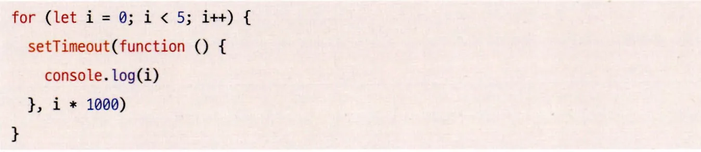

### 1.1 자바스크립트의 동등 비교

리액트 컴포넌트의 렌더링이 일어나는 이유 중 하나가 바로 props의 동등 비교에 따른 결과다.
그리고 이 props의 동등 비교는 객체의 얕은 비교를 기반으로 이뤄진다.

그렇다면 리액트에서는 동등 비교가 어떻게 이루어질까? 리액트에서 사용하는 동등 비교는 == 나 === 가 아
닌 Object.is다. Object.is는 ES6에서 제공하는 기능이기 때문에 리액트에서는 이를 구현한 폴리필(Polyfill) 을 함께 사용한다.

리액트에서의 비교를 요약하자면 Object.is로 먼저 비교를 수행한 다음에 Object.is에서 수행하지 못하는
비교, 즉 객체 간 얕은 비교를 한 번 더 수행하는 것을 알 수 있다.

```jsx
// Object.is는 참조가 다른 객체에 대해 비교가 불가능하다.
Object.is({ hello: "world" }, { hello: "world" }); // false

// 반면 리액트 팀에서 구현한 shallowEqual은 객체의 1 depth까지는 비교가 가능하다.
shallowEqual({ hello: "world" }, { hello: "world" }); // true

// 그러나 2 depth까지 가면 이를 비교할 방법이 없으므로 false를 반환한다.
shallowEqual({ hello: { hi: "world" } }, { hello: { hi: "world" } }); // false
```

- 이렇게 객체의 얕은 비교까지만 구현한 이유는 무엇일까? 먼저 리액트에서 사용하는 **JSX props는 객체**이고, 그리고 여기에 있는 props만 일차적으로 비교하면 되기 때문이다.

```tsx
type Props = {
  hello: string;
};

function HelloComponent(props: Props) {
  return <h1>{props.hello}</h1>;
}

// ...

function App() {
  return <HelloComponent hello="hi!" />;
}
```

- 위 코드에서 props는 객체다. 그리고 기본적으로 리액트는 props에서 꺼내온 값을 기준으로 렌더링을 수행하기 때문에 일반적인 케이스에서는 얕은 비교로 충분할 것이다.

```tsx
type DeeperProps = {
  counter: {
    counter: number;
  };
};

const DeeperComponent = memo((props: DeeperProps) => {
  useEffect(() => {
    console.log("DeeperComponent has been rendered!");
  });

  return <h1>{props.counter.counter}</h1>;
});

export default function App() {
  const [, setCounter] = useState(0);

  function handleClick() {
    setCounter((prev) => prev + 1);
  }

  return (
    <div className="App">
      <Component counter={100} />
      <DeeperComponent counter={{ counter: 100 }} />
      <button onClick={handleClick}>+</button>
    </div>
  );
}
```

- 하지만 위와 같이 props가 깊어지는 경우. 즉, 객체 안에 또다른 객체가 있을 경우React.memo는 컴포넌트에 실제로 변경된 값이 없음에도 불구하고 메모이제이션된 컴포넌트를 반환하지 못한다.
- App에서 버튼을 클릭해서 강제로 렌더링을 일으킬 경우 DeeperComponent 함수는 제대로 비교하지 못해 memo가 작동하지 않게 된다.

---

### 1.2 함수

**화살표 함수**

```jsx
const add = (a, b) => {
  return a + b;
};

const add = (a, b) => a + b;
```

- 화살표 함수는 ES6부터 추가된 함수 생성 방식이다.
- 그러나 화살표 함수는 겉보기와 다르게 앞서 언급한 함수 생성 방식과 몇 가지 큰 차이점이 있다.

```jsx
const Car = (name) => {
  this.name = name;
};

// Uncaught TypeError: Car is not a constructor
const myCar = new Car("하이");
```

1. 먼저 화살표 함수에서는 **constructor**를 사용할 수 없다. 즉, 생성자 함수로 화살표 함수를 사용하는 것은 불가능하다.

```jsx
function hello() {
  console.log(arguments);
}

// Arguments(3) [1, 2, 3, callee: f, Symbol(Symbol.iterator): f]
hello(1, 2, 3);

const hi = () => {
  console.log(arguments);
};

// Uncaught ReferenceError: arguments is not defined
hi(1, 2, 3);
```

2. 그리고 화살표 함수에서는 **arguments**가 존재하지 않는다.


1. 화살표 함수와 일반 함수의 가장 큰 차이점은 바로 **this 바인딩**이다.

- this는 함수를 정의할 때 결정되는 것이 아니라, 함수가 어떻게 호출되느냐에 따라 동적으로 결정된다. 만약 함수가 일반 함수로서 호출된다면, 그 내부의 this는 전역 객체를 가리킨다.
- 이와 달리 화살표 함수는 함수 자체의 바인딩을 갖지 않는다. 화살표 함수 내부에서 this를 참조하면 **상위 스코프의 this**를 그대로 따르게 된다.
- 위 두 메서드 `functionCountUp`과 `ArrowFunctionCountUp`는 모두 state를 하나씩 올리는 작업을 동일하게 하고 있다.
  - 그러나 일반 **함수에서의 this는 undefined**를, 화살표 함수에서의 this는 우리가 원하는 대로 **클래스의 인스턴스인 this**를 가리키는 것을 볼 수 있다.

---

**함수를 만들 때 주의해야 할 사항**

1. **함수의 부수 효과를 최대한 억제하라**

- 자바스크립트 함수에서는 가능한 한 부수 효과를 최소화하고, 함수의 실행과 결과를 최대한 예측 가능하도록 설계해야 한다.
- 리액트의 관점에서 본다면 부수 효과를 처리하는 훅인 **useEffect**의 작동을 최소화하는 것이 그 일환이라 할 수 있다.
  - useEffect의 사용은 피할 수 없지만 최소한으로 줄임으로써 함수의 역할을 좁히고, 버그를 줄이며, 컴포넌트의 안정성을 높일 수 있다.

1. **가능한 한 함수를 작게 만들어라**

- ESLint에는 **max-lines-per-function**이라는 규칙이 있다.
- 이 규칙에서는 기본값으로 50줄 이상이 넘어가면 과도하게 커진 함수로 분류하고 경고 메시지를 출력한다.
- 이 규칙의 요점은 간단하다. 하나의 함수에서 너무나 많은 일을 하지 않게 하는 것이다.
- 최적의 함수 크기를 단언할 수 없지만 가능한 한 함수의 크기를 작게 하는 것이 좋다.

1. **누구나 이해할 수 있는 이름을 붙여라**

- 리액트에서 사용하는 useEffect나 useCallback 등의 혹에 넘겨주는 콜백 함수에 네이밍을 붙여준다면 가독성에 도움이 된다.

```jsx
useEffect(function apiRequest() {
  // ...do something
}, []);
```

- 물론 위와 같이 useEffect의 콜백 함수에 이름을 붙여준다고 한들 `apiRequest()`와 같은 형태로 호출하
  거나 접근할 수 있는 것은 아니다.
- 그러나 useEffect 같은 부수 효과를 일으키는 함수가 많아질수록 굳이 useEffect 코드를 유심히 살펴보지 않더라도 어떤 일을 하는지, 또 어떻게 작동하는지를 단번에 알아채는 데 도움이 될 것이다.

---

### 1.3 클래스

클래스란 특정한 객체를 만들기 위한 일종의 템플릿과 같은 개념이다. 즉, 특정한 형태의 객체를 반복적으로 만들기 위해 사용되는 것이 바로 클래스다.

- 클래스가 나오기 이전에는 클래스라는 개념이 없어 객체를 만드는 템플릿 같은 역할을 함수가 도맡아 했었다.
- 반대로 말하면, 우리가 자바스크립트에서 클래스로 하는 모든 것들을 함수로도 동일하게 표현할 수 있다.

**클래스 내부 구조**


**constructor**

- constructor는 생성자로, 이름에서 알 수 있는 것처럼 객체를 생성하는 데 사용하는 특수한 메서드다.
- 단 하나만 존재할 수 있으며, 생성자에서 별다르게 수행할 작업이 없다면 생략 가능하다.

**프로퍼티**


- 클래스로 인스턴스를 생성할 때 내부에 정의할 수 있는 속성값을 의미한다.
- 기본적으로 인스턴스 생성 시 constructor 내부에는 빈 객체가 할당돼 있는데, 바로 이 빈 객체에 프로퍼티 키와 값을 넣어서 활용할 수 있게 도와준다.
- JS는 기본적으로 public이고, 타입스크립트에서는 private, protected, public을 사용할 수 있다.

**getter**


- getter란 클래스에서 무언가 값을 가져올 때 사용된다.
- get을 앞에 붙여야 하고, 뒤 이어서 getter의 이름을 선언해야 한다.

**setter**


- setter란 클래스 필드에 값을 할당할 때 사용한다.
- set이라는 키워드를 먼저 선언하고, 그 뒤를 이어서 이름을 붙이면 된다.

**인스턴스 메서드(프로토타입 메서드)**


- 클래스 내부에서 선언한 메서드를 인스턴스 메서드라고 한다.
- 이 인스턴스 메서드는 실제로 JS의 prototype에 선언되므로 프로토타입 메서드로 불리기도 한다.
- Car라는 클래스를 선언하고, 그 내부에 hello라고 하는 인스턴스 메서드를 정의했다.

```jsx
Object.getPrototypeOf(myCar) === Car.prototype; // true
```

- 인스턴스에서 hello()에 접근할 수 있는 이유는, 메서드가 생성자 Car의 prototype에 선언됐기 때문이다.
- 프로토타입의 더 자세한 개념은 [https://winjabonjooyui.tistory.com/entry/코어-자바스크립트-06-프로토타입](https://winjabonjooyui.tistory.com/entry/%EC%BD%94%EC%96%B4-%EC%9E%90%EB%B0%94%EC%8A%A4%ED%81%AC%EB%A6%BD%ED%8A%B8-06-%ED%94%84%EB%A1%9C%ED%86%A0%ED%83%80%EC%9E%85) 이 글을 참고하면 된다.

**정적 메서드**


- 정적 메서드는 인스턴스가 아닌 클래스의 이름으로 호출할 수 있는 메서드다.
- 정적 메서드 내부의 this는 인스턴스가 아닌, 클래스 자신을 가리키기 때문에 다른 메서드에서 일반적으로 사용하는 this를 사용할 수 없다.
- 이러한 이유로 리액트 클래스형 컴포넌트 생명주기 메서드인 `static getDerivedStateFromProps(props, state)`에서는 this.state에 접근할수 없다.
- 정적 메서드는 인스턴스를 생성하지 않아도 사용할 수 있기 때문에 여러 곳에서 재사용이 가능하다는 장점이 있다.
- 이 때문에 애플리케이션 전역에서 사용하는 유틸 함수를 정적 메서드로 많이 활용하는 편이다.

**상속**


- 리액트에서는 클래스형 컴포넌트를 만들기 위해서 extends React.Component 또는 extends React.PureComponent와 같이 선언한다.
- 기존 클래스를 상속받아서 자식 클래스에서 상속받은 클래스를 기반으로 확장하는 개념이다.
- Car를 extends한 Truck이 생성한 객체에서도, Truck이 따로 정의하지 않은 honk 메서드를 사용할 수 있는것을 볼 수 있다.

클래스는 객체지향 언어를 사용하던 다른 프로그래머가 좀 더 자바스크립트에 접근하기 쉽게 만들어주는, 일종의 문법적 설탕(syntactic sugar)의 역할을 한다고 볼 수 있다.

또한 자바스크립트 클래스는 프로토타입을 기반으로 작동한다는 사실도 확인할 수 있다.

---

### 1.4 클로저

클로저란 “어떤 함수에서 선언한 변수를 참조하는 내부함수를 외부로 전달할 경우, 함수의 실행 컨텍스트가 종료된 후에도 해당 변수가 사라지지 않는 현상”을 의미한다. 클로저의 더 자세한 개념은 링크를 참고하자.

[https://winjabonjooyui.tistory.com/entry/코어-자바스크립트-05-클로저](https://winjabonjooyui.tistory.com/entry/%EC%BD%94%EC%96%B4-%EC%9E%90%EB%B0%94%EC%8A%A4%ED%81%AC%EB%A6%BD%ED%8A%B8-05-%ED%81%B4%EB%A1%9C%EC%A0%80)

**리액트에서의 클로저**

리액트에서 클로저의 원리를 사용하고 있는 대표적인 것 중 하나가 바로 **useState**다.


- 위 코드에서 useState 함수의 호출은 Component 내부 첫 줄에서 종료됐는데, setstate는 useState 내부의 최신 값을 어떻게 계속해서 확인할 수 있을까?
- 이유는 바로 클로저가 **useState 내부**에서 활용됐기 때문이다.
- **외부 함수 useState**가 반환한 **내부 함수 setState**는 외부 함수의 호출이 끝났음에도
  - **자신이 선언된 외부 함수가 선언된 환경(state가 저장돼 있는 어딘가)을 기억**하기 때문에 계속해서 state 값을 사용할 수 있는 것이다.

---

**클로저를 사용할 때 주의할점**


- 위 코드의 의도는 0부터 시작해 1초 간격으로 console.log로 0, 1, 2, 3, 4를 차례대로 출력하는 것이다. 그러나 실제로 위 코드를 실행하면 0, 1, 2, 3, 4초 뒤에 5만 출력된다.
- 그 이유는 i가 전역 변수로 작동하기 때문이다. JS는 기본적으로 함수 스코프를 가지기 때문에, var로 선언한 변수는 for문 안에서도 전역 스코프에 저장된다.
- for 문을 다 순회한 이후, 태스크 큐에 있는 setTimeout을 실행하려고 했을 때, 이미 전역 레벨에 있는 i는 5로 업데이트가 완료돼 있다.

**올바르게 수정하는 방법**

**let 사용**


- let은 기본적으로 블록 레벨 스코프를 가지게 되므로 let i가 for 문을 순회하면서 각각의 스코프를 갖게 된다.
- 이는 setTimeout이 실행되는 시점에도 유효해서 각 콜백이 의도한 i 값을 바라보게 할 수 있다.

**클로저를 제대로 활용**


- 위 함수는 for문 내부에 즉시 실행 익명 함수를 선언했다.
- 즉시 실행 함수는 i를 인수로 받는데, 이 함수 내부에서는 이를 sec이라고 하는 인수에 저장해 두었다가setTimeout의 콜백 함수에 넘기게 된다.
- 이렇게 되면 setTimeout의 콜백 함수가 바라보는 클로저는 즉시 실행 익명 함수가 되며, 이 즉시 실행 익명 함수는 각 for 문마다 생성되고 실행되기를 반복한다.
- 그리고 각각의 함수는 고유한 스코프, 즉 고유한 sec을 가지게 되므로 올바르게 실행할 수 있게 된다.

클로저는 생성될 때마다 그 선언적 환경을 기억해야 하므로 사용하는 데 추가적인 비용이 든다. 그것에 따르는 비용을 확인하기 위해 다음 예제를 살펴보자.


- 위 두 함수는 엄청나게 긴 작업(길이가 천만인 배열)을 동일하게 처리한다.


- 개발자 도구로 살펴보면 클로저 `heavyJobWithClosure()`로 분리해 실행하고, 이를 onClick에서 실행하는 방식인데 이미 스크립트를 실행하는 시점부터 아주 큰 배열을 메모리에 올려두고 시작하는 것을 알 수 있다(약 40MB).
- 클로저의 기본 원리에 따라, 클로저가 선언된 순간 내부 함수는 외부 함수의 선언적인 환경을 기억하고 있어야하므로 이를 어디에서 사용하는지 여부에 관계없이 저장해 둔다.


- 반면 일반 함수의 경우에는 클릭 시 스크립트 실행이 조금 길지만 클릭과 동시에 선언, 그리고 길이를 구하는 작업이 모두 스코프 내부에서 끝났기 때문에 메모리 용량에 영향을 미치지 않았다.

클로저에 꼭 필요한 작업만 남겨두지 않는다면 메모리를 불필요하게 잡아먹는 결과를 야기할 수 있고, 사용 시 적절한 스코프로 가둬두지 않는다면 성능에 악영향을 미친다. 공짜가 아니므로 클로저를 사용할 때는 주의가 필요하다.

---

### 1.5 이벤트 루프와 비동기 통신의 이해

**싱글 스레드 자바스크립트**

자바스크립트는 **싱글 스레드에서 작동**한다. 즉, 기본적으로 자바스크립트는 코드를 한 줄 한 줄 실행하며, 한 번에 하나의 작업만 동기 방식으로만 처리할 수 있다.

그러나 이러한 싱글 스레드 기반의 JS에서도 많은 양의 비동기 작업이 이루어지고 있다.

이러한 비동기 작업이 어떻게 처리되는지 이해하고 비동기 처리를 도와주는 이벤트 루프를 비롯한 다양한 개념에 대해 알아보자.

**동기(synchronous)**

- 직렬 방식으로 작업을 처리하는 것을 의미한다. 이 요청이 시작된 이후에는 무조건 응답을 받은 이후에야 비로소 다른 작업을 처리할 수 있고, 그동안 다른 모든 작업은 대기한다.

**비동기(asynchronous)**

- 병렬 방식으로 작업을 처리하는 것을 의미한다. 요청을 시작한 후 이 응답이 오건 말건 상관없이 다음 작업이 이루어지며, 따라서 한 번에 여러 작업이 실행될 수 있다.

---

**이벤트 루프**


- 위 코드의 출력 순서는 1, 4, 2, 3이다.
- 동기식으로 작동하는 JS에서 어떻게 이런 비동기 코드를 처리할 수 있는 것인지 이해하려면 **이벤트 루프**라는개념을 이해해야 한다.

**호출 스택과 이벤트 루프**


- 이 코드는 foo를 호출하고, 내부에서 bar, baz를 순차적으로 호출하는 구조로 돼 있다. 이 코드들은 대략 다음과 같은 순서로 호출 스택에 쌓이고 비워지게 된다.
  
- 이 호출 스택이 비어 있는지 여부를 확인하는 것이 바로 이벤트 루프다.
- 이벤트 루프는 단순히 이벤트 루프만의 단일 스레드 내부에서 이 호출 스택 내부에 수행해야 할 작업이 있는지확인하고, 수행해야 할 코드가 있다면 JS 엔진을 이용해 실행한다.
- 알아둘 점은 ‘코드를 실행하는 것’과 ‘호출 스택이 비어 있는지 확인하는 것’ 모두가 단일 스레드에서 일어난다는 점이다. 즉 두 작업은 동시에 일어날 수 없으며 한 스레드에서 순차적으로 일어난다.
- 그렇다면 비동기 작업은 어떻게 실행될까?

**태스크 큐**


- 위 코드를 보면, foo, baz, bar 순으로 출력된다. setTimeout이 정확하게 0초 뒤에 실행된다는 것을 보장하지 못한다.
- 여기서부터는 **태스크 큐**라는 새로운 개념이 등장하는데, 태스크 큐란 **실행해야 할 태스크의 집합**을 의미한다.
- 이벤트 루프는 이러한 태스크 큐를 한 개 이상 가지고 있다.
- 여기서 ‘**실행해야 할 태스크’**라는 것은 **비동기 함수의 콜백 함수나 이벤트 핸들러 등**을 의미한다.
- 호출 스택 내부에서는 다음과 같은 일이 발생한다.


**정리하자면**

- 이벤트 루프의 역할은 호출 스택에 실행 중인 코드가 있는지, 그리고 태스크 큐에 대기 중인 함수가 있는지 반복해서 확인하는 역할을 한다.
- 호출 스택이 비었다면 태스크 큐에 대기 중인 작업이 있는지 확인하고, 이 작업을 실행 가능한 오래된 것부터 순차적으로 꺼내와서 실행하게 된다.
- 이 작업 또한 마찬가지로 태스크 큐가 빌 때까지 이루어진다.

- 마지막으로 궁금해지는 것은 저 비동기 함수는 누가 수행하느냐다. n초 뒤에 setTimeout을 요청하는 작업은 누가 처리할까?
- fetch를 기반으로 실행되는 네트워크 요청은 누가 보내고 응답을 받을 것인가?
- 이러한 작업들은 모두 JS 코드가 동기식으로 실행되는 메인 스레드가 아닌 태스크 큐가 할당되는 별도의 스레드에서 수행된다.
- 이 별도의 스레드에서 태스크 큐에 작업을 할당해 처리하는 것은 브라우저나 Node.js의 역할이다.
  - 즉, JS 코드 실행은 싱글 스레드에서 이루어지지만 이러한 외부 Web API 등은 모두 JS 외부에서 실행되고 콜백이 태스크 큐로 들어가는 것이다.
- 만약 이러한 작업들도 모두 JS 코드가 실행되는 메인 스레드에서만 이루어진다면 절대로 비동기 작업을 수행할 수 없을 것이다.

**태스크 큐와 마이크로 태스크 큐**

태스크 큐와 별개로 **마이크로 태스크 큐**가 있다. 이벤트 루프는 **하나의 마이크로 태스크 큐**를 갖고 있는데, 기존의 태스크 큐와는 다른 태스크를 처리한다.


- 대표적으로 **Promise**가 있다. 이 마이크로 태스크 큐는 기존 태스크 큐보다 우선권을 갖는다.즉, setTimeout과setinterval은 **Promise보다 늦게 실행**된다.
- 마이크로 태스크 큐가 빌 때까지는 기존 태스크 큐의 실행은 뒤로 미루어진다.


- 코드를 실행하면 bar, baz, too 순으로 실행된다. 확실히 Promise가 우선권이 있음을 알 수 있다.

---

**렌더링이 실행되는 시점**


- 태스크 큐를 실행하기 에 앞서 먼저 마이크로 태스크 큐를 실행하고, 이 마이크로 태스크 큐를 실행한 뒤에 렌더링이 일어난다.
- 각 마이크로 태스크 큐 작업이 끝날 때마다 한 번씩 렌더링할 기회를 얻게 된다.
- 위 예제 코드의 결과를 정리하면 다음과 같다.


정리하자면 JS 코드를 실행하는 것 자체는 싱글 스레드로 이루어져서 비동기를 처리하기 어렵지만 자바스크립트 코드를 실행하는 것 이외에 태스크 큐, 이벤트 루프, 마이크로 태스크 큐, 브라우저/Node.js API 등이 적절한 생태계를 이루고 있기 때문에 싱글 스레드로는 불가능한 비동기 이벤트 처리가 가능해졌다.

**이벤트 루프**

- 비동기 작업을 관리하고 실행 흐름을 조율하는 역할을 하는 것
- 호출 스택에 실행중인 코드가 있는지, 태스크 큐에 대기 중인 함수가 있는지 반복해서 확인하고 수행해야 할 코드가 있다면 자바스크립트 엔진을 이용해 실행한다.

**콜 스택**

- 수행해야 할 코드나 함수를 순차적으로 담아두는 스택.

**태스크 큐**

- 실행해야 할 태스크의 집합.
- 자료구조 큐가 아닌 set 형태, 비동기 함수의 **콜백 함수나 이벤트 핸들러**가 포함된다.
- Ex. `setTimeout, setInterval`

**마이크로 태스크 큐**

- 기존 태스크 큐보다 우선권을 가진다. 마이크로 태스크 큐가 빌때까지는 태스크 큐의 실행은 미뤄진다.
- 마이크로 태스크 큐를 실행한 뒤에 렌더링이 일어난다.
- Ex. `Promise`

**Web API**

- 브라우저에서 제공하는 API. 메인 스레드가 아닌 별도에 환경에서 실행된다.
- 자바스크립트 코드 외부에서 실행되며 비동기 작업이 완료되면, 콜백을 태스크 큐, 마이크로 태스크 큐에 추가한다.
- Ex. `setTimeout, DOM 이벤트, fetch`

**예시 코드**

```jsx
console.log("Start");

setTimeout(() => {
  console.log("Timeout callback");
}, 1000);

console.log("End");
```

- console.log("Start")가 콜 스택에 push됨. 즉시 실행되어 “Start” 출력. 콜 스택에서 제거.
- setTimeout이 콜 스택에 push됨. 자바스크립트 엔진(콜 스택)은 setTimeout을 Web API로 넘김.
  - Web API에서 타이머를 실행.
- console.log("End")가 콜 스택에 push됨. 즉시 실행되어 "End" 출력. 콜 스택에서 제거.
- setTimeout 타이머 종료 후, 콜백 함수가 태스크 큐로 이동
- 이미 "End"까지 실행되어 콜 스택이 비어 있으므로, 이벤트 루프가 태스크 큐에서 콜백 함수를 가져와 실행
- "Timeout callback" 출력

---

### 1.7 선택이 아닌 필수, 타입스크립트

**never**


- 클래스형 컴포넌트를 선언할 때 props는 없지만 state가 존재하는 상황에서 이 빈 props, 정확히는 어떠한 props도 받아들이지 않는다는 뜻으로 never를 사용 가능하다.
- 위 Samplecomponent는 어떠한 props도 받을 수 없는 대신, state가 존재한다.
  - React.Component의 제네릭은 Props와 State를 순서대로 작성해야 하는데, Props의 경우 Record<string, never>로 작성해 어떠한 props도 받을 수 없도록 타입스크립트로 처리할 수 있다.

**타입 가드를 적극 활용**

**instanceof**

instanceof는 지정한 인스턴스가 특정 클래스의 인스턴스인지 확인할 수 있는 연산자다.


- unknown으로 내려오는 에러에 대해 타입 가드를 통해 타입을 좁힘으로써 각 에러에 따라 원하는 처리 내용을
  추가할 수 있다.

**typeof**


- typeof 연산자는 특정 요소에 대해 자료형을 확인하는 데 사용된다.

**in**


- 조건문으로 두 객체에 겹치지 않는 프로퍼티를 확인하는 것만으로 해당 변수가 어떤 타입으로부터 내려오는지 확인해 준다.
- in은 타입에 여러 가지 객체가 존재할 수 있는 경우 유용하다.

**제네릭**


- useState에 제네릭으로 타입을 선언한다면 state 사용과 기본값 선언을 좀 더 명확하게 할 수 있다.
- 기본값을 넘기지 않고 사용하는 경우가 많은데, 이 경우 값을 undefined로 추론해 버리는 문제가 발생한다.


- 제네릭을 하나 이상 사용할 수도 있다. 단, 알파벳 T, U 보다 제네릭이 의미하는 바를 명확히 할 수 없으니 적절히 네이밍하는 것이 좋다.

**인덱스 시그니처**


- `[key: string]`을 사용한 부분이 바로 인덱스 시그니처다. 인덱스 시그니처를 사용하면 이처럼 키에 원하는 타입을 부여할 수 있다.
- 단 키의 범위가 위 예제의 경우 string으로 너무 커지기 때문에 존재하지 않는 키로 접근하면 위와 같이undefined를 반환할 수도 있다.
- 따라서 객체의 키는 동적으로 선언되는 경우를 최대한 지양해야 하고, 객체의 타입도 필요에 따라 좁혀야 한다.


- `Record<Key, Value>`를 사용하면 객체의 타입에 각각 원하는 키와 값을 넣을 수 있다. 그리고 인덱스 시그니처에 타입을 사용함으로써 객체를 원하는 형태로 최대한 좁힐 수 있다.

**문제 상황**


- hello 객체의 key를 Object.keys로 잘 뽑아냈고, 그 키로 객체에 접근했는데 에러가 발생했다.
- 이유는 Object.keys가 string[]을 반환하는데, string은 hello의 인덱스 키로 접근할 수 없기 때문이다.

**해결 방법**


- 타입스크립트의 Object.keys에 대한 반환 타입을 string[] 대신 개발자가 단언한 타입으로 강제하는 방법
  이다.


- keysOf라고 하는 Object.keys를 대신할 함수를 만드는 것이다.
- 이 함수는 객체의 키를 가지고 오면서 동시에 이 가져온 배열에 대해서도 마찬가지로 타입 단언으로 처리하는 과정을 거친다.


- 가져온 키를 단언하는 방법도 있다.

**그런데 왜 Object.keys는 string[]으로 강제돼 있을까?**

이는 자바스크립트의 특징과, 이를 구현하기 위한 타입스크립트의 구조적 타이핑의 특징 때문이다. 자바스크립트는 다른 언어에 비해 객체가 열려 있는 구조로 만들어져 있으므로 덕 타이핑(duck typing)으로 객체를 비교해야 하는특징이 있다.

**덕 타이핑**❓

객체의 타입이 클래스 상속, 인터페이스 구현 등으로 결정되는 것이 아니고 어떤 객체가 필요한 변수와 메서드만 지니고 있다면 그냥 해당 타입에 속하도록 인정해 주는 것을 의미한다.

타입스크립트의 핵심 원칙은 타입 체크를 할 때 그 값이 가진 형태에 집중한다는 것이다. 이러한 것을 덕타이핑 또는 구조적 타이핑이라고 한다.

이 덕 타이핑이 Object.keys와 무슨 관계가 있을지 예제로 알아보자.


- 자바스크립트는 객체의 타입에 구애받지 않고 객체의 타입에 열려 있으므로 타입스크립트도 이러한 자바스크립트의 특징을 맞춰줘야 한다.
- 즉, 타입스크립트는 이렇게 모든 키가 들어올 수 있는 가능성이 열려있는 객체의 키에 포괄적으로 대응하기 위해 string[]으로 타입을 제공하는 것이다.

리액트에 필요한 더 자세한 자바스크립트 내용을 알고싶으면 **‘모던 리액트 딥다이브’** 를 읽어보길 추천한다.
