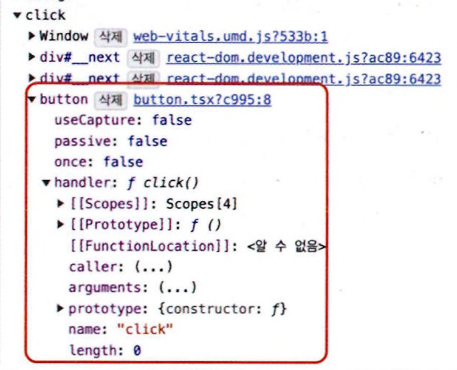

# 10.1 리액트 17 버전 살펴보기

## 10.1.1 리액트의 점진적인 업그레이드

리액트 17 버전부터는 전체 애플리케이션 트리는 리액트 17이지만 일부 트리와 컴포넌트에 대해서만 리액트 18을 선택하는 점진적인 버전 업이 가능해졌다.

지금까지 가장 많이 사용하는 16버전에서 리액트 애플리케이션이 너무 거대해 한꺼번에 새로운 버전으로 업그레이드하기 부담스러운 상황에 유용하게 사용할 수 있게끔 점진적인 버전 업을 리액트 17에서 지원하게 됐다.

## 10.1.2 이벤트 위임 방식의 변경

아래 두 방법이 실제 웹에서 어떻게 다른지 살펴보자.

```tsx
import { useEffect, useRef } from "react";

export default function Button() {
  const buttonRef = (useRef < HTMLButtonElement) | (null > nuU);

  useEffect(() => {
    if (buttonRef.current) {
      buttonRef.current.onclick = function click() {
        alert("안녕하세요!");
      };
    }
  }, []);

  function 안녕하세요() {
    alert("안녕하세요!");
  }

  return (
    <>
      <button onClick={안녕하세요}>리액트 버튼</button>
      <button ref={buttonRef}>그냥 버튼</button>
    </>
  );
}
```



- 그냥 버튼은 해당 버튼의 이벤트 리스너에 click으로 추가돼 있다.


- onClick 이벤트에 noop이라는 핸들러가 추가돼 있다.
- 이 noop은 문자 그대로(no operation) 아무런 일도 하지 않는다.

그러나 두 버튼 모두 동일하게 작동한다. 그렇다면 리액트에서는 이벤트를 어떻게 처리할까?

리액트는 이벤트 핸들러를 해당 이벤트 핸들러를 추가한 각각의 DOM 요소에 부탁하는 것이 아니라, 이벤트 타입(click, change)당 하나의 핸들러를 루트에 부착한다.

이를 이벤트 위임이라고 한다. 이벤트가 어떤 단계로 구성돼 있는지 알아보자.

1. 캡처(capture): 이벤트 핸들러가 트리 최상단 요소에서 부터 시작해서 실제 이벤트가 발생한 타깃 요소까지 내려가는 것을 의미한다.
2. 타깃(target): 이벤트 핸들러가 타깃 노드에 도달하는 단계다. 이 단계에서 이벤트가 호출된다.
3. 버블링(bubbling): 이벤트가 발생한 요소에서부터 시작해 최상위 요소까지 다시 올라간다.

이러한 이벤트 위임이 리액트 16 버전까지는 모두 document에서 수행되고 있었다. 다음 리액트 16 코드를 보자.

```tsx
import React from "react";
import ReactDOM from "react-dom";

export default function App() {
  function 안녕하세요() {
    alert("안녕하세요!");
  }

  return <button onClick={안녕하세요}>리액트 버튼</button>;
}

ReactDOM.render(<App />, document.getElementById("root"));
```


리액트 17부터는 이러한 이벤트 위임이 모두 document가 아닌 리액트 컴포넌트 최상단 트리, 즉 루트 요소로 바뀌었다.


기존 리액트 16의 방식대로 모든 이벤트가 document에 달려 있으면 어떻게 될까?

```tsx
import React from "react"; // 16.14
import ReactDOM from "react-dom"; // 16.14

function React1614() {
  function App() {
    function 안녕하세요() {
      alert("안녕하세요! 16.14");
    }
    return <button onClick={안녕하세요}>리액트 버튼</button>;
  }
  return ReactDOM.render(<App />, document.getElementByld("React-16-14"));
}

import React from "react"; // 16.8
import ReactDOM from "react-dom"; // 16.8

function React168() {
  function App() {
    function 안녕하세요() {
      alert("안녕하세요! 16.8");
    }
    return <button onClick={안녕하세요}>리액트 버튼</button>;
  }
  return ReactDOM.render(<App />, document.getElementByld("React-16-8"));
}
```

위 코드는 다음과 같이 렌더링될 것이다.

```tsx
<html>
  <body>
    <div id="React-16-14">
      <div id="React-16-8"></div>
    </div>
  </body>
</html>
```

만약 이 상황에서 React168 컴포넌트가 e.stopPropagation을 실행하면 어떻게 될까?

이미 모든 이벤트는 document로 올라가 있는 상태이기 때문에 document의 이벤트 전파는 막을 수 없게 된다. 따라서 바깥에 있는 React1614에도 이 이벤트를 전달받게 될 것이다.

이처럼 서로 다른 리액트 버전에서 발생할 수 있는 문제를 해결하기 위해 이벤트 위임의 대상을 document에서 컴포넌트의 최상위로 변경했다.

또 리액트 16에서 document와 리액트가 렌더링되는 루트 컴포넌트 사이에서 이벤트를 막는 코드를 추가하면 리액트의 모든 핸들러가 작동하지 않도록 막을 수 있었다.

```html
<!DOCTYPE html>
<html lang="en">
  <head>
    <meta charset="utf-8" />
    <meta
      name="viewport"
      content="width=device-width, initial-scale=1, shrink-to-fit=no"
    />
  </head>
  <body>
    <!-- 리액트 컴포넌트 루트 -->
    <div id="main">
      <div id="root"></div>
    </div>
    <script>
      // 여기에 클릭 이벤트로 이벤트 전파를 막아버리면 리액트의
      // 클릭 이벤트 핸들러가 모두 막힌다.
      document.getElementById("main").addEventListener(
        "click",
        function (e) {
          e.stopPropagation();
        },
        false
      );
    </script>
  </body>
</html>
```

이러한 작동 방식 또한 이벤트 위임 방식이 변경되면서 사라지게 됐다.


---

## 10.1.3 import React from 'react'가 더 이상 필요 없다: 새로운 JSX transform

JSX는 브라우저가 이해할 수 있는 코드가 아니므로 바벨이나 타입스크립트를 활용해 JSX를 실행하기 위해 일반적인 자바스크립트로 변환하는 과정이 꼭 필요하다.

16 버전까지는 이러한JSX 변환을 사용하기 위해 코드 내에서 React를 사용하는구문이 없더라도 `import React from 'react'`가 필요했고, 이 코드가 없다면 에러가 발생했다.

리액트 17부터 바벨과 협력해 이러한 import 구문 없이도 JSX를 변환할 수 있게 됐다.

import React가 필요 없다는 장점 외에도, 불필요한 import 구문을 삭제해 번들링 크기를 약간 줄일 수 있다.

16버전에서 JSX가 어떻게 변환되는지 살펴보자.

```tsx
const Component = (
  <div>
    <span>hello world</span>
  </div>
);

// 리액트 16에서는 이렇게 변환된다.
var Component = React.createElement(
  "div",
  null,
  React.createElement("span", null, "hello world")
);
```

- 변환 결과를 보면 React.createElement를 수행할 때 필요한 import React from 'react'까지 추가해주지는 않기 때문에 React import가 필요했었다.

17 버전에서는 앞의 코드가 다음과 같이 변환된다.

```tsx
"use strict";
var _jsxRuntime = require("react/jsx-runtime");

var Component = (0, _jsxRuntime.jsx)("div", {
  children: (0, _jsxRuntime.jsx)("span", {
    children: "hello world",
  }),
});
```

- React.createElement가 사라지고 JSX를 변환할 때 필요한 모듈인 react/jsx-runtime을 불러오는 require 구문도 같이 추가되므로 `import React from 'react'`를 작성하지 않아도 된다.

---

## 10.1.4 그 밖의 주요 변경 사항

### 이벤트 풀링 제거

리액트 16에서는 이벤트 풀링이라 불리는 기능이 있었다.

리액트에는 이벤트를 처리하기 위한 SyntheticEvent라는 이벤트가 있는데, 이 이벤트는 브라우저의 기본 이벤트를 한 번 더 감싼 이벤트 객체다.

리액트는 이렇게 한번 래핑한 이벤트를 사용하기 때문에 이벤트가 발생할 때마다 이 이벤트를 새로 만들어야 했고
, 그 과정에서 항상 새로 이벤트를 만들 때마다 메모리 할당 작업이 일어날 수밖에 없다.

또한 메모리 누수를 방지하기 위해 이렇게 만든 이벤트를 주기적으로 해제해야 하는 번거로움도 있다.

여기서 이벤트 풀링이란 SyntheticEvent 풀을 만들어서 이벤트가 발생할 때마다 가져오는 것을 의미한다.


이벤트 풀링 시스템에서는 다음과 같이 이벤트가 발생한다.

1. 이벤트 핸들러가 이벤트를 발생시킨다.
2. 합성 이벤트 풀에서 합성 이벤트 객체에 대한 참조를 가져온다.
3. 이 이벤트 정보를 합성 이벤트 객체에 넣어준다.
4. 유저가 지정한 이벤트 리스너가 실행된다.
5. 이벤트 객체가 초기화되고 다시 이벤트 풀로 돌아간다.

```tsx
export default function App() {
  const [value, setValue] = useState("");

  function handleChange(e: ChangeEvent<HTMLInputElement>) {
    setValue(() => {
      return e.target.value;
    });
  }

  return <input onChange={handleChange} value={value} />;
}
```

- 이 코드는 다음과 같은 에러를 발생시킨다.

```tsx
// Cannot read properties of null (reading 'value')
// Warning： This synthetic event is reused for performance reasons.

// If you're seeing this, you're accessing the property 'target' on a released/nullified synthetic event.

// This is set to null. If you must keep the original synthetic event around, use event.persist(). See https://fb.me/re-act-event-pooling for more information.
```

왜 이런 에러가 발생하는 것일까?

16 이하 버전에서는 이벤트 풀링 방식을 통해 서로 다른 이벤트 간에 이벤트 객체를 재사용하고, 그리고 이 재사용하는 사이에 모든 이벤트 필드를 null로 변경하기 때문이다.

좀 더 쉽게 표현하자면 한번 이벤트 핸들러를 호출한 SyntheticEvent는 이후 재사용을 위해 null로 초기화 된다.

따라서 비동기 코드 내부에서 SyntheticEvent인 e에 접근하면 이미 사용되고 초기화된 이후이기 때문에 null만 얻게 된다.

동기 코드 내부에서 이 합성 이벤트 e에 접근하기 위해서는 추가적인 작업인 e.persist() 같은 처리가 필요했다.

```tsx
export default function App() {
  const [value, setValue] = useState("");

  function handleChange(e: ChangeEvent<HTMLInputElement>) {
    e.persist();
    setValue(() => {
      return e.target.value;
    });
  }

  return <input onChange={handleChange} value={value} />;
}
```

비동기 코드로 이벤트 핸들러에 접근하기 위해서는 이러한 방식으로 별도 메모리 공간에 합성 이벤트 객체를 할당해야 한다는 점, 모던 브라우저에서는 이와 같은 방식이 성능 향상에 크게 도움이 안 된다는 점 때문에 이벤트 풀링 개념이 삭제됐다.

모던 브라우저에서는 이벤트 처리에 대한 성능이 많이 개선됐기 때문에 이러한 처리는 더욱 의미가 퇴색하게 되었다.

따라서 이벤트 핸들러 내부에서 이벤트 객체에 접근할 때 비동기든 동기든 상관없이 일관적으로 코딩할 수 있게 됐다.

### useEffect 클린업 함수의 비동기 실행

useEffect에 있는 클린업 함수는 리액트 16 버전까지는 동기적으로 처리됐다.

리액트 17 버전부터는 화면이 완전히 업데이트된 이후에 클린업 함수가 비동기적으로 실행된다.

더 정확히 이야기하자면 클린업 함수는 컴포넌트의 커밋 단계가 완료될 때까지 지연된다. 즉, 화면이 업데이트가 완전히 끝난 이후에 실행되도록 바뀌었으며, 이로써 약간의 성능적인 이점을 볼 수 있게 됐다.

```tsx
import React, { useState, Profiler, useEffect, useCallback } from "react";

export default function App() {
  const callback = useCallback(
    (id, phase, actualDuration, baseDuration, startTime, commitTime) => {
      console.group(phase);
      console.table({ id, phase, commitTime });
      console.groupEnd();
    },
    []
  );

  return (
    <Profiler id="React16" onRender={callback}>
      <Button>
        <Users />
      </Button>
    </Profiler>
  );
}

function Button({ children }) {
  const [toggle, setToggle] = useState(false);

  const handleClick = useCallback(() => setToggle((prev) => !prev), []);

  return (
    <section>
      <button onClick={handleClick}>{toggle ? "show" : "hide"}</button>
      {toggle && children}
    </section>
  );
}

function Users() {
  const [users, setUsers] = useState(null);

  useEffect(() => {
    const abortController = new AbortController();
    const signal = abortController.signal;
    fetch("https://jsonplaceholder.typicode.com/users", { signal: signal })
      .then((results) => results.json())
      .then((data) => {
        setUsers(data);
      });
    return () => {
      console.log("cleanup!");
      abortController.abort();
    };
  }, []);

  return <p>{users === null ? "Loading" : JSON.stringify(users)}</p>;
}
```

- 이 코드는 버튼을 클릭하면 API를 호출해 유저 목록을 불러오고 클린업 함수로 해당 호출을 abort하는 useEffect를 가진 컴포넌트로 구성돼 있다.

Profiler를 활용해 클린업 함수의 변경으로 인한 리액트 커밋 단계가 얼마나 효율적으로 변경됐는지 살펴보자.


리액트 16에서는 클린업 함수가 update(Profiler에서 update는 리렌더링을 의미한다) 이전에 실행됐지만 리액트 17에서는 리렌더링이 일어난 뒤에 실행되어 화면에 업데이트가 반영되는 시간인 commitTime이 조금이나마 빨라진 것을 볼 수 있다.

### 컴포넌트의 undefined 반환에 대한 일관적인 처리

리액트 16과 17 버전은 컴포넌트 내부에서 undefined를 반환하면 오류가 발생한다.

그러나 리액트 16에서 forwardRef나 memo에서 undefined를 반환하는 경우에는 별다른 에러가 발생하지 않는 문제가 있었다.

```tsx
const ForwardedButton = forwardRef(() => {
  <Button />;
});

const MemoizedButton = memo(() => {
  <Button />;
});

export default function App() {
  // 에러도 안 나지만 아무것도 나타나지 않음
  return (
    <>
      <ForwardedButton />
      <MemoizedButton />
    </>
  );
}
```

리액트 17부터는 에러가 정상적으로 발생한다. 리액트 18부터는 undefined를 반환해도 에러가 발생하지 않는다.

---

# 10.2 리액트 18 버전 살펴보기

리액트 18에서의 가장 큰 변경점은 바로 동시성 지원이다.

## 10.2.1 새로 추가된 훅 살펴보기

### useld

컴포넌트별로 유니크한 값을 생성하는 새로운 훅이다. useld를 사용하면 클라이언트와 서버에서 불일치를 피하면서 컴포넌트 내부의 고유한 값을 생성할 수 있다.

```tsx
import { useId } from "react";

function Child() {
  const id = useld();
  return <div>child: {id}</div>;
}

function SubChild() {
  const id = useId();
  return (
    <div>
      Sub Child:{id}
      <Child />
    </div>
  );
}

export default function Random() {
  const id = useId();
  return (
    <>
      <div>Home: {id}</div>
      <SubChild />
      <SubChild />
      <Child />
      <Child />
      <Child />
    </>
  );
}
```

이 컴포넌트를 서버 사이드에서 렌더링하면 다음과 같은 HTML을 확인할 수 있다.

```html
<div>
  <div>
    Home:
    <!-- -->: Rm:
  </div>
  <div>
    Sub Child:<!-- -->:Ram:
    <div>
      child:
      <!-- -->:R7am:
    </div>
  </div>
  <div>
    Sub Child:<!-- -->:Rem:
    <div>
      child:
      <!-- -->:R7em:
    </div>
  </div>
  <div>
    child:
    <!-- -->:Rim:
  </div>
  <div>
    child:
    <!-- -->:Rmm:
  </div>
  <div>
    child:
    <!-- -->:Rqm:
  </div>
</div>
```

- 같은 컴포넌트임에도 서로 인스턴스가 다르면 다른 랜덤한 값을 만들며, 이 값들은 모두 유니크하다.
- 또한 서버 사이드와 클라이언트 간에 동일한 값이 생성되어 하이드레이션 이슈도 발생하지 않는다.
- useld가 생성하는 값은 :로 감싸져 있는데, 이는 CSS 선택자나 queryselector에서 작동하지 않도록 하기 위한 의도적인 결과다.

### useTransition

UI 변경을 가로막지 않고 상태를 업데이트할 수 있는 리액트 훅이다.

상태 업데이트를 긴급하지 않은 것으로 간주해 무거운 렌더링 작업을 조금 미룰 수 있다. 다음 예제 코드를 보자.

```tsx
// App.tsx
type Tab = "about" | "posts" | "contact";

export default function App() {
  const [tab, setTab] = useState < Tab > "about";

  function selectTab(nextTab: Tab) {
    setTab(nextTab);
  }

  return (
    <>
      <TabButton isActive={tab === "about"} onClick={() => selectTab("about")}>
        Home
      </TabButton>
      <TabButton isActive={tab === "posts"} onClick={() => selectTab("posts")}>
        Posts (slow)
      </TabButton>
      <TabButton
        isActive={tab === "contact"}
        onClick={() => selectTab("contact")}
      >
        Contact
      </TabButton>
      <hr />

      {/* 일반적인 컴포넌트 */}
      {tab === "about" && <About />}
      {/* 매우 무거운 연산이 포함된 컴포넌트 */}
      {tab === "posts" && <Posts />}
      {/* 일반적인 컴포넌트 */}
      {tab === "contact" && <Contact />}
    </>
  );
}
```

```tsx
// PostTab.tsx
import { memo } from "react";

const PostsTab = memo(function PostsTab() {
  const items = Array.from({ length: 1500 }).map((_, i) => (
    <SlowPost key={i} index={i} />
  ));

  return <ul className="items">{items}</ul>;
});

function SlowPost({ index }: { index: number }) {
  let startTime = performance.now();

  // 렌더링이 느려지는 상황을 가정하기 위해 느린 코드를 추가했다.
  while (performance.now() - startTime < 1) {
    // 아무것도 하지 않음
  }

  return <li className="item">Post #{index + 1}</li>;
}

export default PostsTab;
```

- 세 개의 탭 중 하나의 선택된 탭을 보여주는 코드다. state에 따라 필요한 컴포넌트를 노출하는 구조다.
- `<Posts/>`는 내부에 굉장히 느린 작업이 포함돼 있어 렌더링하는 데 많은 시간이 소요된다.
- 코드를 실행한 후, Post를 선택한 후에 바로 Contact를 선택해 보면, 브라우저가 작동을 멈춘 듯한 모습을 보이며, 렌더링이 끝난 이후에야 비로소 `<Contact/>`를 렌더링한다.

이처럼 상태 변경으로 인해 무거운 작업이 발생하고, 이로 인해 렌더링이 가로막힐 여지가 있는 경우 useTransition을 사용하면 된다. 코드를 다음과 같이 변경해보자.

```tsx
import { useState, useTransition } from "react";

// ...

export default function TabContainer() {
  const [isPending, startTransition] = useTransition();
  const [tab, setTab] = useState<Tab>("about");

  function selectTab(nextTab: Tab) {
    startTransition(() => {
      setTab(nextTab);
    });
  }

  return (
    <>
      {/* ... */}
      {isPending ? (
        "로딩 중"
      ) : (
        <>
          {tab === "about" && <About />}
          {tab === "posts" && <Posts />}
          {tab === "contact" && <Contact />}
        </>
      )}
    </>
  );
}
```

- useTransition은 아무것도 인수로 받지 않으며, isPending과 startTransition이 담긴 배열을 반환한다.
- isPending은 상태 업데이트가 진행 중인지를 확인할 수 있는 boolean이다.
- startTransition은 긴급하지 않은 상태 업데이트로 간주할 set 함수를 넣어둘 수 있는 함수를 인수로 받는다.
  - 여기서는 `() => {setTab(nextTab)}`을 인수로 받았지만 경우에 따라서는 여러 개의 setter를 넣어줄 수도 있다.

코드를 변경한 후에 실행해 보면 탭을 아무리 선택해도 렌더링이 블로킹되지 않는다.

`<Posts/>`를 클릭하면 ‘로딩 중’ 이라는 메시지와 함께 렌더링이 시작되며, 이후에 바로 `<Contact/>` 탭으로 이동하면 그 즉시 `<Posts/>` 렌더링이 중단되고 `<Contact />` 렌더링을 시작해 빠르게 완료한다.

마치 async와 await처럼 비동기로 렌더링한다. 그리고 이 `<Posts/>` 컴포넌트 렌더링 와중에 다른 상태 업데이트로 전환되면 `<Posts/>` 렌더링이 취소될 수도, 혹은 완성될 때까지 기다리되 다른 렌더링을 가로막지 않을 수 있다.

또한 훅을 사용할 수 없는 상황이라면 단순히 startTransition을 바로 import할 수도 있다.

```tsx
import { startTransition } from "react";

/// ...
```

사용할 때 주의할 점을 몇 가지 살펴보자.

- startTransition 내부는 반드시 setState와 같은 상태를 업데이트하는 함수와 관련된 작업만 넘길 수 있다.
- startTransition으로 넘겨주는 상태 업데이트는 다른 모든 동기 상태 업데이트로 인해 실행이 지연될 수 있다.
  - 예를 들어, 타이핑으로 인해 setState가 일어나는 경우 타이핑이 끝날 때까지 useTransition으로 지연시킨 상태 업데이트는 일어나지 않는다.
- startTransition으로 넘겨주는 함수는 반드시 동기 함수여야 한다. 만약 이 안에 setTimeout과 같은 비동기 함수를 넣으면 제대로 작동하지 않게 된다.
  - 이는 startTransition이 작업을 지연시키는 작업과 비동기로 함수가 실행되는 작업 사이에 불일치가 일어나기 때문이다.

### useDeferredValue

컴포넌트 트리에서 리렌더링이 급하지 않은 부분을 지연할 수 있게 도와주는 훅이다.

특정 시간 동안 발생하는 이벤트를 하나로 인식해 한 번만 실행하게 해주는 디바운스와 비슷하지만 디바운스 대비 장점이 몇 가지 있다.

먼저 고정된 지연 시간 없이 첫 번째 렌더링이 완료된 이후에 이 useDeferredValue로 지연된 렌더링을 수행한다.

그러므로 이 지연된 렌더링은 중단할 수도 있으며, 사용자의 인터랙션을 차단하지도 않는다.

```tsx
export default function Input() {
  const [text, setText] = useState("");

  const deferredText = useDeferredValue(text);

  const list = useMemo(() => {
    const arr = Array.from({ length: deferredText.length }).map(
      (_) => deferredText
    );

    return (
      <ul>
        {arr.map((str, index) => (
          <li key={index}>{str}</li>
        ))}
      </ul>
    );
  }, [deferredText]);

  function handleChange(e: ChangeEvent<HTMLInputElement>) {
    setText(e.target.value);
  }

  return (
    <>
      <input value={text} onChange={handleChange} />
      {list}
    </>
  );
}
```

- list를 생성하는 기준을 text가 아닌 deferredText로 설정함으로써 잦은 변경이 있는 text를 먼저 업데이트해 렌더링하고, 이후 여유가 있을 때 지연된 deferredText를 활용해 list를 새로 생성하게 된다.
- list에 있는 작업이 더 무겁고 오래 걸릴수록 사용하는 이점을 더욱 누릴 수 있을 것이다.

useDeferredValue와 useTransition은 어떤 차이점이 있을까?

useTransition은 state 값을 업데이트하는 함수를 감싸서 사용하며, useDeferredValue는 state 값 자체만을 감싸서 사용한다.

방식에만 차이가 있을 뿐, 지연된 렌더링을 한다는 점에서는 모두 동일한 역할을 한다.

낮은 우선순위로 처리해야 할 작업에 대해 직접적으로 상태를 업데이트할 수 있는 코드에 접근할 수 있다면 useTransition을 사용하는 것이 좋다.

컴포넌트의 props와 같이 상태 업데이트에 관여할 수는 없고 오로지 값만 받아야 하는 상황이라면 useDeferredValue를 사용하자.

### useSyncExternalStore

이 훅의 기원은 리액트 17까지 존재했던 useSubscription이다.

먼저 테어링(tearing) 현상에 대해 알아보자.

‘찢어진다’라는 뜻으로, 리액트에서는 하나의 state 값이 있음에도 서로 다른 값(보통 state나 props의 이전과 이후)을 기준으로 렌더링되는 현상을 말한다.

리액트 18에서는 앞서 useTransition, useDeferredValue의 훅처럼 렌더링을 일시 중지하거나 뒤로 미루는 등의 최적화가 가능해지면서 동시성 이슈가 발생할 수 있다.

예를 들어, startTransition으로 렌더링을 일시 중지했다고 가정해 보자.

만약 이러한 일시 중지 과정에서 값이 업데이트되면 동일한 하나의 변수(데이터)에 대해서 서로 다른 컴포넌트 형태가 나타날 수 있다.


이 그림에서 어떤 일이 일어나는지 순차적으로 살펴보자.

1. 첫 번째 컴포넌트에서는 외부 데이터 스토어의 값이 파란색이었으므로 파란색을 렌더링했다.
2. 그리고 나머지 컴포넌트들도 파란색으로 렌더링을 준비하고 있었다.
3. 그러다 갑자기 외부 데이터 스토어의 값이 빨간색으로 변경됐다.
4. 나머지 컴포넌트들은 렌더링 도중에 바뀐 색을 확인해 빨간색으로 렌더링했다.
5. 결과적으로 같은 데이터 소스를 바라보고 있음에도 컴포넌트의 색상이 달라지는 테어링 현상이 발생했다.

리액트 18에서부터는 리액트가 렌더링을 앞선 훅의 예제처럼 중지했다가 다시 실행하는 등 ‘양보’하는 것이 가능해졌기 때문에 이러한 문제가 발생할 가능성이 존재하는 것이다.

리액트에서 관리하는 state라면 useTransition이나 useDefferedValue 예제와 같이 내부적으로 이러한 문제를 해결하기 위한 처리를 해뒀지만 **리액트에서 관리할 수 없는 외부 데이터 소스**에서라면 문제가 달라진다.

리액트가 관리할 수 없는 외부 데이터 소스란 리액트의 클로저 범위 밖에 있는, 관리 범위 밖에 있는 값들을 말한다.

글로벌 변수, document.body, window.innerWidth, DOM, 리액트 외부에 상태를 저장하는 외부 상태 관리 라이브러리 등이 모두 여기에 해당한다.

즉 useState나 useReducer가 아닌 모든 것들이 바로 외부 데이터 소스다.

외부 데이터 소스에 리액트에서 추구하는 동시성 처리가 추가돼 있지 않다면 테어링 현상이 발생할 수 있다.

그리고 이 문제를 해결하기 위한 훅이 바로 **useSyncExternalStore**다.

```tsx
import { useSyncExternalStore } from 'react'

useSyncExternalStore(
	subscribe: (callback) => Unsubscribe
	getSnapshot: () => State
) => State
```

- 첫 번째 인수는 subscribe로, 콜백 함수를 받아 스토어에 등록하는 용도로 사용된다. 스토어에 있는 값이 변경되면 이 콜백이 호출돼야 한다.
  - 그리고 useSyncExternalStore는 이 훅을 사용하는 컴포넌트를 리렌더링한다.
- 두 번째 인수는 컴포넌트에 필요한 현재 스토어의 데이터를 반환하는 함수다. 이 함수는 스토어가 변경되지 않았다면 매번 함수를 호출할 때마다 동일한 값을 반환해야 한다.
  - 스토어에서 값이 변경됐다면 이 값을 이전 값과 Object.is로 비교해 정말로 값이 변경됐다면 컴포넌트를 리렌더링한다.
- 마지막 인수는 옵셔널 값으로, 서버 사이드 렌더링 시에 내부 리액트를 하이드레이션하는 도중에만 사용된다.
  - 서버 사이드에서 렌더링되는 훅이라면 반드시 이 값을 넘겨줘야 하며, 클라이언트의 값과 불일치가 발생할 경우 오류가 발생한다.

실제로 이 훅을 사용하는 예제를 보자.

```tsx
import { useSyncExternalStore } from "react";

function subscribe(callback: (this: Window, ev: UIEvent) => void) {
  window.addEventListener("resize", callback);
  return () => {
    window.removeEventListener("resize", callback);
  };
}

export default function App() {
  const windowSize = useSyncExternalStore(
    subscribe,
    () => window.innerWidth,
    () => 0 // 서버 사이드 렌더링 시 제공되는 기본값
  );

  return <>{windowSize}</>;
}
```

- 먼저 subscribe 함수를 첫 번째 인수로 넘겨 innerWidth가 변경될 때 일어나는 콜백을 등록했다.
- useSyncExternalStore는 subscribe 함수의 첫 번째 인수인 콜백을 추가해 resize 이벤트가 발생할 때마다 해당 콜백이 실행되게끔 할 것이다.
- 두 번째 인수로는 현재 스토어의 값인 window.innerWidth
- 마지막으로 서버 사이드에서는 해당 값을 추적할 수 없으므로 0을 제공했다.

innerWidth는 리액트 외부에 있는 데이터 값이므로 이 값의 변경 여부를 확인해 리렌더링까지 이어지게 하려면useSyncExternalStore를 사용하는 것이 매우 적절하다.

만약 사용 중인 관리 라이브러리가 외부에서 상태를 관리하고 있다면 이 useSyncExternalStore를 통해 외부 데이터 소스의 변경을 추적하고 있는지 반드시 확인해야 한다.

해당 라이브러리가 이 훅을 사용하고 있지 않다면 렌더링 중간에 발생하는 값 업데이트를 적절하게 처리하지 못하고 테어링 현상이 발생할 것이다.

### uselnsertionEffect

CSS-in-js 라이브러리를 위한 훅이다.

Next.js에 styled-components를 적용하는 예제를 만들어봤다면 `_document.tsx`에 styled-components가 사용하는 스타일을 모두 모아서 서버 사이드 렌더링 이전에 `<style>` 태그에 삽입하는 작업을 해봤을 것이다.

CSS의 추가 및 수정은 브라우저에서 렌더링하는 작업 대부분을 다시 계산해 작업해야 하는데, 이는 모든 리액트 컴포넌트에 영향을 미칠 수도 있는 매우 무거운 작업이다.

따라서 리액트 17과 styled-components에서는 클라이언트 렌더링 시에 이러한 작업이 발생하지 않도록 서버 사이드에서 스타일 코드를 삽입했다.

훅에서 이러한 작업을 할 수 있도록 도와주는 게 바로 uselnsertionEffect다.

기본적인 훅 구조는 useEffect와 동일하지만 실행 시점이 다르다.

uselnsertionEffect는 DOM이 실제로 변경되기 전에 동기적으로 실행된다.

이 훅 내부에 스타일을 삽입하는 코드를 집어넣음으로써 브라우저가 레이아웃을 계산하기 전에 실행될 수 있게끔 해서 좀 더 자연스러운 스타일 삽입이 가능해진다.

useEffect, useLayoutEffect, uselnsertionEffect의 실행 순서는 다음과 같다.

```tsx
function Index() {
  useEffect(() => {
    console.log("useEffect!"); // 3
  });
  useLayoutEffect(() => {
    console.log("useLayoutEffeet!"); // 2
  });
  uselnsertionEffect(() => {
    console.log("uselnsertionEffect!"); // 1
  });
}
```

- useLayoutEffect와 비교했을 때 실행되는 타이밍이 미묘하게 다르다.
- 두 훅 모두 브라우저에 DOM이 렌더링되기 전에 실행된다는 공통점이 있지만 useLayoutEffect는 모든 DOM의 변경 작업이 다 끝난 이후에 실행되는 반면 uselnsertionEffect는 이러한 DOM 변경 작업 이전에 실행된다.
- 이러한 차이는 브라우저가 다시금 스타일을 입혀서 DOM을 재계산하지 않아도 된다는 점에서 매우 크다고 볼 수 있다.

---

## 10.2.2 react-dom/client

클라이언트에서 리액트 트리를 만들 때 사용되는 API가 변경됐다.

만약 리액트 18 이하 버전에서 만든 create-react-app 으로 프로젝트를 유지보수 중이라면 리액트 18로 업그레이드할 때 반드시 `index.{t | j}jsx`에 있는 내용을 변경해야 한다.

### createRoot

기존의 react-dom에 있던 render 메서드를 대체할 새로운 메서드다.

리액트 18의 기능을 사용하고 싶다면 이 createRoot와 render를 함께 사용해야 한다.

```tsx
// before
import ReactDOM from "react-dom";
import App from "App";

const container = document.getElementById("root");

ReactDOM.render(<App />, container);

// after
import ReactDOM from "react-dom";
import App from "App";

const container = document.getElementById("root");

const root = ReactDOM.createRoot(container);
root.render(<App />);
```

### hydrateRoot

서버 사이드 렌더링 애플리케이션에서 하이드레이션을 하기 위한 새로운 메서드다. 뒤이어 설명할 React DOM 서버 API와 함께 사용된다.

```tsx
// before
import ReactDOM from "react-dom";
import App from "App";

const container = document.getElementById("root");

ReactDOM.hydrate(<App />, container);

// after
import ReactDOM from "react-dom";
import App from "App";

const container = document.getElementById("root");

const root = ReactDOM.hydrateRoot(container, <App />);
```

- 대부분의 서버 사이드 렌더링은 프레임워크에 의존하고 있지만, 자체적으로 서버 사이드 렌더링을 구현해서 사용하고 있다면 이 부분 역시 수정해야 한다.

API가 변경된 것 외에도 추가로 두 API는 새로운 옵션인 onRecoverableError를 인수로 받는다.

이 옵션은 리액트가 렌더링 또는 하이드레이션 과정에서 에러가 발생했을 때 실행하는 콜백 함수다.

기본값으로 reportError 또는 console.error를 사용하지만 필요하다면 원하는 내용을 추가해도 된다.

---

## 10.2.3 react-dom/server

서버에서도 컴포넌트를 생성하는 API에 변경이 있었다.

### renderToPipeableStream

리액트 컴포넌트를 HTML로 렌더링하는 메서드다.

HTML을 점진적으로 렌더링하고 클라이언트에서는 중간에 script를 삽입하는 등의 작업을 할 수 있다.

이를 통해 서버에서는 Suspense를 사용해 빠르게 렌더링이 필요한 부분을 먼저 렌더링 할 수 있고, 값비싼 연산으로 구성된 부분은 이후에 렌더링되게끔 할 수 있다.

여기에 앞서 소개한 hydrateRoot를 호출하면 서버에서는 HTML을 렌더링하고, 클라이언트의 리액트에서는 여기에 이벤트만 추가함으로써 첫 번째 로딩을 매우 빠르게 수행할 수 있다.

```tsx
import * as React from "react";

// res는 HTTP 응답이다.
function render(url, res) {
  let didError = false;
  // 서버에서 필요한 데이터를 불러온다.
  // 그리고 여기에서 데이터를 불러오는 데 오랜 시간이 걸린다고 가정해 보자.
  const data = createServerData();
  const stream = renderToPipeableStream(
    // 데이터를 context API로 넘긴다.
    <DataProvider data={data}>
      <App assets={assets} />
    </DataProvider>,
    {
      // 렌더링 시에 포함시켜야 할 자바스크립트 번들
      bootstrapscripts: [assets["main.js"]],
      onShellReady() {
        // 에러 발생 시 처리 추가
        res.statusCode = didError ? 500 : 200;
        res.setHeader("Content-type", "text/html");
        stream.pipe(res);
      },
      onError(x) {
        didError = true;
        console.error(x);
      },
    }
  );
  // 렌더링 시작 이후 일정 시간이 흐르면 렌더링에 실패한 것으로 간주하고 취소한다오
  setTimeout(() => stream.abort(), ABORT_DELAY);
}
```

```tsx
export default function App({ assets }) {
  return (
    <Html assets={assets} title="Hello">
      <Suspense fallback={<Spinner />}>
        <ErrorBoundary FallbackComponent={Error}>
          <Content />
        </ErrorBoundary>
      </Suspense>
    </Html>
  );
}
```

```tsx
function Content() {
  return (
    <Layout>
      <NavBar />
      <article className="post">
        <section className="comments">
          <h2>Comments</h2>
					<!-- 데이터가 불러오기 전에 보여줄 컴포넌트 -->
          <Suspense fallback={<Spinner />}>
          <!-- 데이터가 완료된 후에 노출되는 컴포넌트 -->
            <Comments />
          </Suspense>
        </section>
        <h2>Thanks for reading!</h2>
      </article>
    </Layout>
  );
}
```

- 이렇게 renderToPipeableStream을 쓰면 최초에 브라우저는 아직 불러오지 못한 데이터 부분을 Suspense의 fallback으로 받는다.

```tsx
<main>
  <article class="post">
    <hl>Hello world</hl>

    <section class="comments">
      <h2>Comments</h2>
      <template id="B:0"></template>
			<!-— Suspense의 fallback이 온다. -->
      <div
        class="spinner spinner—active"
        role="progressbar"
        aria-busy="true"
      ></div>
    </section>
    <h2>Thanks for reading!</h2>
  </article>
</main>;
```

- 그리고 createServerData의 데이터 로딩이 끝나면<Comments/>가 데이터를 가지고 렌더링될 것이다.
-

기존 renderToNodeStream의 문제는 무조건 렌더링을 순서대로 해야하고, 그리고 그 순서에 의존적이기 때문에 이전 렌더링이 완료되지 않는다면 이후 렌더링도 끝나지 않는다.

새롭게 추가된 renderToPipeableStream를 활용하면 순서나 오래 걸리는 렌더링에 영향받을 필요 없이 빠르게 렌더링을 수행할수 있다.

### renderToReadableStream

renderToPipeableStream이 Node.js 환경에서의 렌더링을 위해 사용된다면, renderToReadableStream은 웹 스트림(web stream)을 기반으로 작동한다.

이는 서버 환경이 아닌 클라우드플레어(Cloudflare)나 디노(Deno) 같은 웹 스트림을 사용하는 모던 엣지 런타임 환경에서 사용되는 메서드다.

실제로 웹 애플리케이션을 개발하는 경우에는 이 메서드를 사용할 일이 거의 없을 것이다.

---

## 10.2.4 자동 배치(Automatic Batching)

자동 배치는 리액트가 여러 상태 업데이트를 하나의 리렌더링으로 묶어서 성능을 향상시키는 방법을 의미한다.

예를 들어, 버튼 클릭 한 번에 두 개 이상의 state를 동시에 업데이트한다고 가정해 보자.

자동 배치에서는 이를 하나의 리렌더링으로 묶어서 수행할 수 있다.

```tsx
import { Profiler, useEffect, useState, useCallback } from "react";

const sleep = (ms: number) => {
  return new Promise((resolve) => setTimeout(resolve, ms));
};

export default function App() {
  const [count, setCount] = useState(0);
  const [flag, setFlag] = useState(false);

  const callback = useCallback(
    (id, phase, actualDuration, baseDuration, startTime, commitTime) => {
      console.group(phase);
      console.table({ id, phase, commitTime });
      console.groupEnd();
    },
    []
  );

  useEffect(() => {
    console.log("rendered!");
  });

  function handleClick() {
    sleep(3000).then(() => {
      setCount((c) => c + 1);
      setFlag((f) => !f);
    });
  }

  return (
    <Profiler id="React18" onRender={callback}>
      <button onClick={handleClick}>Next</button>
      <hl style={{ color: flag ? "blue" : "black" }}>{count}</hl>
    </Profiler>
  );
}
```

위 코드를 리액트 17과 18에서 확인해보면, 17에서는 자동 배치가 되지 않아 두 번의 리렌더링이 일어났지만 18에서는 자동 배치 덕분에 리렌더링이 단 한 번만 일어났다.


또 한 가지 특이한 점은 Promise를 사용해 고의로 실행을 지연시키는 sleep 함수를 호출하지 않으면 버전과 상관없이 동일하게 한 번만 렌더링된다는 것이다.

이는 리액트 17 이하의 과거 버전의 경우 이벤트 핸들러 내부에서는 이러한 자동 배치 작업이 이뤄지고 있었지만 Promise, setTimeout 같은 비동기 이벤트에서는 자동 배치가 이뤄지고 있지 않았기 때문이다.

즉, 동기와 비동기 배치 작업에 일관성이 없었고, 이를 보완하기 위해 리액트 18 버전부터는 루트 컴포넌트를 createRoot를 사용해서 만들면 모든 업데이트가 배치 작업으로 최적화 할 수 있게 됐다.

```tsx
import React from "react";
import ReactDOM from "react-dom/client";
import App from "./App";

const rootElement = document.getElementById("root");
const root = ReactDOM.createRoot(rootElement);

root.render(
  <React.StrictMode>
    <App />
  </React.StrictMode>
);
```

- 루트 요소를 document.getElementById("root")로 가져온 다음, ReactDOM.createRoot를 활용해 렌더링하도록 설정해뒀다.
- 이렇게 하면 자동 배치가 활성화되어 리액트가 동기, 비동기, 이벤트 핸들러 등에 관계 없이 렌더링을 배치로 수행하게 된다.

---

## 10.2.5 더욱 엄격해진 엄격모드

### 리액트의 엄격 모드

리액트 애플리케이션에서 발생할 수도 있는 잠재적인 버그를 찾는 데 도움이 되는 컴포넌트다.

```tsx
import { StrictMode } from "react";
import { createRoot } from "react-dom/client";

const root = createRoot(document.getElementById("root"));

root.render(
  <StrictMode>
    <App />
  </StrictMode>
);
```

- 엄격 모드에서 수행하는 모드는 모두 개발자 모드에서만 작동하고, 프로덕션 모드에서는 작동하지 않는다.
- 모든 리액트 애플리케이션 전체에서 작동하게 할 수도, 원한다면 특정 컴포넌트 내부에서만 작동하게 할 수도 있다.
