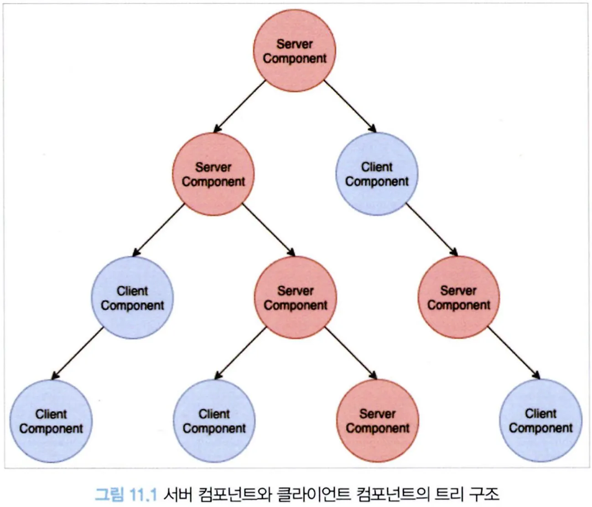
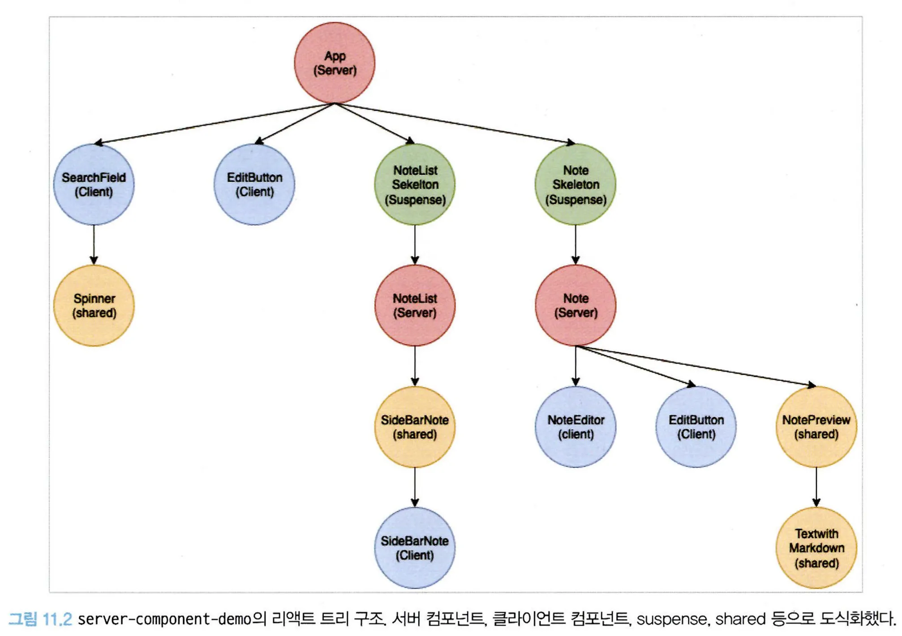
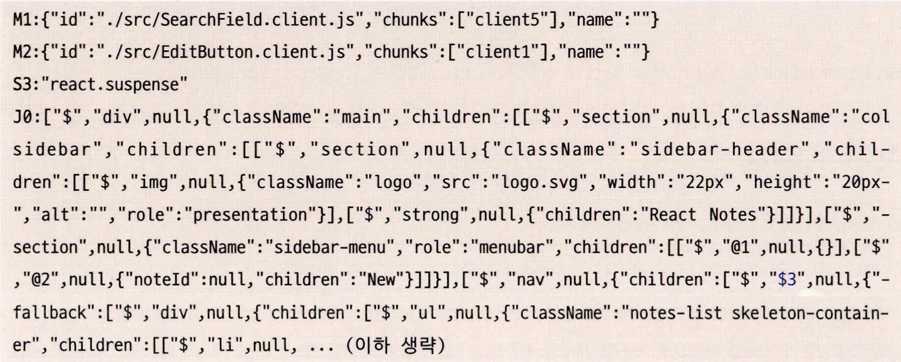

# 11.2 리액트 서버 컴포넌트

리액트 서버 컴포넌트는 서버 사이드 렌더링과 완전히 다른 개념이다.

리액트 서버 컴포넌트는 무엇인지 살펴보자.

## 11.2.1 기존 리액트 컴포넌트와 서버 사이드 렌더링의 한계

기존 SSR의 흐름을 떠올려보면, 미리 서버에서 DOM을 만들어 오고, 클라이언트에서는 이렇게 만들어진 DOM을 기준으로 하이드레이션을 진행한다.

이후 브라우저에서는 상태를 추적하고, 이벤트 핸들러를 DOM에 추가하고, 응답에 따라 렌더링 트리를 변경하기도 한다.

이러한 구조는 몇 가지 명백한 한계점이 있다. 하나씩 살펴보자.

### **1. 자바스크립트 번들 크기가 0인 컴포넌트를 만들 수 없다**

게시판 등 사용자가 작성한 HTML에 위험한 태그를 제거하기 위해 사용되는 유명한 npm 라이브러리로 sanitize-html이 있다.

이 sanitize-html을 리액트 컴포넌트에서 사용한다고 가정해 보자.

```tsx
import sanitizeHtml from "sanitize-html"; // 206K (63.3K gzipped)

function Board({ text }: { text: string }) {
  const html = useMemo(() => sanitizeHtml(text), [text]);
  return <div dangerouslySetInnerHTML={{ __html: html }} />;
}
```

- 63.3kB에 달하는 sanitize-html을 필요로 하며, 브라우저에서 해당 라이브러리를 다운로드, 실행까지 거쳐야 한다.
- 어느 정도 규모 있는 웹 애플리케이션을 작성하다 보면 브라우저 환경에서 타사 라이브러리의 이용은 피할 수 없게 된다. 이는 그만큼 사용자 기기의 부담으로 고스란히 자리 잡게 된다.
- 만약 sanitize-html은 서버만 가지고 있고, 서버에서 라이브러리를 실행한 결과와 컴포넌트 렌더링 결과물만 제공하면, 클라이언트는 무거운 라이브러리를 다운로드해 실행하지 않고도 사용자에게 보여주고 싶은 컴포넌트를 렌더링할 수 있다.

### **2. 백엔드 리소스에 대한 직접적인 접근이 불가능하다**

리액트를 사용하는 클라이언트에서 백엔드 데이터에 접근하려면 REST API와 같은 방법을 사용하는 것이 일반적이다.

이 방법은 편리하지만 백엔드가 항상 클라이언트에서 데이터에 접근하기 위한 방법을 마련해야 한다.

만약 클라이언트에서 직접 백엔드에 접근해 원하는 데이터를 가져올 수 있다면 어떨까?

```tsx
import db from "db"; // 어떤 DB

async function Board({ id }: { id: string }) {
  const text = await db.board.get(id);
  return <>{text}</>;
}
```

- 이처럼 DB에 직접 액세스하거나, 백엔드의 파일 시스템에 직접 접근하는 등 클라이언트에 데이터를 제공
  하기 위한 수고가 줄어든다.
- 백엔드에 접근할 수 있는 단계가 하나 줄어든 셈이므로 성능상으로도 확실히 더 이점을 가지고 있다.

### 3. 자동 코드 분할(code split)이 불가능하다

코드 분할이란 하나의 거대한 코드 번들 대신 코드를 여러 작은 단위로 나누어 필요할 때만 동적으로 지연 로딩함으로서 앱을 초기화하는 속도를 높여주는 기법이다.

일반적으로 리액트에서는 lazy를 사용해 구현해 왔다. 다음 예제를 보자

```tsx
// 리액트 RFC 저장소에 있는 코드 분할 예제

// PhotoRenderer.js
// NOTE: *before* Server Components
import { lazy } from "react";

const OldPhotoRenderer = lazy(() => import("./OldPhotoRenderer.js"));
const NewPhotoRenderer = lazy(() => import("./NewPhotoRenderer.js"));

function Photo(props) {
  // 이 플래그에 따라 어떤 컴포넌트를 사용할지 결정된다.
  if (FeatureFlags.useNewPhotoRenderer) {
    return <NewPhotoRenderer {...props} />;
  } else {
    return <OldPhotoRenderer {...props} />;
  }
}
```

**이 기법은 몇 가지 단점이 있다**

- 일일이 lazy로 감싸는 것을 기억해야 한다.
  - 개발자는 항상 코드 분할을 해도 되는 컴포넌트인지를 유념하고 개발해야 하기 때문에 이를 누락하는 경우가 발생할 수 있다.
- 해당 컴포넌트가 호출되고(Photo) if 문을 판단하기 전까지 어떤 지연 로딩한 컴포넌트를 불러올지 결정할 수 없다.
  - 이는 지연 로딩으로 인한 성능 이점을 상쇄해 버리는 결과를 만들고 만다.
- 코드 분할을 서버에서 자동으로 수행해 준다면 개발자는 굳이 코드 분할을 염두에 두지 않더라도 자연스럽게 성능 이점을 누릴 수 있을 것이다.
- 그리고 어떤 컴포넌트를 미리 불러와서 클라이언트에 내려줄지 서버에서 결정할 수 있다면 코드 분할의 이점을 100% 활용할 수 있게 된다.

### **4. 연쇄적으로 발생하는 클라이언트와 서버의 요청을 대응하기 어렵다**

- 하나의 요청으로 컴포넌트가 렌더링되고, 또 그 컴포넌트의 렌더링 결과로 또 다른 컴포넌트들을 렌더링하는 시나리오를 상상해 보자.
- 최초 컴포넌트의 요청과 렌더링이 끝나기 전까지는 하위 컴포넌트의 요청과 렌더링이 끝나지 않는다는 큰 단점이 있다.
- 또한 그만큼 서버에 요청하는 횟수도 늘어난다. 그리고 부모 컴포넌트의 요청과 렌더링이 결정되기 전까지, 그 부모 컴포넌트의 결과물에 의존하는 하위 컴포넌트들의 서버 요청이 지연되고 아직 렌더링될 준비가 되지 않았음을 나타내는 불필요한 렌더링까지 발생한다.
- 이러한 작업을 서버에서 모두 수행하면 데이터를 불러오고 컴포넌트를 렌더링하는 것이 모두 서버에서 이뤄지므로 클라이언트에서 서버로 요청함으로써 발생하는 지연을 줄일 수 있고, 또한 클라이언트에서는 반복적으로 요청을 수행할 필요도 없어진다. 서버에서는 필요에 따라 백엔드 데이터에 접근하거나 지속적으로 데이터를 불러옴으로써 클라이언트에서보다 더 효율적으로 컴포넌트를 렌더링할 수 있게 된다.

### 5. 추상화에 드는 비용이 증가한다

리액트는 템플릿 언어로 설계되지 않았다. 일반적으로 웹 개발에서 템플릿 언어란 HTML에 특정 언어의 문법을 집어넣어 사용할 수 있는 것을 의미한다.

장고를 예를 들면, 다음과 같은 것이 템플릿 언어라고 볼 수 있다.

```tsx
// 
<li>
	<a href="/post/{{ post.id }}/">{{ post.text }}</a>
</li>
// 
```

- 템플릿 언어는 HTML에서 할 수 없는 for 문이나 if 문 등을 처리할 수 있지만 그 밖의 복잡한 추상화나 함수 사용은 어렵다.
- 리액트는 JS를 기반으로 함수나 클래스를 사용해 다양한 작업을 수행할 수 있게끔 제공하여 개발자에게 자유를 준다.

문제는 이러한 추상화가 복잡해질수록 코드의 양은 많아지고, 런타임 시에는 오버헤드가 발생한다. 다음 예제 코드를 보자.

```tsx
// Note.js
import db from "db";
import NoteWithMarkdown from "NoteWithMarkdown.js";
import { fetchNote } from "services.js";

function Note({ id }) {
  const [note, setNote] = useState(null);

  useEffect(() => {
    (async () => {
      const result = await fetchNote();
      const response = await result.json();
    })();
  }, []);

  if (note === null) {
    return null;
  }

  return <NoteWithMarkdown note={note} />;
}
```

```tsx
// NoteWithMarkdown.js
import marked from "marked";
import sanitizeHtml from "sanitize-html";

function NoteWithMarkdown({ note }) {
  const html = sanitizeHtml(marked(note.text));
  return <div dangerouslySetInnerHTML={{ __html: html }} />;
}
```

- 클라이언트에서 어떤 정보를 불러와서 이를 화면에 보여주는 역할을 하는 두 컴포넌트다.

두 컴포넌트에서 불러오는 import, useEffect 실행, API 호출 등 내용은 복잡하지만 결국 사용자가 보는 것은 다음과 같은 단순한 결과물이다.

```tsx
<div>
	<!— 노트 -->
</div>
```

실무에서 작성된 컴포넌트들은 이보다 더 복잡하고 코드의 양도 많다. 그리고 사용자에게 전달되는 HTML 결과물 자체는 단순할 수도 있다.

이렇게 복잡한 추상화에 따른 결과물을 연산하는 작업을 서버에서 수행한다면, 컴포넌트가 여러 개가 중첩되고 합성되어 복잡해 보일 수 있지만 서버에서 클라이언트로 전송되는 내용을 서버에서 미리 다 계산해서 내려준다면 여러 가지 장점이 있다.

클라이언트에서는 복잡한 작업을 하지 않아도 되므로 속도가 빨라질 것이고, 서버에서 클라이언트에서 전송되는 결과물 또한 단순해 가벼워진다. 코드 추상화에 따른 비용은 서버에서만 지불하면 된다.

---

서버 사이드 렌더링, 클라이언트 사이드 렌더링은 모두 이 문제를 해결하기에는 조금씩 아쉬움이 있다.

이러한 두 구조의 장점을 모두 취하고자 하는 것이 바로 리액트 서버 컴포넌트다.

## 11.2.2 서버 컴포넌트란?

서버 컴포넌트란 하나의 언어, 하나의 프레임워크, 그리고 하나의 API와 개념을 사용하면서 서버와 클라이언트 모두에서 컴포넌트를 렌더링할 수 있는 기법을 의미한다.

서버에서 할 수 있는 일은 서버가 처리하게 두고, 할 수 없는 나머지 작업은 클라이언트인 브라우저에서 수행된다.

즉, 일부 컴포넌트는 클라이언트에서, 일부 컴포넌트는 서버에서 렌더링된다.

하지만 클라이언트 컴포넌트는 서버 컴포넌트를 import할 수 없다.

클라이언트 컴포넌트가 서버 컴포넌트를 불러오게 된다면 클라이언트 컴포넌트는 서버 컴포넌트를 실행할 방법이 없다.(서버 환경이 브라우저에는 존재하지 않으므로)

그렇다면 어떻게 리액트 트리 내부의 컴포넌트를 서버 컴포넌트와 클라이언트 컴포넌트 각각을 만들어서 관리할 수 있는 것일까?



- 흔히 볼 수 있는 리액트 컴포넌트 트리를 간단히 도식화한 그림이다.

서버 컴포넌트의 이론에 따르면 모든 컴포넌트는 서버 컴포넌트가 될 수도 있고 클라이언트 컴포넌트가 될 수도 있다.

따라서 위와 같이 클라이언트 및 서버 컴포넌트가 혼재된 상황은 자연스러울 것이다.

어떻게 이런 구조가 가능한 것일까? 그 비밀은 흔히 children으로 자주 사용되는 ReactNode에 달려 있다.

```tsx
// Clientcomponent.jsx
"use client";

export default function ClientComponent({ children }) {
  return (
    <div>
      <h1>클라이언트 컴포넌트</h1>
      {children}
    </div>
  );
}

// Servercomponent.jsx
export default function Servercomponent() {
  return <span>서버 컴포넌트</span>;
}

// ParentServerComponent.jsx
// 이 컴포넌트는 서버 컴포넌트일 수도, 클라이언트 컴포넌트일 수도 있다.
// 따라서 두 군데 모두에서 사용할 수 있다.
import Clientcomponent from "./Clientcomponent";
import Servercomponent from "./Servercomponent";
export default function ParentServerComponent() {
  return (
    <ClientComponent>
      <ServerComponent />
    </ClientComponent>
  );
}
```

- 한 가지 눈에 띄는 것은 서버 컴포넌트와 클라이언트 컴포넌트가 있으며 동시에 두 군데에서 모두 사용할 수 있는 공용 컴포넌트가 있다는 것이다.

세 컴포넌트의 차이와 제약사항에 대해 각각 알아보자.

### 서버 컴포넌트

- 요청이 오면 그 순간 서버에서 딱 한 번 실행될 뿐이므로 상태를 가질 수 없다. 따라서 useState, useReducer 등의 훅을 사용할 수 없다.
- 렌더링 생명주기도 사용할 수 없다. 한번 렌더링되면 그걸로 끝이기 때문에 useEffect, useLayoutEffect를 사용할 수 없다.
- 커스텀 훅 또한 사용할 수 없다. 단, 서버에서 제공할 수 있는 기능만 사용하는 훅은 사용할 수 있다.
- 서버에서만 실행되기 때문에 DOM API를 쓰거나 window, document 등에 접근할 수 없다.
- 컴포넌트 자체가 async한 것이 가능하다. 데이터베이스, 내부 서비스, 파일 시스템 등 서버에만 있는 데이터를 async/await으로 접근할 수 있다.
- 다른 서버 컴포넌트를 렌더링하거나 div, span, p 같은 요소를 렌더링하거나, 혹은 클라이언트 컴포넌트를 렌더링할 수 있다.

### 클라이언트 컴포넌트

- 브라우저 환경에서만 실행되므로 서버 컴포넌트를 불러오거나, 서버 전용 훅이나 유틸리티를 불러올 수 없다.
- 위 코드처럼 서버 컴포넌트 내부에서 클라이언트 컴포넌트를 렌더링하는데, 그 클라이언트 컴포넌트가 자식으로 서버 컴포넌트를 갖는 구조는 가능하다.
  - 그 이유는 클라이언트 입장에서 봤을 때 서버 컴포넌트는 이미 서버에서 만들어진 트리를 가지고 있을 것이고, 클라이언트 컴포넌트는 이미 서버에서 만들어진 그 트리를 삽입해서 보여주기만 하기 때문이다.
- 위 두 가지 예외 사항을 제외하면 일반적으로 우리가 알고 있는 리액트 컴포넌트와 같다.

### 공용 컴포넌트(shared components)

- 서버와 클라이언트 모두에서 사용할 수 있다. 공통으로 사용할 수 있는 만큼, 서버컴포넌트와 클라이언트 컴포넌트의 모든 제약을 받는 컴포넌트가 된다.

리액트는 어떻게 서버, 클라이언트, 공용 컴포넌트인지 판단할까?

기본적으로 리액트는 모든 것을 다 공용 컴포넌트로 판단한다. 즉, 모든 컴포넌트를 다 서버에서 실행 가능한 것으로 분류한다.

대신, 클라이언트 컴포넌트라는 것을 명시적으로 선언하려면 파일의 맨 첫 줄에 "use client"라고 작성하면 된다.

---

## 11.2.3 서버 사이드 렌더링과 서버 컴포넌트의 차이

서버 사이드 렌더링은 응답받은 페이지 전체를 HTML로 렌더링하는 과정을 서버에서 수행한 후 그 결과를 클라이언트에 내려준다.

그리고 이후 클라이언트에서 하이드레이션 과정을 거쳐 서버의 결과물을 확인하고 이벤트를 붙이는 등의 작업을 수행한다.

서버 사이드 렌더링의 목적은 정적인 HTML을 빠르게 내려주는 데 초점을 두고 있다. 따라서 여전히 초기 HTML이 로딩된 이후에는 클라이언트에서 자바스크립트 코드를 다운로드하고, 파싱하고, 실행하는 데 비용이 든다.

반면 서버 컴포넌트는 하이드레이션이 필요하지 않고, 완성된 컴포넌트를 렌더링하여 제공한다.

따라서 서버 사이드 렌더링과 서버 컴포넌트를 모두 결합하면 서버 컴포넌트를 활용해 서버에서 렌더링할 수 있는 컴포넌트는 서버에서 완성해서 제공받은 다음, 클라이언트 컴포넌트는 서버 사이드 렌더링으로 초기 HTML을 빠르게 전달받을 수 있다.

클라이언트 및 서버 컴포넌트를 모두 빠르게 보여줄 수 있고, 동시에 클라이언트에서 내려받아야 하는 자바스크립트의 양도 줄어들어 브라우저의 부담을 덜 수도 있다.

결론적으로 둘은 대체제가 아닌 상호보완하는 개념으로 봐야한다.

---

## 11.2.4 서버 컴포넌트는 어떻게 작동하는가?

서버 컴포넌트를 렌더링하기 위해 실제로 어떠한 일들이 일어나는지를 핵심 내용만 간단하게 살펴보자.

사용되는 예제 코드는 리액트 팀에서 2021년에 공식적으로 제공한 server-components-demo를 포크한 prisma/server-components-demo다.

**서버 사이드 렌더링이 수행되지 않는 코드**

```tsx
app.get(
  handleErrors(async function (_req, res) {
    await waitForWebpack();
    const html = readFileSync(
      path.resolve(_dirname, "../build/index.html"),
      "utf8"
    );
    // Note: this is sending an empty HTML shell, like a client-side-only app.
    // However, the intended solution (which isn't built out yet) is to read
    // from the Server endpoint and turn its response into an HTML stream.

    // 이것은 빈 HTML 껍데기를 전송하며, 마치 클라이언트 사이드 전용 앱처럼 작동합니다.
    // 그러나 의도된 솔루션(아직 구축되지 않음)은 서버 엔드포인트에서 데이터를 읽어
    // 해당 응답을 HTML 스트림으로 변환하는 것입니다.
    res.send(html);
  })
);
```

- waitForWebpack은 단순히 개발 환경에서 웹팩이 빌드 경로에 index.html을 만들 때까지 기다리는 코드일뿐 사용자가 최초에 들어왔을 때 수행하는 작업은 오로지 index.html을 제공하는 것이다.

1. 서버가 렌더링 요청을 받는다. 서버가 렌더링 과정을 수행해야 하므로 리액트 서버 컴포넌트를 사용하는 모든 페이지는 항상 서버에서 시작된다. 즉, 루트에 있는 컴포넌트는 항상 서버 컴포넌트다.

예제의 구조는 현재 다음과 같다.


- 이 예제에서 /react라고 하는 주소로 요청을 보내면 서버는 브라우저의 요청을 받고 서버 렌더링을 시작한다.

1. 서버는 받은 요청에 따라 컴포넌트를 JSON으로 직렬화(serialize)한다. 이때 서버에서 렌더링할 수 있는 것은 직렬화해서 내보내고, 클라이언트 컴포넌트로 표시된 부분은 해당 공간을 플레이스홀더 형식으로 비워두고나타낸다. 브라우저는 이후에 이 결과물을 받아서 다시 역직렬화한 다음 렌더링을 수행한다.

**react로 최초 메인 페이지에 대한 렌더링 요청을 했을 때 받는 응답**


- 이 같은 데이터 형태를 와이어 포맷(wire format)이라고 하며, 서버는 이 값을 스트리밍해 클라이언트에 제공한다.

위 데이터를 하나씩 살펴보자.

**M**

- M으로 시작하는 줄은 클라이언트 컴포넌트를 의미하며, 클라이언트 번들에서 해당 함수를 렌더링하기 위해 필요한 정보가 어디(chunk)에 담겨 있는지 참조를 전달해 준다.
- 이 예제에서는 SearchField.client.js와 EditButton.client.js, SideBarNote.client.js가 클라이언트의 모듈의 참조로 전해졌다.

**S**

- Suspense를 의미한다.

**J**

- 서버에서 렌더링된 서버 컴포넌트다. J0은 App.server.js를 표현한 것임을 알 수 있다.
- 그리고 여기에는 렌더링에 필요한 모든 element, className, props, children 정보 등이 들어가 있다.

한 가지 흥미로운 것은 @1, @2와 같은 요소다.

```tsx
[
  "$",
  "section",
  null,
  {
    className: "sidebar-menu",
    role: "menubar",
    children: [
      ["$", "@1", null, {}],
      [
        "$",
        "@2",
        null,
        {
          noteId: null,
          children: "New",
        },
      ],
    ],
  },
];
```

- 이 정보는 나중에 렌더링이 완료됐을 때 들어가야 할 컴포넌트를 의미하는 것으로, @1은 M1이 렌더링되면 저 @1 자리에 @M1이 들어가야 한다는 것을 의미한다.
- 이처럼 서버에서는 클라이언트에서 리액트 컴포넌트 트리 구성에 필요한 정보를 최대한 많이, 그리고 경제적인포맷으로 클라이언트에 전달한다.

1. 브라우저가 리액트 컴포넌트 트리를 구성한다. 브라우저가 서버로 스트리밍으로 JSON 결과물을 받았다면 이구문을 다시 파싱한 결과물을 바탕으로 트리를 재구성해 컴포넌트를 만들어 나간다.

- M1과 같은 형태의 클라이언트 컴포넌트를 받았다면 클라이언트에서 렌더링을 진행할 것이고, 서버에서 만들어진 결과물을 받았다면 이 정보를 기반으로 리액트 트리를 그대로 만들 것이다.
- 그리고 최종적으로 이 트리를 렌더링해 브라우저의 DOM에 커밋한다.

살펴본 바를 토대로 리액트 서버 컴포넌트의 작동 방식의 특별한 점을 몇 가지 살펴보자.

- 서버에서 클라이언트로 정보를 보낼 때 스트리밍 형태로 보냄으로써 클라이언트가 줄 단위로 JSON을 읽고 컴포넌트를 렌더링할 수 있어 브라우저에서는 되도록 빨리 사용자에게 결과물을 보여줄 수 있다는 장점이 있다.
- 컴포넌트들이 하나의 번들러 작업에 포함돼 있지 않고 각 컴포넌트별로 번들링이 별개로 돼 있어 필요에 따라컴포넌트를 지연해서 받거나 따로 받는 등의 작업이 가능해졌다.
- 서버 사이드 렌더링과는 다르게 결과물이 HTML이 아닌 JSON 형태로 보내졌다. 클라이언트의 최종 목표는리액트 컴포넌트 트리를 서버 컴포넌트와 클라이언트 컴포넌트의 두 가지로 조화롭게 구성하는 것으로, 이는 단순히 HTML을 그리는 작업 이상의 일을 필요로 한다.
  - 따라서 HTML 대신 단순한 리액트 컴포넌트 구조를 JSON으로 받아서 리액트 컴포넌트 트리의 구성을 최대한 빠르게 할 수 있도록 도와준다.

이러한 특징으로 인해 서버 컴포넌트에서 클라이언트 컴포넌트로 props를 넘길 때 반드시 직렬화 가능한 데이터를 넘겨야 한다.
