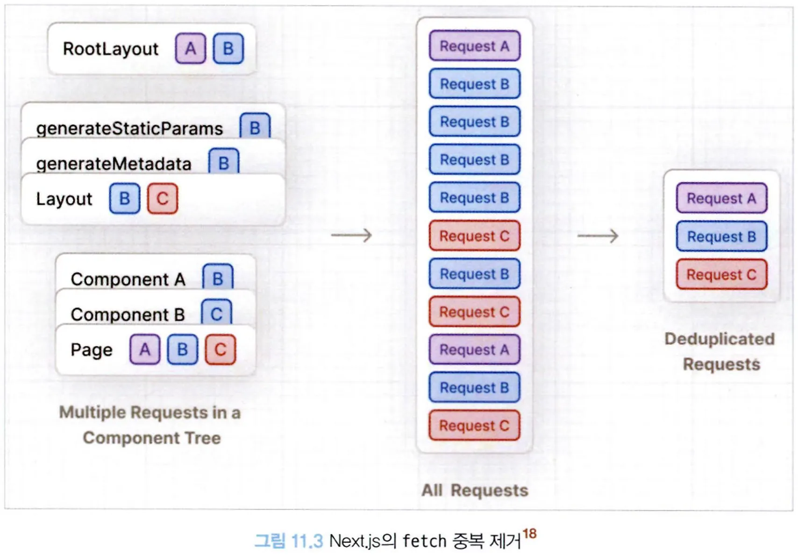
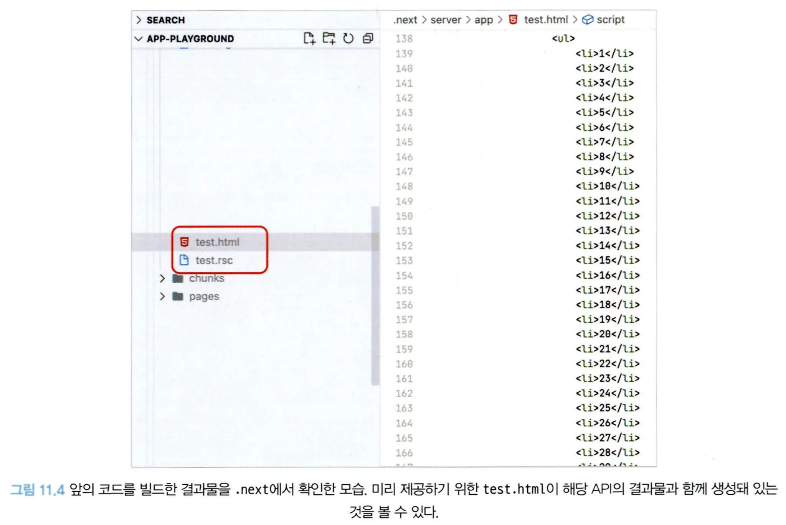
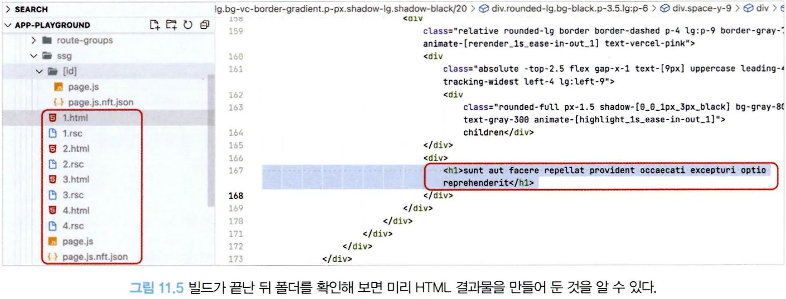
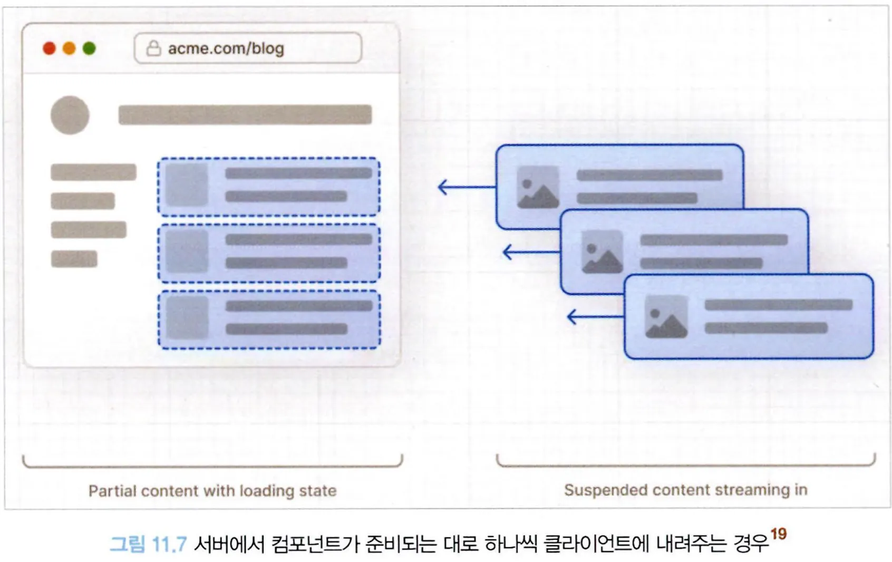

# 11.3 Next.js에서의 리액트 서버 컴포넌트

Next.js가 13 버전을 릴리스하면서 서버 컴포넌트를 지원하기 시작했다.

기본적인 서버 컴포넌트의 제약은 동일하다. 서버 컴포넌트는 클라이언트 컴포넌트를 불러올 수 없으며, 클라이언트 컴포넌트는 서버 컴포넌트를 children props로 받는 것만 가능하다.

그리고 루트 컴포넌트는 무조건 서버 컴포넌트가 된다. 루트 컴포넌트는 각 페이지에 존재하는 page.js다.

그리고 layout.js도 마찬가지로 서버 컴포넌트로 작동한다. 즉, page.js와 layout.js는 반드시 서버 컴포넌트여야하며, 앞서 언급했던 서버 컴포넌트의 제약을 받는다.

```tsx
// page.js
import Clientcomponent from "./Clientcomponent";
import Servercomponent from "./Servercomponent";

// 각 페이지는 기본으로 서버 컴포넌트로 작동한다.
export default function Page() {
  return (
    <ClientComponent>
      <ServerComponent />
    </ClientComponent>
  );
}
```

- 이렇게 하면 클라이언트 컴포넌트 관점에서 서버 컴포넌트는 이미 렌더링된 결과물로 children에 들어갈 것이기 때문에 서버 컴포넌트 구조를 구축하는 데 문제가 없다.

---

## 11.3.1 새로운 fetch 도입과 getServerSideProps, getStaticProps, getInitialProps의 삭제

3개의 메서드가 /app 디렉터리 내부에서는 삭제됐다. 대신 모든 데이터 요청은 웹에서 제공하는 표준 API인 fetch를 기반으로 이뤄진다.

다음 예제를 보자.

```tsx
async function getData() {
  // 데이터를 불러온다.
  const result = await fetch("https://api.example.com/");

  if (!result.ok) {
    // 이렇게 에러를 던지면 가장 가까운 에러 바운더리에 전달된다.
    throw new Error("데이터 불러오기 실패");
  }

  return result.json();
}

// async 서버 컴포넌트 페이지
export default async function Page() {
  const data = await getData();

  return (
    <main>
      <Children data={data} />
    </main>
  );
}
```

- 이제 서버에서 데이터를 직접 불러올 수 있게 됐다.
- 또한 컴포넌트가 비동기적으로 작동하는 것도 가능해진다.
- 서버 컴포넌트는 데이터가 불러오기 전까지 기다렸다가 데이터가 불러와지면 비로소 페이지가 렌더링되어 클라이언트로 전달될 것이다.

추가로 리액트팀은 이 fetch API를 확장해 같은 서버 컴포넌트 트리 내에서 동일한 요청이 있다면 재요청이 발생하지 않도록 요청 중복을 방지했다.


- 해당 fetch 요청에 대한 내용을 서버에서는 렌더링이 한 번 끝날 때까지 캐싱하며, 클라이언트에서는 별도의 지시자나 요청이 없는 이상 해당 데이터를 최대한 캐싱해서 중복된 요청을 방지한다.

---

## 11.3.2 정적 렌더링과 동적 렌더링

정적인 라우팅에 대해서는 기본적으로 빌드 타임에 렌더링을 미리 해두고 캐싱해 재사용할 수 있게끔 해뒀고, 동적인 라우팅에 대해서는 서버에 매번 요청이 올 때마다 컴포넌트를 렌더링하도록 변경했다. 다음 예제를 보자.

```tsx
// app/page.tsx
async function fetchData() {
  const res = await fetch("https://jsonplaceholder.typicode.com/posts");
  const data = await res.json();

  return data;
}

export default async function Page() {
  const data: Array<any> = await fetchData();

  return (
    <ul>
      {data.map((item, key) => (
        <li key={key}>{item.id}</li>
      ))}
    </ul>
  );
}
```

- 특정 API 엔드 포인트에서 데이터를 불러와 페이지에서 렌더링하는 구조를 가진 서버 컴포넌트다.

이 주소는 정적으로 결정돼 있기 때문에 빌드 시에 해당 주소로 미리 요청을 해서 데이터를 가져온 다음 렌더링한 결과를 빌드에 넣어둔다.

해당 주소를 정적으로 캐싱하지 않으려면 fetch 내부에 `{ cache: 'no-cache' }` 옵션을 넣어주면 된다.

그러면 Next.js는 해당 요청을 미리 빌드해서 대기시켜 두지 않고 요청이 올 때마다 fetch 요청 이후에 렌더링을 수행한다.

또한 함수 내부에서 Next.js가 제공하는 next/headers나 next/cookie 같은 헤더 정보와 쿠키 정보를 불러오는 함수를 사용하게 된다면 해당 함수는 동적인 연산을 바탕으로 결과를 반환하는 것으로 인식해 정적 렌더링 대상에서 제외된다.

만약 동적인 주소이지만 특정 주소에 대해서 캐싱하고 싶은 경우, 즉 과거 Next.js에서 제공하는 getStaticPaths를 흉내 내고 싶다면 새로운 함수인 generateStaticParams를 사용하면 된다.

```tsx
export async function generateStaticParams() {
  return [{ id: "1" }, { id: "2" }, { id: "3" }, { id: "4" }];
}

async function fetchData(params: { id: string }) {
  const res = await fetch(
    "https://jsonplaceholder.typicode.com/posts/${params.id}"
  );
  const data = await res.json();
  return data;
}

export default async function Page({
  params,
}: {
  params: { id: string };
  children?: React.ReactNode;
}) {
  const data = await fetchData(params);
  return (
    <div>
      <h1>{data.title}</h1>
    </div>
  );
}
```


fetch 옵션에 따른 작동 방식을 정리하면 다음과 같다.

- `fetch(URL, { cache: 'force-cache' })`
  - 기본값으로 getStaticProps와 유사하게 불러온 데이터를 캐싱해 해당 데이터로만 관리한다.
- `fetch(URL, { cache: 'no-store' }), fetch(URL, { next: {revalidate: 0} })`
  - getServerSideProps와 유사하게 캐싱하지 않고 매번 새로운 데이터를 불러온다.
- `fetch(URL, { next: { revalidate: 10 } })`
  - getStaticProps에 revalidate를 추가한 것과 동일하며, 정해진 유효시간 동안에는 캐싱하고, 유효시간이 지나면 캐시를 파기한다.

---

## 11.3.3 캐시와 mutating, 그리고 revalidating

앞서 본 `fetch(URL, { next: { revalidate: 10 } })` 의 캐시와 갱신이 이뤄지는 과정은 다음과 같다.

1. 최초로 해당 라우트로 요청이 올 때는 미리 정적으로 캐시해 둔 데이터를 보여준다.
2. 이 캐시된 초기 요청은 revalidate에 선언된 값만큼 유지된다.
3. 만약 해당 시간이 지나도 일단은 캐시된 데이터를 보여준다.
4. Nextjs는 캐시된 데이터를 보여주는 한편,시간이 경과했으므로 백그라운드에서 다시 데이터를 불러온다.
5. 4번의 작업이 성공적으로 끝나면 캐시된 데이터를 갱신하고, 그렇지 않다면 과거 데이터를 보여준다.

만약 캐시를 전체적으로 무효화하고 싶다면 router에 추가된 refresh 메서드로 `router.refresh()`를 사용하면 된다.

이는 브라우저를 새로고침하는 등 브라우저의 히스토리에 영향을 미치지 않고, 오로지 서버에서 루트부터 데이터를전체적으로 가져와서 갱신하게 된다.

그리고 이 작업은 브라우저나 리액트의 state에는 영향을 미치지 않는다.

## 11.3.4 스트리밍을 활용한 점진적인 페이지 불러오기

기존 SSR의 한계를 해결하기 위해 하나의 페이지가 다 완성될때까지 기다리는 것이 아니라 HTML을 작은 단위로 쪼개서 완성되는 대로 클라이언트로 점진적으로 보내는 스트리밍이 도입됐다.

스트리밍을 활용하면 모든 데이터가 로드될 때까지 기다리지 않더라도 먼저 데이터가 로드되는 컴포넌트를 빠르게 보여주는 방법이 가능하다.

이는 사용자가 일부라도 페이지와 인터랙션을 할 수 있다는 것을 의미하며, 나아가 핵심 웹 지표인 최초 바이트까지의 시간(TTFB: Time To First Byte)과 최초 콘텐츠풀 페인팅(FCP: First Contentful Paint)을 개선하는 데 큰도움을 준다.

이 스트리밍을 활용할 수 있는 방법은 두 가지가 있다.

**경로에 loading.tsx 배치**

- 예약어로 존재하는 컴포넌트로, 렌더링이 완료되기 전에 보여줄 수 있는 컴포넌트를 배치할 수 있는 파일이다.
- loading 파일을 배치한다면 자동으로 다음 구조와 같이 Suspense가 배치된다.

```tsx
<Layout>
  <Header />
  <SideNav />
  <!-- 여기에 로딩이 온다 -->
  <Suspense fallback={<Loading />}>
    <Page />
  </Suspense>
</Layout>
```

**Suspense 배치**

- 좀 더 세분화된 제어를 하고 싶다면 직접 리액트의 Suspense를 배치하는 것도 가능하다.

```jsx
import { Suspense } from "react";
import { Notes, Peoples } from "./Components";

export default function Posts() {
  return (
    <section>
      <Suspense fallback={<Skeleton />}>
        <Notes />
      </Suspense>
      <Suspense fallback={<Skeleton />}>
        <Peoples />
      </Suspense>
    </section>
  );
}
```

이를 통해 스트리밍을 활용해 서버 렌더링이 가능해지고, 리액트는 로딩이 끝난 컴포넌트 순서대로 하이드레이션을수행해 가능한 한 사용자에게 빠르게 상호작용이 가능한 페이지를 제공할 수 있게 된다.
