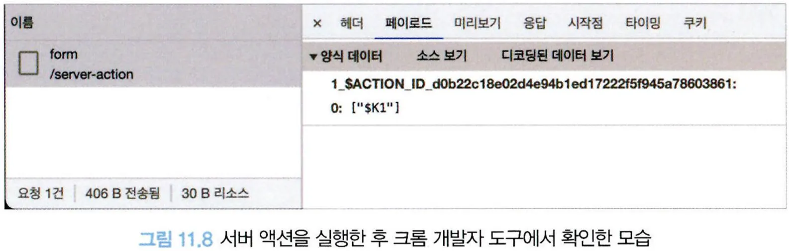
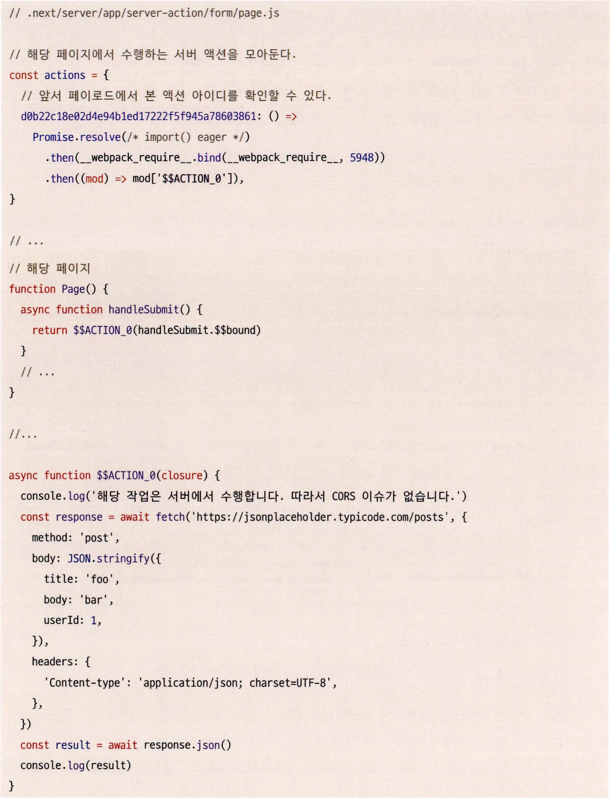
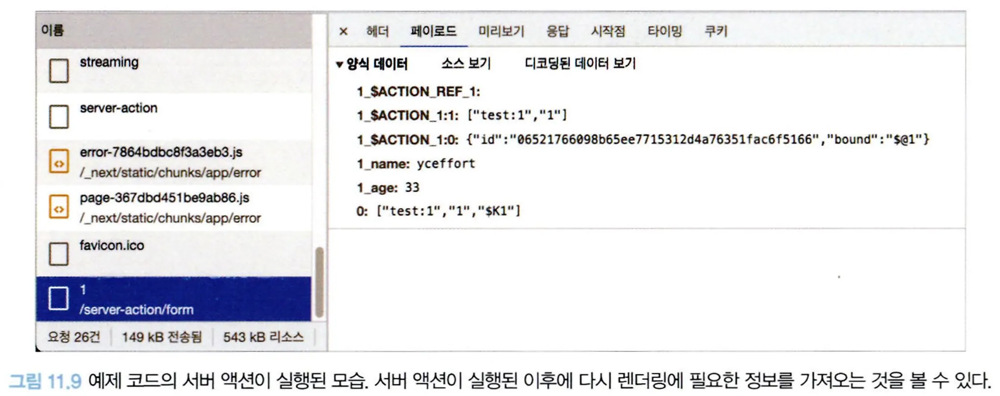

# 11.5 서버액션(alpha)

서버 액션은 API를 굳이 생성하지 않더라도 함수 수준에서 서버에 직접 접근해 데이터 요청 등을 수행할 수 있는 기능이다.

서버 컴포넌트와 다르게, 특정 함수 실행 그 자체만을 서버에서 수행할 수 있다는 장점이 있다.

그리고 그 실행 결과에 따라 다양한 작업을 수행할 수도 있다.

서버 액션을 만들려면 먼저 함수 내부 또는 파일 상단에 "use server" 지시자를 선언해야 한다. 그리고 함수는 반드시 async여야 한다.

```tsx
async function serverAction() {
  "use server";
  // 서버에 바로 접근하는 코드
}
```

```tsx
// 이 파일 내부의 모든 내용이 서버 액션으로 간주된다.
"use server";

export async function myAction() {
  // ...
  // 서버에 바로 접근하는 코드
}
```

서버 액션이 수행할 수 있는 작업을 하나씩 살펴보자.

## 11.5.1 form의 action

<form/> 태그에 action props를 추가해서 이 양식 데이터를 처리할 URI를 넘겨줄 수 있다.

```tsx
export default function Page() {
  async function handleSubmit() {
    "use server";

    console.log(
      "해당 작업은 서버에서 수행합니다. 따라서 CORS 이슈가 없습니다."
    );

    const response = await fetch("https://jsonplaceholder.typicode.com/posts", {
      method: "post",
      body: JSON.stringify({
        title: "foo",
        body: "bar",
        userId: 1,
      }),
      headers: {
        "Content-type": "application/json; charset=UTF-8",
      },
    });

    const result = await response.json();
    console.log(result);
  }

  return (
    <form action={handleSubmit}>
      <button type="submit">form 요청 보내보기</button>
    </form>
  );
}
```

- form.action에 handleSubmit이라는 서버 액션을 만들어 props로 넘겨줬다.
- 이 handleSubmit 이벤트를 발생시키는 것은 클라이언트지만 실제로 함수 자체가 수행되는 것은 서버가 된다.



- 위 화면은 크롬 개발자 도구의 네트워크 탭에서 해당 form 버튼을 클릭했을 때를 캡처한 것이다.
- /server-action/form으로 요청이 수행되고, 페이로드에는 앞서 코드에서 보낸 post 요청이 아닌 ACTION_ID라는 액션 구분자만 있는 것을 볼 수 있다.

그리고 이를 처리하는 서버에서는 다음과 같은 내용이 미리 빌드돼 있는 것을 볼 수 있다.



- 위 코드와 실행 결과를 미루어 봤을 때, 서버 액션을 실행하면 클라이언트에서는 현재 라우트 주소와ACTION_ID만 보내고 그 외에는 아무것도 실행하지 않는 것을 알 수 있다.
- 그리고 서버에서는 요청받은 라우트 주소와 ACTION_ID를 바탕으로, 실행해야 할 내용을 찾고 이를 서버에서 직접 실행한다.
- 이를 위해 'use server'로 선언돼 있는 내용을 빌드 시점에 미리 클라이언트에서 분리시키고 서버로 옮김으로써 클라이언트 번들링 결과물에는 포함되지 않고 서버에서만 실행되는 서버 액션을 만든 것을 확인할 수 있다.

서버 액션은 실제 노출하는 데이터가 연동돼 있을 때 더욱 효과적으로 사용할 수 있다.

```tsx
// key value storage. 서버에서만 사용할 수 있는 패키지다.
import kv from "@vercel/kv";
import { revalidatePath } from "next/cache";

interface Data {
  name: string;
  age: number;
}

export default async function Page({ params }: { params: { id: string } }) {
  const key = `test:${params.id}`;
  const data = await kv.get<Data>(key);

  async function handleSubmit(formData: FormData) {
    "use server";

    const name = formData.get("name");
    const age = formData.get("age");

    await kv.set(key, {
      name,
      age,
    });

    revalidatePath(`/server-action/form/${params.id}`);
  }

  return (
    <>
      <h1>form with data</h1>
      <h2>
        서버에 저장된 정보: {data?.name} {data?.age}
      </h2>

      <form action={handleSubmit}>
        <label htmlFor="name">이름: </label>
        <input
          type="text"
          id="name"
          name="name"
          defaultValue={data?.name}
          placeholder="이름을 입력해 주세요"
        />

        <label htmlFor="age">나이: </label>
        <input
          type="number"
          id="age"
          name="age"
          defaultValue={data?.age}
          placeholder="나이를 입력해 주세요."
        />

        <button type="submit">submit</button>
      </form>
    </>
  );
}
```

- 위 예제에서는 서버에서만 접근할 수 있는 Redis 스토리지인 @vercel/kv를 기반으로 서버 액션에서 어떻게 양식 데이터를 다룰 수 있는지 나타낸다.
- Page 컴포넌트는 서버 컴포넌트로, `const data = await kv.get<Data>(key)`와 같은 형태로 직접 서버 요청을 수행해서 데이터를 가져와 JSX를 렌더링한다.
- 그리고 form 태그에 서버 액션인 handleSubmit을 추가해서 formData를 기반으로 데이터를 가져와 다시 데이터베이스인 kv에 업데이트한다.
- 업데이트가 성공적으로 마무리됐다면 마지막으로 revalidatePath를 통해 해당 주소의 캐시 데이터를 갱신해 컴포넌트를 재렌더링하게 했다.

이 같은 일련의 과정이 어떻게 일어나는지 살펴보자.



- 앞서 form을 사용했던 예제와 마찬가지로 서버에 ACTION_ID와 실행에 필요한 데이터만 보내고, 직접적인 업데이트를 수행하지 않는 것을 확인할 수 있다.
- 그리고 이 서버 액션의 실행이 완료되면 data 객체가 revalidatePath로 갱신되어 업데이트된 최신 데이터를 불러오는 것을 볼 수 있다.
- 이러한 최신 데이터를 불러오는 동작은 페이지 내부에 loading.jsx가 있다면 더욱 뚜렷하게 확인할 수 있다.

이 모든 과정이 페이지 새로고침이 없이 수행된다.

최초에 페이지를 서버에서 렌더링한 이후에 폼에서 handleSubmit으로 서버에 데이터 수정을 요청하는 것, 그리고 수정된 결과를 다시금 조회해서 새로운 결과로 렌더링하는 일련의 과정이 모두 페이지 새로고침 없이 데이터 스트리밍으로 이뤄진다.

따라서 개발자들은 서버에 데이터 수정을 요청하고, 클라이언트에서는 업데이트를 완료한 후 새로운 결과를 받을때까지 사용자에게 로딩 중이라는 것을 알 수 있는 인터랙션을 구성할 수도 있다.

revalidatePath는 인수로 넘겨받은 경로의 캐시를 초기화해서 해당 URL에서 즉시 새로운 데이터를 불러오는 역할을 한다. Next.js에서는 이를 server mutation(서버에서의 데이터 수정)이라고 하는데, server mutation으로 실행할 수 있는 함수는 다음과 같다.

**redirect**

- `import { redirect } from 'next/navigation'`으로 사용할 수 있으며, 특정 주소로 리다이렉트할 수 있다.

**revalidatePath**

- `import { revalidatePath } from 'next/cache'`로 사용할 수 있으며, 해당 주소의 캐시를 즉시 업데이트한다.

**revalidateTag**

- `import { revalidateTag } from 'next/cache'`로 사용할 수 있다. 캐시 태그는 fetch 요청 시에 다음과 같이 추가할 수 있다.
  ```tsx
  fetch("https://localhost:8080/api/something", { next: { tags: [""] } });
  ```
- 이렇게 태그를 추가해 두면 여러 다양한 fetch 요청을 특정 태그 값으로 구분할 수 있으며, revalidateTag를사용할 경우 이 특정 태그가 추가된 fetch 요청을 모두 초기화한다.

이처럼 form을 서버 액션과 함께 사용하면 form을 기반으로 한 데이터 추가 및 수정 요청을 좀 더 자연스럽게 수행할 수 있다.

그리고 Next.js에서 관리하는 캐시를 효과적으로 초기화할 수 있으므로 사용자에게 더욱 자연스러운 사용자 경험을 안겨줄 수 있다.

---

## 11.5.2 input의 submit과 image의 formAction

form.action과 마찬가지로 `input type="submit"` 또는 `input type="image"`에 formAction prop으로도 서버 액션을 추가할 수 있다. 사용법은 앞에서 살펴본 것과 동일하다.

## 11.5.3 startTransition과의 연동

useTransition에서 제공하는 startTransition에서도 서버 액션을 활용할 수 있다.

```tsx
// server-action/index.ts
"use server";

import kv from "@vercel/kv";
import { revalidatePath } from "next/cache";

export async function updateData(
  id: string,
  data: { name: string; age: number }
) {
  const key = `test:${id}`;

  await kv.set(key, {
    name: data.name,
    age: data.age,
  });

  revalidatePath(`/server-action/form/${id}`);
}

// client-component.tsx
("use client");

import { useCallback, useTransition } from "react";
import { updateData } from "../../server-action";
import { SkeletonBtn } from "../app/styles/styled-components/components";

export function ClientButtonComponent({ id }: { id: string }) {
  const [isPending, startTransition] = useTransition();

  const handleClick = useCallback(() => {
    startTransition(() => updateData(id, { name: "기본값", age: 0 }));
  }, []);

  return isPending ? (
    <SkeletonBtn />
  ) : (
    <button onClick={handleClick}>기본값으로 돌리기</button>
  );
}
```

- 이렇게 useTransition을 사용하면 얻을 수 있는 장점 중 하나는 이전과 동일한 로직을 구현하면서도 page 단위의 loading.jsx를 사용하지 않아도 된다.
- isPending을 활용해 startTransition으로 서버 액션이 실행됐을 때 해당 버튼을 숨기고 로딩 버튼을 노출함으로써 페이지 단위의 로딩이 아닌 좀 더 컴포넌트 단위의 로딩 처리도 가능해진다.
- 이와 동시에 revalidatePath과 같은 server mutation도 마찬가지로 처리할 수 있다.

## 11.5.4 server mutation이 없는 작업

별도의 server mutation을 실행하지 않는다면 바로 이벤트 핸들러에 넣어도 된다.

```tsx
export default function Page() {
  async function handleClick() {
    "use server";

    // server mutationO| 필요 없는 작업
  }
  return <button onClick={handleClick}>form 요청 보내보기</button>;
}
```

## 11.5.5 서버 액션 사용 시 주의할 점

- 서버 액션은 클라이언트 컴포넌트 내에서 정의될 수 없다. 서버 액션을 `'use client'`가 선언돼 있는 컴포넌트 내에서 사용하면 에러가 발생한다.
  - 단 `'use server'`로 서버 액션만 모여 있는 파일을 별도로 import하면 가능하다.
- props 형태로 서버 액션을 클라이언트 컴포넌트에 넘기는 것 또한 가능하다. 이는 서버 컴포넌트가 클라이언트 컴포넌트를 불러올 수 있는 것과 동일한 원리다.
  - 즉 서버에서만 실행될 수 있는 자원은 반드시 파일 단위로 분리해야 한다.
