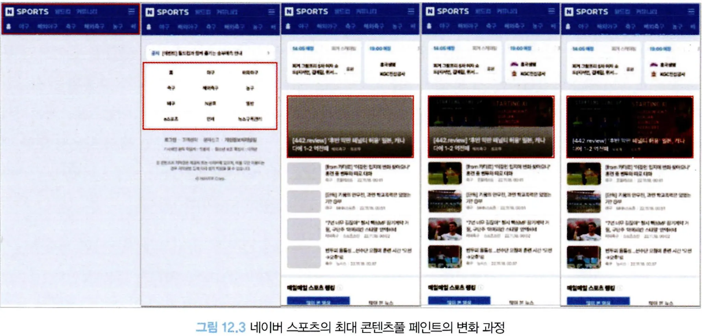
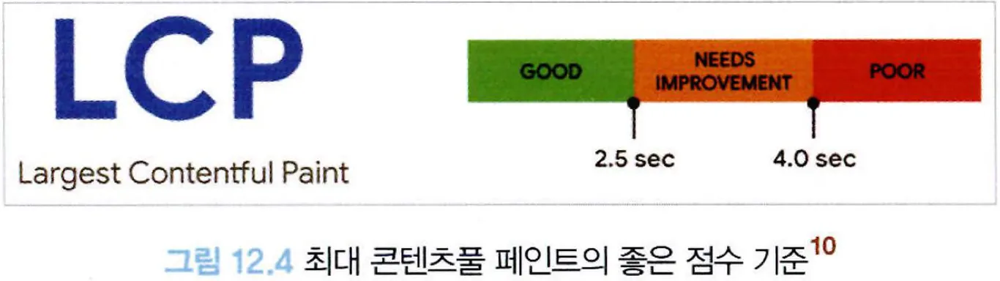
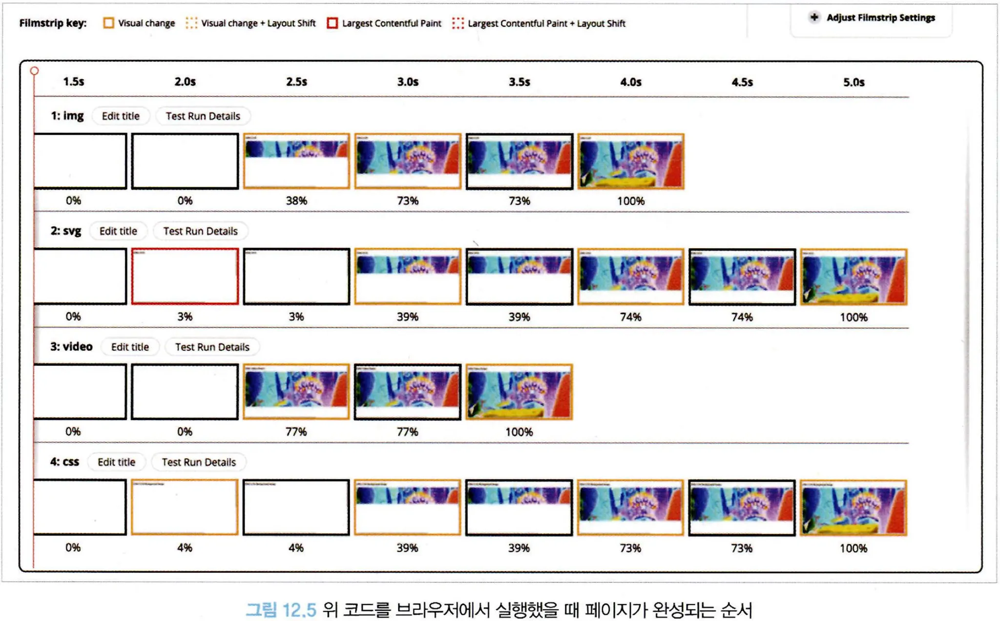
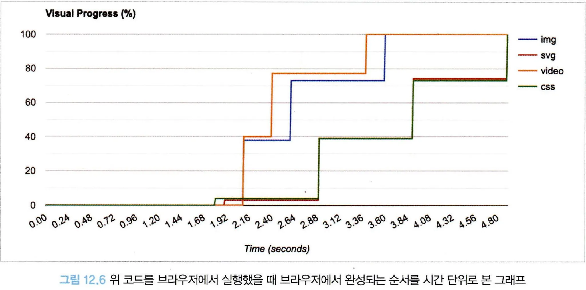
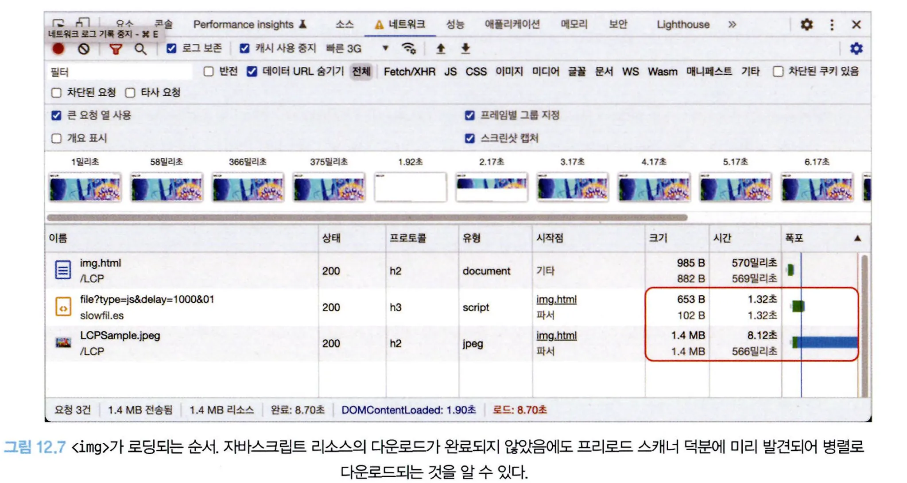
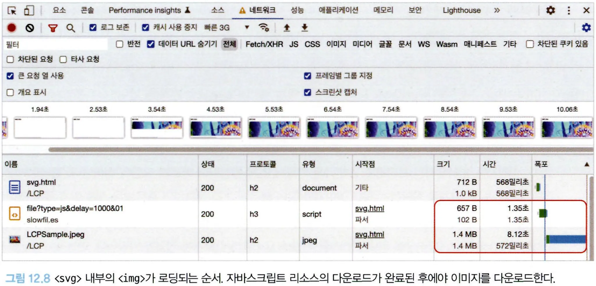

# 12.3 최대 콘텐츠풀 페인트(LCP: Largest Contentful Paint)

## 12.3.1 정의

최대 콘텐츠풀 페인트 LCP란 **페이지가 처음으로 로드를 시작한 시점부터 뷰포트 내부에서 가장 큰 이미지 또는 텍스트를 렌더링하는 데 걸리는 시간**이다.

뷰포트는 사용자에게 현재 노출되는 화면을 의미한다. 사용자에게 노출되는 영역은 기기에 의존하므로 뷰포트 크기는 기기마다 다르다.

이 뷰포트 내부에서 ‘큰 이미지와 텍스트’는 다음과 같이 정의돼 있다.

- ``
- `<svg>` 내부의 `<image>`
- poster 속성을 사용하는 `<video>`
- `url()`을 통해 불러온 배경 이미지가 있는 요소
- 텍스트와 같이 인라인 텍스트 요소를 포함하고 있는 블록 레벨 요소
  - 이 블록 레벨 요소에는`<p>, <div>` 등이 포함된다.

## 12.3.2 의미

사용자가 페이지가 어느 정도 로딩됐다고 인식하는 시점은 언제일까?

사용자에게 있어 로딩이란 일단 뷰포트 영역(화면)에 보이는 부분을 기준으로 할 것이므로 뷰포트에 메인 콘텐츠가 화면에 완전히 전달되는 속도를 기준으로 한다면 사용자는 페이지가 로딩이 완료됐다고 체감하는 시간과 매우 비슷하게 측정할 수 있을 것이다.

따라서 사용자에게 페이지의 정보를 화면에 전달하는 속도를 객관적으로 판단하기 위한 지표로 만들어진 것이 바로 최대 콘텐츠풀 페인트(LCP)다.

---



1. 최초에 헤더가 가장 먼저 노출됐다. 그러므로 최대 콘텐츠풀 페인트는 헤더다.
2. 그다음 바둑판 메뉴가 노출됐다. 이 영역은 헤더보다 크기 때문에 최대 콘텐츠풀 페인트가 헤더에서 이 바둑판 메뉴로 바뀌었다.
3. 시간이 지나고 콘텐츠가 로딩되면서 최대 콘텐츠꿀 페인트는 가운데 사진 영역으로 바뀌었다.
4. 3번에서 현재 최대 콘텐츠풀 페인트인 영역은 이미지 로딩이 필요한데, 아직 이미지 로딩이 끝나지 않았다.
5. 최대 콘텐츠풀 페인트 영역 내부의 이미지 로딩이 마침내 끝나면서 최대 콘텐츠풀 페인트 지표가 기록된다.

즉, 최대 콘텐츠풀 페인트는 페이지 로딩에 따라 변화하는 지표다.

사용자가 이용하는 디바이스의 크기에 따라, 그리고 그것이 이미지와 같이 비교적 크기가 큰 리소스라면 실제로 로딩에 필요한 시간에 따라 최대 콘텐츠풀 페인트 지표의 값이 달라질 수 있다.

---

## 12.3.4 기준 점수

최대 콘텐츠풀 페인트에서 좋은 점수란 해당 지표가 2.5초 내로 응답이 오는 것이다.

4초 이내로 응답이 온다면 보통, 그 이상이 걸리면 나쁨으로 판단된다.



## 12.3.5 개선 방안

### 텍스트는 언제나 옳다

좋은 점수를 얻는 가장 확실한 방법은 뷰포트 최대 영역, 즉 최대 콘텐츠풀 페인트 예상 영역에 이미지가 아닌 문자열을 넣는 것이다.

### 이미지는 어떻게 불러올 것인가?

이미지를 노출하는 방법에는 다음과 같이 여러가지가 있다.

```tsx
// <!-- 1) img -->


// <!-- 2) svg -->
<svg xmlns="http://www.w3.org/1000/svg">
	<image href="lcp.jpg" />
</svg>

// <!-- 3) (비디오의 경우) vide.poster -->
<video poster="lcp.jpg"></video>

// <!-- 4) background-image: url() -->
<div style="background-image: url(lcp.jpg)">...</div>
```

각 방법을 사용했을 때 이미지 로딩 속도에 어떠한 차이가 있는지 살펴보자.



- 1번과 3번의 예제 코드가 더 빠르게 완성되는 것을 볼 수 있다.

타임라인으로 살펴보면 아래와 같다.


각 결과를 간단하게 살펴보자.

``

- 이미지는 브라우저의 프리로드 스캐너에 의해서 먼저 발견되어 빠르게 요청이 일어난다.
  > 💡프리로드 스캐너❓
  > HTML을 파싱하는 단계를 차단하지 않고 이미지와 같이 빠르게 미리 로딩하면 좋은 리소스를 먼저 찾아 로딩하는 브라우저의 기능



- `` 내부의 리소스는 이처럼 HTML 파싱이 미처 완료되지 않더라도 프리로드 스캐너가 병렬적으로 리소스를 다운로드하므로 최대 콘텐츠풀 페인트 요소를 불러오기에 적절한 방법이다. 이는 `<picture/>`도 마찬가지다.

`<svg>`내부의 ``

- `<svg>` 내부의 ``가 로딩이 완료되기 전까지는 LCP가 완료되지 않는다.
- 모든 리소스를 다 불러온 이후에 이미지를 불러온다.



- `<svg>` 내부의 ``는 프리로드 스캐너에 의해 발견되지 않아 병렬적으로 다운로드가 일어나지 않는다.
- 이는 결국 LCP 점수에도 악영향을 미치므로 이러한 방식은 삼가하자.

`<video>의 poster`

- poster는 사용자가 video 요소를 재생하거나 탐색하기 전까지 노출되는 요소다.
- 프리로드 스캐너에 의해 조기에 발견되어 ``와 같은 성능을 나타낸다.
- video가 최대 콘텐츠풀 페인트에 영향을 받을 것 같다면 poster를 반드시 넣어주자.

`background-image`

- CSS에 있는 리소스는 항상 느리다. 브라우저가 해당 리소스를 필요로 하는 DOM을 그릴 준비가 될 때까지 리소스 요청을 뒤로 미루기 때문이다.
- 가능하다면 LCP와 같이 중요한 리소스에는 사용하지 않는 것이 좋다.

### 그 밖에 조심해야 할 사항

이미지 무손실 압축

- 웹으로 서비스할 이미지는 가능한 한 무손실 형식으로 압축해 최소한의 용량으로 서비스하는 것이 좋다.

`loading=lazy` 주의

- `loading=lazy`는 리소스를 중요하지 않음으로 표시하고 필요할 때만 로드하는 전략이다.
- LCP의 이미지에는 사용하지 않는 것이 좋다.

fade in과 같은 각종 애니메이션

- 이미지가 그냥 뜨는 것보다 `fadeIn ease 10s`와 같이 처리한다면 최대 콘텐츠풀 페인트도 그만큼 늦어진다.

클라이언트에서 빌드하지 말 것

- 앞선 연구 사례에서 볼 수 있는 최적의 시나리오는 서버에서 빌드해온 HTML을 프리로드 스캐너가 바로 읽어서 LCP로 빠르게 가져가는 것이다.
- 만약 LCP에 다음과 같은 코드가 있다면 어떻게 될지 살펴보자

```tsx
useEffect(() => {
  (async function loadData() {
    const result = await fetch("https：//example.com/data");
    if (result.ok) {
      setShow(true); // 최대 콘텐츠풀 페인트 영역을 노출함
    }
  })();
}, []);
```

- 어떠한 API 엔드포인트에서 응답을 받아 최대 콘텐츠풀 페인트 영역의 노출을 제어하는 시나리오다.
- 이렇게 되면 LCP는 HTML을 다운로드한 직후가 아닌 리액트 코드를 파싱하고 읽어서 API 요청을 보내고, 응답을 받는 만큼 늦어지게 된다.
- 따라서 가능한 한 이 영역은 서버에서 미리 빌드된 채로 오는 것이 좋다.

최대 콘텐츠풀 리소스는 직접 호스팅

- 가능하다면 LCP 리소스는 같은 도메인에서 직접 호스팅하는 것이 좋다.
- 다른 출처(origin)에서 정제한 이미지를 가져오는 것은 최적화에 좋지 않다. 이미 연결이 맺어진 현재 출처와는 다르게, 새로운 출처의 경우에는 네트워크 연결부터 다시 수행해야 하기 때문이다.
- 중요한 리소스는 직접 다루고 그 외에 덜 중요한 리소스에 대해서만 이미지 최적화 서비스를 사용하여 관리하자.
