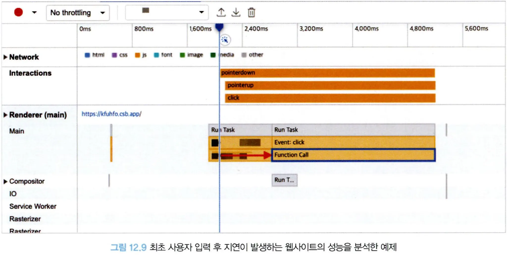
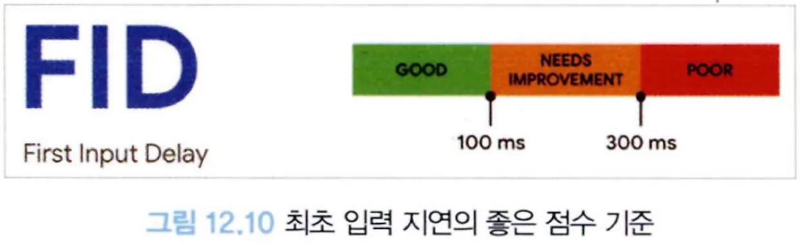
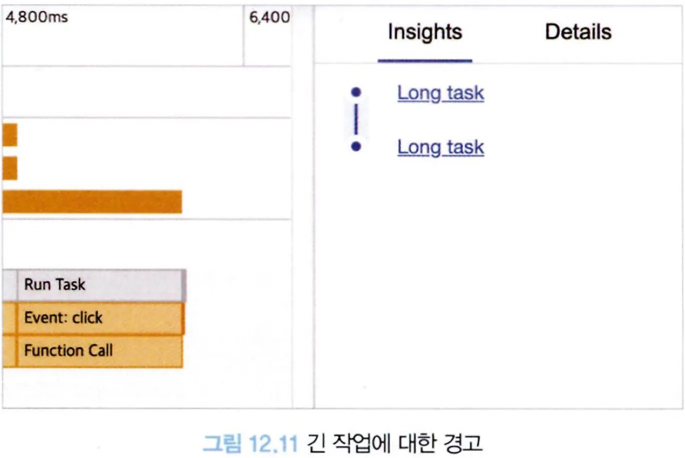
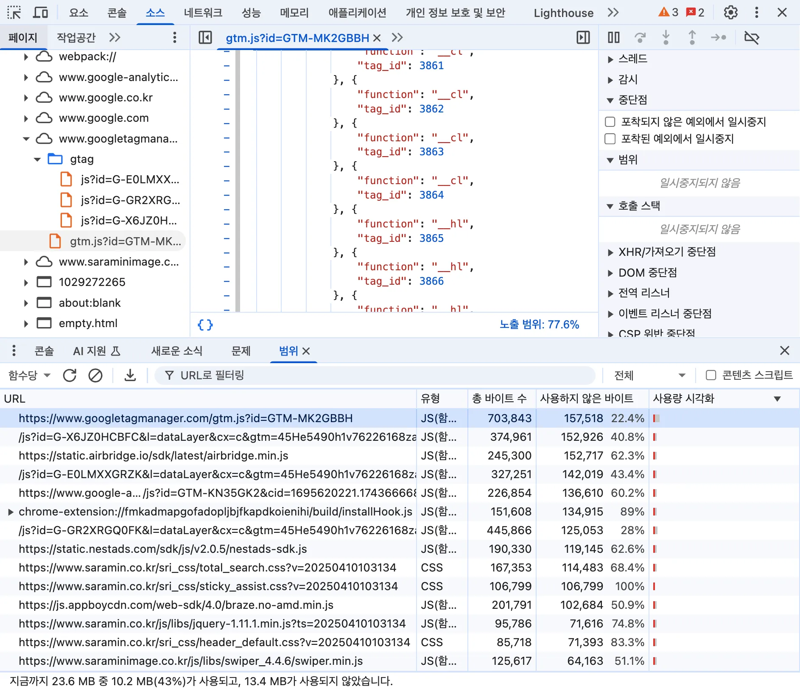

# 12.4 최초 입력 지연(FID: First Input Delay)

## 12.4.1 정의

웹페이지의 로딩 속도만큼 중요한 것이 웹사이트의 반응 속도다. 이러한 웹사이트의 반응성을 측정하는 지표가 바로 최초 입력 지연(FID)이다.

정의는 다음과 같다.

> 사용자가 페이지와 처음 상호 작용할 때(예: 링크를 클릭하거나 버튼을 탭하거나 사용자 지정 JavaScript 기반 컨트롤을 사용할 때)부터 해당 상호 작용에 대한 응답으로 브라우저가 실제로 이벤트 핸들러 처리를 시작하기까지의 시간을 측정합니다.

최초 입력 지연은 사용자가 얼마나 빠르게 웹 페이지와의 상호작용에 대한 응답을 받을 수 있는지 측정하는 지표다.

## 12.4.2 의미

웹사이트 내부의 이벤트가 반응이 늦어지는 이유는 해당 입력을 처리해야 하는 브라우저의 메인 스레드가 바쁘기 때문이다.

메인 스레드가 바쁜 이유는 무언가 대규모 렌더링이 일어나고 있거나, 대규모 자바스크립트 파일을 분석하고 실행하는 등 다른 작업을 처리하는 데 리소스를 할애하고 있기 때문이다.

자바스크립트는 싱글 스레드이기 때문에 이벤트 리스너와 같은 다른 작업을 실행할 수 없어 지연이 발생한다.

즉, 이벤트가 발생하는 시점에 최대한 메인 스레드가 다른 작업을 처리할 수 있도록 여유를 만들어 둬야 빠른 반응성을 보장할 수 있다.

최초 입력 지연에서 최초 입력이란 반응성에 해당하는 클릭, 터치, 타이핑 등 사용자의 개별 입력 작업에 초점을 맞추고 측정한다.

구글은 사용자 경험을 크게 4가지로 분류해 정의하는데, 이를 RAIL이라고 한다.

- Response
  - 사용자의 입력에 대한 반응 속도. 50ms 미만으로 이벤트를 처리할 것
  - Ex. 서치바: 스로틀링 안걸면 입력할때마다 API 요청함. 그래서 입력했을때 바로 반응하기위해 스로틀링 거는거임
- Animation
  - 애니메이션의 각 프레임을 10ms 이하로 생성할 것
- Idle
  - 유휴 시간을 극대화해 페이지가 50ms 이내에 사용자 입력에 응답하도록 할 것
- Load
  - 5초 이내에 콘텐츠를 전달하고 인터랙션을 준비할 것

이 중 최초 입력 지연은 R에 해당하는 응답에 초점을 맞추고 있다.

정리하자면, 최초 입력 지연이란 화면이 최초에 그려지고 난 뒤, 사용자가 웹페이지에서 클릭 등 상호작용을 수행했을 때 메인 스레드가 이 이벤트에 대한 반응을 할 수 있을 때까지 걸리는 시간을 의미한다.

---

## 12.4.3 예제

최초 입력 지연이 매우 심하게 발생하는 어떤 함수에 대해 크롬에서 디버깅을 통해 살펴보자.

- 클릭은 2000ms 경에 일어났지만 실제 클릭에 따른 이벤트는 2600ms 경에 시작됐다. 즉, 클릭 이벤트가 발생한 시점부터 실제 함수 호출이 있기까지 500ms나 걸렸다.
- 클릭 이벤트가 발생한 시점에 메인 스레드가 무언가 다른 작업을 하고 있다.
- 즉, 메인 스레드가 작업 중인 시점에 클릭 이벤트가 일어났고, 클릭 이벤트는 메인 스레드가 이전에 하던 작업을 다 마무리하고 나서야 비로소 실행될 수 있게 됐다.
- 사용자는 클릭 이벤트로부터 약 500ms, 0.5초 정도 잠깐 웹페이지가 멈춰 있는 것처럼 느낄 것이다. 기준 점수에서 0.5초는 매우 좋지 못한 수준의 최초 입력 지연이다.

## 12.4.4 기준 점수

좋은 점수를 얻기 위해서는 100ms 이내로 응답이 와야 하며, 300ms 이내인 경우 보통, 그 이후의 경우에는 나쁨으로 처리된다.

## 12.4.5 개선 방안

개선하는 방법을 구체적으로 살펴보자.

### 실행에 오래 걸리는 긴 작업을 분리

메인 스레드가 처리에 오래 걸리는 작업이 있으면 긴 작업이 있다는 경고가 뜬다.

긴 작업은 비단 최초 입력 지연뿐만 아니라 웹 페이지 전반에 악영향을 미친다.

오래 걸리는 작업이 있다면 몇 가지 대안을 연구해야한다.

**꼭 웹페이지에서 해야 하는 작업인가**

- 개발자 도구에서 네트워크와 CPU 속도를 낮추고 테스트 해봤을때 오래 걸리는 작업이라면 꼭 웹페이지에서 해야 하는 작업인지 고민해 봐야 한다. 만약 그런 작업이 아니라면 서버로 옮겨서 처리하는 것이 좋다.

**긴 작업을 여러 개로 분리하기**

- 꼭 웹 페이지에서 처리해야 하는 작업이라면 해당 작업을 여러 개로 분리하자.
- 하나의 긴 작업이 메인 스레드를 계속 점유할수록 사용자는 페이지에서 응답을 받지 못하고 있을 가능성이 크다.
- 작업 분리에는 최초 로딩에 필요하지 않은 내용을 나중에 불러오는 것도 포함된다. 리액트의 Suspense와 lazy를, 혹은 Next.js의 dynamic을 이용할 수 있다.

### 자바스크립트 코드 최소화

번들러가 빌드 시 필요하지 않은 코드를 걸러내지만, 여전히 웹 페이지를 불러오는 데 사용되지 않는 필요 없는 코드가 존재할 수 있다. 이러한 코드를 크롬 개발자 도구를 통해 확인할 수 있다.

크롬 개발자 도구의 커버리지로 들어가 기록 버튼을 클릭하고 웹페이지를 새로고침하자.

이처럼 사용되지 않은 코드가 얼마나 있는지 확인할 수 있다.

이러한 코드들은 당장에 급하지 않은 코드로 간주해 앞서 언급한 지연 로딩 기법, 사용자가 필요로 하는 순간에 불러오거나 우선순위를 낮춰서 불러오는 것이 좋다.

또한 브라우저에서 지원하지 않는 메서드를 사용하기 위해 웹 페이지에서 직접 구현하고 집어넣는 코드인 **폴리필(polyfill)**이 있다.

만약 인터넷 익스플로러 11과 같은 구형 브라우저 환경을 지원하지 않기로 결심했다면 대부분의 폴리필을 집어 넣을 필요가 없다.

또한 여러 군데에서 자주 사용되는 코드인지 반드시 확인해 봐야 한다. 그렇지 않다면 직접 저수준 자바스크립트 코드를 작성해 구현하는게 코드 크기를 줄이는데 도움이 될 수 있다.

바벨 같은 도구를 사용하고 있다면 @babel/preset-env를 사용해 애플리케이션 코드에서 사용하고 있는 내용만 폴리필에 담을 수 있다.

Next.js의 SWC를 사용하고 있다면 이미 SWC 내부에 구현돼 있기 때문에 별도로 처리하지 않아도 될 것이다.

### 타사 자바스크립트 코드 실행의 지연

Google Analytics나 Firebase와 같이 웹페이지의 통계 집계를 위해 타사 스크립트를 넣는 경우가 있다.

이러한 타사 스크립트는 대부분 웹페이지 로드에 중요한 자원이 아니므로 `<script>`의 async와 defer를 이용
해 지연 불러오기를 하는 것이 좋다.

**defer**

- 해당 스크립트를 다른 리소스와 함께 병렬로 다운로드한다. 다운로드하는 중에도 HTML 파싱 등의 메인 스레드 작업은 멈추지 않는다.
- 다운로드가 완료됐다 하더라도 이 스크립트의 실행은 페이지가 완전히 로딩된 이후에 맨 마지막에 실행된다.

**async**

- 마찬가지로 해당 스크립트를 다른 리소스와 함께 병렬로 다운로드한다.
- async 리소스의 다운로드가 완료되어 버리면 다른 리소스의 다운로드가 완료되는 것을 기다리지 않고 바로 실행한다.
- 따라서 async 리소스의 실행 순서는 다운로드가 완료된 순서대로 실행된다.

**둘 다 없는 경우**

- script를 만나는 순간 다운로드가 우선되며, 다운로드가 완료되면 코드 실행이 우선된다. 다른 작업은 다운로드와 실행이 끝날 때까지 미뤄진다.

타사 자바스크립트는 가능하면 async를, 더 가능하다면 defer로 지연하는 것이 좋다.

만약 광고와 같이 실제 사용자의 뷰포트 위치에 따라 불러와야 하는 컴포넌트라면 `IntersectionObserver`를 이용해 뷰포트에 들어오는 시점에 불러오는 것이 좋다.
