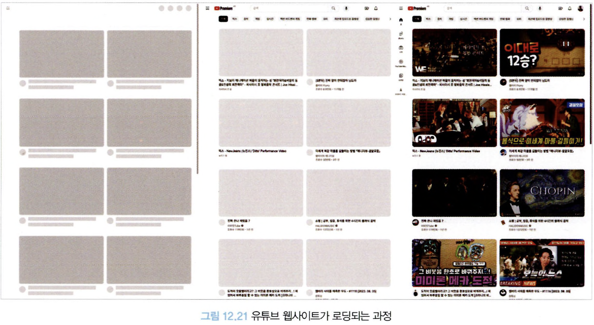

# 12.5 누적 레이아웃 이동(CLS: Cumulative Layout Shift)

## 12.5.1 정의

웹 사이트에서 로딩이 끝난 줄 알고 무언가를 클릭하려고 했는데 그 사이에 다른 요소가 로딩되면서 원래 클릭하려고 했던 요소를 클릭하지 못해거나, 읽고 있던 무언가가 다른 요소의 출력으로 인해 사라지거나 하는 경우가 있다.

이처럼 페이지의 생명주기 동안 발생하는 모든 예기치 않은 이동에 대한 지표를 계산하는 것이 바로 누적 레이아웃 이동(CLS)이라고 한다.

이 지표가 낮을수록, 즉 사용자가 겪는 예상치 못한 레이아웃 이동이 적을수록 더 좋은 웹 사이트다.

## 12.5.2 의미

useEffect 내부에 UI의 레이아웃을 변경하는 작업을 하는 예제를 살펴보자.

```tsx
function Banner() {
  const [show, setShow] = useState(false);

  useEffect(() => {
    (async function () {
      const result = await fetchBannerInfo();
      if (result.ok) {
        setShow(true);
      }
    })();
  }, []);

  if (!show) {
    return null;
  }

  return <BannerHeader>초특가 이벤트 진행 중!</BannerHeader>;
}
```

- 사용자는 렌더링이 완료된 이후부터 API의 응답을 받아 다시 배너가 노출되면 레이아웃이 변경된다.
- 즉, 사용자가 보고 있던 콘텐츠의 위치가 배너로 인해 밀리거나 상호작용하려고 했던 요소의 위치가 바뀌면서 상호작용에 실패하게 된다.
- useEffect가 많을수록, useEffect가 렌더링에 영향을 미칠수록 이 누적 레이아웃 이동에 좋지 못한 점수를 받을 가능성이 커진다.

누적 레이아웃 이동은 뷰포트 내부의 요소에 대해서만 측정한다.

최초 렌더링이 시작된 위치에서 만약 레이아웃의 이동이 발생한다면 누적 레이아웃 이동 점수로 기록하게 된다.

또한 요소가 추가됐다 하더라도 다른 요소의 시작 위치에 영향을 미치지 않았다면 레이아웃 이동으로 간주되지 않는다.

또한 사용자 액션으로 인해 발생한 레이아웃 이동은 점수에 포함되지 않는다.

점수를 계산할 때 포함되는 내용은 다음과 같다.

**영향분율**

- 레이아웃 이동이 발생한 요소의 전체 높이와 뷰포트 높이의 비율을 의미한다.
- 레이아웃 이동이 발생한 요소의 높이가 10이고, 예기치 않은 레이아웃 이동으로 인해 10만큼 내려갔다고 가정해 보자.
- 이 경우 뷰포트의 높이가 100이라고 가정한다면 레이아웃 이동으로 인해 총 10 +10만큼 뷰포트에 영향을 미쳤으므로 이 경우 영향분율은 0.2점이 된다((10+ 10) / 100 = 0.2).

**거리분율**

- 레이아웃 이동이 발생한 요소가 뷰포트 대비 얼마나 이동했는지를 의미한다.
- 예를 들어, 예기치 않은 레이아웃 이동으로 인해 10만큼 내려갔고 전체 뷰포트가 100이라면 0.1점이 된다(10/100).

이 두 가지 점수를 곱해서 최종 점수를 계산한다. 이 경우 최종 점수는 0.02점이 된다(0.2 \* 0.1).

## 12.5.3 예제

유튜브의 경우 최초 서버 사이드에서 가져온 HTML에서는 어떤 영상이 나올지 결정돼 있지 않은 채로 렌더링된다.



- 클라이언트에서 사용자에게 보여줘야 할 콘텐츠가 결정된다. 최초 렌더링 시에는 보여줄 것이 아무것도 없기 때문에 만약 빈 페이지를 보여줬다면 누적 페이지 레이아웃 이동 지표에 매우 좋지 못한 영향을 끼쳤을 것이다.
- 그러나 여기에 로딩 상태임을 보여주는 스켈레톤 UI를 추가해 대략적인 페이지 레이아웃을 고정시켜뒀다. 이 덕분에 페이지 레이아웃 이동을 최소한으로 하면서도 사용자에게 원하는 영상을 보여줄 수 있게 됐다.

또 다른 유튜브 로딩 상황을 살펴보자.


- 위 사진과 한 가지 다른 점은 이번에는 상단에 큰 광고 영역이 자리 잡고 있다.
- 광고가 필요한지 클라이언트에서 결정됐기 때문에 큰 <div>가 갑자기 나타나면서 하단의 대부분의 콘텐츠를 밀어냈고, 이로 인해 이전보다 낮은 누적 레이아웃 지표 점수를 받게 됐다.

두 사례를 통해 클라이언트에서 미리 노출이 예상되는 부분을 HTML로 자리 잡아 두는 것이 누적 레이아웃 지표에 큰 도움이 된다는 점을 알 수 있다.

## 12.5.4 기준 점수

누적 레이아웃 이동의 경우 0.1 이하인 경우 좋음. 0.25 이하인 경우 보통이며 그 외에는 개선이 필요한 나쁜 점수로 보고된다.


## 12.5.5 개선 방안

### 삽입이 예상되는 요소를 위한 추가적인 공간 확보

큰 누적 레이아웃 이동은 클라이언트에서 삽입되는 동적인 요소로 인해 발생한다.

이러한 영향을 받는 것을 미연에 방지하기 위해서는 useEffect의 내부에서 요소에 영향을 미치는 작업, 특히 뷰포트 내부에서 노출될 확률이 높은 작업을 최소화하는 것이 좋다.

사용이 불가피하다면 useLayoutEffect 훅을 사용해 보는 것 또한 검토해 볼 만하다.

하지만 useLayoutEffect는 동기적으로 발생해 브라우저의 페인팅 작업에 영향을 미치기 때문에 사용자에게 로딩이 오래 걸리는 것과 같이 보일 수 있다.

스켈레톤 UI의 사례처럼, 미리 무언가가 동적으로 뜰 것으로 예상되는 공간을 미리 확보해 두는 것도 좋은 방법이다.

가장 좋은 방법은 역시 서버 사이드 렌더링이다. 서버에서 이러한 동적인 요소의 유무를 사전에 판단해 클라이언트에 HTML을 미리 제공해 준다면 클라이언트에서는 이러한 고민을 할 필요 없이 깔끔하게 처리할 수 있다.

### 폰트 로딩 최적화

폰트로 인해 발생할 수 있는 문제는 크게 두 가지다.

**FOUT(flash of unstyled text)**

- HTML 문서에서 지정한 폰트가 보이지 않고 대체 기본 폰트로 보이고 있다가 뒤늦게 폰트가 적용되는 현상

**FOIT(flash of invisible text)**

- HTML 문서에서 지정한 폰트가 보이지 않고, 기본 폰트도 없어서 텍스트가 없는 채로 있다가 뒤늦게 폰트가 로딩되면서 페이지에 렌더링되는 현상

따라서 사용자 기기의 기본 폰트 이외에 다른 폰트를 보여주고 싶다면 다음과 같은 점을 유념해야 한다.

**`<link>`의 preload 사용**

- <link>요소의 rel=preload는 페이지에서 즉시 필요로 하는 리소스를 명시하는 기능이다.
- 초기에 불러와야 하는 중요한 리소스로 간주되므로 브라우저는 리소스를 더 빠르게 사용할 수 있도록 준비해 준다.

**`font-family: optional`**

- 폰트를 불러올 수 있는 방법은 크게 다섯 가지로 나뉜다.
- auto(기본값)
  - 브라우저가 폰트를 불러오는 방법을 결정한다.
- block
  - 폰트가 로딩되기 전까지 렌더링을 중단한다. (최대 3초) 웹 폰트의 로딩이 완료되면 비로소 폰트를 적용한다.
- swap
  - 앞서 언급한 FOUT 방식이다. 우선 fallback 폰트로 글자를 렌더링한 다음, 웹 폰트의 로딩이 완료되면 웹 폰트를 적용한다.
- fallback
  - 이 옵션을 사용하면 100ms간 텍스트가 보이지 않고, 그 이후에 폴백 폰트로 렌더링한다.
  - 그리고 3초 안으로 폰트가 로딩된다면 해당 웹 폰트로 전환하고, 그렇지 않다면 폴백 폰트를 계속 사용한다.
- optional
  - fallback과 유사하다. 차이점은 0.1 초 이내로 폰트가 다운로드돼 있거나 캐시돼 있지 않다면 폴백 폰트를 사용한다.
  - 또한 브라우저가 네트워크 상태를 파악해 일정 기간 폰트를 다운로드하지 못한다면 연결을 취소한다.

누적 레이아웃 이동을 최소화하려면 폰트를 앞서 언급한 두 가지 방법을 조합해 불러오자.

최대한 중요한 폰트의 다운로드를 우선순위에 밀어넣고, 이 우선순위를 활용했음에도 빠르게 로딩하는데 실패했다면 다음을 기약하고 기본 폰트를 노출하는 것이다.

### 적절한 이미지 크기 설정

아래 스타일 속성은 너비는 기기의 너비대로, 높이는 그 그림이 너비를 가지면 자동으로 비례해서(auto) 설정해 달라는 것을 의미한다.

```tsx
img {
	width: 100%;
	height: auto;
}
```

이 경우 누적 레이아웃 이동이 커지는 결과를 낳는다.

높이를 이미지가 완전히 다운로드되기 전까지는 알 수 없기 때문에 높이를 높게 잡아 뒀다가 완전히 로딩 완료된 이후에 기기의 너비만큼 높이를 계산하기 때문이다.


이 문제를 해결하는 방법을 살펴보자.

**width, height 지정**

```tsx
import "./styles.css"; // width: 100%; height: auto;

export default function App() {
  return (
    <div className="App">
      
      <>...</>
    </div>
  );
}
```


- 이렇게 width, height를 원하는 비율로 지정하면 브라우저가 이미지를 로딩하기 전에 적절한 가로세로 비율을 계산해 이미지가 표시되는 만큼 면적을 할당해 둔다.
- 이는 aspect-ratio 속성 덕분인데, 이 속성은 브라우저의 유저 에이전트 스타일시트에 포함돼 있으며, 가로 세로 비율을 자동으로 맞춰주는 역할을 한다.

**반응형 이미지를 사용하고 싶은 경우**

```tsx
<!-- 반드시 ,로 구분돼 있어야 하며, 너비를 알려주는 w를 사용해야 한다. -->

```

- srcset 속성을 사용하는 것이 좋다. 가로 세로 비율이 똑같고 크기가 다른 여러 개의 이미지를 미리 준비해 둔 다음 브라우저가 상황에 맞게 이미지를 사용할 수 있도록 준비하면 된다.

## 12.5.6 핵심 웹 지표는 아니지만 성능 확인에 중요한 지표들

### 최초 바이트까지의 시간(Time To First Byte, TTFB)

브라우저가 웹페이지의 첫 번째 바이트를 수신하는데 걸리는 시간을 의미한다.

즉, 페이지를 요청했을 때 최초의 응답이 오는 바이트까지가 얼마나 걸리는지를 측정하는 지표다. 이 지표는 600ms 이상 걸릴 경우 개선이 필요한 것으로 간주된다.

TTFB는 서버 사이드 렌더링을 하고 있는 애플리케이션에서 주의 깊게 봐야 할 지표다.

서버에서 첫 번째 HTML을 만들기 위해 해야 하는 작업이 많거나 느릴수록 최초 바이트까지의 시간이 길어지게 된다. 개선하려면 다음과 같은 사항을 고려해야 한다.

**로직을 최적화한다.**

- 여기서 말하는 로직이란, Next.js를 예로 든다면 getServerSideProps 함수의 실행과 그 결과에 따른 정적 페이지 렌더링이다.
- 페이지를 만드는 데 필요한 작업을 최소화하고, 페이지를 그리는 데 중요한 내용만 서버 사이드 렌더링에서 준비하는 등의 최적화가 필요하다.

**주 방문객의 국적을 파악해 최대한 해당 국적과 가깝게 서버를 위치시킨다**

- 아마존 웹 서비스를 예로 들면, 한국 사용자에게는 us-east-\*보다는 ap-\*\*\*(아시아)가, 그리고 한국에서 가장 가까운 ap-northeast-2(서울)가 더 낫다.

**스트리밍 API를 사용하자**

- 리액트 서버 사이드 렌더링이라면 renderToNodeStream, renderToStaticNodeStream과 같은 스트리밍 API를 사용하자. 완성된 영역부터 조각조각 받을 수 있어 최초 바이트까지의 시간을 단축할 수 있다.

### 최초 콘텐츠풀 페인트(First Contentful Paint, FCP)

페이지가 로드되기 시작한 시점부터 페이지 콘텐츠의 일부가 화면에 렌더링될 때까지의 시간을 측정한다.

쉽게 말하면 웹사이트에 접속한 순간부터 페이지에 뭐라도 뜨기 시작한(텍스트, 이미지, svg 등) 시점까지의 시간을 의미한다.


FCP는 1.8초 이내에 이뤄진다면 좋음, 3.0초 이내는 보통, 그 이후는 개선이 필요한 것으로 보고된다. 개선하려면 다음 사항을 고려해야 한다.

**TTFB을 개선**

- 뭐라도 다운로드가 시작돼야 렌더링을 할 수 있다. 렌더링을 최대한 빠르게 하기 위해 최초 바이트까지의 시간을 단축하자.

**렌더링을 가로막는 리소스 최소화**

- 자바스크립트나 CSS 같은 렌더링을 가로막는 리소스를 최소화하고, 렌더링을 방해하는 리소스를 비동기적으로 로드한다.

**Above the Fold에 대한 최적화**

- Above the fold은 최초에 스크롤을 굳이 하지 않아도 보이는 영역을 말한다.
- 이 영역에서 게으른 로딩을 하거나 스크립트(앞서 언급한 리액트의 useEffect와 같이)에 의존해 요소가 렌더링되는 것을 피하자.

**페이지 리다이렉트 최소화**

- 다른 페이지로 리다이렉트를 해야 한다면 그만큼 사용자에게 무언가를 보여줄 수 있는 시간이 지연된다. 없게 하거나 최소한으로 유지하자.

**DOM 크기 최소화**

- 구글의 기준에 따르면 전체 DOM 노드는 1500개 미만으로, 깊이는 32단계 정도까지만, 그리고 부모 노드는 자식 노드를 60개 정도만 가지고 있어야 한다.
- 소스 보기로 확인해 봤을 때 DOM이 필요 이상으로 많고 복잡하다면 이를 줄일 수 있는 방법을 고민해 보자.
