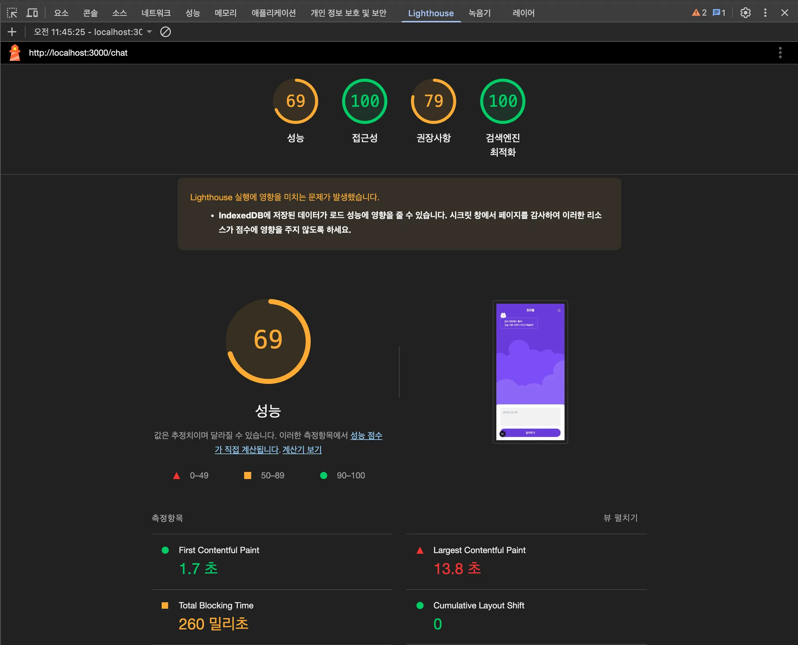
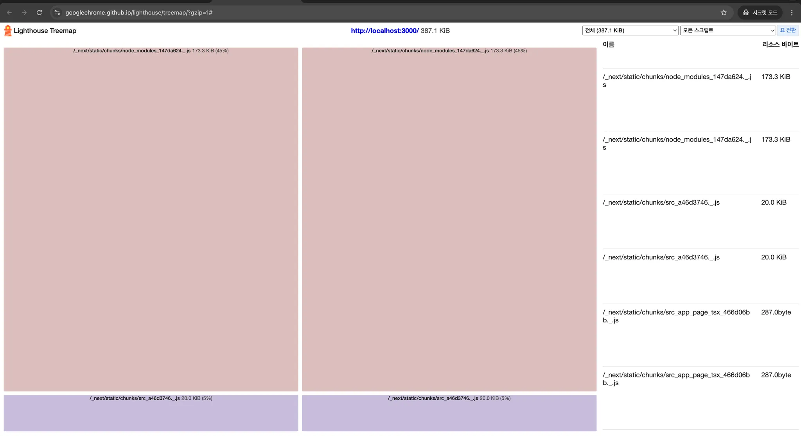

## 13.2.1 구글 라이트하우스 - 탐색 모드

페이지에 접속했을 때부터 페이지 로딩이 완료될 때까지의 성능을 측정하는 모드다.

지표 수집이 완료되면 다음과 같은 리포트가 생성된다.

### 성능

웹페이지의 성능과 관련된 지표를 확인할 수 있는 영역이다.

- 최초 콘텐츠풀 페인트(FCP), 최대 콘텐츠풀 페인트(LCP), 누적 레이아웃 이동(CLS)
- Time to Interactive: 페이지에서 사용자가 완전히 상호작용(인터랙션)할 수 있을 때까지 걸리는 시간을 측정
- Speed Index: 페이지가 로드되는 동안 콘텐츠가 얼마나 빨리 시각적으로 표시되는지를 계산
- Total Blocking Time: 메인 스레드에서 특정 시간 이상 실행되는 작업

### 접근성

웹 접근성을 말하며, 장애인 및 고령자 등 신체적으로 불편한 사람들이 일반적인 사용자와 동등하게 웹페이지를 이용할 수 있도록 보장하는 것

### 권장사항

웹사이트를 개발할 때 고려해야 할 요소들을 얼마나 지키고 있는지 확인할 수 있다.

- CSP가 XSS 공격에 효과적인지 확인: XSS - 개발자가 아닌 제3자가 삽입한 스크립트를 통해 공격하는 기법
- 감지된 JavaScript 라이브러리: 페이지에서 감지되는 자바스크립트 라이브러리(jQuery, Next.js, React, Lodash, create-react-app 등)
- 페이지 로드 시 위치정보 권한 요청 방지하기: 사용자의 동의 없이 페이지 로드 시 사용자의 물리적 위치를 알 수 있는 메서드(`window.navigator.geolocation.getCurrentPosition(), window.navigator.geolocation.watchPosition()`)를 실행하는지 확인.
- 페이지 로드 시 알림 권한 요청 방지하기: 사용자 동의 없이 페이지 로드 시 웹 페이지 알림을 요청하는 `Notification.requestPermission()`을 실행하는지 확인
- 알려진 보안 취약점이 있는 프런트엔드 자바스크립트 라이브러리를 사용하지 않음: 보안 취약점이 존재하는 자바스크립트 라이브러리를 사용하는지 확인
- 사용자가 비밀번호 입력란에 붙여넣을 수 있도록 허용: 일부 사용자는 복잡한 비밀번호를 별도의 애플리케이션에서 관리해 외우지 않고 복사/붙여넣기 방식으로 작성한다. 따라서 비밀번호 입력란은 붙여넣기가 가능해야 한다.
- 이미지를 올바른 가로세로 비율로 표시: 이미지의 실제 크기와 표시되는 크기 사이의 비율이 일치하는지 확인
- 이미지가 적절한 해상도로 제공됨: 이미지를 선명하게 보일 수 있도록 크기에 맞는 해상도의 이미지를 제공하는지 확인
- 페이지에 HTML Doctype 있음: 웹 표준을 준수해 웹페이지가 작성됐다고 의미하는 것이 바로 Doctype. Doctype이 있는지 확인
- 문자 집합을 제대로 정의함: 서버가 HTML 파일을 전송할 때 문자가 어떻게 인코딩돼 있는지 확인(`<meta charset="utf-8"/>`)
- 지원 중단 API 사용하지 않기: 더 이상 지원하지 않는 API 사용되는지 확인
- 콘솔에 로그된 브라우저 오류 없음: 콘솔에 에러가 기록되는지 확인
- Chrome Devtools의 Issues 패널에 문제없음: 개발자 도구에는 문제(Issues)라는 탭이 있는데, 이 탭에는 웹페이지에 대한 여러 가지 문제점을 알려준다.
- 페이지에 유효한 소스 맵이 있음: 소스 맵은 압축되어서 읽기 어려워진 소스코드를 원본 소스코드로 변환할 수 있도록 도와주는 파일로, 이 소스맵이 있으면 개발자가 디버깅하는 데 큰 도움이 된다.
- font-display: optional을 사용하는 폰트가 미리 로드됨: 개발자가 원하는 임의의 폰트를 보여줄 수도 있으면서 동시에 사용자에게 버벅거림 없는 렌더링을 보장할 수 있음

### 검색 엔진 최적화

쉽게 웹페이지 정보를 가져가서 공개할 수 있도록 최적화돼 있는지를 확인하는 것

---

## 13.2.2 구글 라이트하우스 - 기간 모드

### 흔적

View Trace를 번역한 것으로, 웹 성능을 추적한 기간을 성능 탭에서 보여준다.

### 트리맵

페이지를 불러올 때 함께 로딩한 모든 리소스를 함께 모아서 볼 수 있는 곳.

