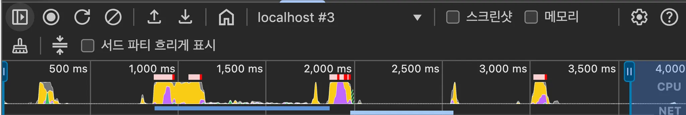
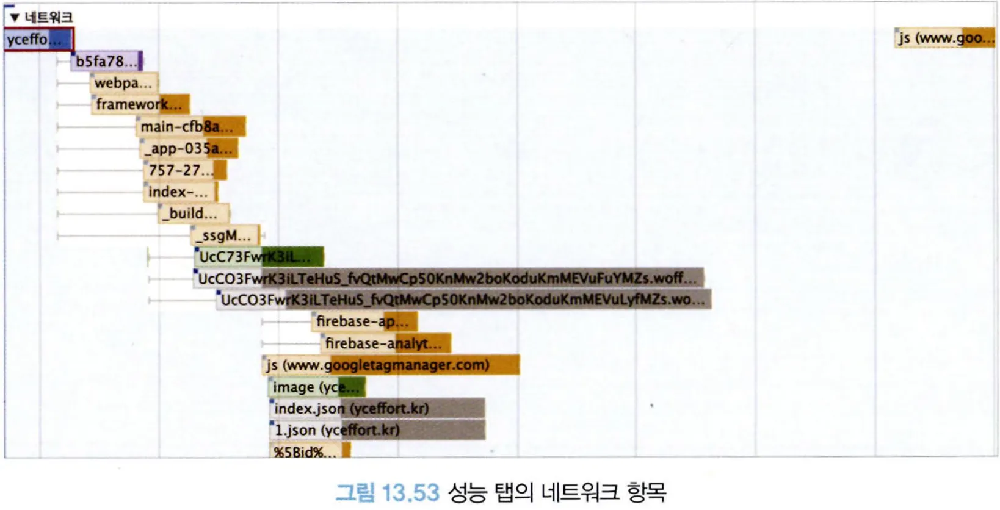
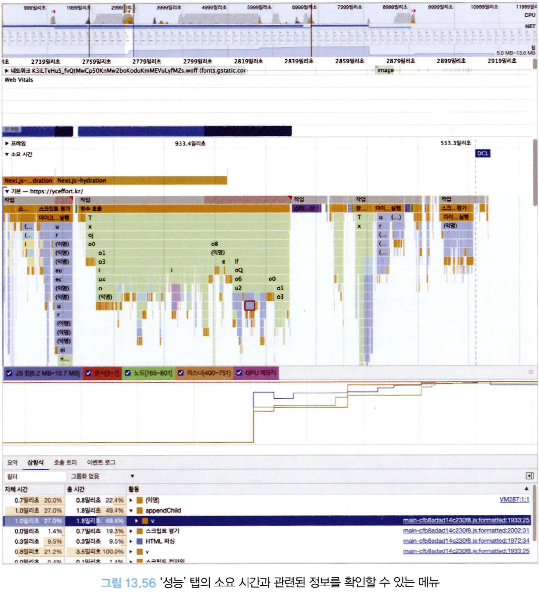

# 13.4 크롬 개발자 도구

크롬 개발자 도구를 활용하기 위해서는 시크릿 창으로 웹사이트를 여는 것이 좋다. 각종 크롬 확장 프로그램으로 인해 성능 이슈를 파악하는 데 방해가 될 수 있다.

## 13.4.2 성능

### 메뉴

원을 선택하면 성능 측정이 시작되며, 다시 누르면 성능 측정이 종료된다.

새로 고침 버튼을 클릭하면 다른 성능 측정과 마찬가지로 페이지 로드부터 종료 시점까지 성능 측정이 일어난다.

### 요약

측정 기간의 CPU, 네트워크 요청, 스크린숏, 메모리 점유율 등을 요약해서 볼 수 있다.

### 네트워크

성능 측정 기간 동안에 발생한 모든 네트워크 요청을 확인할 수 있다.

네트워크 요청은 각 색깔에 따라 어떠한 종류의 요청인지 확인할 수 있다.

- 파란색: HTML
- 보라색: CSS
- 노란색: 자바스크립트
- 초록색: 이미지
- 회색: 기타
- 폰트
- JSON 등

### 소요 시간과 기본

시간의 흐름에 따라 메인 스레드의 작업은 어떻게 이뤄졌는지, 또 자바스크립트 힙 영역은 어떻게 변화하는지 등을 확인할 수 있다.

