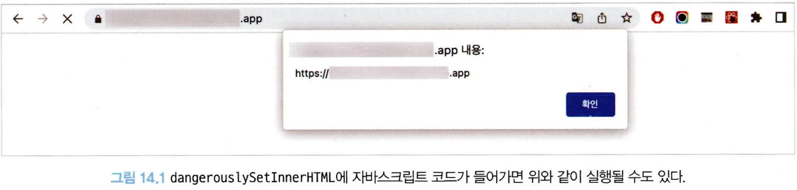
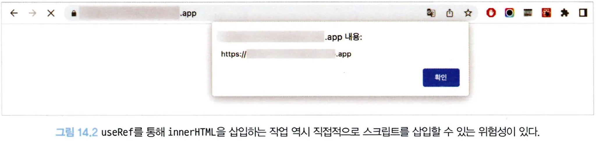
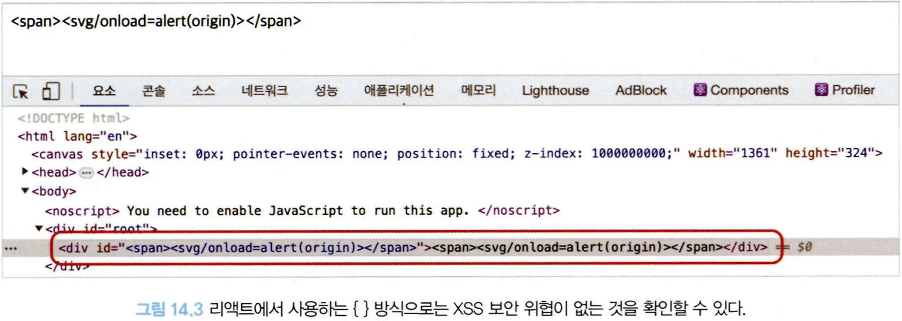

# 14.1 리액트에서 발생하는 크로스 사이트 스크립팅(XSS)

XSS는 웹 애플리케이션에서 가장 많이 보이는 취약점 중 하나로, 웹사이트 개발자가 아닌 제3자가 웹사이트에 악성 스크립트를 삽입해 실행할 수 있는 취약점을 의미한다.

일반적으로 게시판과 같이 사용자가 입력을 할 수 있고, 이 입력을 다른 사용자에게 보여줄 수 있는 경우에 발생한다.

아래의 글을 방문했을 때 별도의 조치가 없다면 `script`도 함께 실행되어 `window.alert`도 함께 실행될 것이다.

```tsx
<p>사용자가 글을 작성했습니다.</p>
<script>
	alert('XSS')
</script>
```

script가 실행될 수 있다면 웹사이트 개발자가 할 수 있는 모든 작업을 함께 수행할 수 있으며, 쿠키를 획득해 사용자의 로그인 세션 등을 탈취하거나 사용자의 데이터를 변경하는 등 각종 위험성이 있다.

이 XSS 이슈는 어떻게 발생할 수 있을까?

## 14.1.1 dangerouslySetlnnerHTML prop

특정 브라우저 DOM의 innerHTML을 특정한 내용으로 교체할 수 있는 방법이다.

일반적으로 게시판과 같이 사용자나 관리자가 입력한 내용을 브라우저에 표시하는 용도로 사용된다.

```tsx
function App() {
  // 다음 결과물은 <div>First • Second</div>이다.
  return <div dangerouslySetInnerHTML={{ __html: "First &middot; Second" }} />;
}
```

- dangerouslySetlnnerHTML은 오직 \_\_html을 키를 가지고 있는 객체만 인수로 받을 수 있으며, 이 인수로 넘겨받은 문자열을 DOM에 그대로 표시하는 역할을 한다.
- 그러나 위험성은 dangerouslySetlnnerHTML이 인수로 받는 문자열에는 제한이 없다는 것이다.

아래의 코드를 방문하면 다음과 같이 origin이 alert로 나타나게 된다.

```tsx
const html = `<span><svg/onload=alert(origin)></span>`;

function App() {
  return <div dangerouslySetInnerHTML={{ __html }} />;
}

export default App;
```



따라서 dangerouslySetlnnerHTML은 사용에 주의를 기울여야 하는 prop이며, 여기에 넘겨주는 문자열 값은 한 번 더 검증이 필요하다.

---

## 14.1.2 useRef를 활용한 직접 삽입

DOM에 직접 내용을 삽입할 수 있는 방법으로 useRef가 있다.

앞서와 비슷한 방식으로 innerHTML에 보안 취약점이 있는 스크립트를 삽입하면 동일한 문제가 발생한다.

아래의 코드를 방문하면 역시 origin이 alert로 나타나게 된다.

```tsx
const html = `<span><svg/onload=alert(origin)></span>`;

function App() {
  const divRef = useRef<HTMLDivElement>(null);

  useEffect(() => {
    if (divRef.current) {
      divRef.current.innerHTML = html;
    }
  });

  return <div ref={divRef} />;
}
```



---

## 14.1.3 리액트에서 XSS 문제를 피하는 방법

리액트에서 XSS 이슈를 피하는 가장 확실한 방법은 제3자가 삽입할 수 있는 HTML을 안전한 HTML 코드로 한 번 치환하는 것이다.

이러한 과정을 새니타이즈(sanitize) 또는 이스케이프(escape)라고 한다.

sanitize-html을 사용한 예제를 살펴보자.

```tsx
import sanitizeHtml, { IOptions as SanitizeOptions } from "sanitize-html";

// 허용하는 태그
const allowedTags = [
  "div",
  "p",
  "span",
  "h1",
  "h2",
  "h3",
  "h4",
  "h5",
  "h6",
  "figure",
  "iframe",
  "a",
  "strong",
  "i",
  "br",
  "img",
];

// 위 태그에서 허용할 모든 속성
const defaultAttributes = ["style", "class"];

// 허용할 iframe 도메인
const allowedlframeDomains = ["naver.com"];

// 허용되는 태그 중 추가로 허용할 속성
const allowedAttributeForTags: {
  [key in (typeof allowedTags)[number]]: Array<string>;
} = {
  iframe: ["src", "allowfullscreen", "scrolling", "frameborder", "allow"],
  img: ["src", "alt"],
  a: ["href"],
};

// allowedTags, allowedAttributeForTags, defaultAttributes를 기반으로
// 허용할 태그와 속성을 정의
const allowedAttributes = allowedTags.reduce<
  SanitizeOptions["allowedAttributes"]
>((result, tag) => {
  const additionalAttrs = allowedAttributeForTags[tag] || [];
  return { ...result, [tag]: [...additionalAttrs, ...defaultAttributes] };
}, {});

const sanitizedOptions: SanitizeOptions = {
  allowedTags,
  allowedAttributes,
  allowedlframeDomains,
  allowlframeRelativeUrls: true,
};

const html = "<span><svg/onload=alert(origin)></span>";

function App() {
  // 위 옵션을 기반으로 HTML을 이스케이프한다.
  // svg는 허용된 태그가 아니므로 <span></span>만 남는다.
  const sanitizedHtml = sanitizeHtml(html, sanitizedOptions);

  return <div dangerouslySetInnerHTML={{ __html: sanitizedHtml }}></div>;
}
```

sanitize-html은 허용할 태그와 목록을 일일히 나열하는 이른바 허용 목록(allow list) 방식을 채택하기 때
문에 사용하기가 매우 귀찮지만 이렇게 허용 목록을 작성하는 것이 훨씬 안전하다.

허용 목록에 추가하는 것을 깜박한 태그나 속성이 있다면 단순히 HTML이 안 보이는 사소한 이슈로 그치겠
지만 차단 목록(block list)으로 해야 할 것을 놓친다면 그 즉시 보안 이슈로 연결되기 때문이다.

단순히 보여줄 때뿐만 아니라 사용자가 콘텐츠를 저장할 때도 한번 이스케이프 과정을 거치는 것이 더 효율적이고 안전하다.

XSS 위험성이 있는 콘텐츠를 데이터베이스에 저장하지 않는 것이 예기치 못한 위협을 방지하는 데 훨씬 도움이 되며, 한번 이스케이프하면 그 뒤로 보여줄 때마다 일일이 이스케이프 과정을 거치지 않아도 된다.

이러한 치환 과정은 되도록 서버에서 수행하는 것이 좋다. 예를 들어, POST 요청으로 입력받은 HTML을 받은 데이터를 저장하는데, 이 이스케이프 과정을 클라이언트에서만 수행한다고 가정해 보자.

일반적인 사용자라면 문제가 되지 않겠지만 POST 요청을 스크립트나 curl 등으로 직접 요청하는 경우에는 스크립트에서 실행하는 이스케이프 과정을 생략하고 바로 저장될 가능성이 있다.

게시판과 같은 예시가 웹사이트에 없다고 하더라도 XSS 문제는 충분히 발생할 수 있다.

다음과 같이 쿼리스트링에 있는 내용을 그대로 실행하거나 보여주는 경우에도 보안 취약점이 발생할 수 있다.

```tsx
import { useRouter } from "next/router";

function App() {
  const router = useRouter();
  const query = router.query;
  const html = query?.html?.toString() || "";

  return <div dangerouslySetInnerHTML={{ __html: html }} />;
}
```

기본적으로 리액트는 XSS를 방어하기 위해 이스케이프 작업이 존재한다.

아래의 코드를 이스케이프하지 않았다면 와으의 onload가 실행됐을 것이다. 그러나 실행되지 않고 다음과 같이 렌더링된다.

```tsx
const html = "<span><svg/onload=alert(origin)></span>";

function App() {
  return <div id={html}>{html}</div>;
}
```


즉, `<div>{html}</div>`와 같이 HTML에 직접 표시되는 textcontent와 HTML 속성값에 대해서는 리액트가 기본적으로 이스케이프 작업을 해준다.

그러나 dangerouslySetlnnerHTML이나 props로 넘겨받는 값의 경우 개발자의 활용도에 따라 원본 값이 필요할 수 있기 때문에 이러한 작업이 수행되지 않는다.
