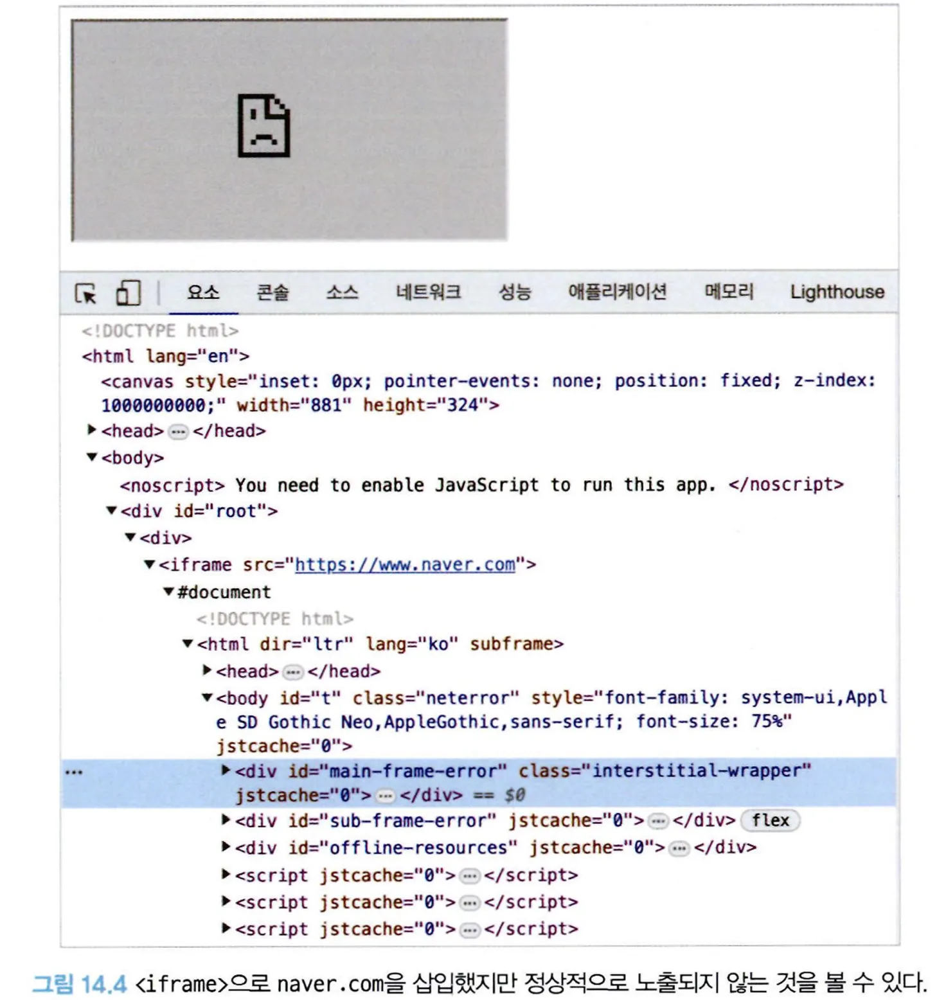
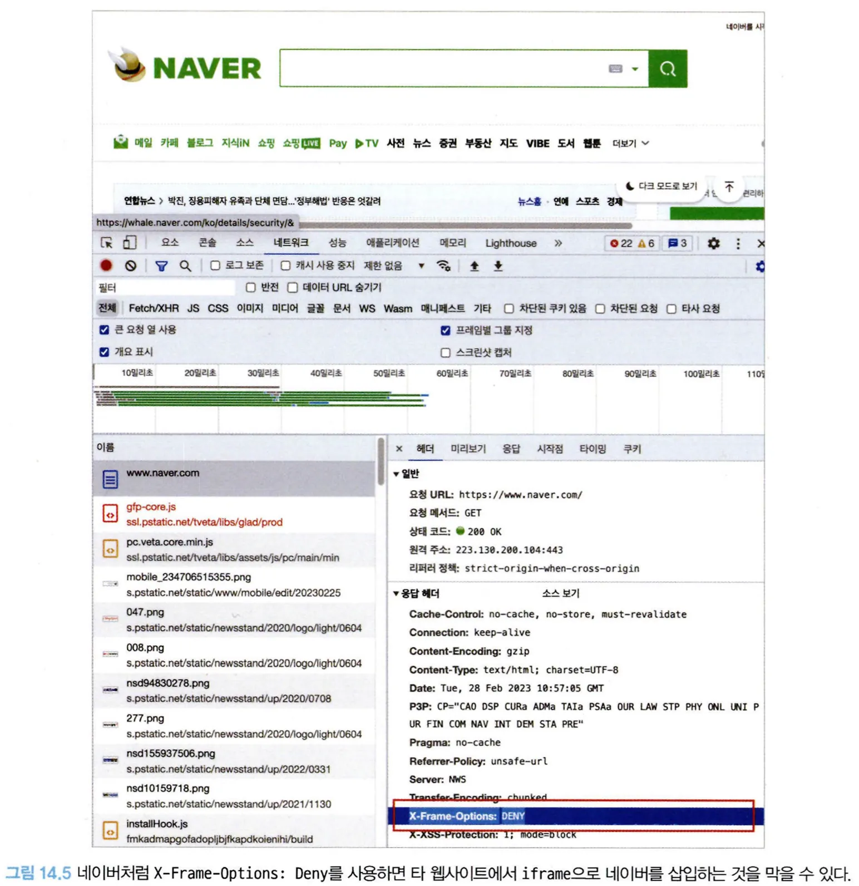
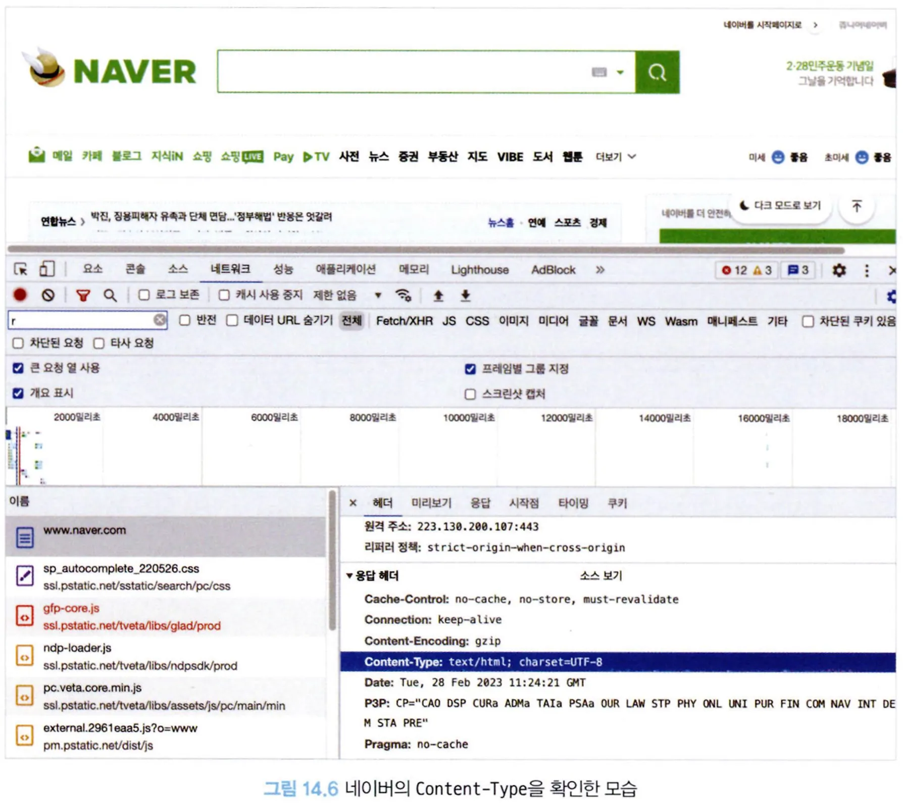
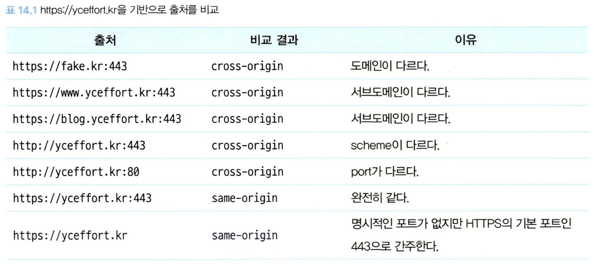
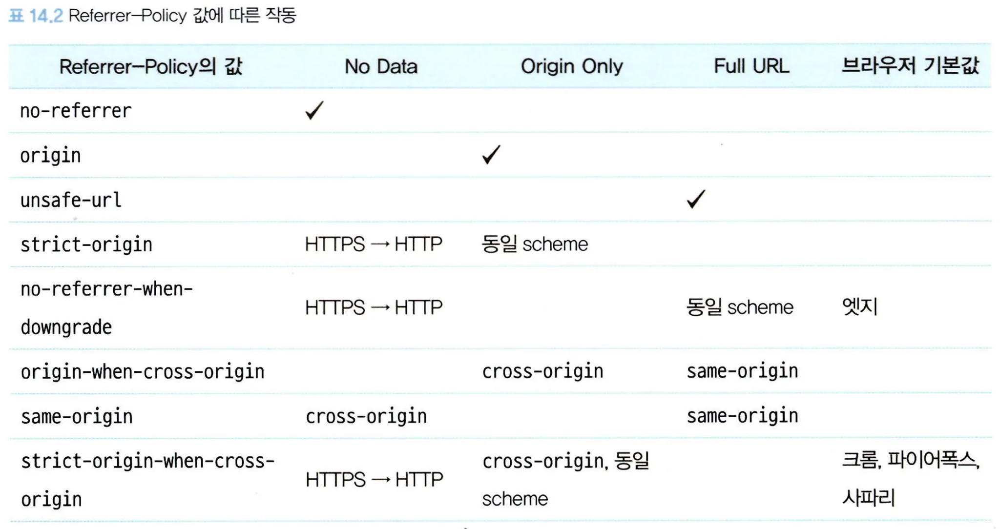

# 14.4 HTTP 보안 헤더 설정하기

HTTP 보안 헤더란 브라우저가 렌더링하는 내용과 관련된 보안 취약점을 미연에 방지하기 위해 브라우저와 함께 작동하는 헤더를 의미한다.

이는 웹사이트 보안에 가장 기초적인 부분으로, HTTP 보안 헤더만 효율적으로 사용할 수 있어도 많은 보안 취약점을 방지할 수 있다.

HTTP 보안 헤더로 무엇이 있는지 먼저 살펴보고, 이를 Next.js 등에 어떻게 적용해 사용할 수 있는지 살펴보자.

## Strict-Transport-Security

모든 사이트가 HTTPS를 통해 접근해야 하며, 만약 HTTP로 접근하는 경우 이러한 모든 시도는 HTTPS로 변경되게 한다.

```tsx
Strict-Transport-Security: max-age=<expire-time>; includeSubDomains
```

`<expire-time>`

- 설정을 브라우저가 기억해야 하는 시간. 초 단위로 기록된다.
- 권장값은 2년이다.
- 이 기간 내에는 HTTP로 사용자가 요청한다 하더라도 브라우저는 이 시간을 기억하고 있다가 자동으로 HTTPS로 요청하게 된다.
- 만약 이 시간이 0으로 돼 있다면 헤더가 즉시 만료되고 HTTP로 요청하게 된다.
- 이 시간이 경과하면 HTTP로 로드를 시도한 다음에 응답에 따라 HTTPS로 이동하는 등의 작업을 수행한다.
- includeSubDomains가 있을 경우 이러한 규칙이 모든 하위 도메인에도 적용된다.

---

## X-Frame-Options

페이지를 frame, iframe, embed, object 내부에서 렌더링을 허용할지를 나타낼 수 있다.

네이버와 비슷한 주소를 가진 페이지가 있고, 이 페이지에서 네이버를 iframe으로 렌더링한다고 했을 때 사용자는 이 페이지를 진짜 네이버로 오해할 수 있고 공격자는 이를 활용해 사용자의 개인정보를 탈취할 수 있다.

X-Frame-Options는 외부에서 자신의 페이지를 위와 같은 방식으로 삽입되는 것을 막아주는 헤더다.

제3의 페이지에서 다음과 같이 `<iframe>`으로 네이버 페이지를 삽입해서 실행해보자.

코드를 실행해 보면 네이버 페이지가 정상적으로 노출되지 않는다.

```tsx
export default function App() {
  return (
    <div className="App">
      <iframe src="https://www.naver.com" />
    </div>
  );
}
```



이유는 네이버에 X-Frame-Options: deny 옵션이 있기 때문이다. 이 옵션은 제3의 페이지에서 `<iframe>`으로 삽입되는 것을 막는다.



네이버의 응답헤더를 보면 해당 옵션이 활성화되는 것을 알 수 있다.

```
X-Frame-Options: DENY // 만약 위와 같은 프레임 관련 코드가 있다면 무조건 막는다.
X-Frame-Options: SAMEORIGIN // 같은 origin에 대해서만 프레임을 허용한다.
```

---

## Permissions-Policy

웹사이트에서 사용할 수 있는 기능과 사용할 수 없는 기능을 명시적으로 선언하는 헤더다.

다양한 브라우저의 기능(카메라, GPS 등)이나 API를 선택적으로 활성화하거나 필요에 따라서는 비활성화 할수도 있다.

예를 들어, 브라우저에서 사용자의 위치를 확인하는 기능(geolocation)과 관련된 코드를 전혀 작성하지 않았는데, 해당 기능이 별도로 차단돼 있지 않고 그 와중에 XSS 공격 등으로 인해 이 기능을 취득해서 사용하게 되면 사용자의 위치를 획득할 수 있게 된다.

사용하는 예제 헤더를 살펴보자.

```
# 모든 geolocation 사용을 막는다.
Permissions-Policy: geolocation=()

# geolocation을 페이지 자신과 몇 가지 페이지에 대해서만 허용한다.
Permissions-Policy: geolocation=(self "https://a.yceffort.kr" "https://b.yceffort.kr")

# 카메라는 모든 곳에서 허용한다.
Permissions-Policy: camera=*;

# pip 기능을 막고, geolocation은 자신과 특정 페이지만 허용하며, 카메라는 모든 곳에서 허용한다.
Permissions-Policy: picture-in-picture=(), geolocation=(self https://yceffort.kr), camera=*;
```

---

## X-Content-Type-Option

이 헤더를 이해하려면 먼저 MIME이 무엇인지 알아야 한다.

MIME란 Multipurpose Internet Mail Extensions의 약자로, Content-type의 값으로 사용된다.



- 네이버에서는 www.naver.com을 Content-Type: text/html; charset=UTF-8로 반환해 브라우저가 이를
  UTF-8로 인코딩된 text/html로 인식할 수 있게 도와주고, 브라우저는 이 헤더를 참고해 해당 파일에 대해 HTML을 파싱하는 과정을 거치게 된다.
- 이러한 MIME은 jpg, CSS, JSON 등 다양하다.

여기서 X-Content-Type-Options란 Content-type 헤더에서 제공하는 MIME 유형이 브라우저에 의해 임의로
변경되지 않게 하는 헤더다.

즉, Content-type: text/css 헤더가 없는 파일은 브라우저가 임의로 CSS로 사용할 수 없으며, Content-type: text/javascript나 Content-type: application/javascript 헤더가 없는 파일은 자바스크립트로 해석할 수 없다.

웹서버가 브라우저에 강제로 이 파일을 읽는 방식을 지정하는 것이 바로 이 헤더다.

예를 들어, 어떠한 공격자가 .jpg 파일을 웹서버에 업로드했는데, 실제로 이 파일은 그림 관련 정보가 아닌 스크립트 정보를 담고 있다고 가정해 보자.

브라우저는 .jpg로 파일을 요청했지만 실제 파일 내용은 스크립트인 것을 보고 해당 코드를 실행할 수도 있다. 여기에 만약 악의적인 스크립트가 담겨져 있다면 보안 위협에 노출될 것이다.

다음과 같은 헤더를 설정해 두면 파일의 타입이 CSS나 MIME이 text/css가 아닌 경우, 혹은 파일 내용이 script나 MIME 타입이 자바스크립트 타입이 아니면 차단하게 된다.

```
X-Content-Type-Options: nosniff
```

---

## Referrer-Policy

HTTP 요청에는 Referer라는 헤더가 존재하는데, 이 헤더에는 현재 요청을 보낸 페이지의 주소가 나타난다.

Referrer-Policy 헤더는 이 Referer 헤더에서 사용할 수 있는 데이터를 나타낸다.

`http://yceffort.kr:443/`라는 출처 기준으로 비교했을 때 다음과 같이 나타낼 수 있다.

이러한 출처에 대한 정보를 바탕으로 Referrer-Policy의 각 값별로 다음과 같이 작동한다.

Referrer-Policy는 응답 헤더뿐만 아니라 페이지의 <meta/> 태그로도 다음과 같이 설정할 수 있다.

```tsx
<meta name="referrer" content="origin" />
```

그리고 페이지 이동 시나 이미지 요청, link 태그 등에도 다음과 같이 사용할 수 있다.

```tsx
<a href="http://yceffort.kr" referrerpolicy="origin">
  ...
</a>
```

구글에서는 이용자의 개인정보 보호를 위해 strict-origin-when-cross-origin 혹은 그 이상을 명시적으로 선언해 둘 것을 권고한다.

만약 이 값이 설정돼 있지 않다면 브라우저의 기본값으로 작동하게 되어 웹사이트에 접근하는 환경별로 다른 결과를 만들어 내어 혼란을 야기할 수 있으며, 이러한 기본값이 없는 구형 브라우저에서는 Referer 정보가 유출될 수도
있다.

---

## Content-Security-Policy

콘텐츠 보안 정책은 XSS 공격이나 데이터 삽입 공격과 같은 다양한 보안 위협을 막기 위해 설계됐다.

대표적으로 이용되는 몇 가지를 알아보자.

### \*-src

font-src, img-src, script-src 등 다양한 src를 제어할 수 있는 지시문이다. 예를 들어, font-src는 다음과 같이 사용할 수 있다.

아래와 같이 선언해 두면 font의 src로 가져올 수 있는 소스를 제한할 수 있다. 여기에 선언된 font 소스만 가져올 수 있으며, 이 외의 소스는 모두 차단된다.

```tsx
Content-Security-Policy: font-src <source>;
Content-Security-Policy: font-src <source> <source>;
```

예를 들어, 다음과 같이 응답 헤더를 설정했다고 가정해보자.

```
Content-Security-Policy: font-src https://yceffort.kr/
```

위처럼 응답 헤더를 반환했다면 다음 폰트는 사용할 수 없게 된다.

```html
<style>
  @font-face {
  	font-family: 'Noto Sans KR';
  	font-style: normal;
  	font-weight: 400;
  	font-display: swap;
  		src: url(https://fonts.gstatic.com/s/notosanski7V13/PbykFmXiEBPT41TbgNA5cgm203Tq4JJWq209pU0DP-dWuqxJFA4GNDCBYtw.0.woff2)
  		format('woff2‘);
  }
</style>
```

비슷한 유형의 지시문에는 다음과 같은 것이 있다.

- script-src： `<script>`의 src
- style-src： `<style>`의 src
- font-src： `<font>`의 src
- img-src： ``의 src
- connect-src： 스크립트로 접근할 수 있는 URL을 제한한다. `<a>` 태그에서 사용되는 ping, XMLHttpRequest나 fetch의 주소, 웹소켓의 EventSource, Navigator.sendBeacon() 등이 포함된다.
- worker-src： Worker의 리소스
- object-src：`<object>`의 data, `<embed>`의 src, <applet>의 archive
- media-src： `<audio>`와`<video>`의 src
- manifest-src：`<link rel="manifest" />`의 href
- frame-src：`<frame>`과 `<iframe>`의 src
- prefetch-src: prefetch의 src
- child-src： Worker 또는 `<frame>`과 `<iframe>`의 src

만약 해당 -src가 선언돼 있지 않다면 default-src로 한 번에 처리할 수도 있다.

default-src는 다른 여타 _-src에 대한 폴백 역할을 한다. 만약 _-src에 대한 내용이 없다면 이 지시문을 사용하게 된다.

```
Content-Security-Policy: default-src <source>;
Content-Security-Policy: default-src <source> <source>;
```

### form-action

폼 양식으로 제출할 수 있는 URL을 제한할 수 있다. 다음과 같이 form-action 자체를 모두 막아버리는 것도 가능하다.

```tsx
<meta http-equiv="Content-Security-Policy" content="form-action 'none'" />;

export default function App() {
  function handleFormAction() {
    alert("form action!");
  }

  return (
    <div>
      <form action={handleFormAction} method="post">
        <input type="text" name="name" value="foo" />
        <input type="submit" id="submit" value="submit" />
      </form>
    </div>
  );
}
```

위 컴포넌트에서 submit을 눌러 form을 제출하면 콘솔에 다음과 같은 에러 메시지가 출력되면서 작동하지 않는다.

```
Refused to send form data to '****' because it violates the following Content Security Policy directive: "form-action 'none'".
```

---

## 보안 헤더 설정하기

### Next.js

Next.js에서는 애플리케이션 보안을 위해 HTTP 경로별로 보안 헤더를 적용할 수 있다. next.config.js에서 다음과 같이 추가할수 있다.

```tsx
const securityHeaders = [
  {
    key: "key",
    value: "value",
  },
];

module.exports = {
  async headers() {
    return [
      {
        // 모든 주소에 설정한다.
        source: "/:path*",
        headers: securityHeaders,
      },
    ];
  },
};
```

여기서 설정할 수 있는 값은 다음과 같다.

- X-DNS-Prefetch-Control
- Strict-Transport-Security
- X-XSS-Protection
- X-Frame-Options
- Permissions-Policy
- X-Content-Type-Options
- Referrer-Policy
- Content-Security-Policy: ContentSecurityPolicy의 경우 선언할 수 있는 지시어가 굉장히 많기 때문에 다음과 같이 개별적으로 선언한 이후에 묶어주는 것이 더 편리하다.

```tsx
const ContentSecurityPolicies = [
	{ key: 'default-src', value: "'self'" },
	{ key: 'script-src', value： "'self'" },
	{ key: 'child-src', value: 'example.com' },
	{ key: 'style-src', value: "'self' example.com" },
	{ key: 'font-src', value: "'self'" },
]

const securityHeaders = [
	{
		key: 'Content-Security-Policy',
		value: ContentSecurityPolicies.map(
			(item) => `${item.key} ${item.value}`,
		).join(' '),
	},
]
```

---

### NGINX

정적인 파일을 제공하는 NGINX의 경우 다음과 같이 경로별로 add_header 지시자를 사용해 원하는 응답 헤더를 추가할 수 있다.

```
location / {
	# ...
		add_header X-XSS-Protection "1; mode=block";
		add_header Content-Security-Policy "default-src 'self'; script-src 'self'; child-src e...m; style-src 'self' example.com; font-src 'self';";
	# ...
}
```

---

## 보안 헤더 확인하기

서비스 중인 웹사이트의 보안 헤더를 확인할 수 있는 가장 빠른 방법은 보안 헤더의 현황을 알려주는 `https://securityheaders.com/`을 방문하는 것이다.

헤더를 확인하고 싶은 웹사이트의 주소를 입력하면 곧바로 현재 보안 헤더 상황을 알 수 있다.
