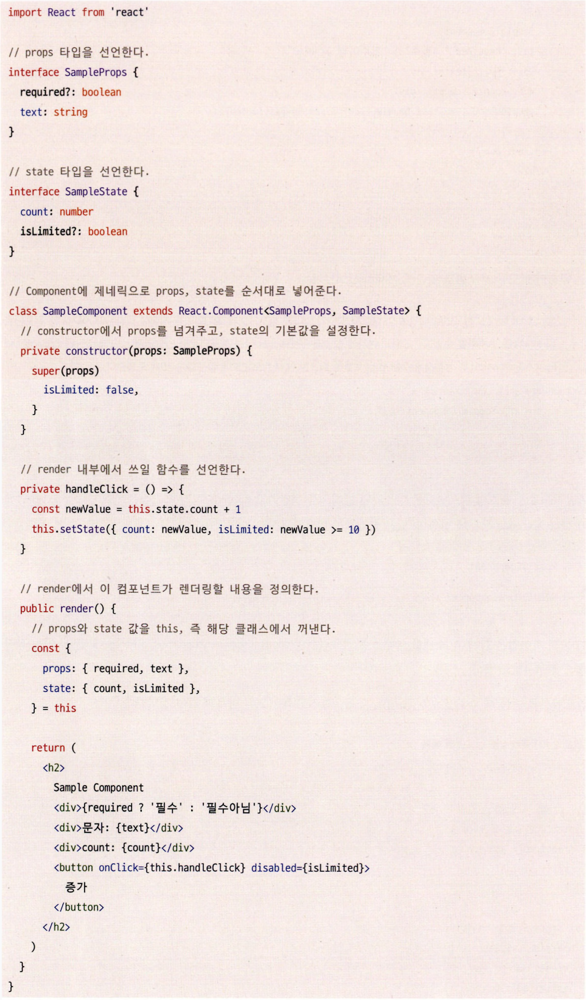

### **클래스형 컴포넌트**

기존 리액트 16.8 미만으로 작성된 코드에는 클래스형 컴포넌트가 대다수다.

```jsx
import React from "react";

class Samplecomponent extends React.Component {
  render() {
    return <h2>Sample Component</h2>;
  }
}
```

- 클래스형 컴포넌트를 만들려면 클래스를 선언하고 extends로 만들고 싶은 컴포넌트를 extends 해야 한다.
- extends 구문에 넣을 수 있는 클래스는 `React.Component`, `React.PureComponent`가 있다.

컴포넌트를 만들 때 주로 쓰이는 props, state, 그리고 메서드는 다음과 같이 정의한다.



**constructor()**

컴포넌트 내부에 이 생성자 함수가 있다면 컴포넌트가 초기화되는 시점에 호출된다. 여기서는 컴포넌트의 state를초기화할 수 있다. 그리고 여기에 선언돼 있는 super()는 컴포넌트를 만들면서 상속받은 상위 컴포넌트, 즉React.Component의 생성자 함수를 먼저 호출해 필요한 상위 컴포넌트에 접근할 수 있게 도와준다.

**props**

함수에 인수를 넣는 것과 비슷하게, 컴포넌트에 특정 속성을 전달하는 용도로 쓰인다. 위 예제에서는 props가 { required?: boolean; text: string; } 형태로 선언돼 있으므로 해당 컴포넌트를 호출하기 위해서는<SampleComponent text="안녕하세요" />와 같은 형태로 선언해야 한다.

**state**

클래스형 컴포넌트 내부에서 관리하는 값을 의미한다. 이 값은 항상 객체여야만 한다. 이 값에 변화가 있을 때마다리렌더링이 발생한다.

**메서드**
렌더링 함수 내부에서 사용되는 함수이며, 보통 DOM에서 발생하는 이벤트와 함께 사용된다. 이를 만드는 방식은크게 3가지로 나뉜다.

1. **constructor에서 this 바인드를 하는 방법**

   

   - 일반적인 함수로 메서드를 만든다면 this가 undefined로 나오는 현상을 겪게 될 것이다. 이러한 현상이 발생하는이유는 생성자가 아닌 일반 함수로 호출하게 되면 this에 전역 객체(strict 모드에서는 undefined)가 바인딩되기때문이다. 따라서 생성된 함수에 bind를 활용해 강제로 this를 바인딩 해야한다.

2. **화살표 함수를 쓰는 방법**
   - 앞선 예제처럼 실행 시점이 아닌 작성 시점에 this가 상위 스코프로 결정되는 화살표 함수를 사용한다면 굳이 바인딩하지 않더라도 사용할 수 있다.
3. **렌더링 함수 내부에서 함수를 새롭게 만들어 전달하는 방법**

```jsx
<button onClick={() => this.handleClick()}>증가</button>
```

- 위와 같이 메서드 내부에서 새롭게 함수를 만들어서 전달하는 방법이다.
- 그러나 이 방법을 사용하게 되면 매번 렌더링이 일어날 때마다 새로운 함수를 생성해서 할당하게 되므로 최적화를 수행하기가 매우 어려워진다. 따라서 이 방법은 지양하는 것이 좋다.

---

**클래스형 컴포넌트의 생명주기 메서드**

생명주기 메서드가 실행되는 시점은 크게 3가지로 나눌 수 있다.

마운트(mount): 컴포넌트가 마운팅(생성)되는 시점
업데이트(update): 이미 생성된 컴포넌트의 내용이 변경(업데이트)되는 시점
언마운트(unmount): 컴포넌트가 더 이상 존재하지 않는 시점

**render()**

생명주기 메서드 중 하나로, 클래스형 컴포넌트의 유일한 필수 값으로 항상 쓰인다.

컴포넌트가 UI를 렌더링하기 위해서 쓰이며, 렌더링은 앞서 언급한 시점 중 두 가지인 마운트와 업데이트 과정에서 일어난다.

주의할 것은 이 render() 함수는 항상 순수해야 하며 부수 효과가 없어야 한다는 것이다. 즉, 같은 입력값(props 또는 state)이 들어가면 항상 같은 결과물을 반환해야 하고 내부에서 state를 직접 업데이트하는 this.setstate를 호출해서는 안 된다.

**componentDidMount()**

이 함수는 컴포넌트가 마운트되고 준비되는 즉시 실행된다. render()와는 다르게, 이 함수 내부에서는 this.setState()로 state 값을 변경하는 것이 가능하다.

this.setstate를 호출하면 state가 변경되고, 그 즉시 다시 한번 렌더링을 시도하는데, 이 작업은 브라우저가 실제로 UI를 업데이트하기 전에 실행되어 사용자가 변경되는 것을 눈치챌 수 없게 만든다.

일반적으로 state를 다루는 것은 생성자에서 하는 것이 좋으며, 생성자 함수에서는 할 수 없는 API 호출 후 업데이트, DOM에 의존적인 작업(이벤트 리스너 추가 등)등을 할 때 this.setstate를 허용하는게 좋다.

**componentDidupdate()**

컴포넌트 업데이트가 일어난 이후 바로 실행된다. state나 props의 변화에 따라 DOM을 업데이트하는 등에 쓰이며, this.setstate를 사용할수 있다.


- 그러나 적절한 조건문으로 감싸지 않는다면 this.setstate가 계속해서 호출되니 주의하자.

**componentWillUnmount()**

컴포넌트가 언마운트되거나 더 이상 사용되지 않기 직전에 호출된다. 메모리 누수나 불필요한 작동을 막기 위한 클린업 함수를 호출하기 위한 최적의 위치다. 메서드 내에서 this.setstate를 호출할 수 없다.


- 위와 같이 이벤트를 지우거나, API 호출을 취소하거나, setinterval, setTimeout으로 생성된 타이머를 지우는 등의 작업을 하는 데 유용하다.

**shouldComponentUpdate()**

state나 props의 변경으로 리액트 컴포넌트가 다시 리렌더링되는 것을 막고 싶을때 사용한다.


state의 변화에 따라 컴포넌트가 리렌더링되는 것은 자연스러운 일이므로 특정한 성능 최적화 상황에서만 고려해야 한다.

앞서 클래스형 컴포넌트에는 두 가지 유형 Component, PureComponent가 있다고했는데, 이 둘의 차이점이 바로 이 생명주기를 다루는 데 있다.

**Component**


**PureComponent**


- 위 예시는 모두 동일한 작업을 수행한다. state로 count를 가지고 있으며, 버튼을 클릭하면 해당 count 값을초깃값과 같은 count인 1로 다시 세팅한다.

**결과**


- 콘솔을 보면 Component의 경우 버튼을 누르는 대로, 즉 state가 업데이트되는 대로 렌더링이 일어나지만PureComponent는 state의 값이 업데이트되지 않아서 렌더링이 일어나지 않았다.

PureComponent는 state 값에 대해 얕은 비교를 수행해 결과가 다를 때만 렌더링을 수행한다.

그래서 state가 객체와 같이 복잡한 구조의 데이터 변경은 감지하지 못하기 때문에 제대로 작동하지 않는다.

만약 컴포넌트가 얕은 비교를 했을 때 일치하지 않는 일이 더 잦다면 이러한 비교는 무의미하고 오히려 성능에 역효과를 미칠 수도 있다.

따라서 PureComponent는 필요한 곳에 적재적소에 활용하는 것이 성능에 도움이 된다.

**static getDerivedStateFromProps()**

가장 최근에 도입된 메서드 중 하나로, render()를 호출하기 직전에 호출된다.


- static으로 선언돼 있어 this에 접근할 수 없으며, 여기서 반환하는 객체는 해당 객체의 내용이 모두 state로 들어가게 된다.
- 반대로 null을 반환하면 아무런 일도 일어나지 않는다.

**getSnapShotBeforeUpdate()**

DOM이 업데이트되기 직전에 호출된다. 여기서 반환되는 값은 componentDidUpdate로 전달된다.


- DOM에 렌더링되기 전에 윈도우 크기를 조절하거나 스크롤 위치를 조정하는 등의 작업을 처리하는 데 유용하다.

**지금까지 언급한 생명주기 메서드 정리**


**getDerivedStateFromError()**

뒤이어 소개할 componentDidCatch 메서드와 함께 에러 상황에서 실행되는 메서드다. 이 두 메서드와 앞서 소개한 getSnapShotBeforeUpdate는 아직 리액트 훅으로 구현돼 있지 않아서 필요하다면 반드시 클래스형 컴
포넌트를 사용해야 한다.

getDerivedStateFromError는 **자식 컴포넌트에서 에러가 발생했을 때 호출**되는 에러 메서드다.
이 에러 메서드를 사용하면 적절한 에러 처리 로직을 구현할 수 있다. 다음 코드를 살펴보자.


- static 메서드로, error를 인수로 받는다. 여기서 error는 하위 컴포넌트에서 발생한 에러를 말한다.
- getDerivedStateFromError는 반드시 state 값을 반환해야 한다. 그 이유는 실행 시점 때문이다.
- 이 메서드는 하위 컴포넌트에서 에러가 발생했을 경우에 어떻게 자식 리액트 컴포넌트를 렌더링할지 결정하는용도로 제공되는 메서드이기 때문에 반드시 미리 정의해 둔 state 값을 반환해야 한다.
- 또한 렌더링 과정에서 호출되는 메서드이기 때문에 부수 효과를 발생시켜서는 안 된다.
- 여기서 말하는 부수 효과란 에러에 따른 상태 state를 반환하는 것 외의 모든 작업을 의미한다.(console.error 등도 포함)

**componentDidCatch**

자식 컴포넌트에서 에러가 발생했을 때 실행되며, getDerivedStateFromError에서 에러를 잡고 state를 결정한이후에 실행된다.

이 메서드는 두 개의 인수를 받는데, 첫 번째는 getDerivedStateFromError와 동일한 error, 그리고 정확히 어떤컴포넌트가 에러를 발생시켰는지 정보를 가지고 있는 info다. 위 예제에서 componentDidCatch를 추가해보자.


- componentDidCatch에서는 앞서 getDerivedStateFromError()에서 하지 못했던 부수 효과를 수행할 수 있다.
- 이는 render 단계에서 실행되는 getDerivedStateFromError와는 다르게 componentDidCatch는 커밋단계에 실행되기 때문이다.
- 즉, componentDidCatch는 리액트에서 에러 발생 시 이 메서드에서 제공되는 에러 정보를 바탕으로 로깅하는 등의 용도로 사용할 수 있다.

**두번째 매개변수 info를 console에 출력한 결과**


앞의 두 메서드는 ErrorBoundary, 즉 에러 경계 컴포넌트를 만들기 위한 목적으로 많이 사용된다.


- ErrorBoundary를 여러 개 선언해서 컴포넌트별로 에러 처리를 다르게 적용할 수 있으며, 에러가 발생한 컴포넌트 트리 영역만 별도로 처리해서 애플리케이션 전체에 에러가 전파되어 표시되는 것을 방지할 수 있다.

---

**클래스형 컴포넌트의 한계**

클래스형 컴포넌트에서 제공하는 메서드만으로도 완성도 있는 리액트 애플리케이션을 만드는 데는 충분해 보이는데, 어떠한 문제점 때문에 리액트는 함수형 컴포넌트에 훅을 도입한 새로운 패러다임을 만든 것일까? 이유를 추측해보자면 다음과 같다.

1. **데이터의 흐름을 추적하기 어려움**

- 서로 다른 여러 메서드에서 state의 업데이트가 일어날 수 있고, 코드 작성 시 메서드의 순서가 강제돼 있는 것이 아니기 때문에 읽기가 매우 어렵다.
- 즉, 코드를 읽는 과정에서 state가 어떤 식의 흐름으로 변경돼서 렌더링이 일어나는지 혹은 일어나지 않는지를 판단하기 어렵다.

1. **애플리케이션 내부 로직의 재사용이 어려움**
   - 컴포넌트 간에 중복되는 로직이 있고, 이를 재사용하고 싶다면 컴포넌트를 또 다른 고차 컴포넌트로 감싸거나 props를 넘겨주는 방식이 있다.
   - 공통 로직이 많아질수록 이를 감싸는 고차 컴포넌트 또는 props가 많아지는 래퍼 지옥(wrapper hell)에 빠져들 위험성이 커진다.
2. **기능이 많아질수록 컴포넌트의 크기가 커진다**
   - 컴포넌트 내부에 로직이 많아지거나 내부에서 처리하는 데이터 흐름이 복잡해져 생명주기 메서드 사용이 잦아지는 경우 컴포넌트의 크기가 기하급수적으로 커진다.
3. **클래스는 함수에 비해 상대적으로 어렵다**
   - JS는 프로토타입 기반의 언어라 개발자는 클래스보다는 함수에 더 익숙하다. 대부분의 언어와 다르게 작동하는 this를 비롯한 JS의 작동 방식이 혼란에 빠지기 쉽다.
4. **코드 크기를 최적화하기 어렵다**

   **빌드 전**

   

   - handleClick과 handlechange가 존재하는데, handlechange는 어디에서도 사용되고 있지 않다. 그리고 이를 빌드한 결과물을 살펴보자.

   **빌드 후**

   

   - handlechange와 handleClick의 이름이 최소화되지 않았고,
   - 사용하지 않는 메서드 handlechange도 트리 쉐이킹이 되지 않고, 번들에 그대로 포함된다.
   - 최종 결과물인 번들 크기를 줄이는 데도 어려움을 겪는다.

5. **핫 리로딩**

핫 리로딩은 코드에 변경 사항이 발생했을 때 앱을 다시 시작하지 않고서도 해당 변경된 코드만 업데이트해 변경 사항을 빠르게 적용하는 기법이다.


- 위 예제는 count라는 state와 이 state를 1 만큼 올려주는 핸들러로 구성된 완전히 동일한 기능을 하는 함수형, 클래스형 컴포넌트다.
- 개발자 모드에서 실행한 뒤에 각각 return과 render 함수 내부를 수정하면 함수형 컴포넌트는 핫 리로딩이 일어난 뒤에도 변경된 상태값이 유지되지만, 클래스형 컴포넌트는 핫 리로딩이 일어나면 바로 다시 기본값 0으로 돌아간다.
- 클래스형 컴포넌트는 최초 렌더링 시에 instance를 생성하고, 그 내부에서 state 값을 관리하는데, 이 instance 내부에 있는 render를 수정하게 되면 이를 반영할 수 있는 방법은 오직 instance를 새로 만드는 것뿐이다. 그리고 새롭게 만들어진 instance에서 값은 당연히 초기화 된다.
- 함수형 컴포넌트는 state를 함수가 아닌 클로저에서 저장해 두므로 함수가 다시 실행돼도 해당 state를 잃지 않고 다시 보여줄 수 있게 된다.

---

### 함수형 컴포넌트

**함수형 컴포넌트 vs. 클래스형 컴포넌트**

**생명주기 메서드의 부재**

함수형 컴포넌트에서는 생명주기 메서드가 존재하지 않는다. 그 이유는 함수형 컴포넌트는 **props를 받아 단순히 리액트 요소만 반환하는 함수**인 반면, 클래스형 컴포넌트는 render 메서드가 있는 React.Component를 상속
받아 구현하는 자바스크립트 클래스이기 때문이다.

함수형 컴포넌트는 useEffect 혹을 사용해 앞서 언급했던 생명주기 메서드인 componentDidMount,
componentDidUpdate, componentWillUnmount를 비슷하게 구현할 수 있다. 하지만 완전히 똑같지는 않다.

useEffect는 생명주기를 위한 훅이 아니라 컴포넌트의 state를 활용해 동기적으로 부수 효과를 만드는 메커니즘이다.

---

**함수형 컴포넌트와 렌더링된 값**

함수형 컴포넌트는 렌더링된 값을 고정하고, 클래스형 컴포넌트는 그렇지 못하다. 예제를 살펴보자.


- 함수형, 클래스형 모두 같은 작업을 하고 있다. handleClick을 클릭하면 3초 뒤에 props에 있는 user를 alert로 띄워준다.
- 만약 3초 사이에 props를 변경하면 어떻게 될까?
  - 클래스형의 경우에는 3초 뒤에 변경된 props를 기준으로 메시지가 뜨고, 함수형은 클릭했던 시점의 props 값을 기준으로 메시지가 뜬다.
- 클래스형 컴포넌트는 props의 값을 항상 this로부터 가져온다. props는 외부에서 변경되지 않는 이상 불변 값이지만 this가 가리키는 객체, 즉 컴포넌트의 인스턴스의 멤버는 변경 가능한 값이다.
- 따라서 render 메서드를 비롯한 리액트의 생명주기 메서드가 변경된 값을 읽을 수 있게 된다.
- 따라서 이 경우 부모 컴포넌트가 props를 변경해 컴포넌트가 다시 렌더링됐다는 것은 this.props의 값이 변경된 것이다. 따라서 showMessage는 새로운 props의 값을 읽을 수 있게 된다.


- this에 바인딩된 props를 사용하는 클래스형 컴포넌트와 다르게, 함수형 컴포넌트는 props를 인수로 받는다.
- props는 인수로 받기 때문에 컴포넌트는 그 값을 변경할 수 없고, 해당 값을 그대로 사용하게 된다. 그리고 이러한 특성은 state도 마찬가지다.
- 함수형 컴포넌트는 렌더링이 일어날 때마다 그 순간의 값인 props와 state를 기준으로 렌더링 된다.
- props와 state가 변경된다면, 다시 한 번 그 값을 기준으로 함수가 호출된다고 볼 수 있다.
- 반면 클래스형 컴포넌트는 시간의 흐름에 따라 변화하는 this를 기준으로 렌더링이 일어난다.
