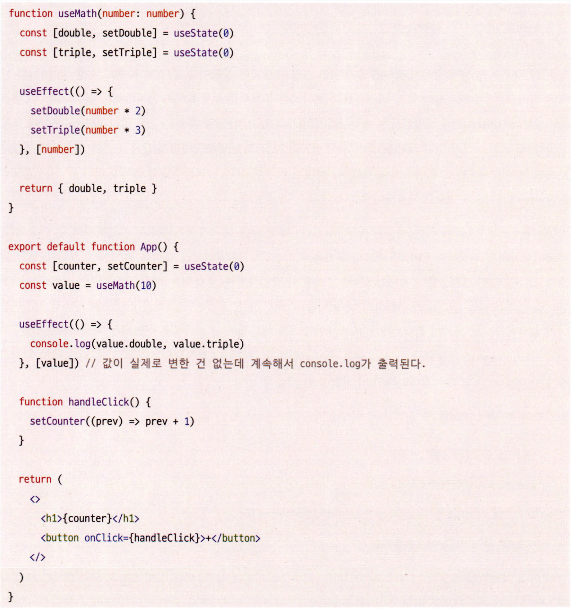

### 컴포넌트와 함수의 무거운 연산을 기억해 두는 메모이제이션

메모이제이션 최적화는 리액트 커뮤니티에서 오랜 논쟁 주제 중 하나로 ‘무조건 메모이제이션은 필요하다’와 ‘메모이제이션을 섣불리 해서는 안 된다’의 입장을 살펴보고, 현명하고 효율적으로 리액트에서 메모이제이션하는 법에 대해 알아보자.

**꼭 필요한 곳에만 메모이제이션을 추가하자는 입장**

```jsx
function sum(a, b) {
  return a + b;
}
```

- 위와 같은 가벼운 작업 자체는 메모이제이션해서 자바스크립트 메모리 어딘가에 두었다가 그것을 다시 꺼내오는 것보다는 매번 이 작업을 수행해 결과를 반환하는 것이 더 빠를 수도 있다.

메모이제이션에도 비용이 든다. 값을 비교하고 렌더링 또는 재계산이 필요한지 확인하는 작업, 그리고 이전에 결과물을 저장해 두었다가 다시 꺼내와야 한다는 두 가지 비용이 있다.

과연 이 비용이 리렌더링 비용보다 저렴하다고 할 수 있을까? 그것은 상황에 따라 다를 것이다.

만약 이러한 비교와 렌더링이 문제가 됐다면 리액트에서는 진작에 모든 컴포넌트를 PureComponent로 만들었
거나 memo로 감싸두는 작업을 했을 것이다. 그렇지 않고 이를 개발자에게 선택권으로 쥐어주었다는 것은 메모이제이션이 모든 문제를 해결할 수 있는 은탄환(silver bullet)이 아니라는 사실을 방증한다.

리액트 공식 문서에는 다음과 같은 내용도 나와 있다.

> useMemo는 성능 최적화를 위해 사용할 수는 있지만 의미상으로 그것이 보장된다고 생각하지는 마세요. 가까운 미래에 리액트에서는 이전에 메모이제이션된 값들의 일부를 “잊어버리고” 다음 렌더링 시에 그것들을 재계산하는방향을 택할지도 모르겠습니다.
> 예를 들면, 오프스크린 컴포넌트의 메모리를 해제하는 등이 있을 수 있습니다. useMemo를 사용하지 않고도 작동할 수 있도록 코드를 작성하고 그것을 추가해 성능을 최적화하세요.

이 문서에서 이야기하고 있는 것처럼 리액트가 useMemo를 언제까지고 성능 최적화를 위해 제공해 줄 것이라는보장은 없다. 따라서 섣불리 최적화하는 것은 옳지 못하다.

일단 애플리케이션을 어느 정도 만든 이후에 개발자 도구나 useEffect를 사용해 실제로 어떻게 렌더링이 일어나고있는지 확인하고 필요한 곳에서만 최적화하는 것이 옳다.

**렌더링 과정의 비용은 비싸므로, 모두 메모이제이션하자는 입장**

최적화의 옳고 그름을 이야기하기 전에, 먼저 두 가지 주장에서 모두 공통으로 깔고 가는 전제는 일부 컴포넌트에서는 메모이제이션을 하는 것이 성능에 도움이 된다는 점이다.

해당 컴포넌트가 렌더링이 자주 일어나며 그 렌더링 사이에 비싼 연산이 포함돼 있고, 심지어 그 컴포넌트가 자식 컴포넌트 또한 많이 가지고 있다면 memo나 다른 메모이제이션 방법을 사용하는 것이 이점이 있을 때가 분명히 있다.

그렇다면 두 가지 선택권이 있다.

1. memo를 컴포넌트의 사용에 따라 잘 살펴보고 일부에만 적용하는 방법
2. memo를 일단 그냥 다 적용하는 방법

첫 번째 경우는 가장 이상적인 상황이다. 그러나 실무에 임하는 모든 개발자들은 생각보다 최적화나 성능 향상에 쏟을 시간이 많지 않다.

따라서 일단 memo로 감싼 뒤에 생각해 보는 건 어떨까? 이렇게 감싸는 것이 괜찮은지 생각해보려면 잘못된 컴포넌트에 이뤄진 최적화, 즉 렌더링 비용이 저렴하거나 사실 별로 렌더링이 안 되는 컴포넌트에 memo를 썼을 때 역으로 지불해야 하는 비용을 생각해 보자.

잘못된 memo로 지불해야 하는 비용은 바로 props에 대한 얕은 비교가 발생하면서 지불해야 하는 비용이다.

메모이제이션을 위해서는 CPU와 메모리를 사용해 이전 렌더링 결과물을 저장해 둬야 하고, 리렌더링할 필요가 없다면 이전 결과물을 사용해야 한다.

그런데 리액트는 이전 렌더링 결과를 다음 렌더링과 구별하기 위해 저장해 둬야 한다. 즉, 어차피 리액트의 기본적인 재조정 알고리즘 때문에 이전 결과물은 어떻게든 저장해두고 있다.

따라서 우리가 memo로 지불해야 하는 비용은 props에 대한 얕은 비교뿐인 것이다. 물론 props가 크고 복잡해진다면 이 비용 또한 커질 수 있다.

반면 memo를 하지 않았을 때 발생할 수 있는 문제는 다음과 같다.

- 렌더링을 함으로써 발생하는 비용
- 컴포넌트 내부의 복잡한 로직의 재실행
- 그리고 위 두 가지 모두가 모든 자식 컴포넌트에서 반복해서 일어남
- 리액트가 구 트리와 신규 트리를 비교

얼핏 살펴보더라도 memo를 하지 않았을 때 치러야 할 잠재적인 위험 비용이 더 크다는 사실을 알 수 있다.

이제 useMemo와 useCallback에 관해 이야기해 보자. useMemo와 useCallback을 사용해 의존성 배열을 비교하고, 필요에 따라 값을 재계산하는 과정과 이러한 처리 없이 값과 함수를 매번 재생성하는 비용 중에서 무엇이 더 저렴한지 매번 계산해야 한다.

그렇다면 이 또한 마찬가지로 무조건 메모이제이션 하는 방법을 먼저 고민해 볼 필요가 있다.

리렌더링이 발생할 때 메모이제이션과 같은 별도 조치가 없다면 모든 객체는 재생성되고, 결과적으로 참조는 달라지게 된다. 이 값이 useEffect와 같은 의존성 배열에 쓰이면 어떻게 될까? 변경된 참조로 인해 다른 쪽에도 영향을미칠 것이다. 다음 예제를 보자.



- 위 useMath 혹은 인수로 넘겨주는 값이 변하지 않는 이상 같은 값을 가지고 있어야 하는데, handleclick으로 렌더링을 강제로 일으켜 보면 console.log가 출력된다.
- 이유는 함수형 컴포넌트인 App이 호출되면서 useMath가 계속해서 호출되고, 객체 내부의 값 같지만 참조가변경되기 때문이다.


- useMath의 반환값을 useMemo로 감싼다면 값이 변경되지 않는 한 같은 결과물을 가질 수 있고, 그 덕분에사용하는 쪽에서도 참조의 투명성을 유지할 수 있게 된다.
- 즉, 메모이제이션은 컴포넌트 자신의 리렌더링뿐만 아니라 이를 사용하는 쪽에서도 변하지 않는 고정된 값을 사용할 수 있다는 믿음을 줄 수 있다.

정리하자면, 메모이제이션은 하지 않는 것보다 메모이제이션했을 때 더 많은 이점을 누릴 수 있다. 이것이 비록 섣부른 초기화라 할지라도 했을 때 누릴 수 있는 이점, 그리고 이를 실수로 빠트렸을 때 치러야 할 위험 비용이 더 크니, 가능한 한 모든 곳에 메모이제이션을 활용한 최적화를 하는 것이 좋다.
