### useState

useState 혹의 기본적인 사용법을 살펴보자.

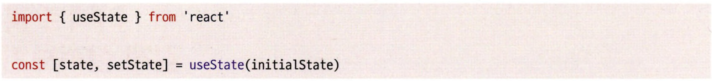

- 인수로는 사용할 state의 초깃값을 넘겨준다. 아무런 값을 넘겨주지 않으면 초깃값은 undefined다.
- 반환 값은 배열이며, 첫 번째 원소로 state 값 자체를 사용할 수 있고, 두 번째 원소인 setstate 함수를 사용해해당 state의 값을 변경할 수 있다.

**변경된 state 값이 반영되지 않는 예제**


- 위 코드에서 triggerRender을 통해 state를 업데이트해도 왜 렌더링이 되지 않을까?
- 리액트의 렌더링은 함수형 컴포넌트에서 반환한 결과물인 return의 값을 비교해 실행된다고 했었다.
- 즉, 매 렌더링마다 함수는 다시 새롭게 실행되고, state는 매번 hello로 초기화되므로 아무리 state를 변경해도 다시 hello로 초기화되는 것이다.

이를 해결하기 위해 리액트는 클로저를 이용했다.

클로저의 자세한 개념은 링크를 참고하자.
[https://winjabonjooyui.tistory.com/entry/모던-리액트-딥-다이브-14-클로저](https://winjabonjooyui.tistory.com/entry/%EB%AA%A8%EB%8D%98-%EB%A6%AC%EC%95%A1%ED%8A%B8-%EB%94%A5-%EB%8B%A4%EC%9D%B4%EB%B8%8C-14-%ED%81%B4%EB%A1%9C%EC%A0%80)
[https://winjabonjooyui.tistory.com/entry/코어-자바스크립트-05-클로저](https://winjabonjooyui.tistory.com/entry/%EC%BD%94%EC%96%B4-%EC%9E%90%EB%B0%94%EC%8A%A4%ED%81%AC%EB%A6%BD%ED%8A%B8-05-%ED%81%B4%EB%A1%9C%EC%A0%80)

**useState 작동 방식을 대략적으로 흉내 낸 코드**


- 위 코드는 작동 자체만 구현했을 뿐, 실제 리액트 코드에서는 useReducer를 이용해 구현돼 있다.
- MyReact라고 불리는 클로저 내부에 useState와 관련된 정보를 저장해 두고, 이를 필요할 때마다 꺼내놓는형식으로 구성돼 있다.
- useState는 클로저를 사용함으로써 외부에 해당 값을 노출시키지 않고 오직 리액트에서만 쓸 수 있었고, 함수형 컴포넌트가 매번 실행되더라도 useState에서 이전의 값을 정확하게 꺼내 쓸 수 있게 됐다.

**게으른 초기화**

useState의 인수로 특정한 값을 넘기는 함수를 인수로 넣어줄 수도 있는데, 이렇게 함수를 넘기는 것을 게으른 초기화(lazy initialization)라고 한다.

**게으른 초기화 예제 코드**


- 게으른 초기화 함수는 오로지 state가 처음 만들어질 때만 사용된다. 만약 이후에 리렌더링이 발생된다면 이 함수의 실행은 무시된다.
- 리액트에서는 렌더링이 실행될 때마다 함수형 컴포넌트의 함수가 다시 실행되고, useState의 값도 재실행된다.
  - 물론 클로저를 통해 값을 가져오며 초깃값은 최초에만 사용된다.


- 위와 같이 Number.parselnt(…)을 값으로 바로 넘기면 리렌더링 시에도 동일하게 계속 연산을 하게 된다.
- 이런 경우에는 함수 형태로 인수에 넘겨 초깃값이 없다면 함수를 실행해 연산을 시도할 것이고, 초깃값이 존재한다면 함수 실행을 하지 않고 기존 값을 사용할 수 있다.

리액트에서는 게으른 최적화를 무거운 연산이 요구될 때 사용하라고 한다.

예를 들어 localstorage나 sessionstorage에 대한 접근, map, filter, find 같은 배열에 대한 접근, 혹은 초깃값계산을 위해 함수 호출이 필요할 때와 같이 무거운 연산을 포함해 실행 비용이 많이 드는 경우가 있으니 참고하자.

---

### **useEffect**

useEffect의 정의를 정확하게 내리자면 useEffect는 애플리케이션 내 컴포넌트의 여러 값들을 활용해 동기적으로 부수 효과를 만드는 메커니즘이다.

그리고 이 부수 효과가 ‘언제’ 일어나는지보다 어떤 상태값과 함께 실행되는지 살펴보는 것이 중요하다.

```jsx
function Component() {
  const [counter, setCounter] = useState(0);

  useEffect(() => {
    console.log(counter); // 1, 2, 3, 4....
  });

  function handleClick() {
    setCounter((prev) => prev + 1);
  }

  return (
    <>
      <h1>{counter}</h1>
      <button onClick={handleClick}>+</button>
    </>
  );
}
```

- useEffect는 렌더링할 때마다 의존성에 있는 값을 보면서 이 의존성의 값이 이전과 다른 게 하나라도 있으
  면 부수 효과를 실행한다.
- 따라서 useEffect는 state와 props의 변화 속에서 일어나는 렌더링 과정에서 실행되는 부수 효과 함수라고볼 수 있다.

**클린업 함수의 목적**

클린업 함수라 불리는 useEffect 내에서 반환되는 함수는 정확히 무엇이고 어떤 일을 할까?


- 위 useEffect가 포함된 컴포넌트를 실행해 보면 다음과 같은 결과를 얻을 수 있다.


- 위 로그를 살펴보면 클린업 함수는 이전 counter 값, 즉 이전 state를 참조해 실행된다는 것을 알 수 있다.
- 중요한 사실은 클린업 함수는 비록 새로운 값을 기반으로 렌더링 뒤에 실행되지만 이 변경된 값을 읽는 것이 아니라 함수가 정의됐을 당시에 선언됐던 이전 값을 보고 실행된다.
- 이러한 사실을 코드로 직관적으로 표현하면 다음과 같다.


- useEffect는 그 콜백이 실행될 때마다 이전의 클린업 함수가 존재한다면 그 클린업 함수를 실행한 뒤에 콜백을 실행한다.
- 따라서 이벤트를 추가하기 전에 이전에 등록했던 이벤트 핸들러를 삭제하는 코드를 클린업 함수에 추가하여 특정 이벤트의 핸들러가 무한히 추가되는 것을 방지할 수 있다.

클린업 함수는 생명주기 메서드의 언마운트 개념과는 조금 차이가 있다.

언마운트는 특정 컴포넌트가 DOM에서 사라진다는 것을 의미하는 클래스형 컴포넌트의 용어다.

클린업 함수는 언마운트라기보다는 함수형 컴포넌트가 리렌더링 됐을 때 의존성 변화가 있었을 당시 이전의 값을 기준으로 실행되는, 이전 상태를 청소해 주는 개념이다.

**의존성 배열**

```jsx
useEffect(() => {
  console.log("컴포넌트 렌더링됨");
});
```

- 위처럼 두번째 인자로 아예 배열을 넘기지 않으면 콜백은 렌더링이 발생할 때마다 실행된다.
- 이는 보통 컴포넌트가 렌더 링됐는지 확인하기 위한 방법으로 사용된다.

한 가지 의문점이 든다. 의존성 배열이 없는 useEffect가 매 렌더링마다 실행된다면 그냥 useEffect 없이 써도 되는 게 아닐까?

```jsx
// 1 직접 실행
function Component() {
  console.log("렌더링됨");
}

// 2 useEffect를 통해 실행
function Component() {
  useEffect(() => {
    console.log("렌더링 됨");
  });
}
```

- 위 두 코드는 명백히 리액트에서 차이점을 지니고 있다.
- 첫째, 서버 사이드 렌더링 관점에서 useEffect는 클라이언트 사이드에서 실행되는 것을 보장해 준다. useEffect 내부에서는 window 객체에 접근할 수 있다.
- 둘째, useEffect는 컴포넌트의 렌더링이 완료된 이후에 실행된다. 반면 직접 실행은 컴포넌트가 렌더링되는 도중에 실행된다. 따라서 서버 사이드 렌더링의 경우에 서버에서도 실행된다. 이 작업은 함수형 컴포넌트의 반환을 지연시키는 행위다. 즉, 무거운 작업일 경우 렌더링을 방해하므로 성능에 악영향을 미칠 수 있다.

useEffect는 컴포넌트가 렌더링된 후에 어떠한 부수 효과를 일으키고 싶을 때 사용하는 훅이라는걸 명심하자.

**useEffect 를 사용할 때 주의할 점**

useEffeet를 사용할 때 주의할 점은 무엇이 있는지 살펴보자.

**1. eslint-disable-line react-hooks/exhaustive-deps 주석은 최대한 자제**


- 이 ESLint 룰은 useEffect 인수 내부에서 사용하는 값 중 의존성 배열에 포함돼 있지 않은 값이 있을 때 경고를 발생시킨다.
- 대부분 빈 배열 []을 의존성으로 할 때, 컴포넌트를 마운트하는 시점에만 무언가를 하고 싶다라는 의도로 작성한다.
- 의존성 배열을 넘기지 않은 채 콜백 함수 내부에서 특정 값을 사용한다는 것은, 컴포넌트의 state, props와 같은 어떤 값의 변경과 useEffect의 부수 효과가 별개로 작동하게 된다는 것이다.
- useEffect에서 사용한 콜백 함수의 실행과 내부에서 사용한 값의 실제 변경 사이에 연결 고리가 끊어져 있는것이다.


- 위 코드의 의도는 아마도 해당 컴포넌트가 최초로 렌더링됐을 때만 logging을 실행하고 싶어서일 것이다.
- 그러나 당장은 문제가 없어도 버그의 위험성을 안고 있다. log가 아무리 변하더라도 useEffect의 부수 효과는실행되지 않고, useEffect의 흐름과 컴포넌트의 props.log의 흐름이 맞지 않게 된다.
- 따라서 logging이라는 작업은 부모 컴포넌트에서 실행되는 것이 옳을지도 모른다.
  - 부모 컴포넌트에서 컴포넌트가 렌더링되는 시점을 결정하고 이에 맞게 log 값을 넘겨준다면, 동일한 결과를 만들 수 있고 컴포넌트의 부수 효과 흐름을 거스르지 않을 수 있다.

useEffect에 빈 배열을 넘기기 전에는 정말로 useEffect의 부수 효과가 컴포넌트의 상태와 별개로 작동해야만 하는지, 혹은 여기서 호출하는 게 최선인지 한 번 더 검토해 봐야 한다.

**2. useEffect의 첫 번째 인수에 함수명을 부여**


- 함수명을 부여하는 것이 어색해 보일 수 있지만 목적을 명확히 하고 그 책임을 최소한으로 좁힌다는 점에서 굉장히 유용하다.

**3. 거대한 useEffect를 만들지 마라**

useEffect는 간결하고 가볍게 유지하는 것이 좋다.
만약 부득이하게 크게 만들어야 한다면 적은 의존성 배열을 사용하는 여러 개의 useEffect로 분리하는 것이 좋다.

의존성 배열이 너무 거대하고 관리하기 어려운 수준까지 이른다면 정확히 이 useEffect가 언제 발생하는지 알 수없게 된다.

의존성 배열에 불가피하게 여러 변수가 들어가야 하는 상황이라면 최대한 useCallback과 useMemo 등으로 사전에 정제한 내용들만 useEffect에 담아두어 언제 useEffect가 실행되는지 좀 더 명확하게 알 수 있다.

**4. 불필요한 외부 함수를 만들지 마라**


- 이 컴포넌트는 props를 받아서 그 정보를 바탕으로 API 호출을 하는 useEffect를 가지고 있다.
- 그러나 useEffect 밖에서 함수를 선언하다 보니 불필요한 코드가 많아지고 가독성이 떨어졌다.


- 관련 함수를 내부로 가져왔더니 훨씬 간결한 모습이다.
- 불필요한 의존성 배열도 줄일수 있었고, 또 무한루프에 빠지지 않기 위해 넣었던 코드인 useCallback도 삭제할 수 있었다.
- useEffect 내에서 사용할 부수 효과라면 내부에서 만들어서 정의해서 사용하는 편이 훨씬 도움이 된다.

**경쟁 상태(race condition)**


- useEffect의 인수로 비동기 함수가 사용 가능하다면 비동기 함수의 응답 속도에 따라 결과가 이상하게 나타날 수 있다.
- 예시로 이전 state 기반의 응답이 10초가 걸렸고, 이후 바뀐 state 기반의 응답이 1초 뒤에 왔다면 이전 state기반으로 결과가 나와버리는 불상사가 생길 수 있다.
- 이러한 문제를 useEffect의 경쟁 상태라고 한다.


- useEffect 내부에서 비동기 함수가 내부에 존재하게 되면 useEffect 내부에서 비동기 함수가 생성되고 실행되는 것을 반복하므로 클린업 함수에서 이전 비동기 함수에 대한 처리를 추가하는 것이 좋다.
- fetch의 경우 abortController 등으로 이전 요청을 취소하는 것이 좋다.

즉, 비동기 useEffect는 state의 경쟁 상태를 야기할 수 있고 cleanup 함수의 실행 순서도 보장할 수 없기 때문에 개발자의 편의를 위해 useEffect에서 비동기 함수를 인수로 받지 않는다.

---

### useMemo

useMemo는 비용이 큰 연산에 대한 결과를 저장(메모이제이션)해 두고, 이 저장된 값을 반환하는 훅이다.
흔히 리액트에서 최적화를 떠올릴 때 가장 먼저 언급되는 훅이 바로 useMemo다.


- 첫 번째 인수로는 어떠한 값을 반환하는 생성 함수를, 두 번째 인수로는 해당 함수가 의존하는 값의 배열을 전달한다.
- useMemo는 렌더링 발생 시 의존성 배열의 값이 변경되지 않았으면 함수를 재실행하지 않고 이전에 기억해 둔 해당 값을 반환하고, 변경됐다면 첫 번째 인수의 함수를 실행한 후에 그 값을 반환하고 그 값을 다시 기억한다.


- 위와 같이 컴포넌트도 useMemo로 메모이제이션도 가능하다. 물론 React.memo를 쓰는 것이 더 현명하다.
- useMemo 등 메모이제이션을 활용하면 무거운 연산을 다시 수행하는 것을 막을 수 있다는 장점이 있다.

---

### useCallback

useCallback은 인수로 넘겨받은 콜백 함수 자체를 기억한다. 쉽게 말해 특정 함수를 새로 만들지 않고 다시 재사용한다는 의미다.


- memo를 사용해서 컴포넌트를 메모이제이션했지만 App의 자식 컴포넌트 전체가 렌더링되고 있다.
- 이유는 state 값이 바뀌면서 App 컴포넌트가 리렌더링되고, 그때마다 매번 onChange로 넘기는 함수가 재생성되고 있기 때문이다.


- 크롬 메모리 프로필로 살펴보면 toggle1만 클릭해도 두 함수 모두 매번 재생성된다.


- 위 예제의 toggle1, toggle2에 useCallback을 추가하면, 의존성 배열이 변경되지 않는 한 함수를 재생성하지 않는다.


- useCallback 추가 후 다시 살펴보니 의존성 배열에 변경이 감지된 toggle1만 재생성된걸 확인할 수 있다.


- 위 두 코드는 동일한 기능을 한다. 다만 useMemo는 값 자체를 메모이제이션하는 용도이기 때문에 반환문으로 함수 선언문을 반환해야 한다.
- 이는 코드를 작성하거나 리뷰하는 입장에서 혼란을 불러올 수 있으므로 함수를 메모이제이션하는 용도라면 좀 더 간단한 useCallback을 사용하자.

다만 기억해야 할 사실은 useCallback이나 useMemo는 모두 동일한 역할을 한다는 것이다.

---

### useRef

useRef는 useState와 동일하게 컴포넌트 내부에서 렌더링이 일어나도 변경 가능한 상태값을 저장한다. 그러나 useState와 큰 차이점 두 가지를 가지고 있다.

1. useRef는 반환값인 객체 내부에 있는 current로 값에 접근 또는 변경할 수 있다.

2. useRef는 그 값이 변하더라도 렌더링을 발생시키지 않는다.

그렇다면 useRef가 왜 필요한지 먼저 고민해보자.

렌더링에 영향을 미치지 않는 고정된 값을 관리하기 위해서 useRef를 사용한다면 그냥 함수 외부에서 값을 선언해서 관리하면 되지 않을까?

```jsx
let value = 0;

function Component() {
  function handleClick() {
    value += 1;
  }

  return <button onClick={handleClick}>{value}</button>;
}
```

- 이 방식은 몇 가지 단점이 있다. 컴포넌트가 실행되어 렌더링되지 않았음에도 value라는 값이 기본적으로 존재하게 된다. 이는 메모리에 불필요한 값을 갖게 하는 악영향을 미친다.
- 또한 만약 컴포넌트가 여러 번 생성된다면 각 컴포넌트에서 가리키는 값이 모두 value로 동일하다.
  - 대부분의 경우에는 컴포넌트 인스턴스 하나당 하나의 값을 필요로 하는 것이 일반적이다.

useRef는 앞서 언급한 두 가지 문제를 모두 극복한다. 컴포넌트가 렌더링될 때만 생성되며, 컴포넌트 인스턴스가 여러 개라도 각각 별개의 값을 바라본다.

useRef의 가장 일반적인 사용 예는 바로 DOM에 접근하고 싶을 때일 것이다. 예제를 살펴보자.


- useRef의 최초 기본값은 인수로 넘겨받은 값이다.
- useRef가 선언된 당시에는 아직 컴포넌트가 렌더링되기 전이라 return으로 컴포넌트의 DOM이 반환되기 전이므로 undefined가 출력된다.


- useRef를 사용할 수 있는 유용한 경우는 렌더링을 발생시키지 않고 원하는 상태값을 저장할 수 있다는 특징
  을 활용해 위와 같이 useState의 이전 값을 저장하는 usePrevious() 같은 훅을 구현할 때다.

---

### useContext

많이들 알고있는 props drilling을 극복하기 위해 Context가 등장했다.


- useContext는 상위 컴포넌트에서 만들어진 Context를 함수형 컴포넌트에서 사용할 수 있도록 만들어진 훅이다. 상위 컴포넌트에서 선언된 <Context.Provider />에서 제공한 값을 사용할 수 있게 된다.
- 여러 개의 Provider가 있다면 가장 가까운 Provider의 값을 가져오게 된다.

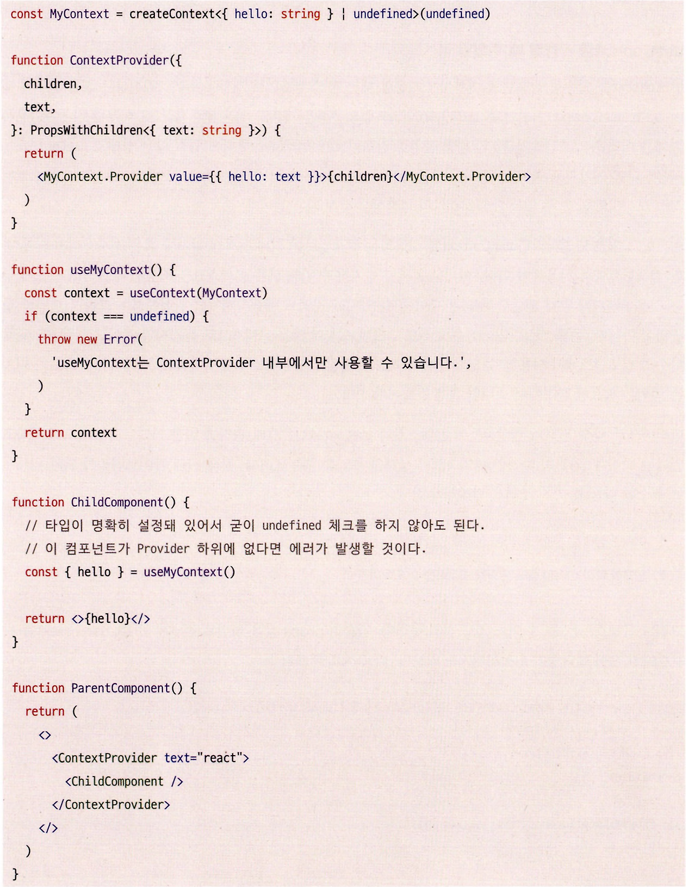

- 다수의 Provider와 useContext를 사용할 때, 특히 타입스크립트를 사용하고 있다면 위와 같이 별도 함수로 감싸서 사용하는 것이 좋다.
- 타입 추론에도 유용하고, 상위에 Provider가 없는 경우에도 사전에 쉽게 에러를 찾을 수 있다.

#### useContext를 사용할 때 주의할 점

useContext가 선언돼 있으면 Provider에 의존성을 가지고 있는 셈이 되므로 아무데서나 재활용하기에는 어려운 컴포넌트가 된다.

이러한 상황을 방지하려면 useContext를 사용하는 컴포넌트를 최대한 작게 하거나 혹은 재사용되지 않을 만한 컴포넌트에서 사용해야 한다.

일부 리액트 개발자들이 콘텍스트와 useContext를 상태 관리를 위한 리액트의 API로 오해하고 있다는 것이다.

콘텍스트는 상태를 주입해 주는 API다.

상태 관리가 되기 위해서는 최소한 다음 두 가지 조건을 만족해야 한다.

1. 어떠한 상태를 기반으로 다른 상태를 만들어 낼 수 있어야 한다.
2. 필요에 따라 이러한 상태 변화를 최적화할 수 있어야 한다.

그러나 Context는 둘 중 어느 것도 하지 못한다. 단순히 props 값을 하위로 전달해 줄 뿐, useContext를 사용한다고 해서 렌더링이 최적화되지는 않는다.

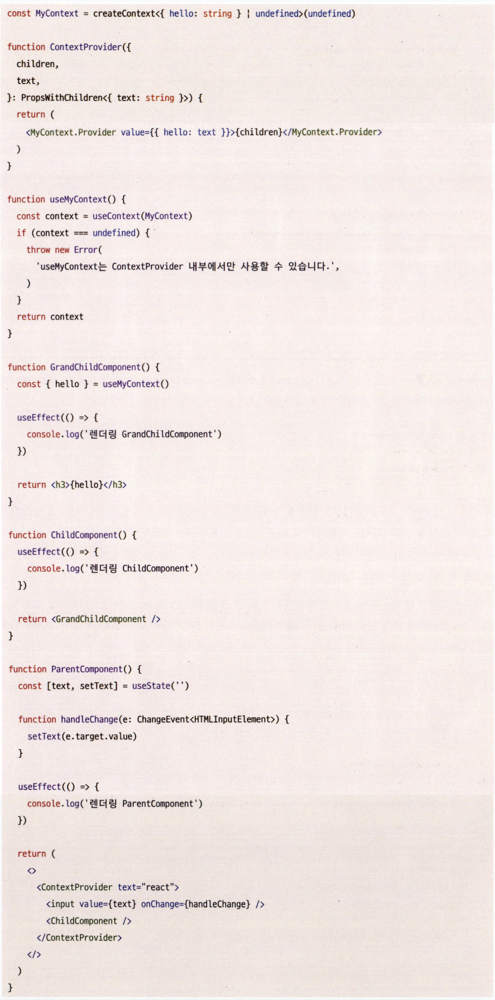

- 위 코드는 보기에는 text가 변경되는 ParentComponent와 이를 사용하는 GrandChild Component만 렌더링될 것 같지만 컴포넌트 트리 전체가 리렌더링 되고 있다.


- 부모 컴포넌트가 렌더링되면 하위 컴포넌트는 모두 리렌더링되는 상황이 바로 이 콘텍스트 사용 예제에 해당하기 때문이다.
- useContext는 상태를 관리하는 마법이 아니라는 사실을 반드시 기억해야 한다.
  콘텍스트는 단순히 상태를 주입할 뿐 그 이상의 기능도, 그 이하의 기능도 하지 않는다.

위 예제를 최적화하려면 어떻게 해야 할까?
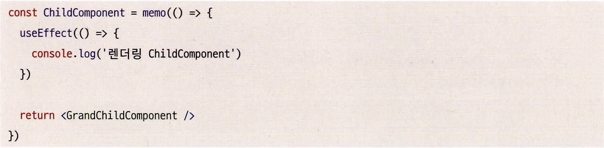

- React.memo로 Childcomponent가 렌더링되지 않게 막을 수 있다.
- memo는 props 변화가 없으면 리렌더링되지 않고 계속해서 같은 결과물을 반환할 것이다.

---

### useReducer

useReducer의 반환값은 useState와 동일하게 길이가 2인 배열이다.

```typescript
const [state, dispatcher] = useReducer(reducer, initialstate, init);
```

- state: 현재 가지고 있는 값
- dispatcher: 한국어로 발송하다 라는 뜻이다. 상태 변화가 있어야 한다고 reducer 함수에게 요청하는 함수이다.
  - setstate는 단순히 값을 넘겨주지만 dispatcher에는 action을 넘겨준다.
  - action은 state를 변경할 수 있는 액션을 의미한다.
- reducer: 한국어로 변환기라는 뜻을 가지고 있다. 즉, 상태를 실제로 변경하는 변환기 역할을 하는 함수이다.
- initialstate: 초기 상태값이다.
- init: 게으른 초기화를 위한 함수이다. 필수값이 아니며 만약 함수를 넘겨주면 initialState를 인수로 init 함수가 실행된다.

이제 본격적인 사용법을 알아보자.
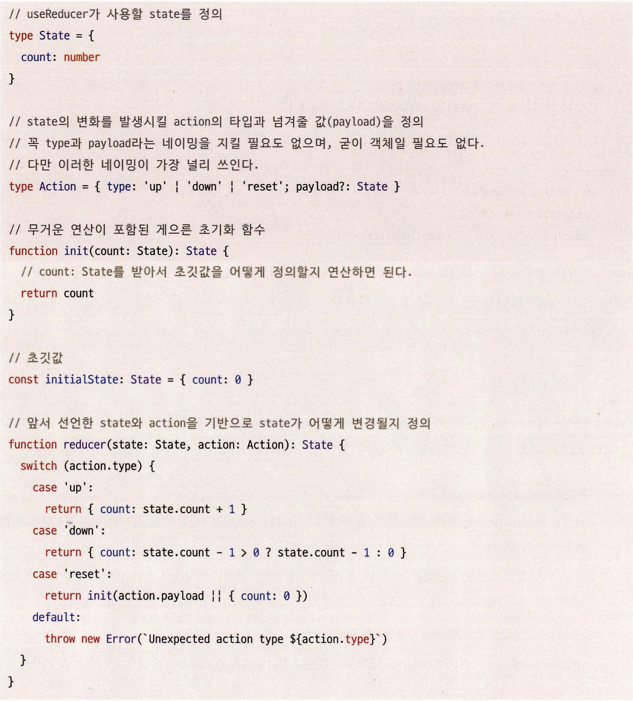
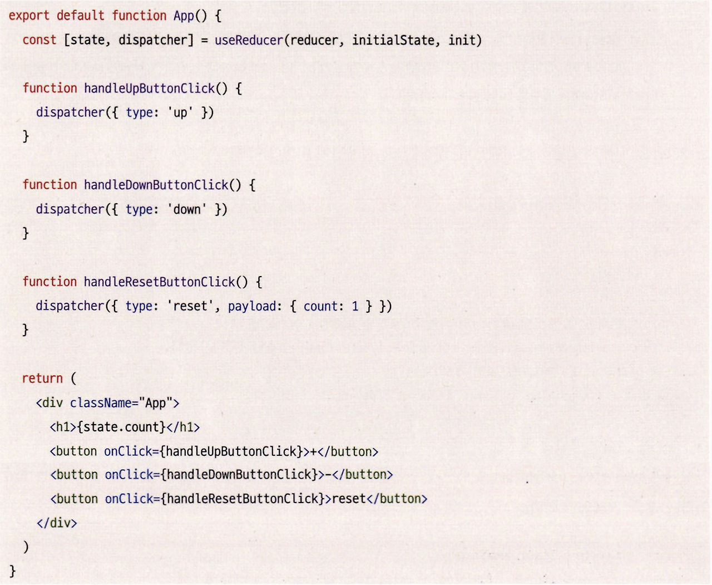

- 복잡해 보일 수 있지만 useReducer의 목적은 간단하다.
- 복잡한 형태의 state를 사전에 정의된 dispatcher로만 수정할 수 있게 만들어 줌으로써 state 값에 대한 접근은 컴포넌트에서만 가능하게 하고,
  - 이를 업데이트하는 방법에 대한 상세 정의는 컴포넌트 밖에다 둔 다음, state의 업데이트를 미리 정의해 둔 dispatcher로만 제한하는 것이다.

state 값을 변경하는 시나리오를 제한적으로 두고 이에 대한 변경을 빠르게 확인할 수 있게끔 하는 것이 useReducer의 목적이다.

state 하나가 가져야 할 값이 복잡하고 이를 수정하는 경우의 수가 많아진다면 state를 관리하는 것이 어려워진다.

또 여러 개의 state를 관리하는 것보다 때로는 성격이 비슷한 여러 개의 state를 묶어 useReducer로 관리하는 편이 더 효율적일 수도 있다.

이렇게 useReducer를 사용해 state를 관리하면 state를 사용하는 로직과 이를 관리하는 비즈니스 로직을 분리할 수 있어 state를 관리하기가 한결 쉬워진다.

useReducer나 useState 둘 다 세부 작동과 쓰임에만 차이가 있을 뿐, 결국 클로저를 활용해 값을 가둬서 state를 관리한다는 사실에는 변함이 없다.

---

### useImperativeHandle

널리 사용되지 않지만, 일부 사용 사례에서 유용하게 활용될 수 있다.
useImperativeHandle을 이해하기 위해서는 먼저 React.forwardRef에 대해 알아야 한다.

#### forwardRef

ref를 상위 컴포넌트에서 하위 컴포넌트로 전달하고 싶을때 사용한다.
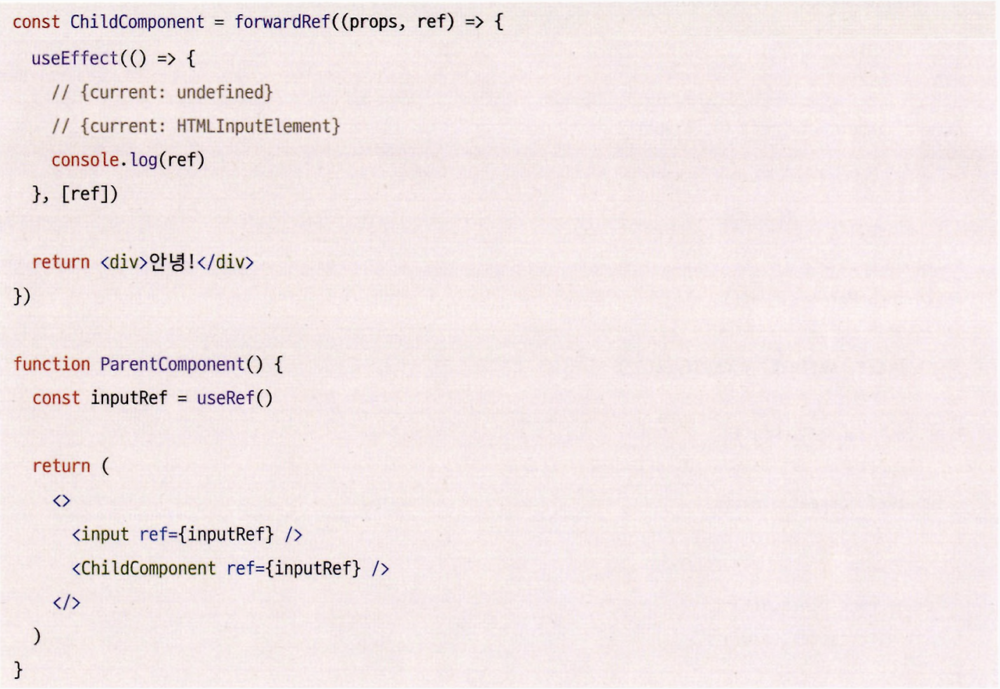

- ref를 받고자 하는 컴포넌트를 forwardRef로 감싸고, 두 번째 인수로 ref를 전달받는다.
- 부모 컴포넌트에서는 동일하게 ref prop를 통해 ref를 넘겨주면 된다.

이제 useImperativeHandle 대해 살펴보자.
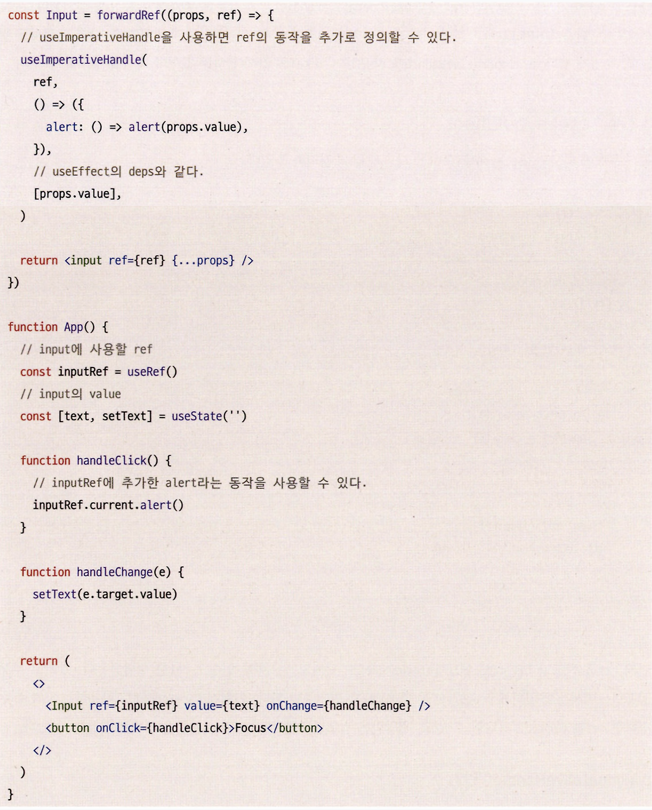

- useImperativeHandle은 부모에게서 넘겨받은 ref를 원하는 대로 수정할 수 있는 훅이다.
- 원래 ref는 {current: <HTMLElement>}와 같은 형태로 HTMLElement만 주입할 수 있는 객체였다.
- 그러나 여기서는 전달받은 ref에다 훅을 사용해 추가적인 동작을 정의했다.
- 이로써 부모는 단순히 HTMLElement뿐만 아니라 자식 컴포넌트에서 새롭게 설정한 객체의 키와 값에 대해서도 접근할 수 있게 됐다.
- useImperativeHandle을 사용하면 이 ref의 값에 원하는 값이나 액션을 정의할 수 있다.

---

### useLayoutEffect

시그니처는 useEffect와 동일하나, 모든 DOM의 변경 후에 useLayoutEffect의 콜백 함수 실행이 동기적으로 발생한다.

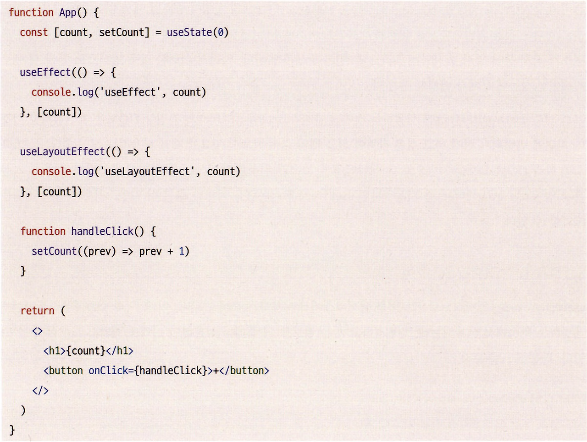

- 여기서 말하는 DOM 변경이란 렌더링이지, 브라우저에 실제로 해당 변경 사항이 반영되는 시점을 의미하는 것은 아니다.
- 위 예제에서 useEffect가 먼저 선언돼 있지만 항상 useLayoutEffect가 useEffect 보다는 먼저 실행된다.

실행 순서는 다음과 같다.

1. 리액트가 DOM을 업데이트

2. useLayoutEffect를 실행

3. 브라우저에 변경 사항을 반영

4. useEffect를 실행

동기적으로 발생한다는 것은 리액트는 useLayoutEffect의 실행이 종료될 때까지 기다린 다음에 화면을 그린다는 것을 의미한다.

즉, 리액트 컴포넌트는 useLayoutEffect가 완료될 때까지 기다리기 때문에 컴포넌트가 잠시 동안 일시 중지되는 것과 같은 일이 발생하여 성능에 문제가 생길 수 있다.

그래서 DOM은 계산됐지만 이것이 화면에 반영되기 전에 하고 싶은 작업이 있을 때와 같이 반드시 필요할 때만 사용하는 것이 좋다.

Ex. DOM 요소를 기반으로 한 애니메이션, 스크롤 위치를 제어하는 등

---

### useDebugValue

디버깅을 위한 훅이다. 디버깅하고 싶은 정보를 이 훅에다 사용하면 리액트 개발자 도구에서 볼 수 있다.

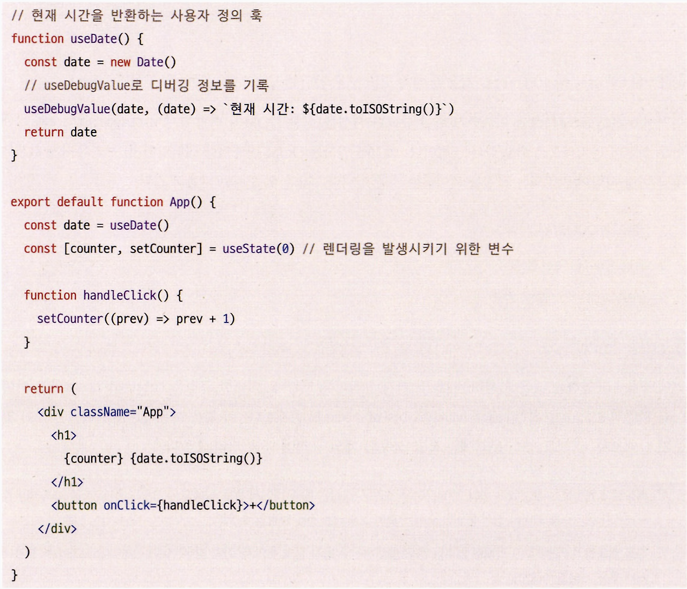

- 두 번째 인수로 포매팅 함수를 전달하면 이에 대한 값이 변경됐을 때만 호출되어 포매팅된 값을 노출한다.
  - 즉, 첫 번째 인수의 값이 같으면 포매팅 함수는 호출되지 않는다.
- 오직 다른 훅 내부에서만 실행할 수 있다.

위 코드를 실행한 다음, 리액트 개발자 도구로 확인하면 다음과 같은 결과를 볼 수 있다.
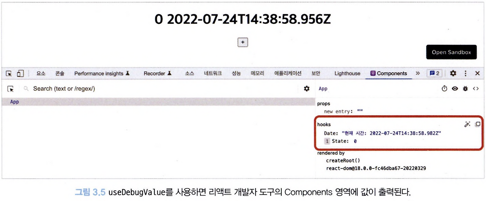

- 공통 훅을 제공하는 라이브러리나 대규모 웹 애플리케이션에서 디버깅 관련 정보를 제공하고 싶을 때 유용하다.

---

### 훅의 규칙

리액트에서 제공하는 혹은 사용하는 데 몇 가지 규칙이 존재한다.

이러한 규칙을 rules-of-hooks라고 하며 이와 관련된 ESLint 규칙인 react-hooks/rules-of-hooks도 존재한다.

리액트 공식 문서에는 훅을 사용할 때의 규칙에 대해 정리해 뒀다.

1. 최상위에서만 훅을 호출해야 한다. 이 규칙을 따라야만 컴포넌트가 렌더링될 때마다 항상 동일한 순서로 훅이 호출되는 것을 보장할 수 있다.
2. 훅을 호출할 수 있는 것은 리액트 함수형 컴포넌트, 커스텀 훅 두가지 경우뿐이다. 일반 자바스크립트 함수에서는 훅을 사용할 수 없다.
   이 규칙이 어떤 의미를 가지고 있는지 자세히 살펴보자.

앞서 useState의 구현에서 보여줬던 것처럼 훅에 대한 정보 저장은 리액트 어딘가에 있는 index와 같은 키를 기반으로 구현돼 있다(실제로는 객체 기반 링크드 리스트에 더 가깝다).
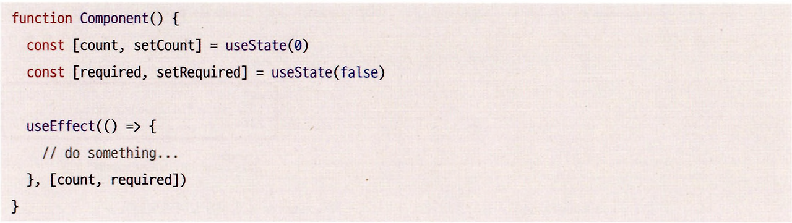

이 컴포넌트는 파이버에서 다음과 같이 저장된다.
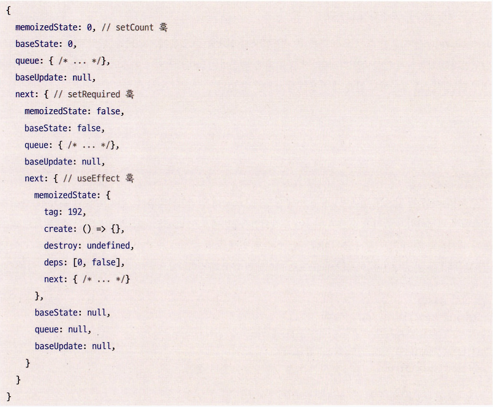

- 코드에서 볼 수 있듯이 리액트 훅은 파이버 객체의 링크드 리스트의 호출 순서에 따라 저장된다.
- 그 이유는 각 훅이 파이버 객체 내에서 순서에 의존해 state나 effect의 결과에 대한 값을 저장하고 있기 때문이다.
- 이렇게 고정된 순서에 의존해 훅과 관련된 정보를 저장함으로써 이전 값에 대한 비교와 실행이 가능해진다.

만약 이러한 순서를 보장받을 수 없는 상황이라면 어떻게 될까?
리액트 공식 문서에 있는 훅에 대한 잘못된 예제를 살펴보자.
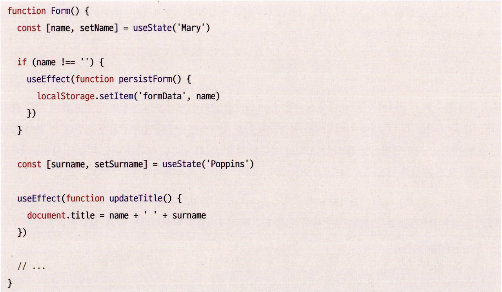

- 위 코드에서 setName을 빈 값으로 업데이트하면 name이 업데이트되면서 2번째로 있던 훅 useEffect를 호출해서 변경하려고 했지만 조건부 구문이 추가되면서 2번째 혹이 useState가 되어버렸다.
- 이렇게 조건이나 다른 이슈로 인해 훅의 순서가 깨지거나 보장되지 않을 경우 리액트 코드는 에러를 발생시킨다.

이 상황을 코드로 나타내면 다음과 같다.
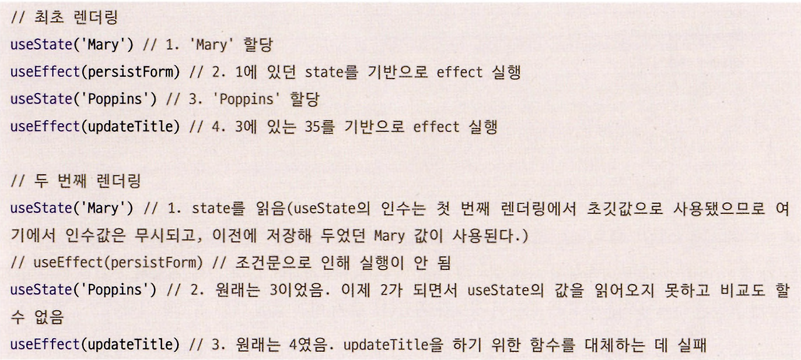

- 그러므로 훅은 절대 조건문, 반복문 등에 의해 리액트에서 예측 불가능한 순서로 실행되게 해서는 안 된다.
- 항상 혹은 실행 순서를 보장받을 수 있는 컴포넌트 최상단에 선언돼 있어야 한다.
