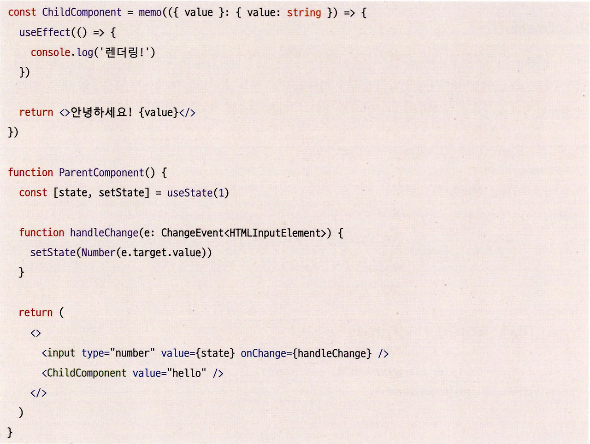
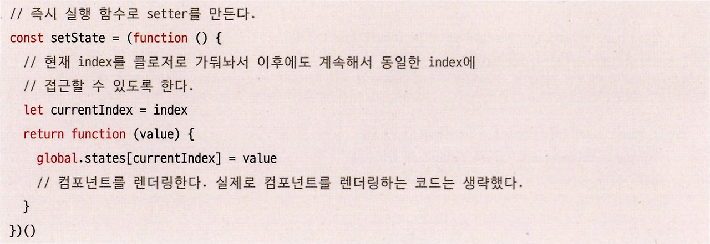
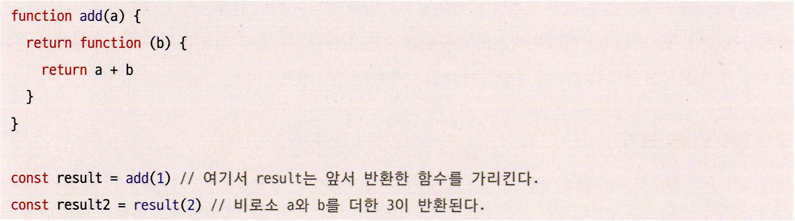
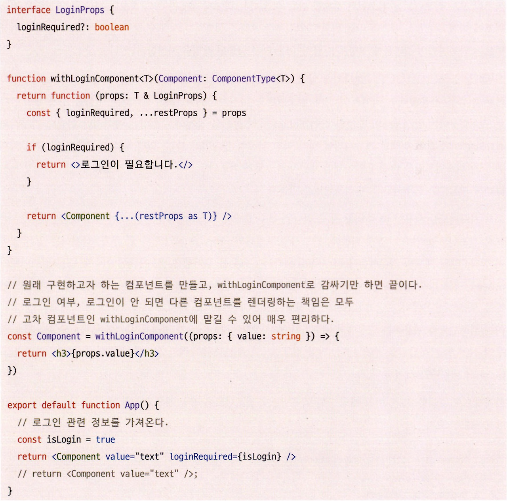
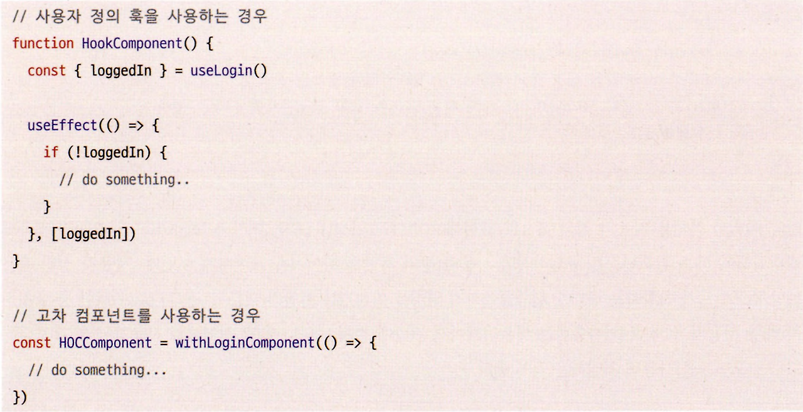
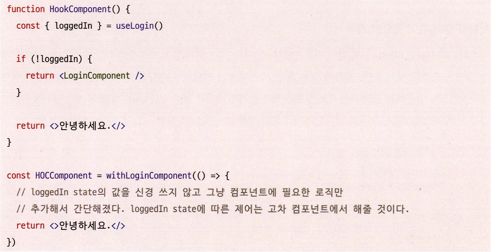

## 3.2 사용자 정의 훅과 고차 컴포넌트 중 무엇을 써야 할까?

리액트에서는 재사용할 수 있는 로직을 관리할 수 있는 두 가지 방법이 있다.

바로 사용자 정의 훅(custom hook)과 고차 컴포넌트(higher order component)다.

사용자 정의 훅과 고차 컴포넌트를 알아보자.

---

### 사용자 정의 훅(Custom Hook)

리액트의 훅(useState, useEffect 등)을 기반으로 **개발자가 필요한 훅을 만드는 기법**이다.

서로 다른 컴포넌트 내부에서 **같은 로직을 공유하고자 할 때 주로 사용**된다. 이는 **리액트에서만 사용할 수 있는 방식**이다.

혹의 규칙 중 하나는 기존 리액트 훅들처럼 이름이 반드시 **use로 시작하는 함수를 만들어야 한다는 것**이다.

```typescript
import { useEffect, useState } from "react";

// HTTP 요청을 하는 사용자 정의 훅
function useFetch<T>(
  url: string,
  { method, body }: { method: string; body?: XMLHttpRequestBodyInit }
) {
  // 응답 결과
  const [result, setResult] = useState<T | undefined>();
  // 요청 중 여부
  const [isLoading, setIsLoading] = useState<boolean>(false);
  // 2xx, 3xx로 정상 응답인지 여부
  const [ok, setOk] = useState<boolean | undefined>();
  // HTTP status
  const [status, setStatus] = useState<number | undefined>();

  useEffect(() => {
    const abortController = new AbortController();

    (async () => {
      setIsLoading(true);
      const response = await fetch(url, {
        method,
        body,
        signal: abortController.signal,
      });

      setOk(response.ok);
      setStatus(response.status);

      if (response.ok) {
        const apiResult = await response.json();
        setResult(apiResult);
      }

      setIsLoading(false);
    })();

    return () => {
      abortController.abort();
    };
  }, [url, method, body]);

  return { ok, result, isLoading, status };
}

interface Todo {
  userId: number;
  id: number;
  title: string;
  completed: boolean;
}

export default function App() {
  // 사용자 지정 훅 사용
  const { isLoading, result, status, ok } = useFetch<Array<Todo>>(
    "https://jsonplaceholder.typicode.com/todos",
    {
      method: "GET",
    }
  );

  useEffect(() => {
    if (!isLoading) {
      console.log("fetchResult >>", status);
    }
  }, [status, isLoading]);

  return (
    <div>
      {ok
        ? (result || []).map(({ userId, title }, index) => (
            <div key={index}>
              <p>{userId}</p>
              <p>{title}</p>
            </div>
          ))
        : null}
    </div>
  );
}
```

- fetch를 이용해 API를 호출하는 로직을 커스텀 훅으로 분리한 예제다.
- 분리하지 않았다면 fetch로 API 호출을 해야 하는 모든 컴포넌트 내에서 공통적으로 관리되지 않는 최소 4개의 state를 선언해서 각각 구현했어야 할 것이다.
- useReducer를 사용한다 하더라도 useEffect도 필요하기 때문에 이 두 가지 혹을 fetch가 필요한 곳마다 중복해서 사용해야 할 것이다.

이렇게 복잡하고 반복되는 로직은 사용자 정의 혹으로 간단하게 만들 수 있다.

훅에서 필요한 useState와 useEffect 로직을 사용자 정의 훅인 useFetch 내부에 두면 사용하는 쪽에서는 useFetch 훅만 사용해도 손쉽게 중복되는 로직을 관리할 수 있다.

---

### 고차 컴포넌트(HOC, Higher Order Component)

고차 컴포넌트는 **고차 함수의 일종**으로, 자바스크립트의 일급 객체, 함수의 특징을 이용하므로 굳이 **리액트가 아니더라도 자바스크립트 환경**에서 널리 쓰일 수 있다.

리액트에서 가장 유명한 고차 컴포넌트는 리액트에서 제공하는 API 중 하나인 **React.memo**다.


- Parentcomponent에서 아무리 state가 변경돼도 ChildComponent는 다시 렌더링되지 않는다.
- React.memo는 렌더링하기에 앞서 props를 비교해 **이전과 props가 같다면 렌더링 자체를 생략**하고 이전에 **기억해 둔**(memoization)**컴포넌트를 반환**한다.

#### 고차 함수 만들어보기

리액트의 **함수형 컴포넌트도 결국 함수**이기 때문에 함수를 기반으로 고차 함수를 만드는 것을 먼저 이해해야 한다.

> **고차 함수**❓  
> 함수를 인수로 받거나 결과로 반환하는 함수

대표적인 고차 함수로는 **Array.prototype.map**이 있다.

```typescript
const list = [1, 2, 3];
const doubledList = list.map((item) => item * 2);
```

이번에는 리액트 코드에서 살펴보자.


- 위 코드는 3.1 절 ‘리액트의 모든 훅 파헤치기’에서 설명한 setstate 함수를 구현한 예제다.
  - 전체 코드를 보고 싶으면 [리액트의 모든 훅 파헤치기](https://winjabonjooyui.tistory.com/entry/%EB%AA%A8%EB%8D%98-%EB%A6%AC%EC%95%A1%ED%8A%B8-%EB%94%A5-%EB%8B%A4%EC%9D%B4%EB%B8%8C-31-%EB%A6%AC%EC%95%A1%ED%8A%B8%EC%9D%98-%EB%AA%A8%EB%93%A0-%ED%9B%85-%ED%8C%8C%ED%97%A4%EC%B9%98%EA%B8%B0-useState-useEffect-useMemo-useCallback-useRef) 게시물에서 확인할 수 있다.
- 이 setstate는 useState에서 반환된 두 번째 배열의 값으로 실행할 수 있는 함수를 반환한다. 이것 또한 고차 함수다.



- add(1)라는 함수를 호출하는 시점에 1이라는 정보가 a에 포함되고, 이러한 정보가 담긴 함수가 result로 반환된다.
- 클로저를 사용하는 useState의 원리와 비슷하다.
  - **a = 1 이라는 정보가 담긴 클로저가 result에 포함**됐고, result(2)를 호출하면서 이 클로저에 담긴 a = 1인 정보를 활용해 1 + 2의 결과를 반환할 수 있게 됐다.

이처럼 고차 함수를 활용하면 함수를 인수로 받거나 새로운 함수를 반환해 완전히 새로운 결과를 만들어 낼수 있다.

**리액트의 함수형 컴포넌트도 결국 함수**이다.

#### 리액트 고차 컴포넌트 만들어보기



- 인증된 사용자에게는 개인화된 컴포넌트를, 그렇지 않은 사용자에게는 별도로 정의된 공통 컴포넌트를 보여주는 시나리오다.
- withLoginComponent는 함수(컴포넌트)를 인수로 받으며, 조건부에 따라 컴포넌트를 반환하는 고차 컴포넌트다.

글쓴이는 위 예제 코드가 간단한 예제인데도 불구하고 코드의 동작 원리가 너무나도 이해가 되지 않아 정말 답답했었다.

하지만 확실히 이해하기 위해서 정말 차근차근 코드의 동작 순서를 확인해봤었는데, 또 까먹을수도 있으니 한 번 기록해 본다.

1\. 우선 여기서 withLoginComponent() 함수의 인자로 들어가는 콜백은 **함수**(컴포넌트)다.

```typescript
const Component = withLoginComponent((props: { value: string }) => {
  return <h3>{props.value}</h3>;
});
```

2\. 콜백이 function withLoginComponent<T>()의 인자 Component가 된다.

```typescript
function withLoginComponent<T>(Component: ComponentType<T>) {...}
```

3\. withLoginComponent는 새로운 익명 함수를 반환하고 반환된 익명 함수가 const Component에 할당된다.

```typescript
const Component = withLoginComponent((props: { value: string }) => {
  return <h3>{props.value}</h3>;
});
```

4\. App 컴포넌트에서 return을 통해 3에서 Component에 할당됐던 익명 함수를 **실행**(렌더링) 시킨다. 이 때, props로 value, loginRequired을 넘겨준다.

```typescript
export default function App() {
  // 로그인 관련 정보를 가져온다.
  const isLogin = true;
  return <Component value="text" loginRequired={isLogin} />;
}
```

5 . withLoginComponent가 반환한 익명 함수의 if (loginRequired)은 4에서 넘겨준 props으로 인해 true이므로 로그인이 필요합니다.가 출력된다.

본인은 4에서 정말 많이 헷갈렸는데, 리액트는 JS를 기반으로 하지만 **JSX** 문법을 쓴다.

하지만 결국 App 리액트 컴포넌트에서의  
return <Component value="text" loginRequired={isLogin} /> 이 부분이

JS로 따지면  
Component({ value: 'text', loginRequired: true }) 와 같이  
**함수를 실행시키는 것과 같다**는 사실이 순간적으로 머리에 떠오르질 않아서 헷갈렸던 것이다.

이래서 기본을 정확히 알고 새로운 기술을 배워야하는 거 같다 🧐

이처럼 고차 컴포넌트는 단순히 값을 반환하거나 부수 효과를 실행하는 커스텀 훅과는 다르게, 컴포넌트의 결과물에 영향을 미칠 수 있는 다른 공통된 작업을 처리할 수 있다.

---

#### 고차 컴포넌트를 만들 때 주의할 점

1\. 커스텀 훅이 use로 시작한다면 **고차 컴포넌트는 with로 시작하는 이름을 사용**해야 한다.

- ESLint 규칙 등으로 강제되는 사항은 아니지만 리액트 라우터의 withRouter와 같이 리액트 커뮤니티에 널리 퍼진 일종의 관습이다.

2\. 부수 효과를 최소화해야 한다.

- 고차 컴포넌트는 반드시 컴포넌트를 인수로 받게 되는데, 반드시 컴포넌트의 props를 임의로 수정, 추가, 삭제하는 일은 없어야 한다.
- 만약 기존 컴포넌트에서 사용하는 props를 수정, 삭제한다면 고차 컴포넌트를 사용하는 쪽에서는 언제 props가 수정될지 모른다는 우려를 가지고 개발해야 하는 불편함이 생긴다.
- 컴포넌트에 무언가 추가적인 정보를 제공해 줄 목적이라면 별도 props로 내려주는 것이 좋다.

3\. 여러 개의 고차 컴포넌트로 컴포넌트를 감싸지 말자.

- 고차 컴포넌트가 증가할수록 개발자는 이것이 어떤 결과를 만들어 낼지 예측하기 어려워진다. 따라서 고차 컴포넌트는 최소한으로 사용하는게 좋다.

---

이제 어떠한 경우에 커스텀 훅 또는 고차 컴포넌트를 써야할지 살펴보자.

#### 커스텀 훅이 필요한 경우

- 단순히 **useEffect, useState와 같이 리액트에서 제공하는 훅으로만 공통 로직을 격리할 수 있다면 커스텀 훅을 사용**하는 것이 좋다.
- **커스텀 훅 자체로는 렌더링에 영향을 미치지 못하기 때문**에 사용이 제한적이므로 반환하는 값을 바탕으로 무엇을 할지는 개발자에게 달려 있다.
- 따라서 컴포넌트 내부에 미치는 영향을 최소화해 훅을 원하는 방향으로만 사용할 수 있다.
  
- 로그인 정보를 가지고 있는 useLogin 훅은 단순히 loggedIn에 대한 값만 제공할 뿐, 이에 대한 처리는 컴포넌트를 사용하는 쪽에서 원하는 대로 사용 가능하여 부수 효과가 제한적이다.
- 따라서 단순히 컴포넌트 전반에 걸쳐 동일한 로직으로 값을 제공하거나 특정한 훅의 작동을 취하게 하고 싶다면 커스텀 훅을 사용하는 것이 좋다.

#### 고차 컴포넌트가 필요한 경우

앞선 예제와 같이 로그인되지 않은 어떤 사용자가 컴포넌트에 접근하려 할 때 컴포넌트를 감추고 로그인을 요구하는 공통 컴포넌트를 노출하는 것이 좋을 수 있다.

혹은 에러 바운더리와 비슷하게 특정 에러가 발생했을 때 현재 컴포넌트 대신 에러가 발생했음을 알릴 수 있는 컴포넌트를 노출하는 경우도 있을 것이다.

앞선 예제를 조금 변경해보면,


- loggedIn이 false인 경우에 렌더링해야 하는 컴포넌트는 동일하지만 커스텀 훅만으로는 이를 표현하기 어렵다. 훅은 해당 컴포넌트가 반환하는 랜더링 결과물에까지 영향을 미치기는 어렵기 때문이다.
- 이러한 중복 처리가 해당 커스텀 훅을 사용하는 애플리케이션 전반에 걸쳐 나타나게 될 것이므로 훅 보다는 고차 컴포넌트를 사용해 처리하는 것이 좋다.

---

함수형 컴포넌트의 반환값, 즉 렌더링의 결과물에도 영향을 미치는 공통 로직이라면 고차 컴포넌트를 사용하는 것을 고려해보자.

개발하는 애플리케이션의 규모가 커지고, 처리해야 하는 로직이 많아질수록 중복 작업에 대한 고민이 커진다.

현재 상황을 잘 살펴보고 적절한 방법을 고른다면 애플리케이션 개발이 더 효율적으로 개선될 것이다.
