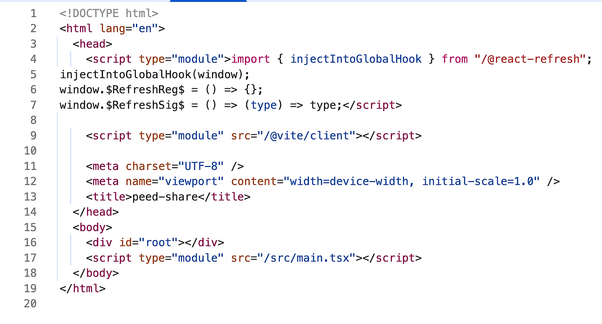
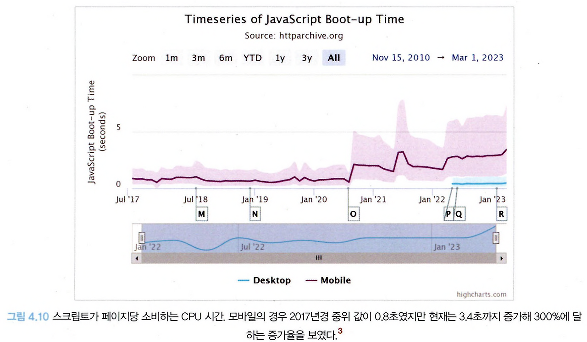
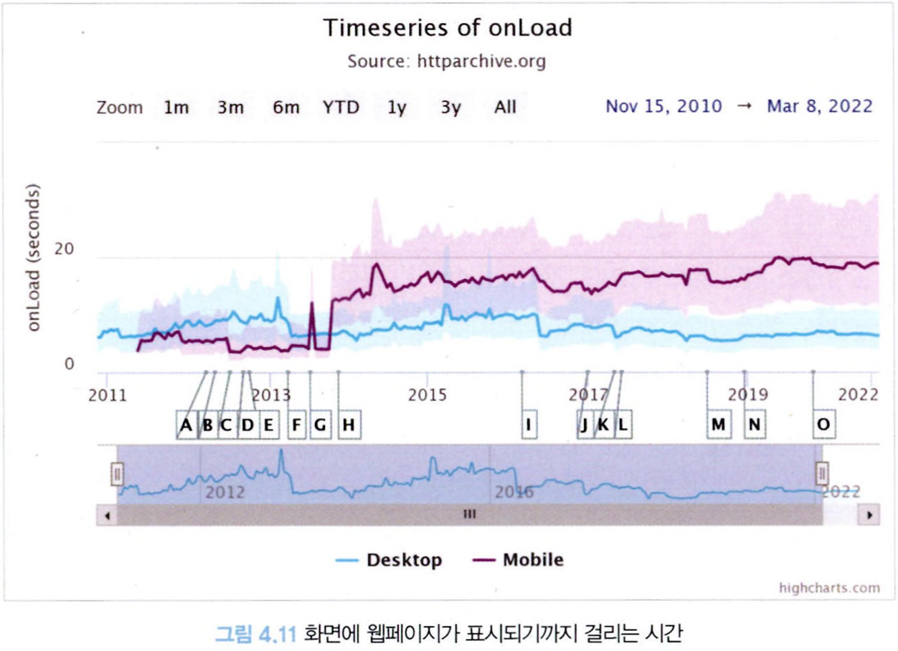
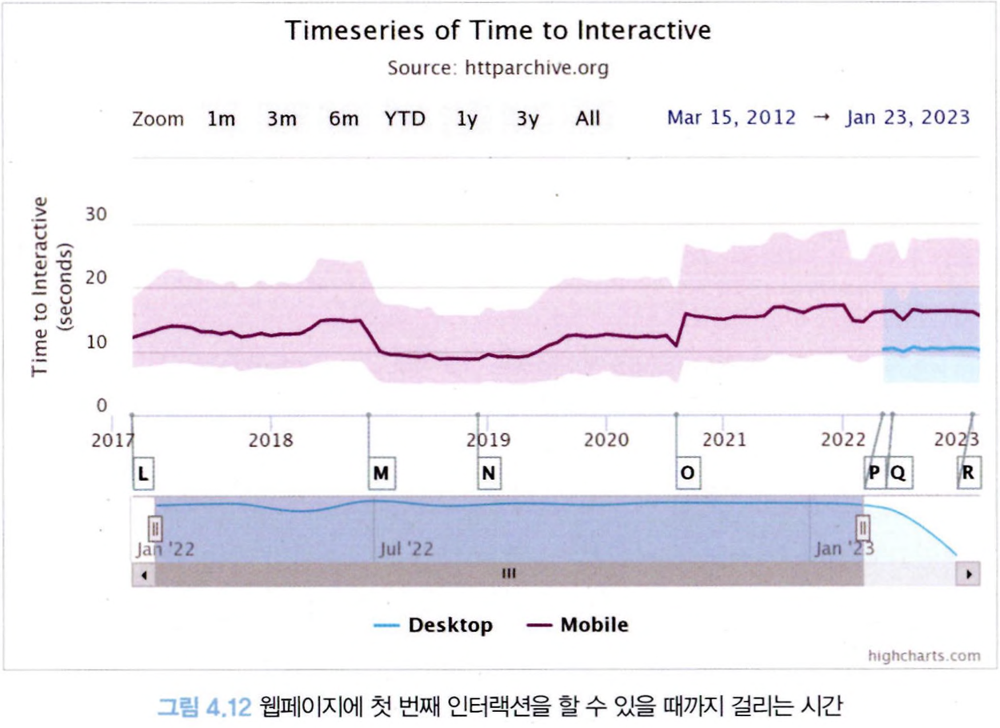
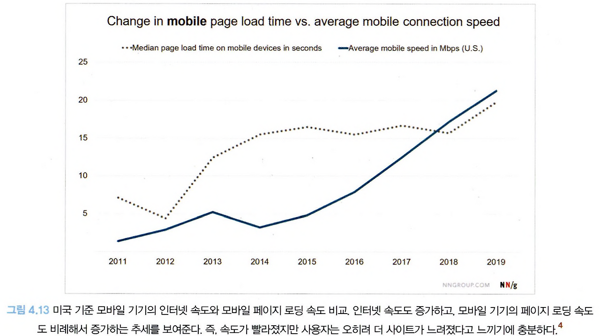
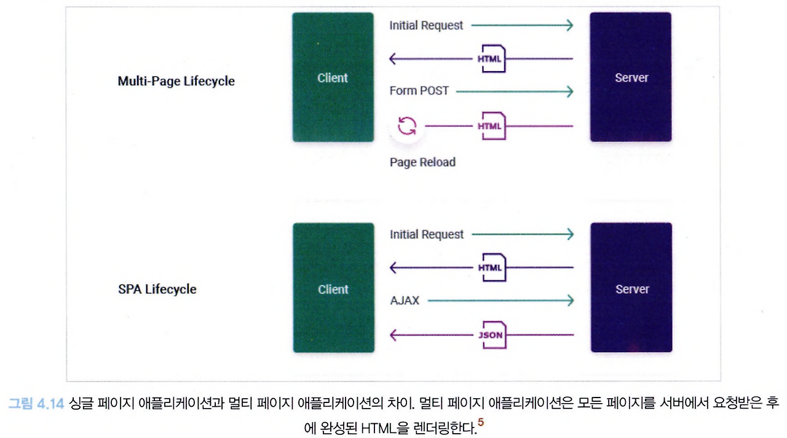

## 4.1 서버 사이드 렌더링이란?

#### 먼저 서버 사이드 렌더링 애플리케이션과 반대되는 개념인 **싱글 페이지 애플리케이션**에 대해 먼저 살펴보자.

### 싱글 페이지 애플리케이션(Single Page Application)이란?

싱글 페이지 애플리케이션이란 렌더링과 라우팅에 필요한 대부분의 기능을 서버가 아닌 **브라우저의 자바스크립트에 의존하는 방식**을 의미한다.

최초에 첫 페이지에서 데이터를 모두 불러온 이후에는 페이지 전환을 위한 모든 작업이 자바스크립트와 브라우저의 history.pushState와 history.replaceState로 이뤄지기 때문에 페이지를 불러온 이후에는 서버에서 HTML을 내려받지 않고 **하나의 페이지에서 모든 작업을 처리**하므로 싱글 페이지 애플리케이션이라고 한다.

SPA의 HTML 코드를 크롬의 소스 보기로 캡처한 모습

- 분명히 이 사이트에 접속하면 전체 사이트를 모두 볼 수 있지만 실제로 소스 보기로 HTML 코드를 봤을 때는<body>내부에 아무런 내용이 없다.
- 이는 사이트 렌더링에 필요한 내부의 내용을 모두 자바스크립트 코드로 삽입한 이후에 렌더링하기 때문이다.
- 페이지 전환 시에도 새로운 HTML 페이지를 요청하는 게 아니라 자바스크립트에서 다음 페이지의 렌더링에 필요한 정보만 HTTP 요청 등으로 가져온 다음, 그 결과를 바탕으로 내부에 DOM을 추가, 수정, 삭제하는 방법으로 페이지가 전환된다.

즉, 최초에 서버에서 최소한의 데이터를 불러온 이후부터는 이미 가지고 있는 자바스크립트 리소스와 브라우저 API를 기반으로 모든 작동이 이뤄진다.

이러한 작동 방식은 최초에 로딩해야 할 자바스크립트 리소스가 커지는 단점이 있지만 한번 로딩된 이후에는 서버를 거쳐 필요한 리소스를 받아올 일이 적어지기 때문에 사용자에게 훌륭한 UI/UX를 제공한다는 장점이 있다.

---

#### 싱글 페이지 렌더링 방식의 유행과 JAM 스택의 등장

PHP 시절, 웹 애플리케이션을 만들기 위해서는 자바스크립트 외에도 신경 쓸 것이 많았지만 SPA에서는 단지 브라우저 내부에서 작동하는 자바스크립트만 잘 작성하면 문제없다.

즉, 프런트엔드 개발자들에게 좀 더 간편한 개발 경험을 제공했고, 더욱 간편하게 웹 애플리케이션을 만들 수 있다는 장점이 있다. 이러한 장점과 시대적인 요구로 많은 SPA가 개발되기 시작했다.

이러한 SPA의 유행으로 인해 새롭게 생겨난 용어가 있으니 바로 **JAM 스택**이다.

과거에는 **LAMP 스택**, 즉 Linux(운영체제), Apache(서버), MySQL(데이터베이스), PHP/Python 등(웹 프레임워크)으로 구성돼 있었다.

LAMP 스택은 매우 인기 있는 웹 개발 구조이면서 동시에 어쩔 수 없는 선택이었다. 과거에는 자바스크립트에서 할 수 있는 일이 제한적이었기 때문에 대부분의 처리를 서버에서 해야만 했다.

이러한 서버 의존적인 문제는 웹 애플리케이션의 확장성에도 걸림돌로 작용했는데, 웹 애플리케이션의 기능이 다양해지거나 사용자가 늘어나면 이와 동시에 서버도 확장해야 했지만 클라우드의 개념이 부족했던 이 당시에는 서버를 확장하는 것이 매우 번거로웠다.

그리하여 앞서 언급한 프레임워크의 등장으로 등장한 것이 바로 **JAM(JavaScript, API, Markup) 스택**이다.

대부분의 작업을 자바스크립트에서 수행할 수 있었기 때문에 프런트엔드는 자바스크립트와 마크업（HTML, CSS）을 미리 빌드해 두고 정적으로 사용자에게 제공하면 이후 작동은 모두 사용자의 클라이언트에서 실행되므로 서버 확장성 문제에서 좀 더 자유로워질 수 있게 됐다.

JAM 스택의 인기와 Node.js의 고도화에 힘입어 **MEAN**(MongoDB, Express.js, AngularJS, Node.js) 이나 **MERN**(MongoDB, Expresses, React, Node.js) 스택처럼 아예 API 서버 자체도 자바스크립트로 구현하는 구조가 인기를 끌기 시작했다.

---

#### 새로운 패러다임의 웹서비스를 향한 요구

자바스크립트 코드의 규모도 점차 커지면서 이에 대해 우려의 목소리도 조금씩 나오기 시작했다.

다만 이 시기에 있었던 폭발적인 기술의 발전으로 이러한 문제가 자연스럽게 해결될 것이라 기대하기도 했었다.

인터넷 속도는 날이 갈수록 빨라졌고, 프로세서나 메모리 등 하드웨어 성능 또한 눈부시게 발전을 거듭했기 때문이다.

즉, 웹페이지를 불러오는 데 필요한 부담을 일정 부분 사용자에게 전가하더라도 사용자의 기기나 인터넷 환경이 더 빠르게 발전할 것이기 때문에 괜찮을 것이라는 기대감이 팽배했다.

그렇다면 웹페이지 속도는 얼마나 개선됐을까? 아래 3개의 데이터는 2017년부터 도표를 표시하고 있다.

**스크립트가 페이지당 소비하는 CPU 시간**

**화면에 웹페이지가 완전히 로딩되는 데 걸리는 시간**

- 모바일에서의 웹페이지 로딩은 여전히 20초 가까이 걸릴 정도로 오래 걸린다.

**사용자가 페이지에서 최초로 인터랙션이 가능해지기까지 걸리는 시간**

- 모바일에서 사용자가 웹페이지에서 어떠한 액션을 취하고 싶다면 약 15초 이상을 대기해야 한다.

물론 이 모든 것이 SPA의 탓은 것은 절대 아니다.

현재의 웹 애플리케이션은 정말 다양한 작업을 처리하고 있고, 심지어 하이브리드 애플리케이션의 형태로 앱 내부에서도 마치 웹처럼 구동되는 경우도 많다. 과거의 웹과 현재의 웹의 기능을 비교하면 정말 천지차이다.

그럼에도 중요한 사실 중 하나는 사용자의 기기와 인터넷 속도 등 웹 전반을 이루는 환경이 크게 개선됐음에도 실제 사용자들이 느끼는 웹 애플리케이션의 로딩 속도는 5년 전이나 지금이나 크게 차이가 없거나 오히려 더 느리다는 것이다.

웹 애플리케이션 개발자라면 이러한 웹 서비스의 성능을 역행하는 추세에 책임감을 가질 필요가 있다. "웹 개발 환경이 바뀌었다"라거나 "이전보다 웹에서 더 많은 작업을 처리한다"라는 사실만으로는 고객을 설득하기 어렵다.

웹사이트 방문자들은 참을성이 없기에 개발자들은 제품의 웹 서비스 환경에 대해 한 번 더 고민 할 때다.

---

### 서버 사이드 렌더링(Server Side Rendering)이란?

SPA가 자바스크립트를 활용해 하나의 페이지에서만 렌더링을 수행한다면, 서버 사이드 렌더링은 **최초에 시용자에게 보여줄 페이지를 서버에서 렌더링해 빠르게 사용자에게 화면을 제공**하는 방식을 의미한다.

앞서 언급했던, 웹 페이지가 점점 느려지는 상황에 대한 문제의식을 SPA의 태생적인 한계에서 찾고, 이를 개선하고자 서버에서 페이지를 렌더링해 제공하는 기존 방식의 웹 개발이 다시금 떠오르고 있다.

SPA와 서버에서 페이지를 빌드하는 서버 사이드 렌더링의 차이는 웹페이지 렌더링의 책임을 어디에 두느냐다.

**SPA는** 사용자에게 제공되는 **JS 번들**에서 렌더링을 담당하지만 **서버 사이드 방식**을 채택하면 렌더링에 필요한 작업을 모두 **서버에서 수행**한다.

구체적으로 서버 사이드 렌더링의 장단점을 살펴보자.

---

#### 서버 사이드 렌더링의 장점

**1\. 최초 페이지 진입이 비교적 빠르다.**

SSR은 사용자가 최초 페이지에 진입했을 때 페이지에 유의미한 정보가 그려지는 시간(First Contentful Paint)이 더 빨라질 수 있다.

최초에 사용자에게 보여줘야 할 화면에 표시할 정보가 외부 API 호출에 많이 의지해야 한다고 가정해 보자.

SPA는 사용자가 해당 페이지에 진입하고, JS 리소스를 다운로드하고, HTTP 요청을 수행한 이후에 이 응답의 결과를 가지고 화면을 렌더링한다.

하지만 일반적으로 서버에서 HTTP 요청을 수행하는 것이 더 빠르고, HTML을 그리는 작업도 서버에서 해당 HTML을 문자열로 미리 그려서 내려주는 것이 클라이언트에서 기존 HTML에 삽입하는 것보다 더 빠르다.

화면 렌더링이 HTTP 요청에 의존적이거나 렌더링해야 할 HTML의 크기가 커진다면 상대적으로 SSR이 더 빠를 수 있다.

**2\. 검색 엔진과 SNS 공유 등 메타데이터 제공이 쉽다.**

검색 엔진 최적화에 유용하다. 검색 엔진이 사이트에서 필요한 정보를 가져가는 과정을 보자.

1\. 검색 엔진 로봇(머신)이 페이지에 진입한다.

2\. 페이지가 HTML 정보를 제공해 로봇이 이 HTML을 다운로드한다. 단 다운로드만 하고 JS 코드는 실행하지 않는다.

3\. 다운로드한 HTML 페이지 내부의 오픈 그래프(Open Graph)나 메타(meta) 태그 정보를 기반으로 페이지의 검색(공유) 정보를 가져오고 이를 바탕으로 검색 엔진에 저장한다.

로봇은 페이지를 보는 것이 아닌 페이지의 정적인 정보를 가져오는 것이 목적이므로 JS를 다운로드하거나 실행할 필요가 없다.

SSR은 최초의 렌더링 작업이 서버에서 일어난다. 즉, 검색 엔진에 제공할 정보를 서버에서 가공해서 HTML 응답으로 제공할 수 있으므로 검색 엔진 최적화에 대응하기가 매우 용이하다.

**3\. 누적 레이아웃 이동(Cumulative Layout Shift)이 적다.**

> 누적 레이아웃 이동❓🧐  
> 사용자에게 페이지를 보여준 이후에 뒤늦게 어떤 HTML 정보가 추가되거나 삭제되어 마치 화면이 덜컥거리는 것과 같은 부정적인 사용자 경험

화면 전체에 기사 내용이 있고, 중간에 가로로 긴 배너가 있는 신문 기사 사이트가 있다고 가정해보자.

기사(글)의 로딩은 빨리 이뤄져서 화면에 먼저 노출되고 있는데, 갑작스럽게 뒤늦게 배너가 로딩된다면 배너의 크기만큼 글 영역이 밀리면서 사용자에게 불편을 초래할 것이다.

SPA는 페이지 콘텐츠가 API 요청에 의존하고, API 요청의 응답 속도가 제각각이며, 이를 적절히 처리해두지 않는다면 이러한 누적 레이아웃 이동 문제가 발생할 수 있다.

반면 SSR은 요청이 완전히 완료된 이후에 완성된 페이지를 제공하므로 이러한 문제에서 비교적 자유롭다.

하지만 누적 레이아웃 이동을 해결하기 위해 SSR을 사용해도 이런 문제에서 완전히 자유롭지는 못한다. useEffect는 클라이언트에서 컴포넌트가 마운트된 이후에 실행되므로 SSR이나 SPA에서 모두 문제의 소지가 있다.

또한 API 속도가 모두 달랐을 때, SSR은 모든 요청이 완료되기 전까지 페이지가 렌더링되지 않을 것이므로 최초 페이지 다운로드가 굉장히 느려질 수도 있다.

그러나 이는 리액트 18에서 등장한 스트림으로 인해 해결될 수도 있다.

**4\. 사용자의 디바이스 성능에 비교적 자유롭다.**

자바스크립트 리소스 실행은 사용자의 디바이스에서만 실행되므로 절대적으로 사용자 디바이스 성능에 의존적이다.

그러나 SSR을 수행하면 이러한 부담을 서버에 나눌 수 있으므로 사용자의 디바이스 성능으로부터 조금 더자유로워질 수 있다.

하지만 이 또한 절대적인 것은 아니다. 인터넷 속도가 느리다면 어떠한 방법론을 쓰든 느릴 것이고, 사용자 방문이 폭증해 서버에 부담이 가중된다면, 그리고 이를 위한 적절한 처리가 수반돼 있지 않다면 SSR도 충분히 느려질 수 있다.

**5\. 보안에 좀 더 안전하다.**

브라우저의 개발자 도구를 사용하면 웹사이트에서 일어나는 거의 대부분의 작업을 파악할 수 있다.

API 호출과 인증 같이 사용자에게 노출되면 안 되는 민감한 작업도 포함되므로 정상적인 비즈니스 로직을 거치지 않은 상황에서 인증이나 API가 호출되는 것을 항상 방지해야 한다.

반면 SSR의 경우 인증 혹은 민감한 작업을 서버에서 수행하고 그 결과만 브라우저에 제공해 이러한 보안 위협을 피할 수 있다는 장점이 있다.

---

#### 서버 사이드 렌더링의 단점

**1\. 소스코드를 작성할 때 항상 서버를 고려해야 한다.**

SSR은 서버 환경에 대한 고려가 필요하다. 가장 큰 문제는 브라우저 전역 객체인 window 또는 sessionstorage와 같이 브라우저에만 있는 전역 객체 등이다.

서버에서도 실행될 가능성이 있는 코드라면 window에 대한 접근을 최소화해야 하고, window 사용이 불가피하다면 해당 코드가 서버 사이드에서 실행되지 않도록 처리해야 한다.

외부에서 의존하고 있는 라이브러리도 마찬가지다. 해당 라이브러리가 마찬가지로 서버에 대한 고려가 돼 있지 않다면 다른 대안을 찾거나 클라이언트에서만 실행될 수 있도록 처리해야 한다.

**2\. 적절한 서버가 구축돼 있어야 한다.**

SSR은 말 그대로 사용자의 요청을 받아 렌더링을 수행할 서버가 필요하다.

서버를 구축하는 것은 절대 쉬운 일이 아니다. 사용자의 요청에 따라 적절하게 대응할 수 있는 물리적인 가용량을 확보해야 하고, 때로는 예기치 않은 장애 상황에 대응할 수 있도록 복구 전략도 필요하다. 또한 요청을 분산시키고, 프로세스가 예기치 못하게 다운될 때를 대비해 PM2와 같은 프로세스 매니저의 도움도 필요하다.

실제로 프로덕션 SSR 애플리케이션을 운영해 본 경험이 있다면 쿠버네티스 같은 여러 가지 라이브러리와 도구의 도움을 얻더라도 절대 쉽지 않은 일이라는 것을 알 것이다.

**3\. 서비스 지연에 따른 문제**

SPA에서 무언가 느린 작업이 있다고 해보자.

그래도 최초에 어떤 화면이라도 보여준 상태에서 무언가 느린 작업이 수행되기 때문에 '로딩 중...'과 같이 작업이 진행 중임을 적절히 안내한다면 충분히 사용자가 기다릴 여지가 있다.

반면 SSR은 지연 작업이 최초 렌더링에 발생한다면 큰 문제가 된다.

서버에서 사용자에게 보여줄 페이지에 대한 렌더링 작업이 끝나기까지는 사용자에게 그 어떤 정보도 제공할 수 없다.

애플리케이션의 규모가 커지고 작업이 복잡해지고, 이에 따라 다양한 요청에 얽혀있어 병목 현상이 심해진다면 때로는 SSR이 더 안 좋은 사용자 경험을 제공할 수도 있다.
