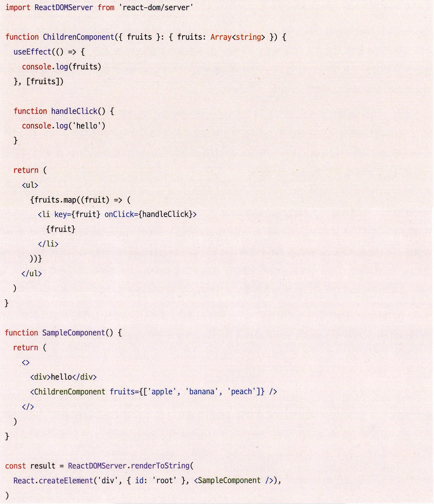
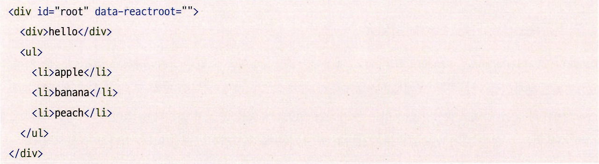
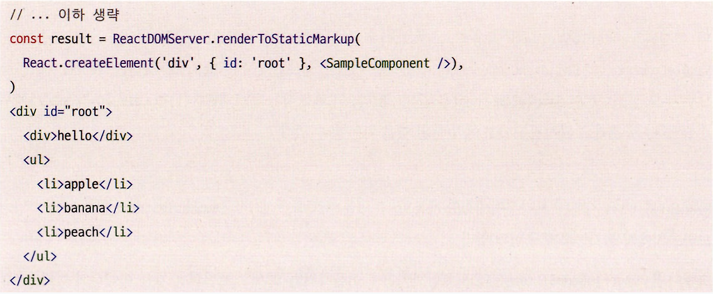
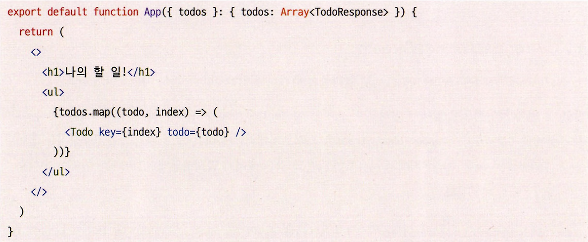
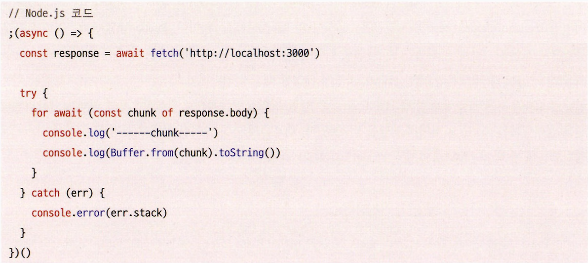
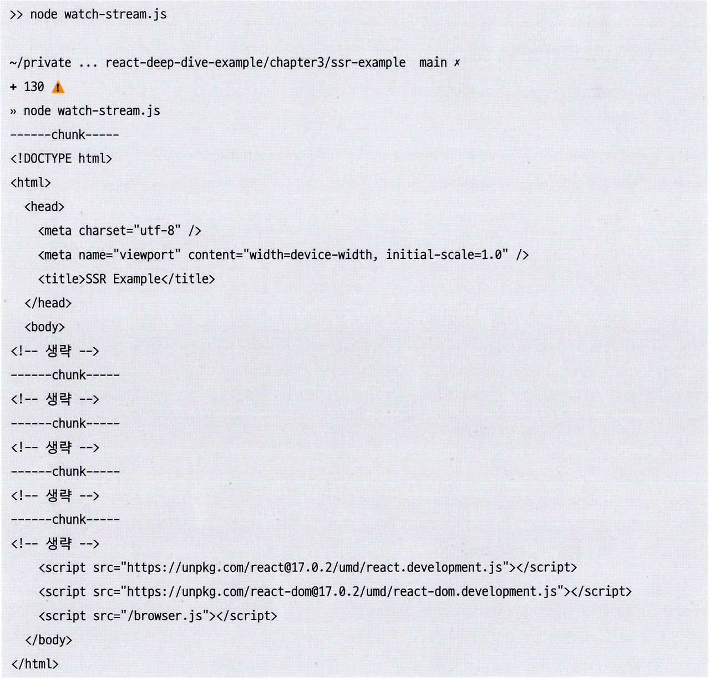
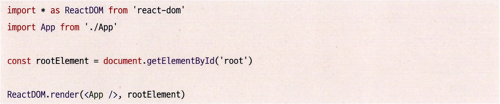
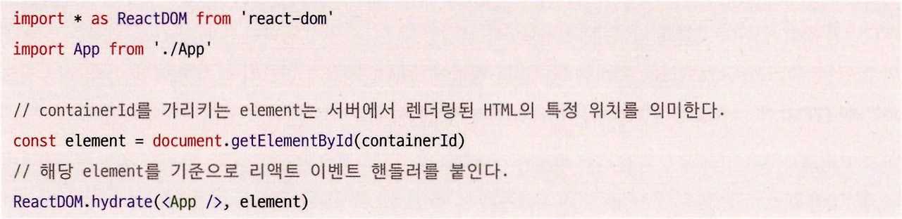
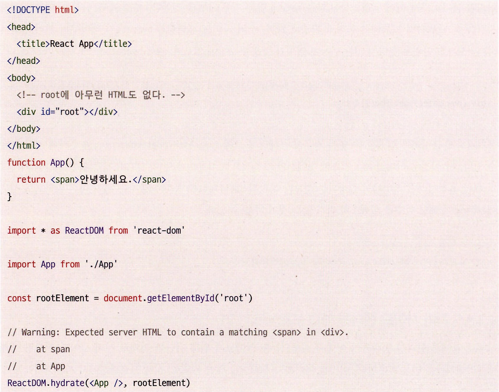

## 4.2 서버 사이드 렌더링을 위한 리액트 API 살펴보기

리액트는 애플리케이션을 브라우저의 window 환경이 아닌 Node.js와 같은 서버 환경에서만 실행할 수 있는 API도 제공한다.
​
API를 확인해 보려면 리액트 저장소의 react-dom/server.js를 확인하면 된다. 여기에 있는 함수들이 무엇인지, 또 어떤 역할을 하는지 하나씩 살펴보자.

---

### renderToString

인수로 넘겨받은 리액트 컴포넌트를 렌더링해 HTML 문자열로 반환하는 함수다.
​
SSR을 구현하는 데 가장 기초적인 API로, SSR에서 **최초의 페이지를 HTML로 먼저 렌더링**한다고 했는데 바로 **그 역할을 하는 함수가 renderToString**이다.
​


- 위 result는 다음과 같은 문자열을 반환한다.



- renderToString을 사용해 실제 브라우저가 그려야 할 HTML 결과로 만들어 낸 모습이다.
- SampleComponent와 ChildrenComponent는 일반적인 리액트 컴포넌트이고, ReactDOMServer.renderToString으로 부모 컴포넌트인 SampleComponent를 렌더링했다.
- 이 렌더링은 루트 컴포넌트인 <div id="root"/>에서 수행됐다. 그 결과로 완성된 HTML이 반환된 것을 확인할 수 있다.

여기서 한 가지 눈여겨볼 것은 ChildrenComponent에 있는 useEffect와 같은 혹과 handleClick과 같은 **이벤트 핸들러는 결과물에 포함되지 않았다.**

renderToString은 **인수로 주어진 컴포넌트를 기준으로 빠르게 브라우저가 렌더링할 수 있는 HTML을 제공하는 데 목적이 있는 함수**라 클라이언트에서 실행되는 자바스크립트 코드를 포함시키거나 렌더링하는 역할까지 해주지는 않는다.

renderToString을 통해 서버 사이드의 이점, 먼저 완성된 HTML을 서버에서 제공할 수 있으므로 **초기 렌더링에서 뛰어난 성능**을 보일 것이다.

또한 검색 엔진이나 SNS 공유를 위한 메타 정보도 미리 준비한 채로 제공할 수 있으므로 SPA 구조보다 손쉽게 완성할 수 있을 것이다.

중요한 사실은 **리액트의 서버 사이드 렌더링은 단순히 '최초 HTML 페이지를 빠르게 그려주는데'에 목적**이 있다는 것이다.

완성된 HTML을 빠르게 볼 수는 있지만 useEffect나 이벤트 핸들러가 없는 것처럼, **사용자와 인터랙션할 준비가 되기 위해서는 이와 관련된 자바스크립트 코드를 모두 다운로드, 파싱, 실행**하는 과정을 거쳐야 한다.

마지막으로 주목할 것은 div#root에 존재하는 속성인 **data-reactroot**다. 이 속성은 리액트 컴포넌트의 **루트 엘리먼트가 무엇인지 식별**하는 역할을 한다.

이후에 자바스크립트를 실행하기 위한 **hydrate 함수에서 루트를 식별하는 기준점**이 된다.

리액트로 만들어진 애플리케이션을 보면 리액트의 루트 엘리먼트에 data-reactroot 속성이 있는 것을 확인할 수 있다.

---

### renderToStaticMarkup

renderToString과 매우 유사한 함수다. 한 가지 차이점은 앞서 루트 요소에 추가한 **data-reactroot와 같은 리액트에서만 사용하는 추가적인 DOM 속성을 만들지 않는다.**

리액트에서만 사용하는 속성을 제거하면 결과물인 HTML의 크기를 아주 약간이라도 줄일 수 있다.


- 앞선 예제에서 renderToStaticMarkup으로만 바꿔서 실행한 결과, 리액트와 관련된 코드인 data-reactroot가 사라진 완전히 순수한 HTML 문자열이 반환된다.

이 함수를 실행한 결과로 렌더링을 수행하면 클라이언트에서는 리액트에서 제공하는 **useEffect와 같은 브라우저 API를 절대로 실행할 수 없다.**

renderToStaticMarkup의 결과물을 기반으로 리액트의 자바스크립트 이벤트 리스너를 등록하는 hydrate를 수행하면 서버와 클라이언트의 내용이 맞지 않다는 에러가 발생한다.

renderToStaticMarkup의 결과물은 **hydrate를 수행하지 않는다는 가정하에** **순수한 HTML만 반환**하기 때문이다.

결과적으로 hydrate를 수행해도 브라우저에서 클라이언트에서 완전히 새롭게 렌더링하게 된다.

즉, 리액트의 **이벤트 리스너가 필요 없는 완전히 순수한 HTML을 만들 때만 사용**되며 블로그 글이나 상품의 약관 정보와 같이 아무런 브라우저 액션이 없는 정적인 내용만 필요한 경우에 유용하다.

---

### renderToNodeStream

renderToString과 결과물이 완전히 동일하지만 두 가지 차이점이 있다.

1.  Node.js 환경에 의존하고 있어서 **브라우저에서 사용하는 것이 완전히 불가능**하다.
2.  renderToString은 결과물이 string이지만, **renderToNodeStream의 결과물은 Node.js의 ReadableStream**이다.

- ReadableStream은 utf-8로 인코딩된 바이트 스트림으로, **Node.js 환경에서만 사용할 수 있다**. 궁극적으로 브라우저가 원하는 결과물, 즉 string을 얻기 위해서는 추가적인 처리가 필요하다.
- ReadableStream 자체는 브라우저에서도 사용할 수 있는 객체지만, **이를 만드는 과정이 브라우저에서 불가능**하게 구현돼 있다.

그렇다면 renderToNodeStream은 왜 필요할까? 먼저 **스트림**의 개념을 이해해야 한다.

> 스트림이란❓🧐  
> 큰 데이터를 다룰 때 데이터를 청크(chunk, 작은 단위)로 분할해 조금씩 가져오는 방식을 의미한다.

유튜브와 같이 웹에서 동영상을 보는 상황에서 우리는 영상을 보기 위해 전체 영상을 모두 다운로드할 때까지 기다리지 않는다. 볼 수 있는 몇 초라도 먼저 다운로드되면 그 부분을 먼저 보여주고, 이후에 계속해서 영상을 다운로드한다.

renderToString이 생성하는 HTML 결과물의 크기가 작다면 굳이 여러 번에 걸쳐 나눠서 만들 필요가 없다.

그러나 생성해야 하는 HTML의 크기가 매우 크다면, 큰 문자열을 한번에 메모리에 올려두고 응답을 수행해야 해서 Node.js가 실행되는 서버에 큰 부담이 될 수 있다.

대신 스트림을 활용하면 이러한 큰 크기의 데이터를 청크 단위로 분리해 순차적으로 처리할 수 있다는 장점이 있다.


- todos를 순회하며 렌더링하는데, todos가 엄청나게 많다고 가정해 보자. renderToString은 이를 모두 한 번에 렌더링하려고 하기 때문에 시간이 많이 소요될 것이다.

그러나 이를 renderToNodeStream으로 렌더링하면 다음과 같은 차이를 볼 수 있다.



- 응답으로 오는 HTML이 여러 청크로 분리돼 내려오는 것을 볼 수 있다.
- renderToString을 사용했다면 HTTP 응답은 거대한 HTML 파일이 완성될 때까지 기다려야 한다.
- 그러나 스트림을 활용한다면 브라우저에 제공해야 할 큰 HTML을 작은 단위로 쪼개 연속적으로 작성함으로써 리액트 애플리케이션을 렌더링하는 Node.js 서버의 부담을 덜 수 있다.

대부분의 널리 알려진 리액트 서버 사이드 렌더링 프레임워크는 모두 renderToString 대신 renderToNodeStream을 채택하고 있다.

---

### renderToStaticNodeStream

renderToString에 renderToStaticMarkup이 있다면 renderToNodeStream에는 renderToStaticNodeStream이 있다.

renderToNodeStream과 제공하는 결과물은 동일하나, renderToStaticMarkup과 마찬가지로 **리액트 자바스크립트에 필요한 리액트 속성이 제공되지 않는다.**

마찬가지로 hydrate를 할 필요가 없는 순수 HTML 결과물이 필요할 때 사용하는 메서드다.

---

### hydrate

renderToString과 renderToNodeStream으로 생성된 HTML 콘텐츠에 **자바스크립트 핸들러나 이벤트를 붙이는 역할**을 한다.

renderToString의 결과물은 단순히 서버에서 렌더링한 HTML 결과물로 사용자에게 무언가 보여줄 수 있지만, 사용자가 페이지와 인터랙션하는 것은 불가능하다.

hydrate는 이처럼 정적으로 생성된 HTML에 이벤트와 핸들러를 붙여 완전한 웹페이지 결과물을 만든다.

hydrate에 대해 설명하기에 앞서 hydrate와 비슷한 브라우저에서만 사용되는 메서드인 **render**를 먼저 살펴보자.


- render 함수는 컴포넌트와 HTML의 요소를 인수로 받는다.
- 인수로 받은 두 정보를 바탕으로 HTML의 요소에 해당 컴포넌트를 렌더링하며, 여기에 이벤트 핸들러를 붙이는 작업까지 모두 한 번에 수행한다.

render는 클라이언트에서만 실행되는, **렌더링과 이벤트 핸들러 추가 등 리액트를 기반으로 한 온전한 웹페이지를 만드는 데 필요한 모든 작업을 수행**한다.

이제 hydrate를 살펴보자. render와 인수를 넘기는 것이 거의 유사하다.


- render와의 차이점은 **hydrate는 기본적으로 이미 렌더링된 HTML이 있다는 가정하에 작업이 수행**되고, 이 **렌더링된 HTML을 기준으로 이벤트를 붙이는 작업만 실행**한다.

만약 hydrate의 두 번째 인수로 renderToStaticMarkup 등으로 생성된, 리액트 관련 정보가 없는 순수한 HTML 정보를 넘겨주면 어떻게 될까?


- 서버에서 제공받은 HTML에 App 컴포넌트에 있는 <span/>이 있기를 기대했지만 이 요소가 없다는 경고 문구가 출력된다.
- rootElement 내부에는 **<App/>을 렌더링한 정보가 이미 포함돼 있어야만 hydrate를 실행할 수 있는 것**이다.
- 따라서 hydrate로 넘겨준 **두 번째 인수**에는 이미 **renderToString 등으로 렌더링된 정적인 HTML 정보가 반드시 담겨 있어야 한다**. 아무것도 없는 빈 HTML에 이 정보를 렌더링하는 render와의 차이점이 바로 이것이다.

비록 서버에서 렌더링한 정보가 없어서 경고가 노출됐음에도 불구하고, 리액트는 이 함수를 통해 정상적으로 웹페이지를 만든다.

이는 hydrate 작업이 단순히 이벤트나 핸들러를 추가하는 것 이외에도 렌더링을 한 번 수행하면서 hydrate가 수행한 렌더링 결과물 HTML과 인수로 넘겨받은 HTML을 비교하는 작업을 수행하기 때문이다.

여기서 발생한 불일치가 바로 에러의 원인이며, 불일치가 발생하면 hydrate가 렌더링한 기준으로 웹페이지를 그리게 된다.

하지만 이렇게 렌더링을 하는 것은 사실상 서버와 클라이언트에서 두 번 렌더링을 하게 되고, 결국 서버 사이드 렌더링의 장점을 포기하는 것이기 때문에 반드시 고쳐야 하는 문제다.

**위 내용에서 확실히 알아야 할 것은❗️🤩**

**hydrate는 클라이언트에서 실행**된다는 점이다.

서버에서 미리 렌더링된 HTML에 data-reactroot가 없다면 hydrate 함수에서 루트를 식별하지 못하기때문에,

서버에서 렌더링된 <App />이 없다고 판단하여, hydrate가 리액트의 가상 돔에서 렌더링한 첫번째 인수 <App /> 컴포넌트에 대한 결과와 다르다고 판단할 것이고,

그럼에도 불구하고 hydrate가 렌더링한 결과로 최종 브라우저에 렌더링 될 것이기 때문에, 결국 서버 사이드 렌더링의 이점이 모두 없어지니 이를 잘 유의해서 사용하자!

하지만 불가피하게 이러한 결과물이 다를 수밖에 없는 경우도 있을 것이다.

예를 들어, HTML 내부에 현재 시간을 초 단위까지 기록해야 한다고 가정해 보자.

서버 사이드 렌더링과 hydrate가 제아무리 빨리 끝난다 하더라도 1초 단위로 끝나지 않는 이상 불일치가 발생할 수밖에 없으며, 결국 hydrate는 에러를 발생시킨다.

```jsx
// <!-- Warning: Text content did not match. Server: ”1676461135828” Client: "1676461137621" -->

<div>{new Date().getTime()}</div>
```

- 이런 경우에는 해당 요소에 suppressHydrationWarning을 추가해 경고를 끌 수 있다.

```jsx
// <!-- 아무런 에러가 발생하지 않는다. -->
<div suppressHydrationWarning>{new Date().getTime()}</div>
```

- 단 이것은 어디까지나 필요한 곳에서만 제한적으로 사용해야 한다.
- HTML에 정확한 시간을 기록하기 위한 목적이라면 서버에서 실행되는 것보다 차라리 useEffect를 통해 노출하는 편이 더 정확하므로 서버에서는 굳이 해당 함수를 실행조차 하지 않는 것이 나을 수 있다.
