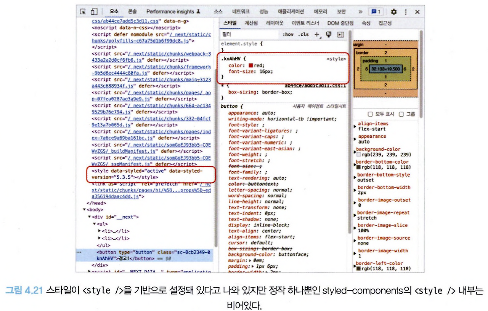

## 4.3 Next.js 톺아보기

리액트 서버 사이드 렌더링 프레임워크로 가장 많은 인기를 얻고 있는 Next.js를 살펴보자.

설명은 pages router를 기준으로 한다.

### `pages/_app.tsx`

default export로 내보낸 함수는 애플리케이션의 전체 페이지의 시작점이다.

웹 애플리케이션에서 공통으로 설정해야 하는 것들을 여기에서 실행할 수 있다.

`_app.tsx`에서 할 수 있는 내용은 다음과 같다.

1.  에러 바운더리를 사용해 애플리케이션 전역에서 발생하는 에러 처리
2.  reset.css 같은 전역 CSS 선언
3.  모든 페이지에 공통으로 사용 또는 제공해야 하는 데이터 제공 등

여기서 서버 사이드 프레임워크의 특징을 확인할 수 있다.

`_app.tsx`의 `render()` 내부에 `console.log()`를 추가해서 아무 메시지나 기록해 보자.

그리고 페이지를 새로고침하면 해당 로그가 브라우저 콘솔창이 아닌 Next.js를 실행한 터미널에 기록된다.

또 여기에서 페이지를 전환하면 더 이상 서버에서 로깅되지 않고 브라우저에 로깅된다.

이러한 사실로 미뤄 봤을 때 최초에는 서버 사이드 렌더링을, 이후에는 클라이언트에서 `_app.tsx`의 렌더링이 실행된다는 것을 짐작할수 있다.

---

### pages/\_document.tsx

애플리케이션의 HTML을 초기화하는 곳이다. `_app.tsx`와 다음과 같은 몇 가지 차이점이 있다.

- `<html>`이나 `<body>`에 DOM 속성을추가하고 싶다면 `_document.tsx`를 사용한다.
- \_document는 무조건 서버에서 실행된다. 따라서 이 파일에서 onClick과 같은 이벤트 핸들러를 추가하는 것은 불가능하다. 이벤트를 추가하는 것은 클라이언트에서 실행되는 hydrate의 몫이기 때문이다.
- Next.js에는 두 가지 `<head>`가 존재하는데 하나는 `next/document`에서 제공하는 head이고, 다른 하나는 `next/head`에서 기본적으로 제공하는 head가 있다.
  - 브라우저의 `<head/>`와 동일한 역할을 하지만 `next/document`는 오직 `_document.tsx`에서만 사용할 수 있다.
  - next/head는 페이지에서 사용할 수 있으며, SEO에 필요한 정보나 title 등을 담을 수 있다.
  - 또한 `next/document`의 `<Head/>` 내부에서는 `<title/>`을 사용할 수 없다.
  - 웹 애플리케이션에 공통적인 제목이 필요하면 `_app.tsx`에, 페이지별 제목이 필요하다면 페이지 파일 내부에서 `next/head`를 사용하면 된다.
- `getServerSideProps, getStaticProps` 등 서버에서 사용 가능한 데이터 불러오기 함수를 사용할 수 없다.
- CSS-in-JS의 스타일을 서버에서 모아 HTML로 제공하는 작업을 할 수 있다.

`_app.tsx`는 Next.js를 초기화하는 파일로, Next.js 설정과 관련된 코드를 모아두는 곳이며, 경우에 따라 서버와 클라이언트 모두에서 렌더링될 수 있다.

`_document.tsx`는 Next.js로 만드는 웹사이트의 뼈대가 되는 HTML 설정과 관련된 코드를 추가하는 곳이며, 반드시 서버에서만 렌더링된다.

---

### pages/\_error.tsx


- 에러 페이지는 위와 같이 클라이언트에서 발생하는 에러 또는 서버에서 발생하는 500 에러를 처리할 목적으로 만들어졌다.
- Next.js 프로젝트 전역에서 발생하는 에러를 적절하게 처리하고 싶다면 이 페이지를 활용하면 된다.
- 단, 개발 모드에서는 이 페이지에 방문할 수 없고 에러가 발생하면 Next.js가 제공하는 개발자 에러 팝업이 나타나게 된다.
  - 이 페이지가 잘 작동하는지 확인하려면 프로덕션으로 빌드해서 확인해 봐야 한다.

---

### pages/404.tsx

- 404 페이지를 정의할 수 있는 파일이다.
- 만들지 않으면 Next.js에서 제공하는 기본 404 페이지를 볼 수 있고, 원하는 스타일의 404 페이지를 이곳에서 만들 수 있다.

---

### pages/500.tsx

서버에서 발생하는 에러를 핸들링하는 페이지다. \_error.tsx와 500.tsx가 모두 있다면 500.tsx가 우선적으로 실행된다.

마찬가지로 500이나 error 페이지가 없다면 기본적으로 Next.js에서 제공하는 페이지를 볼 수 있다.

---

### pages/index.tsx

앞서 소개한 페이지들은 Next.js에서 제공하는 예약어로 관리되는 페이지라면 지금부터는 개발자가 자유롭게 명칭을 지정해 만들 수 있는 페이지다.

Next.js의 라우팅 구조는 다음과 같이 /pages 디렉터리를 기초로 구성되며, 각 페이지에 있는 default export로 내보낸 함수가 해당 페이지의 루트 컴포넌트가 된다.

- /pages/index.tsx: 웹사이트의 루트이며, localhost:3000과 같은 루트 주소를 의미한다.
- /pages/hello.tsx: 파일명이 주소가 된다. localhost:3000/hello로 접근할 수 있다.
- `/pages/hello/[greeting].tsx`: `[]`의 의미는 여기에 어떠한 문자도 올 수 있다는 뜻이다.
  - 서버 사이드에서 greeting이라는 변수에 사용자가 접속한 주소명이 오게 된다.
  - localhost:3000/hello/1, localhost:3000/hello/greeting 모두 유효하다. gretting 변수에는 각각 1, greetting이라는 값이 들어온다.
  - 만약 /pages/hello/world.tsx와 같이 이미 정의된 주소가 있다면 미리 정의해 둔 주소가 우선이다.
- `/pages/hi/[...props].tsx`: 전개 연산자와 동작이 동일하다. /hi를 제외한 /hi 하위의 모든 주소가 여기로 온다.
  - localhost:3000/hi/hello, localhost:3000/hi/hello/world 등이 여기로 오게 된다.
  - 그리고 이 `[...props]` 값은 props라는 변수에 배열로 오게 된다.

그렇다면 `[]`의 변수로 지정된 값은 어떻게 사용할 수 있는 것일까?


- 위 페이지를 다음과 같은 주소로 접근하면 props에 다음과 같은 값이 담기게 된다.
  - `/hi/1: ['1']`
  - `/hi/1/2: ['1', '2']`
  - `/hi/1/2/3: ['1', '2', '3']`
  - `/hi/my/name/is: ['my', 'name', 'is']`

주소에 숫자를 입력했다고 해서 숫자로 형변환되지 않음을 주의하자.

또 한 주소에 하나만 들어갔다 하더라도, string 1이 아닌 `string[]` `[1]`이 들어간다는 것을 염두하자.

`[...props]`와같이 전개 연산자로 선언한 모든주소는 배열로 들어간다.

---

### 서버 라우팅과 클라이언트 라우팅의 차이

Next.js는 SSR을 수행하지만 동시에 SPA과 같이 클라이언트 라우팅 또한 수행한다.

우선 Next.js는 SSR 프레임워크이기 때문에 최초 페이지 렌더링이 서버에서 수행된다. 페이지에 있는 루트 컴포넌트에 console.log를 사용해 기록해 보면 알수 있다.


- localhost:3000/hello를 방문해 보면 콘솔 문구가 실행한 서버에서 기록되며,window가 undefined이기 때문에 '서버'라는 문자열이 기록된다.


- next/link는 Next.js에서 제공하는 라우팅 컴포넌트이며, `<a/>` 태그와 비슷한 동작을 한다.

각 링크를 클릭해서 이동해 차이점을 살펴보자. 전자와 후자를 반복해서 클릭하다 보면 전자는 잠시 깜빡인 이후에 페이지 라우팅을 하지만 후자는 매우 매끄럽게 SPA처럼 라우팅된다.

#### `<a/>` 태그


- hello라는 이름의 문서를 요청하고 있으며, 이후에는 webpack, framework, main, hello 등 페이지를 만드는 데 필요한 모든 리소스를 처음부터 다 가져온다.
- 또한 렌더링이 어디에서 일어났는지 판단하기 위한 console.log도 서버와 클라이언트에 각각 동시에 기록된다.
  - 즉, 서버에서 렌더링을 수행하고, 클라이언트에서 hydrate하는 과정에서 한 번 더 실행됐다는 것을 알 수 있다.

#### `<Link>` 태그


- 네트워크에 hello.js만 존재하며, 나머지 어떠한 요청도 없다. hello.js를 살펴보자.  
  

- 클라이언트에 로깅을 하기 위해 남긴 console.log가 존재한다.
- 즉, hello.js는 hello 페이지를 위한 자바스크립트이고, next/link로 이동하는 경우 SSR이 아닌, 클라이언트에서 필요한 JS만 불러온 뒤 라우팅하는 클라이언트 라우팅/렌더링으로 동작한다.

Next.js는 SSR의 장점, 즉 사용자가 빠르게 볼 수 있는 최초 페이지를 제공한다는 점과 SPA의 장점인 자연스러운 라우팅이라는 두 가지 장점을 모두 살리기 위해 이러한 방식으로 작동한다는 것을 기억하자.

이러한 Next.js의 장점을 적극 살리기 위해서는 내부 페이지 이동 시 다음과 같은 규칙을 지켜야 한다.

- `<a>` 대신 `<Link>`를 사용한다.
- `window.location.push` 대신 `router.push`를 사용한다.

---

### 페이지에서 getServerSideProps를 제거하면 어떻게 될까?

앞의 /pages/hello 예제에서 getServerSideProps가 아무것도 하지 않고 있음에도 추가돼 있는 것이 의아하다.

만약 이 예제 파일에서 getServerSideProps를 제거하면 어떻게 작동할까?

```jsx
// pages/hello.tsx
export default function Hello() {
  console.log(typeof window === "undefined" ? "서버" : "클라이언트");
  return <>hello</>;
}
```

빌드한 뒤 실행해 보면 어떠한 방식으로 접근해도 `<a/>`, `<Link/>`에 상관없이 서버에 로그가 남지 않는데, 이유는 빌드 결과물에서 확인할 수 있다.

#### getServerSideProps가 있는 빌드


- 人표시가 돼 있어 서버 사이드에서 렌더링되는 페이지로 구분했다.

#### getServerSideProps 가 없는 빌드


- o로 서버 사이드 렌더링이 필요 없는, 빌드 시점에 미리 만들어도 되는 페이지로 간주해 버린다.
- typeof window === 'undefined' : '서버' : '클라이언트' 도 단순히 '클라이언트'로 축약돼 있음을 볼 수 있다.
  - 이는 getServerSideProps가 없으면 서버에서 실행하지 않아도 되는 페이지로 처리하고 typeof window의 처리를 모두 object로 바꾼 다음, 빌드 시점에 미리 트리쉐이킹을 하기 때문이다.

이처럼 Next.js는 SSR 프레임워크이지만 모든 작업이 서버에서 일어나는 것은 아니라는 점을 명심하자.

---

### /pages/api/hello.ts

/pages 하단에 api라고 작성된 디렉터리는 서버의 API를 정의하는 폴더다.

/pages/api/hello.ts는 /api/hello로 호출할 수 있으며, 이 주소는 다른 pages 파일과 다르게 HTML 요청을 하는 게 아니라 단순히 서버 요청을 주고받게 된다.


- 페이지와 마찬가지로 default export로 내보낸 함수가 실행되며 당연히 서버에서만 실행되기때문에 window나 document 등을 사용하면 에러가 발생한다.

서버에서 내려주는 데이터를 조합해 BFF(backend-for-frontend) 형태로 활용하거나, 완전한 풀스택 애플리케이션을 구축하고 싶을때, 혹은 CORS(Cross-Origin Resource Sharing) 문제를 우회하기 위해 사용될 수 있다.

---

### Data Fetching

Next.js에서는 SSR 지원을 위한 몇 가지 데이터 불러오기 전략이 있는데, Next.js에서는 이를 Data Fetching이라고 한다.

이 함수는 pages/의 폴더에 있는 라우팅이 되는 파일에서만 사용할 수 있으며, 예약어로 지정되어 반드시 정해진 함수명으로 export를 사용해 함수를 파일 외부로 내보내야 한다.

이를 활용하면 서버에서 미리 필요한 페이지를 만들어서 제공하거나 해당 페이지에 요청이 있을 때마다 서버에서 데이터를 조회해서 미리 페이지를 만들어서 제공할 수 있다.

#### getStaticPaths 와 getStaticProps

이 두 함수는 어떠한 페이지를 CMS(Contents Management System) 나 블로그, 게시판과 같이 사용자와 관계없이 정적으로 결정된 페이지를 보여주고자 할 때 사용되는 함수다.

두 함수는 는 반드시 함께 있어야 사용할 수 있다.

#### `/pages/post/[id]`


- getStaticPaths는 `/pages/post/[id]`가 접근 가능한 주소를 정의하는 함수다.
  - paths를 배열로 반환하는 것을 볼 수 있는데, 여기에 params를 키로 하는 객체에 적절한 값을 배열로 넘겨주면 해당 페이지에서 접근 가능한 페이지를 정의할 수 있다.
  - 즉, 이 페이지는 /post/1 과 /post/2만 접근 가능하다.
- getStaticProps는 앞에서 정의한 페이지를 기준으로 해당 페이지로 요청이 왔을 때 제공할 props를 반환하는 함수다.
  - id가 각각 1과 2로 제한돼 있기 때문에 fetchPost(1), fetchPost(2)를 기준으로 각 함수의 응답 결과를 변수로 가져와 props의 { post }로 반환하게 된다.

종합해 보자면 getStaticPaths에서 해당 페이지는 id를 각각 1, 2만 허용하며, getStaticProps는 1과 2에 대한 데이터 요청을 수행해 props로 반환한 다음, 마지막으로 Post는 이 결과를 바탕으로 페이지를 렌더링한다.

이 두 함수를 사용하면 빌드 시점에 미리 데이터를 불러온 다음에 정적인 HTML 페이지를 만들 수 있다.

---

두 함수를 이용해 블로그를 만든다고 가정해보자.

getStaticPaths와 getStaticProps를 적절히 설정하고, next build를 사용해 프로젝트를 빌드했다.


- `/[year]/[...slugs]`, `/pages/[id]`, `/tags/[tag]/pages/[id]`에 앞의 두 함수를 선언하고 각 페이지별로 원하는 path와 데이터를 제공했더니 가능한 모든 조합을 빌드 시점에 불러와 페이지로 렌더링했다.


- 이렇게 사용자가 접근할 수 있는 페이지를 빌드해 두고 배포하면 사용자는 페이지가 렌더링되는 것을 기다릴 필요 없이 이미 완성돼 있는 페이지를 받기만 하면 되므로 굉장히 빠르게 해당 페이지를 확인할 수 있다.


- getStaticPaths 함수의 반환값 중 하나인 fallback 옵션이 있다.
  - true: 사용자가 미리 빌드하지 않은 페이지에 접근할 경우, 빌드되기 전까지는 fallback 컴포넌트를 보여주고, 빌드가 완료된 이후에 해당 페이지를 보여주는 옵션이다.
  - blocking： 별도의 로딩과 같은 처리를 하지 않고, 단순히 빌드가 완료될 때까지 사용자를 기다리게 하는 옵션이다. 서버 사이드에서 렌더링할 때까지 대기한 다음, 렌더링이 완료되면 해당 페이지를 제공한다.

이처럼 getStaticPaths와 getStaticProps는 정적인 데이터만 제공하면 되는 사이트, 예를 들어 블로그 글이나 약관 같이 단순한 콘텐츠를 빠르게 제공하기만 하는 경우에 매우 유용하게 사용할 수 있다.

---

### getServerSideProps

서버에서 실행되는 함수이며 해당 함수가 있다면 무조건 페이지 진입 전에 이 함수를 실행한다.

이 함수는 응답값에 따라 페이지의 루트 컴포넌트에 props를 반환할 수도, 혹은 다른 페이지로 리다이렉트시킬 수도 있다.

이 함수가 있다면 Next.js는 꼭 서버에서 실행해야 하는 페이지로 분류해 빌드 시에도 서버용 자바스크립트 파일을 별도로 만든다.

#### `/pages/post/[id].tsx`


- context.query.id를 사용하면 `/post/[id]`와 같은 경로에 있는 id 값에 접근할 수 있다.
- 이 값을 이용해 props를 제공하면 페이지의 Post 컴포넌트에 해당 값을 제공해 이 값을 기준으로 렌더링을 수행할 수 있다.

페이지에 접근해 보면 다음과 같은 결과물을 확인할 수 있다.


- HTML이 getServerSideProps의 반환 값을 기반으로 페이지가 렌더링돼 있음을 알 수 있다.
- 즉, Next.js의 SSR은 getServerSideProps의 실행과 함께 이뤄지며, 이 정보를 기반으로 페이지를 렌더링하는 과정이 바로 SSR을 나타내는 것임을 알 수 있다.

한 가지 더 눈여겨봐야 할 것은 \_\_NEXT_DATA\_\_라는 id가 지정된 script다.

이 스크립트는 getServerSideProps의 정보인 props뿐만 아니라 현재 페이지 정보, query 등 Next.js 구동에 필요한 다양한 정보가 담겨 있다.

왜 script 형태로 삽입돼 있을까?

리액트의 서버 사이드 렌더링을 하는 작동을 잠시 떠올려보자.

1.  서버에서 fetch 등으로 렌더링에 필요한 정보를 가져온다.
2.  1번에서 가져온 정보를 기반으로 HTML을 완성한다.
3.  2번의 정보를 클라이언트(브라우저)에 제공한다.
4.  3번의 정보를 바탕으로 클라이언트에서 hydrate 작업을 한다. 이 작업은 DOM에 리액트 라이프사이클과 이벤트 핸들러를 추가하는 작업이다.
5.  4번 작업인 hydrate로 만든 리액트 컴포넌트 트리와 서버에서 만든 HTML이 다르다면 불일치 에러를 뱉는다(suppressHydrationWarning).
6.  5번 작업도 번과 마찬가지로 fetch 등을 이용해 정보를 가져와야 한다.

즉, 1번과 6번 작업 사이에 fetch 시점에 따라 결과물의 불일치가 발생할 수 있으므로 1 번에서 가져온 정보를 결과물인 HTML에 script 형태로 내려주는 것이다.

이 작업을 거치면 1 번의 작업을 6번에서 반복하지 않아도 되어 불필요한 요청을 막을 수 있고, 시점 차이로 인한 결과물의 차이도 막을 수 있다.

6번에서 재요청하는 대신, `<script/>`를 읽어도 1번의 데이터를 동일하게 가져올 수 있다.


- Next.js에서는 이 정보를 window 객체에도 저장해 둔다.

리액트의 JSX와는 다르게 getServerSideProps의 props로 내려줄 수 있는 값은 JSON으로 제공할 수 있는 값으로 제한된다.

props의 결과를 HTML에 정적으로 작성해서 내려주기 때문에 JSON으로 직렬화할 수 없는 값, 즉 class나 Date 등은 props로 제공할 수 없다. 반드시 JSON.stringify로 직렬화할 수 있는 값만 제공해야 한다.

그리고 getServerSideProps는 무조건 클라이언트가 아닌 서버에서만 실행된다는 사실 또한 염두에 두어야 한다. 서버에서 실행되기 때문에 다음과 같은 제약이 있다.

- window, document와 같이 브라우저에서만 접근할 수 있는 객체에는 접근할 수 없다.
- API 호출 시 /api/some/path와 같이 protocol과 domain 없이 fetch 요청을 할 수 없다. 브라우저와 다르게 서버는 자신의 호스트를 유추할 수 없기 때문이다. 반드시 완전한 주소를 제공해야 fetch가 가능하다.
- 여기에서 에러가 발생한다면 500.tsx와 같이 미리 정의해 둔 에러 페이지로 리다이렉트된다.

또한 이 함수는 사용자가 매 페이지를 호출할 때마다 실행되고, 이 실행이 끝나기 전까지는 사용자에게 어떠한 HTML도 보여줄 수 없다.

따라서 내부에서 실행하는 내용은 최대한 간결하게 작성하기 위해 꼭 최초에 보여줘야 하는 데이터가 아니라면 getServerSideProps보다는 클라이언트에서 호출하는 것이 더 유리하다.

어떤 조건에 따라 다른 페이지로 보내고 싶다면 redirect를 사용할 수 있다.


- post를 조회하는 데 실패했다면 /404 페이지로 바로 보내도록 설정할 수 있다.
- 이 경우 클라이언트에서 리다이렉트하는 것에 비해서 훨씬 더 자연스럽다.
  - 클라이언트에서는 아무리 리다이렉트를 초기화해도 자바스크립트가 어느 정도 로딩된 이후에 실행할 수밖에 없다.
  - 하지만 getServerSideProps를 사용하면 조건에 따라 사용자에게 미처 해당 페이지를 보여주기도 이전에 원하는 페이지로 보내버릴 수 있어 사용자에게 훨씬 더 자연스럽게 보여줄 수 있다.

---

### getlnitialProps

getStaticProps나 getServerSideProps가 나오기 전에 사용할 수 있었던 유일한 페이지 데이터 불러오기 수단이었다.

굉장히 제한적인 예시에서만 사용되지만, _app.tsx와 같이 일부 페이지에서는 getlnitialProps밖에 사용할 수 없다.

#### `/pages/todo/[id].tsx`


- 눈에 띄는 차이점은 페이지의 루트 함수에 정적 메서드로 추가한다는 점과 props 객체를 반환하는 것이 아니라 바로 객체를 반환한다는 점이다.
- console.log가 어디에서 실행되는지 확인해 보면, 최초 페이지 진입 시에는 서버에, 그 이후 클라이언트에서 라우팅을 수행했다면 클라이언트에서 실행되는 것을 확인할 수 있다.
- 즉, getlnitialProps는 라우팅에 따라서 서버와 클라이언 모두에서 실행 가능한 메서드다.

해당 메서드가 서버 혹은 클라이언트 중 어디서 실행되는지 알고 싶다면 다음과 같이 작성하면 된다.


context 객체에는 다양한 값이 존재한다. getServerSideProps의 context도 포함된다.

- pathname: 현재 경로명. 단 실제 경로가 아닌 페이지상 경로다. 예제의 경우 pathname은 `/todo/[id]`다.
- asPath: 브라우저에 표시되는 실제 경로를 의미한다. pathname과 다르게 /todo/1과 같이 사용자에게 표시되는 주소가 보인다.
- query: URL에 존재하는 쿼리. 여기에는 pathname에 있는 `[id]` 값도 포함된다. 즉, 예제에서는 쿼리 파라미터가 없어도 기본적으로 {id: '1'}과 같은 값이 제공된다.
  - 만약 /todo/2?foo=bar&id=3처럼 쿼리 문자열이 추가돼 있다면 { foo: 'bar', id: '2' } 객체가 반환된다.
  - 단 `[id]`는 페이지의 query를 우선시하므로 반드시 다른 값으로 변경해야 한다.
- req: Node.js에서 제공하는 HTTP request 객체(http.IncomingMessage)
- res: Node.js에서 제공하는 HTTP response 객체(http.ServerResponse)

getlnitialProps는 다른 데이터 가져오기에 비해 사용하기도 까다롭고 여러 가지 주의할 점이 있으므로 가급적이면 getStaticProps나 getServerSideProps를 사용하는 편이 좋다.

getlnitialProps는 _app.tsx나 _error.tsx와 같이 Next.js의 특성상 사용이 제한돼 있는 페이지에서만 사용하는 것이 좋다.

---

### 스타일 적용하기

Next.js에서는 어떻게 스타일을 입힐 수 있는지 살펴보자.

#### 전역 스타일

CSS Reset이라 불리는, 이른바 브라우저에 기본으로 제공되고 있는 스타일을 초기화하는 등 애플리케이션 전체에 공통으로 적용하고 싶은 스타일이 있다면 _app.tsx를 활용하면 된다.


- 글로벌 스타일은 다른 페이지나 컴포넌트와 충돌할 수 있으므로 반드시 _app.tsx에서만 제한적으로 작성하자.

#### CSS-in-JS

최근에는 자바스크립트 내부에 스타일시트를 삽입하는 CSS-in-JS 방식의 스타일링이 각광받고 있다.

styled—components의 스타일을 Next.js에 추가하려면 다음과 같은 코드가 필요하다.

#### `_document.tsx`


- `_document.tsx`가 앞서 문서를 초기화하기 위한 Next.js의 특별한 페이지라고 했는데, 여기에 서버와 클라이언트 모두에서 작동하는 getlnitialProps를 사용해 무언가 처리하는 것 같다. 하나씩 살펴보자.
  

요약한다면 리액트 트리 내부에서 사용하고 있는 styled-components의 스타일을 모두 모은 다음, 이 각각의 스타일에 유니크한 클래스명을 부여해 스타일이 충돌하지 않게 클래스명과 스타일을 정리해 이를 _document.tsx가 서버에서 렌더링할 때 React.Context 형태로 제공하는 것이다.

이렇게 CSS-in-JS의 스타일을 서버에서 미리 모은 다음 SSR에서 한꺼번에 제공해야 올바른 스타일을 적용할 수 있다.

만약 이런 과정을 거치지 않는다면 스타일이 브라우저에서 뒤늦게 추가되어 **FOUC**(flash of unstyled content)라는, **스타일이 입혀지지 않은 날것의 HTML을 잠시간 사용자에게 노출**하게 된다.

따라서 CSS-in-JS를 Next.js와 같은 SSR 프레임워크에서 사용할 때는 반드시 이런 초기화 과정을 서버에서 거쳐야 한다.

만약 바벨 대신 swc를 사용한다면 next.config.js에 다음과 같이 compiler.styledComponents를 추가하면 된다.


이제 결과물을 살펴보자.


- 정상적으로 모든 css를 사용할 수 있는 것을 확인할 수 있다.

styled-components가 포함된 프로젝트를 빌드하고 소스코드를 살펴보면 개발 모드와는 다르게 스타일 태그가 완전히 비어있는 반면 스타일은 제대로 적용돼 있는 것을 볼 수 있다.



- 그 이유는 styled-components가 개발 모드와 다르게 프로덕션 모드에서는 이른바 SPEEDY_MODE라고 하는 설정을 사용하기 때문이다.
- 이 설정이 켜져 있으면 HTML에 스타일을 적용하는 대신 자바스크립트를 활용해 CSSOM 트리에 직접 스타일을 넣는다.
- 이 때문에 HTML의`<style />`은 비어있지만 필요한 스타일은 모두 자바스크립트로 삽입했기 때문에 HTML은 문제없이 렌더링 할 수 있게 된다.
- 그리고 이름에서 알 수 있듯 기존 스타일링 방식보다 훨씬 빠른 것으로 나타났다.


실제 스타일이 어떻게 삽입돼 있는지 확인하고 싶다면 document.styleSheets를 활용하면 된다.


---

### \_app.tsx 응용하기

\_app.tsx가 Next.js로 만든 모든 서비스가 진입하는 최초 진입점이라고 언급했다.

이러한 특성을 활용하면 사용자가 처음 서비스에 접근했을 때 하고 싶은 무언가를 여기에서 처리할 수 있다.


- 먼저 _app.tsx에 getlnitialProps를 추가하려면 반드시 const appProps = await App.getlnitialProps(context)를 실행한 뒤에 해당 값을 반환해야 한다.
- 이 코드는 다른 페이지에 있는 getlnitialProps를 실행해서 반환하는 역할을 하는데, 이게 없다면 다른 페이지의 getlnitialProps가 정상적으로 실행되지 않는다.

app.getlnitialProps에는 한 가지 흥미로운 작동 방식이 숨겨져 있는데, 다음 내용을 _app의 getlnitialProps에 추가해 두고 라우팅을 반복해 보자.


- 이 코드가 포함된 애플리케이션의 실행 절차를 살펴보면 다음과 같다.
  
- 앞서 `<Link/>`나 router를 이용하면 이후 라우팅은 클라이언트 렌더링처럼 작동한다고 언급했다.
- 페이지 방문 최초 시점인 1번은 서버 사이드 렌더링이 전체적으로 작동해야 해서 페이지 전체를 요청했다.
- 그러나 이후에는 클라이언트 라우팅을 수행하기 위해 해당 페이지가 비록 getServerSideProps와 같은 서버 관련 로직이 있다 하더라도 전체 페이지를 가져오는 것이 아닌, 해당 페이지의 getServerSideProps 결과를 json 파일만을 요청해서 가져오는 것을 확인할 수 있다.

이러한 특성을 잘 활용하면 다음과 같이 웹서비스를 최초에 접근했을 때만 실행하고 싶은 내용을 app.getlnitialProps 내부에 담아 둘 수 있다.


- if 문 조건을 하나씩 살펴보자.
- req가 있다면 서버로 오는 요청이다.
- req.url이 /\_next로 시작하지 않는다면 이는 클라이언트 렌더링으로 인해 발생한 getServerSideProps 요청이 아님을 알 수 있다.
- pathname, 즉 접근 요청하는 경로가 에러 페이지가 아니라면 정상적인 페이지 접근일 것이다.

1, 2, 3번 조건을 모두 만족한다면 사용자가 웹페이지에 최초로 접근해서 최초 SSR을 수행했다는 사실을 어느 정도 보장할 수 있을 것이다.

여기에는 userAgent 확인이나 사용자 정보와 같은 애플리케이션 전역에서 걸쳐 사용해야 하는 정보 등을 호출하는 작업을 수행할 수 있을 것이다.
