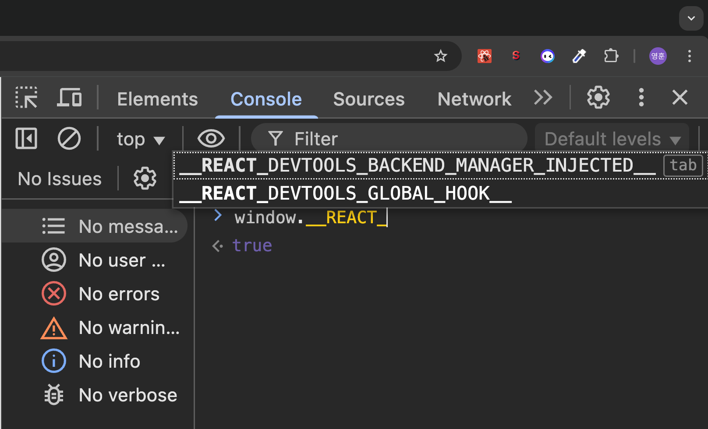

# 07. 크롬 개발자 도구를 활용한 애플리케이션 분석

## 크롬 개발자 도구란?

> 크롬에서 제공하는 개발자용 도구로, 웹페이지에서 일어나는 거의 모든 일을 확인할 수 있는 강력한 개발 도구

크롬 개발자 도구에서 웹사이트를 제대로 디버깅하고 싶다면 시크릿 모드 또는 프라이빗 모드라 불리는 개인정보 보호 모드에서 페이지와 개발자 도구를 여는 것을 권장한다.

브라우저에 설치돼 있는 각종 확장 프로그램 때문이다. 브라우저 확장 프로그램은 웹페이지 방문 시 확장 프로그램의 실행을 위해 전역 변수나 HTML 요소에 실제 웹 애플리케이션이 제공하지 않은 다른 정보를 추가할 수 있다.

그리고 이러한 정보는 개발자가 추가한 정보가 아닐뿐더러 다른 사용자에게서는 볼 수 없 는 정보로서 디버깅하는 데 방해가 된다.



- 테스트 해보니 개발자 도구를 키면 전역 객체에 2개의 정보가 담겨 있다.


- 리액트 개발자 도구가 꺼져 있다면 앞에서 본 전역 객체 정보 중 1개만 볼 수 있다.

---

## 요소(Element) 탭

요소 탭서는 현재 웹페이지를 구성하고 있는 HTML, CSS 등의 정보를 확인할 수 있다.


- 왼쪽에는 현재 웹페이지의 HTML 트리가 표시되고, 오른쪽에는 왼쪽에서 선택한 요소와 관련된 각종 정보가나타난다.

### 요소 화면


- 왼쪽 화면은 현재 웹페이지를 구성하는 HTML을 나타낸다. 이 중에서 원하는 태그를 클릭하면 브라우
  저 페이지의 해당 요소가 강조되고. 해당 태그와 관련된 정보를 확인할 수 있다.
- 요소 화면에서는 단순히 현재 HTML을 보는 것뿐만 아니라 직접 코드를 수정해서 웹페이지에서 어떻게 보이는지 빠르게 확인할 수 있다.
  - 수정하고 싶은 요소를 더블클릭해 태그명이나 클래스 등 요소와 관련된 정보를 수정하거나, 오른쪽 화면에서 스타일을 수정할 수도 있다.
  - `<p>` 태그 내부의 2025년 이라는 텍스트를 3025년으로 직접 변경했다. 핫 리로딩(hot reloading)을 거치지 않고 즉시 변경 사항을 확인할 수 있다.

만약 배너와 같이 코드에 의해 클래스나 속성값이 동적으로 제어되는 DOM이 있다면 요소의 중단점을 사용해 디버깅할 수 있다.

디버깅하고 싶은 요소를 선택하고 마우스 우클릭한 후 중단 위치를 선택하고 중단을 원하는 옵션을 클릭해 보자.


- 이렇게 중단 위치를 설정해 두면 중단과 관련된 작업이 일어날 때마다 브라우저가 렌더링을 중단하고 해당 요소 변경을 일으킨 소스 코드를 보여준다.


- 테스트로 배너에 중단점을 설정하고 x 버튼을 눌러 변화를 주니 자동으로 요소의 변경을 일으킨 소스 파일로 이동한다.

이 밖에도 요소에 속성을 추가, 수정, 삭제하거나 해당 요소를 스크린숏으로 캡처하거나 숨기는 등 HTML DOM과 관련된 다양한 작업을 수행할 수 있다.

### 요소 정보

요소 탭 오른쪽에서는 해당 요소와 관련된 정보를 얻을 수 있다.

요소 정보에서 확인할 수 있는 주요 내용은 다음과 같다.

**스타일**


- 요소를 선택하면 실제로 적용돼있는 스타일 정보를 확인할 수 있다.

계산됨


- 해당 요소의 크기, 패딩, 보더, 마진과 각종 CSS 적용 결괏값을 박스 모델로써 확인할 수 있다.

레이아웃


- css 그리드나 레이아웃과 관련된 정보를 확인할 수 있다.

이벤트 리스너


- 현재 요소에 부착된 각종 이벤트 리스너를 확인할 수 있다.
- 상위 버튼을 체크 해제하면 딱 해당 요소에 명확하게 부착된 이벤트만 볼 수 있다. 버튼을 선택하고 체크를 해제하니 버튼에 부착돼있는 click 이벤트만 보인다.

중단점


- 설정해놓은 중단점이 있는지 알려주는 탭이다.

속성


- 해당 요소가 가지고 있는 모든 속성값을 나타낸다. 버튼의 스타일과 “알려주기”라고 설정해놓은 버튼명도 볼 수 있다.
- 기본적으로 자바스크립트에서 해당 DOM으로 `.attributes`를 실행했을 때 나오는 결과와 비슷하지만 `.attributes`는 직접 할당된 값만 나오는 반면 속성 탭에는 모든 값이 나온다는 차이가 있다.

접근성


- 접근성이란 웹 이용에 어려움을 겪는 장애인 노약자를 위한 스크린리더기 등이 활용하는 값을 말한다. 접근성 탭에서는 이러한 접근성 정보를 확인할 수 있다.

---

## 소스 탭

소스 탭에서는 웹 애플리케이션을 불러오기 위해 실행하거나 참조된 모든 파일을 확인할 수 있다.

자바스크립트 파일부터, CSS, HTML, 폰트까지 다양한 파일 정보를 확인할 수 있다.


- 소스 탭에서 유용한 것을 살펴보려면 디버깅하고 싶은파일을 직접 열어야한다. setting 페이지 파일을 열어보니, 소스 코드를 확인할 수 있다.
- 프로덕션 모드의 경우 파일이 모두 압축돼 있기 때문에 디버깅하기가 매우 불편하지만 개발 모드에서는 유용하게 사용할 수 있다.


- 상태가 바뀌면 애니메이션 화면을 실행시키는 useEffect 내부 코드에 중단점을 만들어 useEffect 내부에서 어떠한 일이 일어나는지 살펴보고 있다.
- 다음 코드 시작을 중단시키고 이전에 할당한 변수에는 어떠한 값이 들어있는지 육안으로 확인해 볼 수 있다.
- setTimeout() 함수에 해당하는 timer 변수에 `timer = 82` 의 값이 할당돼 있다.
- 버그가 의심되는 지점을 디버깅하거나 실제로 소스코드상에서 어떤 식으로 작동하는지 확인하고 싶을 때 매우 유용하다.

소스 탭 오른쪽 패널에 제공하는 정보와 기능은 무엇인지 자세히 알아보자.

감시

- 감시하고 싶은 변수를 선언하고, 해당 변수의 정보를 확인할 수 있는 메뉴다.
- 왼쪽에서 제공하는 변수 외에 디버깅 시점에서 특정 변수의 값을 알고 싶을때 활용하자.

중단점

- 현재 열려 있는 파일뿐만 아니라 웹페이지 전체에 걸쳐 소스 탭에서 추가한 모든 중단점을 확인할 수 있다.

범위


- 현재 중단점에서의 스코프를 의미한다. 로컬은 현재 로컬 스코프를 의미하며, 이 스코프에서 접근할 수 있는 값을 확인할 수 있다. 이 밖에도 클로저, 전역 스코프 등을 확인할 수 있다.

호출 스택

- 현재 중단점의 콜스택을 확인할 수 있다. 자바스크립트 코드가 실행되며 생성되는 실행 콘텍스트가 어떻게 저장되어 현재 어떤 모습을 하고 있는지 직접 볼 수 있다.

전역 리스너

- 현재 전역 스코프에 추가된 리스너 목록을 확인할 수 있다.

XHR/가져오기, DOM, 이벤트 리스너, CSP 위반 중단점

- 소스의 중단점 이외에 다양한 중단점을 확인할 수 있다.

소스 탭에서는 중단점을 설정해 두면 빌드된 자바스크립트 또는 실제 개발 중인 스크립트 파일이 어떻게 실행되는지 눈으로 확인할 수 있다.

변수의 값을 미리 보여주는 기능, 감시에 변수를 추가해 실제 변숫값을 확인하는 기능을 사용한다면 굳이 번거롭게변수마다 `console.log`로 디버깅하지 않아도 훨씬 빠르게 필요한 정보를 확인할 수 있다.

또한 자바스크립트 파일에서는 확인할 수 없는 스코프, 호출 스택 등 현재 자바스크립트가 실행되고 있는 구조도 확인 할 수 있어 유용하다.

---

## 네트워크 탭

웹페이지를 접속하는 순간부터 발생하는 모든 네트워크 관련 작동이 기록된다. HTTP 요청부터 웹 소켓에 이르기까지, 웹페이지가 외부 데이터와 통신하는 정보를 확인해보자.


- 상단 탭에서 전체와 Fecth/XHR, JS 등의 탭으로 보고 싶은 네트워크 요청 종류를 필터링할 수 있으며, 기타 다른 체크박스를 선택해 보고 싶은 네트워크 종류를 제한할 수 있다.
- 왼쪽에는 실제 해당 페이지를 불러오는 과정에서 발생한 네트워크 요청을 볼 수 있다. 전체 채팅 목록을 불러오는 chats 요청이 보인다.
- 리액트에서 동일한 주소의 요청이 두 번 실행되는 경우는 대부분 잘못된 useEffect의 사용으로 발생하는 문제이므로 네트워크 탭을 자세히 들여다보면 이처럼 리액트 코드에 문제가 있는지도 확인할 수 있다.


- 하단에는 페이지를 불러오는 기간 동안 발생한 총 요청 건수와 총 다운로드한 업로드 리소스의 크기를 확인 할 수 있다.


- 스크린샷 캡처 기능을 활용하면 네트워크 요청 흐름에 따라 웹페이지가 어떻게 로딩되고 있는지 확인할 수 있다.
- 코드 내부에서 발생하는 fetch 요청 이외에도 외부 CDN에서 가져오는 이미지 리소스 요청 등도 확인 할 수 있기 때문에 사용자에게 먼저 노출되거나, 노출되는 영역이 큰 중요한 콘텐츠가 우선적으로 다운로드 되는지 등을 확인할 수 있다.

네트워크 탭을 통해 집중적으로 확인해 봐야 하는 점은 다음과 같다.

- 불필요한 요청 또는 중복되는 요청이 없는지
- 웹페이지 구성에 필요한 리소스 크기가 너무 크지 않은지
- 리소스를 불러오는 속도는 적절한지 또는 너무 속도가 오래 걸리는 리소스는 없는지
- 리소스가 올바른 우선순위로 다운로드 되어 페이지를 자연스럽게 만들어가는지

현대의 웹사이트는 렌더링에서 끝나지 않고 수많은 요청을 주고받으면서 페이지가 완성된다.

이 과정에서 네트워크 탭을 활용해 불필요한 네트워크 요청은 없는지 꼼꼼하게 확인한다면 더욱 빠르고 쾌적한 웹페이지를 만드는 데 큰 도움을 얻을 수 있을 것이다.

---

## 메모리 탭

현재 웹페이지가 차지하고 있는 메모리 관련 정보를 확인할 수 있다.

이 탭은 크롬 개발자 도구에서 제공하는 도구 중 가장 난이도가 높고 까다롭다.

그러나 애플리케이션에서 발생하는 메모리 누수, 속도 저하, 혹은 웹페이지 프리징 현상을 확인할 수 있는 유용한 도구다.


- 메모리 탭 그 자체만으로는 아무것도 할 수 없으며, 리액트 개발 도구의 프로파일과 비슷하게 프로파일링 작업을 거쳐야 원하는 정보를 볼 수 있다.

프로파일 유형은 크게 세 가지가 있다.

- 힙 스냅샷
  - 스냅샷이라는 이름에 걸맞게 현재 메모리 상황을 사진 찍듯이 촬영할 수 있다. 현재 시점의 메모리 상황을알고 싶다면 힙 스냅샷을 활용하면 된다.
- 타임라인의 할당 계측
  - 현재 시점의 메모리 상황이 아닌, 시간의 흐름에 따라 메모리의 변화를 살펴보고 싶다면 타임라인의 할당 계측을 사용하면 된다.
  - 주로 로딩이 되는 과정의 메모리 변화 또는 페이지에서 어떠한 상호작용을 했을 때 메모리의 변화 과정을알고 싶을 때 사용한다.
- 할당 샘플링
  - 메모리 공간을 차지하고 있는 자바스크립트 함수를 볼 수 있다.

이러한 세 가지 방법으로 메모리 현황을 디 버깅하는 방법을 알아보자.

### 자바스크립트 인스턴스 VM 선택

현재 실행 중인 자바스크립트 VM 인스턴스를 확인할 수 있다.


- 메모리에서 자바스크립트 가상머신 인스턴스를 선택할 수 있는데, 메모리 현황을 알고 싶은 인스턴스를 선택하고 시작하면 된다.
- 환경별 힙 크기를 볼 수 있는데. 실제 해당 페이지가 자바스크립트 힙을 얼마나 점유하고 있는지 나타낸다.
- 이 크기는 자바스크립트 실행에 따라 실시간으로 바뀐다.
- 이 크기만큼 사용자의 브라우저에 부담을 주기 때문에 불필요하게 크기가 늘어나지 않는지 눈여겨볼 필요가 있다.

### 힙 스냅샷

현재 페이지의 메모리 상태를 확인해 볼 수 있는 메모리 프로파일 도구다.

힙 스냅샷을 촬영하는 시점을 기준으로 마치 사진으로 촬영하듯 메모리 현황을 보여준다.

힙 스냅샷 도구를 유용하게 활용하는 방법을 알기 위해 극단적으로 잘못된 코드 예시와 함께 디버깅을 시작해 보자.

```jsx
const DUMMY_LIST = [];
export default function App() {
  function handleClick() {
    Array.from({ length: 10_000_000 }).forEach((_, idx) =>
      DUMMY_LIST.push(Math.random() * idx)
    );
    alert("complete!");
  }
  return <button onClick={handleClick}>BUG</button>;
}
```

- 위 코드는 버튼을 클릭하면 컴포넌트 외부에 있는 배열에 천만 개의 랜덤한 값을 push한다.

실제 메모리에서는 어떤 일이 벌어지는지 살펴보자.

먼저 페이지에 진입하고, 페이지 로딩이 완료되면 힙 스냅샷 촬영을 한 번 수행한다.


- 컴포넌트 하나밖에 없는 아주 간단한 예제임에도 불구하고, 메모리에 많은 정보들이 존재한다.
- 이는 리액트 기반 애플리케이션이 기본적으로 차지하는 내용, 그리고 window 객체 등 브라우저가 차지하는 내용이 존재하기 때문이다.

여기서 BUG 버튼을 한 번 더 클릭해 DUMMY_LIST에 다량의 데이터가 push되게 한 다음, 다시 힙 스냅샷을 촬영해 보자.


- 왼쪽 힙 스냅샷 화면에서 기존의 15.6MB에서 134MB로 엄청나게 크기가 증가했다.

메모리 크기 차이의 원인을 정확하게 파악하기 위해 모든 객체 메뉴를 클릭하고 스냅샷 1에서 스냅샷 2 사이에 할당된 객체를 클릭해 얕은 크기 항목을 기준으로 내림차순으로 정렬해 보자.


- 두 스냅샷 간의 비교와 정렬 덕분에 어떠한 변수가 메모리를 크게 잡아먹고 있는지 확인할 수 있다.
- 두 스냅샷 간 사이에 일어났던 유저 인터랙션, 즉 버튼 클릭으로 인해 이러한 메모리 사용량 차이가 발생했다는 것을 명확히 확인할 수 있다.
- 또 메모리를 크게 차지하고 있는 것이 객체(배열)라는 점, 그리고 이 액션이 handleclick이라는 함수를 통해 빚어졌다는 점도 파악할 수 있다.
- 한 발짝 더 나아가서, 해당 배열이 어떠한 값을 가지고 있는지도 직접 확인할 수 있다.


- 해당 객체를 대상으로 마우스 오른쪽 버튼을 클릭해 전역 변수로 저장을 누르면 해당 변수의 값이 전역 변수에 저장된다.
- 여기서는 `window.temp1`에 기록됐으며, 실제 값 또한 콘솔에서 확인할 수 있다.

얕은 크기와 유지된 크기의 차이점

얕은 크기와 유지된 크기라는 항목이 보이는데, 이것에 대해서 알아보자.

얕은 크기란 객체 자체가 보유하는 메모리 바이트의 크기를 나타낸다.

반면 유지된 크기란 해당 객체 자체뿐만 아니라 다른 부모가 존재하지 않는 모든 자식 객체들의 크기까지 더한 값이다.

무슨 말인지 정확히 이해하기 위해 다음 코드를 살펴보자.

```jsx
var counter = 0;
var instances = [];

function Y() {
  this.j = 5;
}

function X() {
  this.i = counter++;
  this.y = new Y();
}

export default function App() {
  function handleClick() {
    instances.push(new X());
  }

  return <button onClick={handleClick}>+</button>;
}
```

- 이 코드는 버튼을 클릭하면 X라는 이름의 새로운 객체를 생성하는데, 이 생성자 내부에서는 또 우라고 하는 새로운 생성자를 생성해 할당한다.
- 이 코드 실행 전후로 스냅샷을 찍어 확인해 보자.


- 여기서 주목해야 할 것은 새롭게 할당된 X의 크기다. X는 유지된 크키가 100, 얕은 크기가 52로 선언돼 있다.
- 그리고 X 내부에는 앞서 선언한 Y 객체가 있는데, 왼쪽에 있는 메모리 아이디 @374491을 따라가면 Y 객체가 있으며, 이 객체의 얕은 크기와 유지된 크기가 각각 48임을 알 수 있다.
- 즉, X의 유지된 크기는 100이지만, Y를 제외하고 X라는 객체 자체가 가지고 있는 크기 자체는 52다.
- 그리고 여기서 비롯된 차이 48은 객체 자체가 참조를 보유하고 있는 Y 객체의 크기를 의미한다.

메모리 누수를 찾을 때는 얕은 크기(객체 자체의 크기)는 작으나 유지된 크기(객체가 참조하고 있는 모든 객체들의 크기)가 큰 객체를 찾아야 한다.

두 크기의 차이가 큰 객체는 다수의 다른 객체를 참조하고 있다는 뜻이며, 이는 해당 객체가 복잡한 참조 관계를 가지고 있다는 뜻이다.

스냅샷을 활용할 때는 아무것도 없는 페이지라도 리액트와 브라우저가 웹페이지 실행을 위해 많은 것을 준비해 두기 때문에 의심이 되는 지점을 먼저 추측해 본 뒤에 두 개 이상의 스냅샷을 보는 것이 훨씬 쉽다.

스냅샷을 활용하면 useMemo나 useCallback과 같은 의존성이 있는 값들이 정말로 렌더링 사이에 그대로 유지되는지 육안으로 직접 확인할 수 있다. 다음 코드를 보자.

```jsx
function MemoComponent({ num }: { num: number }) {
  const callbackHandleClick = useCallback(
    function callbackHandleClick() {
      console.log(num);
    },
    [num]
  );
  const handleClick = () => {
    console.log(num);
  };

  return (
    <>
      <button onClick={callbackHandleClick}>1번</button>
      <button onClick={handleClick}>2번</button>
    </>
  );
}

export default function App() {
  // 리렌더링을 발생시키는 용도
  const [toggle, setToggle] = useState(false);

  function handleToggle() {
    setToggle((prev) => !prev);
  }

  return (
    <>
      <button onClick={handleToggle}>{toggle ? "ON" : "OFF"}</button>
      <MemoComponent num={5} />
    </>
  );
}
```

- 부모 컴포넌트가 리렌더링되기 때문에 Memocomponent도 리렌더링 된다.
- 그리고 callbackHandleClick은 절대 변경되지 않는 num을 의존성 배열로 가지고 있으므로 재생성되지 않는 것이 맞을 것이다.
- 실제로 그런지 스냅샷으로 살펴보기 위해 토글 버튼을 클릭하기 전과 후의 스냅샷을 촬영해 비교해 보자.


- 스냅샷 촬영 사이에 useCallback으로 감싼 callbackHandleClick은 재생성되지 않았기 때문에 스냅샷 사이에 할당된 객체에서 확인할 수 없다.
- 반면 useCallback으로 감싸지 않은 handleToggle은 이 스냅샷 사이에 재생성된 것을 확인할 수 있다.
- 두 번째로 알 수 있는 것은 바로 세 번째로 보이는 익명 함수 ()다. 이는 `setToggle((prev) => !prev)` 즉 setToggle 내부의 익명 함수다.
- setToggle 내부의 함수를 기명 함수로 바꾼다면 힙 스냅샷에서 바로 확인할 수 있다.

```jsx
function handleToggle() {
  setToggle(function 토글함수(prev) {
    return !prev;
  });
}
```

- 위 코드를 실행해서 개발자 도구에서 확인하면 다음과 같이 기명 함수를 명확하게 확인할 수 있다.


- 소스 탭이든, 메모리 탭이든, 디버깅을 빠르고 원활하게 하려면 기명 함수를 사용하는 편이 좋다.

---

### 타임라인 할당 계측

앞서 스냅샷 촬영은 해당 시점의 메모리 내용만 촬영하는 프로파일링 기법이지만 타임라인 할당 계측은 시간의 흐름에 따라 메모리 변화를 확인할 수 있는 기능이다.

시간의 흐름에 따라 메모리의 변화를 모두 기록하기 때문에 상대적으로 많은 부담이 발생한다.

메모리 누수를 프로파일링하기 위해 다음 예제 코드와 함께 살펴보자.

```tsx
import { useState } from "react";

export default function App() {
  const [number, setNumber] = useState(0);
  const [list, setList] = useState < Array < string >> [];

  const handleClick = () => {
    const newNumber = number + 1;
    setNumber(newNumber);

    setList((prev) => [
      ...prev,
      ...Array.from({ length: newNumber * 3000 }).map(
        (_, index) => `${index + number * 3000}`
      ),
    ]);
  };

  return (
    <>
      <button onClick={handleClick}>+</button>
      <ul>
        {list.map((item, index) => (
          <li key={`${item}_${index}`}>{item}</li>
        ))}
      </ul>
    </>
  );
}
```

- 위 코드를 기준으로 리액트 애플리케이션을 구동해 브라우저에서 접속하자.
- 페이지 로딩이 끝나면 타임라인의 할당 계측을 선택하고 시작을 누른다. 그리고 버튼을 여러 번 누르면서 어떤 변화가 일어나는지 살펴보자.


- 버튼을 누를 때마다 3000, 6000, 9000개씩 배열에 새로운 아이템이 생기며, 리액트는 이 배열을 모두 DOM에 그려야 한다.
- 그 결과, DOM을 그리기 위해 리액트가 1：1 구조로 생성하는 FiberNode와 해당 배열을 담아야 하는 array가 엄청난 크기로 커진 것을 알 수 있다.


- 해당 객체가 어떤 값을 가지고 있는지 살펴보고 싶다면 ►를 눌러 펼쳐보면 된다.


- 또 다른 장점은 기간을 좁혀서 확인해 볼 수 있다는 것이다. 상단 그래프에서 검색을 원하는 범위를 좁히면 해당 기간에 메모리에 할당된 내용만 골라서 볼 수 있다.


- 특정 변수를 클릭해서 전역 변수로 저장을 누르면 해당 변수가 무슨 값을 가지고 있는 객체인지 확인할 수도 있다.


- 전역 변수로 저장하면 위와 같이 콘솔에서 해당 변수를 확인할 수 있다.

시간의 흐름에 따른 메모리 점유율을 자세히 알고 싶다면 타임라인 할당 계측을 활용하자.

---

### 할당 샘플링

할당 계측과 비슷하지만 자바스크립트 실행 스택별로 분석할 수 있고, 이 분석을 함수 단위로 한다는 차이점이 있다.

```tsx
const DUMMY_LIST = [];

export default function App() {
  function handleClick() {
    Array.from({ length: 10_000_000 }).forEach((_, idx) =>
      DUMMY_LIST.push(Math.random() * idx)
    );

    alert("complete!");
  }

  return <button onClick={handleClick}>BUG</button>;
}
```


- 위 코드를 기준으로 페이지가 로딩된 이후에 할당 샘플링을 시작하고 버튼을 눌러 어떤 변화가 일어나는지 살펴보자.


- 최초에는 6.5MB 정도만 차지하던 힙이, 버튼을 클릭한 이후에는 395MB까지 치솟은 것을 확인할 수 있다.
- 즉, 버튼을 클릭하는 사이에 엄청나게 많은 메모리 할당 작업이 이뤄진 것을 볼 수 있다.
- 중지를 눌러 할당 샘플링을 살펴보자.


- 무거운 순으로 정렬하면 가장 많은 바이트를 차지한 함수의 작업이 맨 위로 올라오는데, 여기서는 addDummy 함수가 문제임을 확인할 수 있다.
- 여기서는 문제가 되는 함수뿐만 아니라 오른쪽의 파일명을 누르거나 마우스 오른쪽 버튼을 클릭한 후 소스 패널에 표시를 선택해 해당 함수가 어느 파일에서 어떻게 정의됐는지도 확인할 수 있다.

할당 샘플링은 타임라인 할당 계측과 유사하지만 프로파일링할 때 브라우저에 주는 부담을 최소화할 수 있어 장시간에 걸쳐 디버깅을 수행해야 할 때 유리하다.

만약 메모리 누수가 짐작되지만 정확히 어디에서 발생하는지 확인하기 어려워 힙 스냅샷을 촬영해 비교하기 어려운 경우, 오랜 기간 메모리 누수가 의심되어 프로파일링을 장기간 수행해야 하는 경우에는 할당 샘플링을 활용하는 것이 좋다.

---

## Next.js 환경 디버깅하기

Next.js의 서버 환경을 디버깅하는 방법을 알아보자. 놀랍게도 서버 환경도 동일하게 크롬 개발자 도구로 디버깅이가능하다.

### Next.js 프로젝트를 디버그 모드로 실행하기

가장 먼저 할 일은 Next.js 프로젝트를 디버그 모드로 실행하는 것이다. 디버그 모드로 실행하려면 다음과 같은 방법으로 Next.js 프로젝트를 실행한다.

```tsx
"dev": NODE_OPTIONS='—inspect' next dev

NODE_OPTIONS="--inspect" DEBUG="next:*" npm run dev
```

- `NODE_0PTI0NS='—inspect'` 라는 인수와 함께 `next dev`를 실행하면 다음과 같이 디버거가 활성화되면서 디버그 모드가 켜진 것을 확인할 수 있다.


- 이렇게 웹소켓 주소가 나타나면 디버거에 연결된 준비가 된 것이다. 그다음 크롬 브라우저에서 `chrome://inspect`로 이동하자.


- 여기서 **Open dedicated DevTools for Node**를 클릭하면 다음과 같이 새로운 창에서 개발자 도구가 나타난다.


- 이제 앞서와 마찬가지로 크롬 개발자 도구에서 디버깅할 준비가 끝났다.

---

### Next.js 서버에 트래픽 유입시키기

서버 사이드 렌더링과 같이 서버에서 제공되는 서비스의 경우 서버를 실행한 뒤 사용자가 서서히 유입되면서 메모리 누수가 발생하는 경우가 많다.

따라서 서버에 직접 트래픽을 발생시켜서 확인하는 편이 제일 확실한 방법이다.

사용자의 트래픽이 서버로 몰리는 상황을 시뮬레이션해 보자. 오픈소스 도구인 ab를 사용하자.

ab는 아파치 재단에서 제공하는 웹서버 성능 검사 도구로, HTTP 서버의 성능을 벤치마킹할수 있는 도구다.

터미널에서 다음과 같이 실행해 보자.

```tsx
» ab -k -c 50 -n 10000 "http://127.0.0.1:3000/"
```

- 이 명령어는 `"http://127.0.0.1:3000/"`을 향해 한 번에 50개의 요청을 총 10,000회 시도한다.
- 로컬에서 테스트할 경우 주소를 localhost로 하면 정상적으로 실행되지 않으니 반드시 IP나 올바른 주소를 기재해야 한다.

이 명령어를 실행하면 다음과 같이 요청이 실행되는 것을 확인할 수 있다.


- 단순히 요청을 수행하는 것뿐만 아니라 요청으로부터 응답받는 데 걸린 시간, 바이트 크기 등 다양한 정보를 확인할 수 있다.

### Next.js의 메모리 누수 지점 확인하기

다음 예제는 `getServerSideProps`가 있는 Next.js 페이지로서 `getServerSideProps`가 실행될 때마다 전역 변수로 선언된 `access_users`에 끊임없이 push를 수행한다.

```tsx
import type { GetServerSidePropsContext, NextPage } from "next";

const access_users = [];

function Home({ currentDateTime }: { currentDateTime: number }) {
  return <>{currentDateTime}</>;
}

export const getServerSideProps = (ctx: GetServerSidePropsContext) => {
  const currentDateTime = new Date().getTime();

  access_users.push({
    user: `user-${Math.round(Math.random() * 100000)}`,
    currentDateTime,
  });

  return {
    props: {
      currentDateTime,
    },
  };
};

export default Home;
```

- 해당 페이지에 사용자가 방문할 때마다 메모리 사용이 점차 늘어날 것으로 예상된다.
- 이를 디버그 모드로 실행한 후 실제로 누수가 발생하고 있는지 확인해 보자.


- 그리고 브라우저에서 next 애플리케이션을 방문한 뒤 다시 메모리 탭에서 메모리 변화를 살펴보자.


- 메모리 도구로 프로파일링한 결과, `getServerSideProps`의 다수 실행과 메모리 누수를 확인할 수 있다.
- `getServerSideProps`는 페이지 접근 요청이 있을 때마다 실행되는 함수이므로 최대한 부수 효과가 없는 순수 함수로 만들어야 한다.
- 만약 이 함수 내부에서 외부 스코프의 변수에 의존하는 작업을 한다면 지금과 같은 메모리 누수 상황을 마주할 수도 있을 것이다.

---

실제 디버깅 과정은 매우 어렵고 귀찮은 작업이다.

대부분의 경우에는 메모리 누수의 원인이 불명확하고, 코드를 아무리 봐도 잘 이해되지 않는 경우가 많기 때문에 메모리 누수가 의심되는 지점을 찾고, 코드를 수정하고, 다시 또 프로파일링해서 문제가 해결되는지 확인해야 하는 지루하고 긴 과정을 반복해야 한다.

이 과정은 분명 숙달하기도 어려운 문제이지만 반복해서 문제를 파고들다 보면 결국 원인을 파악하고 수정해서 더욱 안정적인 서비스를 제공할 수 있을 것이다.
