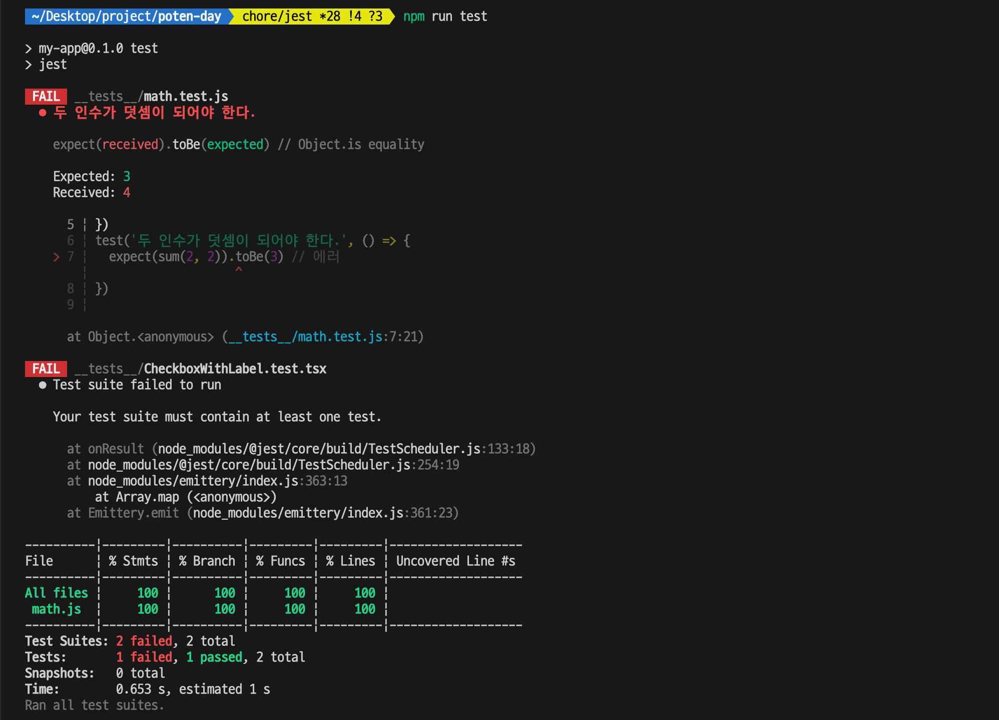

# 8.2 리액트 팀이 권장하는 리액트 테스트 라이브러리

프론트엔드 개발은 HTML, CSS와 같이 디자인 요소뿐만 아니라 사용자의 인터랙션, 의도치 않은 작동 등 브라우저에서 발생할 수 있는 다양한 시나리오를 고려해야 하기 때문에 일반적으로 테스팅하기가 매우 번거롭고 손이 많이 가는 작업이다.

그래서 단순히 함수나 컴포넌트 수준에서 유닛 테스트를 할 수도 있고, 사용자가 하는 작동을 모두 흉내 내서 테스트할 수도 있다.

리액트로 개발된 애플리케이션을 테스팅하는 방법, 특히 가장 널리 사용되는 React Testing Library 위주로 살펴보자.

## 8.2.1 React Testing Library란?

DOM Testing Library를 기반으로 만들어진 테스팅 라이브러리다.

먼저 리액트 테스팅 라이브러리가 기반으로 하는 DOM Testing Library에 대해 알아둬야 한다.

DOM Testing Library는 jsdom을 기반으로 하고 있다.

jsdom이란 순수하게 js로 작성된 라이브러리로, HTML이 없는 js만 존재하는 환경, 예를 들어 Node.js 같은 환경에서 HTML과 DOM을 사용할 수 있도록 해주는 라이브러리다.

jsdom을 사용하면 js 환경에서도 HTML을 사용할 수 있어 DOM Testing Library에서 제공하는 API를 사용해 테스트를 수행할 수 있다.

```tsx
const jsdom = require("jsdom");
const { JSDOM } = jsdom;

const dom = new JSDOM(`<!DOCTYPE html><p>Hello world</p>`);
console.log(dom.window.document.querySelector("p").textContent); // "Hello world”
```

동일한 원리로 리액트 기반 환경에서 리액트 컴포넌트를 테스팅할 수 있는 라이브러리가 바로 리액트 테스팅 라
이브러리다.

이를 활용하면 브라우저를 직접 실행해 눈으로 확인하지 않아도 리액트 컴포넌트가 원하는 대로 렌더링되고 있는지 확인할 수 있다.

컴포넌트뿐만 아니라 Provider, 훅 등 리액트를 구성하는 다양한 요소들을 테스트할 수 있다.

# 8.2.2 자바스크립트 테스트의 기초

기본적인 테스트 코드를 작성하는 방식은 다음과 같은 과정을 거친다.

1. 테스트할 함수나 모듈을 선정한다.
2. 함수나 모듈이 반환하길 기대하는 값을 적는다.
3. 함수나 모듈의 실제 반환 값을 적는다.
4. 3번의 기대에 따라 2번의 결과가 일치하는지 확인한다.
5. 기대하는 결과를 반환한다면 테스트는 성공이며, 만약 기대와 다른 결과를 반환하면 에러를 던진다.

이 과정을 위해 가장 먼저 필요한 것이 “작성한 코드가 예상대로 작동한다면 성공했다는 메시지가 출력되고, 실패하면 에러를 던진다”라는 작동을 대신해 주는 라이브러리다.

Node.js는 assert라는 모듈을 기본적으로 제공하며, 이 모듈을 사용하면 위와 같이 작동하도록 만들 수 있다.

이처럼 테스트 결과를 확인할 수 있도록 도와주는 라이브러리를 어설션(assertion) 라이브러리라고 한다.

```tsx
const assert = require("assert");

function sum(a, b) {
  return a + b;
}

assert.equal(sum(1, 2), 3);
assert.equal(sum(2, 2), 4);

// AssertionError [ERR_ASSERTION][ERR.ASSERTION]: 3 == 4
assert.equal(sum(1, 2), 4);
```

어셜션 라이브러리만으로는 무슨 테스트를 어떻게 수행했는지 등 테스트에 관한 실제 정보를 알 수는 없다.

좋은 테스트 코드는 다양한 테스트 코드가 작성되고 통과하는 것뿐만 아니라 어떤 테스트가 무엇을 테스트하는지 일목요연하게 보여주는 것이 중요하다.

이를 완성해 주는 것이 바로 테스팅 프레임워크다. Jest, Mocha, Karma, Jasmine 등이 있다.

테스팅 프레임워크들은 어설션을 기반으로 테스트를 수행하며, 여기에 추가로 테스트 작성자에게 도움이 될 만한 정보를 알려주는 역할도 함께 수행한다.

```tsx
// math.js

export default function sum(a, b) {
  return a + b;
}
```

```tsx
__tests__ / math.test.js;

import sum from "../src/test/math";

test("두 인수가 덧셈이 되어야 한다.", () => {
  expect(sum(1, 2)).toBe(3);
});
test("두 인수가 덧셈이 되어야 한다.", () => {
  expect(sum(2, 2)).toBe(3); // 에러
});
```



앞서 단순히 Node.js의 assert를 사용했던 것과 다르게 테스트를 실행하는 콘솔에서 볼 수 있는 테스트 관련 정보가 한층 다양해졌다. 무엇을 테스트했는지, 소요된 시간은 어느 정도인지, 무엇이 성공하고 실패했는지, 전체 결과는 어떤지에 대한 자세한 정보를 확인할 수 있다.

테스트 코드에서 볼 수 있는 특이점은 test, expect 등의 메서드를 import하지 않고 바로 사용한다는 점, node가 아닌 jest(npm run test)로 실행했다는 것이다.

만약 해당 코드를 jest가 아닌 node로 바로 실행했다면 에러가 발생했을 것이다. 그 이유는 test와 expect 모두Node.js 환경의 global, 즉 전역 스코프에 존재하지 않는 메서드이기 때문이다.

메서드가 실행될 수 있는 비밀은 Jest CLI에 있다. Jest를 비롯한 테스팅 프레임워크에는 이른바 글로벌(global)이라 해서 실행 시에 전역 스코프에 기본적으로 넣어주는 값들이 있다. 그리고 Jest는 이 값을 실제 테스트 직전에 미리 전역 스코프에 넣어준다.

이 전역 스코프에 삽입되는 값은 Jest 공식 문서에서 확인할 수 있다.

---

# 8.2.3 리액트 컴포넌트 테스트 코드 작성하기

기본적으로 리액트에서 컴포넌트 테스트는 다음과 같은 순서로 진행된다.

1. 컴포넌트를 렌더링한다.
2. 필요하다면 컴포넌트에서 특정 액션을 수행한다.
3. 컴포넌트 렌더링과 2번의 액션을 통해 기대하는 결과와 실제 결과를 비교한다.

아래는 cra로 생성한 리액트 프로젝트의 react-testing-library 기본 템플릿이다.

```tsx
// react-test/src/App.test.js

import { render, screen } from "@testing-library/react";
import App from "./App";

test("renders learn react link", () => {
  render(<App />);
  const linkElement = screen.getByText(/learn react/i);
  expect(linkElement).toBeInTheDocument();
});
```

```tsx
// App.js

import logo from "./logo.svg";
import "./App.css";

function App() {
  return (
    <div className="App">
      <header className="App-header">
        
        <p>
          Edit <code>src/App.js</code> and save to reload.
        </p>
        <a
          className="App-link"
          href="https://reactjs.org"
          target="_blank"
          rel="noopener noreferrer"
        >
          Learn React
        </a>
      </header>
    </div>
  );
}

export default App;
```

테스트하는 내용은 다음과 같이 요약할 수 있다.

1. <App/>을 렌더링한다.
2. 렌더링하는 컴포넌트 내부에서 “learn react”라는 문자열을 가진 DOM 요소를 찾는다.
3. expect(linkElement).toBeInTheDocument()라는 어설션을 활용해 2번에서 찾은 요소가 document 내부에 있는지 확인한다.

위와 같이 리액트 컴포넌트에서 테스트하는 일반적인 시나리오는 특정한 무언가를 지닌 HTML 요소가 있는
지 여부다.

이를 확인하는 방법은 크게 3가지가 있다.

**getBy…**

- 인수의 조건에 맞는 요소를 반환하며, 해당 요소가 없거나 두 개 이상이면 에러를 발생시킨다. 복수 개를 찾고 싶다면 getAllBy...를 사용하면 된다.

**findBy…**

- getBy...와 거의 유사하나 한 가지 큰 차이점은 Promise를 반환한다는 것이다. 즉, 비동기로 찾는다는 것을 의미하며, 기본값으로 1000ms의 타임아웃을 가지고 있다. 마찬가지로 두 개 이상이면 에러를 발생시키지만 복수 개를 찾고 싶다면 findAllBy...를 사용하면 된다. 이러한특징 때문에 findBy는 비동기 액션 이후에 요소를 찾을 때 사용한다.

**queryBy...**

- 인수의 조건에 맞는요소를 반환하는 대신 찾지 못한다면 null을 반환한다. getBy...와 findBy...는 찾
  지 못하면 에러를 발생시키기 때문에 찾지 못해도 에러를 발생시키지 않고 싶다면 queryBy...를 사용하면 된다. 마찬가지로 복수 개를 찾았을 때는 에러를 발생시키며, 복수 개를 찾고 싶다면 queryAllBy...를 사용하면된다.

컴포넌트를 테스트하는 파일은 App.tsx, App.test.tsx의 경우와 마찬가지로 같은 디렉터리상에 위치하는 것이 일반적이다.

대부분의 프레임워크가 App.test.tsx 와 같은 이름으로 된 파일은 번들링에서 제외한다.

### 정적 컴포넌트

상태가 존재하지 않아 항상 같은 결과를 반환하는 컴포넌트를 테스트하는 방법은 크게 어렵지 않다.

```tsx
import { memo } from "react";

export const AnchorTagComponent = memo(function AnchorTagComponent({
  name,
  href,
  targetBlank,
}: {
  name: string;
  href: string;
  targetBlank?: boolean;
}) {
  return (
    <a
      href={href}
      target={targetBlank ? "_blank" : undefined}
      rel="noopener noreferrer"
    >
      {name}
    </a>
  );
});

export default function StaticComponent() {
  return (
    <>
      <h1>Static Component</h1>
      <div>유용한 링크</div>

      <ul data-testid="ul" style={{ listStyleType: "square" }}>
        <li>
          <AnchorTagComponent
            targetBlank
            name="리액트"
            href="https://reactjs.org"
          />
        </li>
        <li>
          <AnchorTagComponent
            targetBlank
            name="네이버"
            href="https://www.naver.com"
          />
        </li>
        <li>
          <AnchorTagComponent name="블로그" href="https://yceffort.kr" />
        </li>
      </ul>
    </>
  );
}
```

위 컴포넌트에 링크가 제대로 있는지 확인한다면 다음과 같이 테스트 코드를 작성해 볼 수 있다.

```tsx
import { render, screen } from "@testing-library/react";

import StaticComponent from "./index";

beforeEach(() => {
  render(<StaticComponent />);
});

describe("링크 확인", () => {
  it("링크가 3개 존재한다.", () => {
    const ul = screen.getByTestId("ul");
    expect(ul.children.length).toBe(3);
  });

  it("링크 목록의 스타일이 square다.", () => {
    const ul = screen.getByTestId("ul");
    expect(ul).toHaveStyle("list-style-type: square;");
  });
});

describe("리액트 링크 테스트", () => {
  it("리액트 링크가 존재한다.", () => {
    const reactLink = screen.getByText("리액트");
    expect(reactLink).toBeVisible();
  });

  it("리액트 링크가 올바른 주소로 존재한다.", () => {
    const reactLink = screen.getByText("리액트");
    expect(reactLink.tagName).toEqual("A");
    expect(reactLink).toHaveAttribute("href", "https://reactjs.org");
  });
});

describe("네이버 링크 테스트", () => {
  it("네이버 링크가 존재한다.", () => {
    const naverLink = screen.getByText("네이버");
    expect(naverLink).toBeVisible();
  });

  it("네이버 링크가 올바른 주소로 존재한다.", () => {
    const naverLink = screen.getByText("네이버");
    expect(naverLink.tagName).toEqual("A");
    expect(naverLink).toHaveAttribute("href", "https://www.naver.com");
  });
});

describe("블로그 링크 테스트", () => {
  it("블로그 링크가 존재한다.", () => {
    const blogLink = screen.getByText("블로그");
    expect(blogLink).toBeVisible();
  });

  it("블로그 링크가 올바른 주소로 존재한다.", () => {
    const blogLink = screen.getByText("블로그");
    expect(blogLink.tagName).toEqual("A");
    expect(blogLink).toHaveAttribute("href", "https://yceffort.kr");
  });

  it("블로그는 같은 창에서 열려야 한다.", () => {
    const blogLink = screen.getByText("블로그");
    expect(blogLink).not.toHaveAttribute("target");
  });
});
```

jest의 메서드를 하나씩 살펴보자.

**beforeEach**

- 각 테스트(it)를 수행하기 전에 실행하는 함수다. 여기서는 각 테스트를 실행하기에 앞서 Static Component를 렌더링한다.

**describe**

- 비슷한 속성을 가진 테스트를 하나의 그룹으로 묶는 역할을 한다. 정의에서도 알 수 있듯, 이 describe는 꼭 필요한 메서드는 아니다. 그러나 테스트 코드가 많아지고 관리가 어려워진다면 describe로 묶어서 관리하는 것이 편리하다. describe 내부에 describe를 또 사용할 수 있다.

**it**

- test와 완전히 동일하며, test의 축약어(alias)다. it이라는 축약어를 제공하는 이유는 테스트 코드를 좀 더 사람이 읽기 쉽게 하기 위해서다. describe ... it (something) 과 같은 형태로 작성해두면 테스트 코드가 한결 더 문어체 같이 표현되어 읽기 쉬워진다.

**testld**

- testld는 리액트 테스팅 라이브러리의 예약어로, get 등의 선택자로 선택하기 어렵거나 곤란한 요소를 선택하기 위해 사용할 수 있다. HTML의 DOM 요소에 testld 데이터셋을 선언해 두면 이후 테스트 시에 getByTestld, findByTestld 등으로 선택할 수 있다. 웹에서 사용하는 querySelector([data-testid="${yourId}"])와 동일한 역할을 한다.

### 데이터셋이란?

HTML의 특정 요소와 관련된 임의 정보를 추가할 수 있는 HTML 속성이다.

HTML의 특정 요소에 data-로 시작하는 속성은 무엇이든 사용할 수 있다. 앞의 예제에서는 HTML에 data-testid를 추가해 getByTestld를 사용했다.

이는 특정 시나리오에서 매우 유용하게 사용할 수 있다. 다음 예제를 보자.

```tsx
export default function App() {
  return (
    <ul>
      {Array.from({ length: 10 }).map((_, index) => (
        <li>
          <button>{index + 1}</button>
        </li>
      ))}
    </ul>
  );
}
```

위 코드에서 만약 버튼을 눌렀을 때 해당 index를 확인할 수 있는 코드를 작성한다고 가정해 보자.

```tsx
export default function App() {
  function handleButtonClick(e: MouseEvent<HTMLUListElement>) {
    if (e.target instanceof HTMLButtonElement) {
      // dataset.id는 해당 요소의 data-id 값이다.
      console.log(e.target.dataset.id);
    }
  }

  return (
    <ul onClick={handleButtonClick}>
      {Array.from({ length: 10 }).map((_, index) => (
        <li>
          <button data-id={index + 1}>{index + 1}</button>
        </li>
      ))}
    </ul>
  );
}
```

이때 활용할 수 있는 방법이 바로 데이터셋이다. HTML에 필요한 정보를 담아두면 이에서도 우리가 원하는 정보를 가져올 수 있다.

이렇게 하면 버튼마다 onClick 함수를 생성할 필요도 없고, 이벤트 버블링을 활용해 ul에서도 원하는 정보를 가져올 수 있다.

---

아래는 Jest 공식문서에 나와있는 리액트 컴포넌트 예제 테스트 코드이다.

```tsx
// CheckboxWithLabel.tsx

import { useState } from "react";

export default function CheckboxWithLabel({
  labelOn,
  labelOff,
}: {
  labelOn: string;
  labelOff: string;
}) {
  const [isChecked, setIsChecked] = useState(false);

  const onChange = () => {
    setIsChecked(!isChecked);
  };

  return (
    <label>
      <input type="checkbox" checked={isChecked} onChange={onChange} />
      {isChecked ? labelOn : labelOff}
    </label>
  );
}
```

```tsx
// __tests__/CheckboxWithLabel.test.tsx

import { cleanup, fireEvent, render } from "@testing-library/react";
import CheckboxWithLabel from "../src/test/CheckboxWithLabel";

afterEach(cleanup);

it("CheckboxWithLabel은 클릭 후 텍스트를 변경합니다", () => {
  const { queryByLabelText, getByLabelText } = render(
    <CheckboxWithLabel labelOn="On" labelOff="Off" />
  );

  expect(queryByLabelText(/off/i)).toBeTruthy();

  fireEvent.click(getByLabelText(/off/i));

  expect(queryByLabelText(/on/i)).toBeTruthy();
});
```


