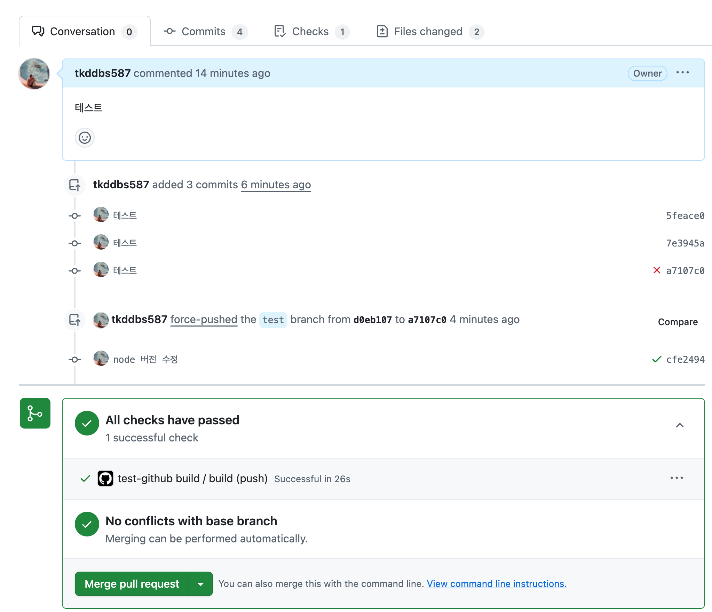

# 9.2 깃허브 100% 활용하기

## 9.2.1 깃허브 액션으로 CI 환경 구축하기

깃허브 액션에 대해 본격적으로 알아보기에 앞서 먼저 CI(Continuous Integration)에 대해 알아보자.

코드의 변화를 모으고 관리하는 코드 중앙 저장소에서, 여러 기여자가 기여한 코드를 지속적으로 빌드하고 테스트해 코드의 정합성을 확인하는 과정을 바로 CI라고 한다.

CI의 핵심은 저장소에서 코드의 변화가 있을 때마다 전체 소프트웨어의 정합성을 확인하기 위한 작업을 자동으로 실행해야 한다는 것이다.

여기서 자동으로 실행해야 하는 작업이란 테스트, 빌드, 정적 분석, 보안 취약점 분석 등이 있다.

깃허브 액션은 깃허브에서 출시한 SaaS로, 깃허브 저장소와 함께 사용할 수 있는 강력한 도구다.

깃허브 액션의 본래 목적은 깃허브 저장소를 기반으로 깃허브에서 발생하는 다양한 이벤트를 트리거 삼아 다양한 작업을 할 수 있게 도와주는 것이다.

이러한 작업에는 다음과 같은 것이 포함된다.

- 깃허브의 어떤 브랜치에 푸시가 발생하면 빌드를 수행한다.
- 깃허브의 특정 브랜치가 메인 브랜치를 대상으로 풀 리퀘스트가 열리면 빌드, 테스트, 정적 분석을 수행한다.

이러한 특징을 활용하면 다른 Cl/CD(Continuous Integration/Continuous Delivery) 솔루션을 대체할 수 있다는 것이 널리 알려지게 되면서 깃허브 액션이 CI/CD 서비스로서 각광받게 됐다.

깃허브 액션은 깃허브 저장소를 기반으로 CI를 구축하고자 할 때 매우 유용하게 사용할 수 있다. 프론트엔드 애플리케이션은 일부 서버 응답과의 연동을 하는 시나리오를 제외한다면 저장소에 있는 코드만으로 테스트, 빌드, 정적 분석 등 CI에 필요한 대부분의 기능을 손쉽게 구현할 수 있다.

깃허브 액션은 깃허브 저장소에서만 사용할 수 있으며, 일부 제한적인 환경에서만 무료로 사용할 수 있다.

## 깃허브 액션의 기본 개념

깃허브 액션에서 자주 언급되는 개념을 알아보자.

**러너(runner)**

- 러너란 파일로 작성된 깃허브 액션이 실행되는 서버를 의미한다. 특별히 지정하지 않으면 공용 깃허브 액션 서버를 이용하며, 별도의 러너를 구축해 자체적으로 운영할 수도 있다.

**액션(action)**

- 러너에서 실행되는 하나의 작업 단위를 의미한다. yaml 파일로 작성된 내용을 하나의 액션으로 볼 수 있다.

**이벤트(event)**

- 깃허브 액션의 실행을 일으키는 이벤트를 의미한다. 개발자의 필요에 따라 한 개 이상의 이벤트를 지정할 수 있다. 또한 특정 브랜치를 지정하는 이벤트도 가능하다.
- 주로 사용되는 이벤트는 다음과 같다.
  - pull_request: PR(pull request)과 관련된 이벤트로서, PR이 열리거나, 닫히거나, 수정되거나, 할당되거나, 리뷰 요청되는 등의 PR과 관련된 이벤트를 의미한다.
  - issues: 이슈와 관련된 이벤트로서 이슈가 열리거나, 닫히거나, 삭제되거나, 할당되는 등 이슈와 관련된 이벤트를 의미한다.
  - push: 커밋이나 태그가 푸시될 때 발생하는 이벤트를 의미한다.
  - schedule: 저장소에서 발생하는 이벤트와 별개로 특정 시간에 실행되는 이벤트를 의미한다. 여기서 말하는 시간은 cron에서 사용되는 시간을 의미한다.
    - cron이란 유닉스 계열 운영체제에서 실행되는 시간 기반 잡 스케줄러로 여기서는 특정 시간을 표현할 때 다음과 같은 형식을 취한다.
    - 5 4 \* \* *: 매일 4시 5분에 실행. 분, 시간, 일, 월, 요일 순으로 표현하며 *는 모든 값을 의미한다.

**잡(jobs)**

- 잡이란 하나의 러너에서 실행되는 여러 스텝의 모음을 의미한다. 하나의 액션에서 여러 잡을 생성할 수 있으며, 특별히 선언한 게 없다면 내부 가상머신에서 각 잡은 병렬로 실행된다.

**스텝(steps)**

- 잡 내부에서 일어나는 하나하나의 작업을 의미한다. 셸 명령어나 다른 액션을 실행할 수도 있다. 이 작업은 병렬로 일어나지 않는다.

요약하자면 스텝들을 엮어서 잡을 만들고, 이러한 여러 개의 잡은 병렬로 실행되며, 이러한 잡을 하나 이상 모아둔 것을 액션이라고 한다. 그리고 이 액션을 실행하는 것이 러너다.

### 깃허브 액션 작성하기

액션을 작성하려면 저장소의 루트에 .github/workflows 폴더를 생성하고 내부에 파일을 작성하면 된다. 확장자는 .yml 또는 .yaml로 지정해야한다.

```tsx
// .github/workflows/build.yaml

name: test-github build
run-name: ${{ github. actor }} has been added new commit.

on:
  push:
    branches-ignore:
      - "main"

jobs:
  build:
    runs-on: ubuntu-latest
    steps:
      - uses: actions/checkout@v3
      - uses: actions/setup-node@v3
        with:
          node-version: 20
      - name: "install dependencies"
        run: npm ci
      - name: "build"
        run: npm run build
```

위와 같이 작성하고 test 브랜치에서 push 후 PR을 올리니까 아래와 같이 빌드가 성공한 것을 확인할 수 있었다.




구체적으로 액션이 yaml 파일 내에서 어떻게 작성됐고 각 값의 뜻은 무엇인지 알아보자.

**name**

- name은 액션의 이름이다. 필수 값은 아니지만, 액션을 구별하는 데 도움이 되므로 이름을 지정하는 것이 좋다.

**run-name**

- 액션이 실행될 때 구별할 수 있는 타이틀명이다. 이 또한 필수 값은 아니다.
- 다만 예제와 같이 github.actor를 활용해 어떤 사람이 해당 액션을 트리거했는지 정도를 구별하는 데 쓸 수 있다.
- 만약 설정돼있지 않다면 풀 리퀘스트 이름이나 마지막 커밋 메시지 등이 출력된다.

**on**

- 필수 값으로, 언제 이 액션을 실행할지를 정의한다.
- 예제에서는 원격 저장소의 푸시가 발생했을 때 실행하도록 했으며, main 브랜치에 푸시가 발생했을 때는 실행하지 않도록 설정했다.
- 이유는 main 브랜치의 직접적인 푸시는 풀 리퀘스트가 머지됐을 때만 일어나며, 이 풀 리퀘스트 머지 단계에서 이미 해당 액션으로 CI를 통과했을 것이기 때문이다.
- main 브랜치를 제외하지 않는다면 CI 중복 실행이 발생하기 때문에 별도로 막아뒀다.

**jobs**

- 필수 값으로, 해당 액션에서 수행할 잡을 의미한다.
- 한 개 이상 설정할 수 있으며, 여러 개를 지정하면 병렬로 실행된다.
- **jobs.build**
  - build는 GitHub Actions의 예약어가 아니라 임의로 지정한 이름으로, name과 같은 역할을 한다. jobs의 하위 항목이므로 반드시 들여쓰기해야 한다.
  - 이 파일에서는 jobs에 1개 이상의 작업이 있는데, 그 중 하나의 작업이 build라는 것을 의미한다.
- **jobs.build.runs-on**
  - 어느 환경에서 해당 작업이 실행될지를 결정한다. 별도의 러너를 설정하고 싶지 않고, 깃허브에서 제공하는 서버를 쓰고 싶다면 ubuntu-latest를 선언하면 된다.
  - 커스텀 러너를 쓴다면 해당 러너명을 지정하면 된다. 커스텀 러너를 쓰고 싶다면 저장소의 Settings - Actions - Runners에서 추가할 수 있다.
- **jobs.build.steps**
  - 이제 해당 잡에서 순차적으로수행할 작업을 정의한다.
  - **uses: actions/checkout@v3**
    - 해당 스텝에서 작업을 actions/checkout@v3을 사용해서 작업하겠다는 것을 의미한다.
    - actions/checkout@v3은 깃허브에서 제공하는 기본 액션으로, 별도 파라미터를 제공하지 않으면 해당 브랜치의 마지막 커밋을 기준으로 체크아웃한다.
    - 최신 코드를 기준으로 작동해야 하는 CI 액션에서는 필수적으로 사용된다.
  - **uses: actions/setup-node@v3**
    - 해당 스텝에서 작업을 actions/setup-node@v3를 사용해서 작업하겠다는 것을 의미한다.
    - actions/setup-node@v3 역시 깃허브에서 제공하는 기본 액션으로 해당 러너에 Node.js를 설치한다.
    - with.node-version.20을 함께 지정했는데, 이름에서 유추할 수 있는 것처럼 Node.js 20 최신 버전을 설치한다.
    - 해당 프런트엔드 프로젝트가 배포되는 Node.js 버전에 맞춰 작성하면 된다.(현재 v20.18.0 사용중)
  - **name: ‘install dependencies’**
    - 해당 스텝의 명칭을 지정했다. 여기서는 의존성을 설치하는 작업을 수행한다.
    - working-directory는 터미널의 cd 명령과 비슷한 역할을 하는데, 뒤이어 수행할 작업을 해당 디렉터리에서 수행하겠다는 뜻이다.
    - 만약 그냥 루트에서 실행해도 된다면 따로 지정하지 않아도 된다. 그리고 run을 통해 수행할 작업을 명시했다. 여기서는 의존성을 설치하기 위해 npm ci를 선언했다.
  - **name: ‘build’**
    - Cl를 위한 작업, git checkout, Node.js 설치, 의존성 설치까지 마무리했으니 마지막 작업으로 빌드를 수행한다.
    - npm run build를 실행해 Next.js 프로젝트를 빌드했다.

위 액션은 예제 액션이므로 완벽하지 않다. 하지만 젠킨스에 비해 훨씬 손쉽게 CI를 구축할 수 있다.

깃허브 액션을 적절히 활용하면 다양한 작업을 해볼 수도 있다.

기본적인 빌드 CI 예제부터 actions/github-script를 사용해 깃허브 API를 직접 호출해 PR에 댓글을 달거나, 혹은 일정 시간마다 특정한 작업을 수행한다거나, 배포 서비스와 연동해 자동 배포를 실행하거나, 저장소 내부에 이미지가 추가될 때마다 이미지 최적화도 할 수 있다.

---

# 9.2.2 직접 작성하지 않고 유용한 액션과 깃허브 앱 가져다 쓰기

깃허브 액션은 비교적 작성하기 쉬운 편이지만 단순한 빌드나 린트, 테스트 같은 작업 외에 여러 가지 작업을 수행하기에는 조금 복잡하고 어려울 수도 있다.

이를 위해 깃허브에서는 Marketplaces라는 서비스를 제공해 여러 사용자가 만들어 놓은 액션을 가져다 쓸 수 있다.

## 깃허브에서 제공하는 기본 액션

**actions/checkout**

- 깃허브 저장소를 체크아웃하는 액션이다. 저장소를 기반으로 작업을 해야 한다면 반드시 필요하다.
- 일반적으로는 아무런 옵션 없이 사용해 해당 액션을 트리거한 최신 커밋을 불러오지만 ref를 지정해 특정 브랜치나 커밋을 체크아웃할 수도 있다.

**actions/setup-node**

- Node.js를 설치하는 액션이다. Node.js를 사용하는 프로젝트라면 반드시 필요하다. 설치할 Node.js 버전을 지정할 수도 있다.

**actions/github-script**

- GitHub API가 제공하는 기능을 사용할 수 있도록 도와주는 액션이다.
- GitHub API를 이용하면 깃허브에서 할 수 있는 대부분의 작업을 수행할 수 있으므로 한 번쯤 API 문서를 보는 것을 추천한다.

**actions/stale**

- 오래된 이슈나 PR을 자동으로 닫거나 더 이상 커뮤니케이션하지 못하도록 닫는다.
- 저장소가 오래되어 과거에 생성된 이슈나 풀 리퀘스트가 너무 많을 경우 정리하는 데 도움이 된다.

**actions/dependency-review-action**

- 의존성 그래프에 대한 변경, 즉 package.json, package-lock.json, pnpm-lock.yaml 등의 내용이 변경됐을 때 실행되는 액션으로, 의존성을 분석해 보안 또는 라이선스에 문제가 있다면 이를 알려준다.

**github/codeql-action**

- 깃허브의 코드 분석 솔루션인 code-ql을 활용해 저장소 내 코드의 취약점을 분석해 준다.
- languages에 javascript만 설정해 두면 자바스크립트와 타입스크립트를 모두 검사하므로 특정 스케줄에 맞춰서 실행하거나 CI로 활용할 수 있다.

## Lighthouse Cl

많은 액션중에 대표적으로 Lighthouse CI를 직접 적용해보고자 한다.

Lighthouse CI는 구글에서 제공하는 액션으로, 웹 성능 지표인 라이트하우스를 CI를 기반으로 실행할 수 있도록 도와주는 도구다.

이 깃허브 액션을 활용하면 프로젝트의 URL을 방문해 라이트하우스 검사를 실행한다.

[Lighthouse CI 홈페이지](https://github.com/apps/lighthouse-ci)를 방문해서 install을 누르자.


그러면 라이트하우스를 이용할 레포를 선택할 수 있다.

개인 레포를 선택하기 위해 본인 깃허브 아이디를 클릭하자.


이렇게 레포를 Lighthouse CI를 적용할 레포를 선택할 수 있다. 전체 레포에 허용하도록 설정했다.


여기서 레포를 선택하면 마지막 단계에서 화면에 뜨는 토큰을 복사해서 저장한다.


이제 저장한 토큰 값을 해당 레포의 Settings 탭으로 접속하여

Secrets and variables > Actions > New repository secret를 클릭해 secrets 변수에 저장하면 된다.

Name은 [Lighthouse Cl 공식 레포지토리에 나와있는 가이드](https://github.com/GoogleChrome/lighthouse-ci/blob/main/docs/getting-started.md#overview)대로 LHCI_GITHUB_APP_TOKEN으로 지정하고 Secret은 방금 전에 복사해놨던 토큰 값을 붙여넣기 하면 된다.


- 토큰 없이 yaml 파일 설정(PR 시 바로 성능 측정 페이지를 볼 수 있는 링크가 제공되지 않음)
  일단은 토큰 없이 설정을 해도 되는거 같아서 아래와 같이 github/workflows 폴더에 yaml 파일을 설정해줬다.

  ```tsx
  // .github/workflows/light-house-ci.yaml

  name: CI
  on: [push]
  jobs:
    lhci:
      name: Lighthouse
      runs-on: ubuntu-latest
      steps:
        - uses: actions/checkout@v3
        - name: Use Node.js 20
          uses: actions/setup-node@v3
          with:
            node-version: 20
        - name: npm install, build
          run: |
            npm install
            npm run build
        - name: run Lighthouse CI
          run: |
            npm install -g @lhci/cli@0.14.x
            lhci autorun

  ```

  - 먼저 저장소를 checkout한 후, Node.js를 설치하고, 설치 후 빌드를 한다.
  - 그리고 이후에 Ihci를 설치해 실행한다.

- 토큰값을 불러와 yaml 파일 설정(PR 시 바로 성능 측정 페이지를 볼 수 있는 링크가 제공됨)

  ```tsx
  // .github/workflows/light-house-ci.yaml

  name: Lighthouse CI
  on: [push]
  jobs:
    lhci:
      name: Lighthouse
      runs-on: ubuntu-latest
      steps:
        - uses: actions/checkout@v3
        - name: Use Node.js 20
          uses: actions/setup-node@v3
          with:
            node-version: 20
        - name: npm install, build
          run: |
            npm install
            npm run build
        - name: run Lighthouse CI
          run: |
            npm install -g @lhci/cli@0.14.x
            lhci autorun
          env:
            LHCI_GITHUB_APP_TOKEN: ${{ secrets.LHCI_GITHUB_APP_TOKEN }}
  ```

  - 먼저 저장소를 checkout한 후, Node.js를 설치하고, 설치 후 빌드를 한다.
  - 그리고 이후에 Ihci를 설치해 실행한다. 이때 LHCI_GITHUB_APP_TOKEN이라는 환경변수에 LHCI_GITHUB_APP_TOKEN을 넣는다.
  - 이렇게 토큰을 넣으면 Ihci가 PR이나 액션에 권한을 얻어 사용자에게 결과를 보여줄 수 있다.

이제 루트에 .lighthouserc.js 파일을 생성한다.

Ihci로 라이트하우스 분석을 진행하려면 몇 가지 추가적인 설정이 필요하다.

먼저 Ihci에 어떤 사이트를 분석해야 하는지 알려줘야 한다.

```tsx
// .lighthouserc.js

module.exports = {
  ci: {
    collect: {
      url: ["http://localhost:3000"],
      collect: {
        numberOfRuns: 5,
      },
    },
    upload: {
      startServerCommand: "npm run start",
      target: "temporary-public-storage",
    },
  },
};
```

- npm run start를 통해 서버를 실행하고, http://localhost:3000을 분석하도록 설정돼 있다.
- numberOfRuns를 다섯 번으로 수정해 여러 차례 분석한 다음, 각각의 결과를 최종 결과로 반환한다.
- 그리고 그 결과를 temporary-public-storage, 즉 임시 저장소에 업로드해 분석하도록 명령을 내렸다.

test 브랜치에서 push를 하니 이렇게 라이트하우스 ci가 정상적으로 동작한다.

토큰을 yaml 파일에 넣어주지 않았을때는 아래와 같이 바로 성능 측정 결과 페이지로 가는 링크가 생기지 않는다.


Lighthouse CI를 클릭해서 자세히 보면 Github token not set 이라고 경고가 뜨는데,

이 부분이 아까 테스트 레포지토리가 뜨지 못해서 설정하지 못한 부분이다.

그래도 Open the report at 뒤 링크로 접속해보면 테스트로 작성한 App.js 페이지를 분석하여 라이트하우스 결과를 알려준다.


반대로 토큰을 yaml 파일에 넣어줬을때는 아래와 같이 바로 성능 측정 결과 페이지로 가는 링크가 생긴다.

클릭하면 바로 성능 측정 페이지로 갈 수 있고 다른 사용자가 보기에도 훨씬 수월하다.


이렇게 Lighthouse CI로 어렵지 않게 성능 측정 액션을 자동화해봤다.

생각보다 깃허브에서 제공하는 기능이 내가 생각하던 것보다 훨씬 다양하다고 느꼈다.

프론트엔드 개발자라면 깃허브 액션을 통해 프로젝트마다 필요한 액션을 잘 적용한다면, 인프라 지식을 바삭하게 알고 있지 않더라도 간단한 CI/CD는 구축할 수 있겠다는 생각이 들었다.

물론 더 복잡한 CI/CD 구축은 책에서 나와있는대로 젠킨스와 같은 플랫폼을 이용해야 할테지만, 특정 동작을 자동화한다는 것은 굉장히 효율적인 일이라고 생각한다. 앞으로도 다양한 액션들을 적용해보면 좋겠다.
