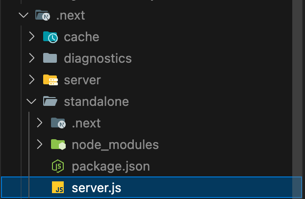

# 9.4 리액트 애플리케이션 도커라이즈하기

과거에는 웹 애플리케이션을 배포하기 위해 직접 장비를 준비하고, 해당 장비에 애플리케이션 구동에 필요한 각종 파일을 설치하고 소스를 다운로드해서 설치했다면 요즘은 애플리케이션을 하나의 컨테이너로 만들어서 빠르게 배포하는 것이 일반적이다.

이 컨테이너를 만드는 데 사용되는 것이 바로 도커(Docker)다.

도커는 서비스 운영에 필요한 애플리케이션을 격리해 컨테이너로 만드는데 이용하는 소프트웨어다.

이렇게 어디서든 실행될 수 있는 이미지 상태로 애플리케이션을 준비해 둔다면 이 도커 이미지를 실행할 수 있는 최소한의 환경이 갖춰진 상태라면 어디서든 웹 애플리케이션을 배포할 수 있다. 즉, 서비스를 Vercel, Netlify와 같이 특정 배포 서비스에 종속적이지 않은 상태로 만들어 좀 더 유연하게 관리할 수 있다.

## 9.4.1 리액트 앱을 도커라이즈하는 방법

애플리케이션을 도커 이미지로 만드는 과정을 도커라이즈(dockerize)라고 한다.

쉽게 이야기하자면 애플리케이션을 신속하게 구축해 배포할 수 있는 상태로 준비하는 것을 말한다.

## 도커란?

도커 홈페이지에서는 도커를 아래와 같이 설명한다.

> “도커는 개발자가 모던 애플리케이션을 구축, 공유, 실행하는 것을 도와줄 수 있도록 설계된 플랫폼이다. 도커는 지루한 설정 과정을 대신해 주므로 코드를 작성하는 일에만 집중할 수 있다.”

이 문장에서 “지루한 설정 과정”이란 create-react-app 내지는 create-next-app을 배포하기 위한 사전 준비를 대신 해준다는 의미다.

‘사전 준비’라는 것에는 해당 애플리케이션이 실행될 수 있는 컴퓨팅 리소스를 확보하고, 사용하는 라이브러리에 따라 설치 방법을 다르게 하거나, 외부 네트워크로 이 애플리케이션을 개방하는 등 많은 것이 있다.

만약 이러한 애플리케이션을 배포하기 위한 사전 준비를 개발자가 처음부터 해야 한다면 많은 작업이 필요하다.

서버와 애플리케이션에 적절한 리소스를 확보하고, 운영체제를 설치하고, Node.js도 설치하고, 빌드도 해야 한다.도커가 말하는 ‘지루한 설정 작업’이란 바로 이러한 것을 말한다.

도커는 애플리케이션을 빠르게 배포할 수 있도록 애플리케이션을 ‘컨테이너’라는 단위로 패키징하고, 이 ‘컨테이너’ 내부에서 애플리케이션이 실행될 수 있도록 도와준다.

도커는 이 ‘컨테이너’를 바탕으로 독립된 환경에서 애플리케이션이 항상 일관되게 실행할 수 있도록 보장해 준다.

### 도커 용어

**이미지**

- 도커에서 이미지란 컨테이너를 만드는 데 사용되는 템플릿을 의미한다.
- 이 이미지를 만들기 위해서 Dockerfile이 필요하며, 이 파일을 빌드하면 이미지를 만들 수 있다.

**컨테이너**

- 도커의 이미지를 실행한 상태를 컨테이너라고 한다.
- 이 컨테이너가 바로 독립된 공간이며, 이미지가 목표하는 운영체제, 파일 시스템, 각종 자원 및 네트워크 등이 할당되어 실행될 수 있는 독립된 공간이 생성된다.

**Dockerfile**

- 어떤 이미지 파일을 만들지 정의하는 파일이다.
- 이 파일을 빌드하면 이미지를 만들 수 있으며, 흔히 도커 이미지화한다(dockerize)라고 할 때 가장 먼저 하는 것이 바로 이 Dockerfile을 만드는 것이다.

**태그**

- 이미지를 식별할 수 있는 레이블 값을 의미한다. 일반적으로 이름: 태그명 형태로 구성돼 있다.
- 대표적인 이미지인 ubuntu:latest를 예로 들면 ubuntu는 이미지 이름이고 latest는 태그명이다. 즉, ubuntu:latest는 ubuntu의 latest인 이미지를 의미한다.

**리포지터리**

- 이미지를 모아두는 저장소로 앞서 언급했던 이 름에 다양한 태그로 지정된 이미지가 모여있는 저장소다.

**레지스트리**

- 리포지터리에 접근할 수 있게 해주는 서비스를 의미한다. 대표적인 레지스트리로는 도커 허브(Docker Hub)가 있다.
- 이 레지스트리에는 다양한 리포지터리가 있으며, 이 리포지터리에서 사용자는 자신이 원하는 이미지를 내려받아 사용할 수 있다.

### 자주 쓰는 도커 cli 명령어

**docker build**

- Dockerfile을 기준으로 이미지를 빌드하는 작업을 말한다.
- 일반적으로 태그를 부여하는 옵션인 -t와 함께 많이 사용된다.
- 예를 들어, `docker build -t foo:bar ./`는 현재 ./에 있는 Dockerfile을 가준으로 이미지를 빌드하고, 해당 이미지명에 foo:bar라는 태그를 붙이는 것을 의미한다.

**docker push**

- 이미지나 리포지터리를 도커 레지스트리에 업로드하는 과정을 의미한다.
- 예를 들어, docker push yceffort/foo:bar는 yceffort라는 사용자 계정에 foo:bar 이미지를 푸시하는 것을 말한다.
- 별도 설정이 돼 있지 않다면 기본적으로 도커 허브에 업로드한다.

**docker tag**

- 이미지에 태그를 생성하는 명령어다.
- docker tag 원본이미지:태그 변경할\_이미지:태그 형태로 실행한다.
- 한 가지 유념해야 할 점은 이름을 수정하는 게 아니라 기존 이미지에 새로운 태그를 붙인다는 것이다.
- 동일한 이미지에 두 개의 태그가 생긴 것으로, 하나를 삭제하더라도 동일 이미지의 다른 태그에는 영향을 미치지 않는다.

**docker inspect**

- 이미지나 컨테이너의 세부 정보를 출력하는 명령어다.
- docker inspect {이미지명 | 컨테이너명}으로 세부 정보를 원하는 이미지명이나 컨테이너 명령어를 입력하면 된다.

**docker run**

- 이미지를 기반으로 새로운 컨테이너를 생성하는 명령어다.
- 웹 애플리케이션을 실행하는 이미지를 만들었다면 이 명령어를 통해 컨테이너를 만들어 웹 애플리케이션을 컨테이너 내부에서 작동하게끔 할 수 있다.

**docker ps**

- 현재 가동 중인 컨테이너 목록을 확인할 수 있는 명령어다.
- 만약 --all과 함께 실행한다면 현재 가동 중이지 않은 멈춘 컨테이너도 확인할 수 있다.

**docker rm**

- docker rm {이미지명}으로 컨테이너를 삭제할 수 있다.
- 실행 중인 컨테이너를 삭제하려면 docker stop {이미지명}으로 해당 컨테이너를 중지시키고 삭제해야 한다.

여기서 언급하는 대부분의 명령어는 도커 데스크톱(Docker Desktop)의 GUI 인터페이스에서 제공하는 기능이다. 그러나 도커 데스크톱이 없는 명령줄 기반 환경에서도 도커를 써야 할 경우가 있으므로 주요 명령어는 외워두자.

이제 create-react-app과 create-next-app을 도커 이미지로 만들어보자.

### create-react-app을 위한 Dockerfile 작성하기

프론트엔드 애플리케이션이 도커 이미지에서 해야 할 작업을 간단히 요약하면 다음과 같다.

**운영체제 설정**

- 당연하게도 애플리케이션을 정상적으로 구동하기 위해서는 최소한의 운영체제가 확보돼 있어야 한다.

**Node.js 설치**

- npm 프로젝트를 구동하려면 Node.js가 필요하다.
- 이 Node.js 버전은 애플리케이션을 개발하는 과정에서 정해진 버전과 일치하거나 그 이상이어야 한다.(유의적 버전 규칙에 따라 메이저 버전이 올라가는 경우 상황에 따라서 실행이 되지 않을 수도 있다.)

**npm ci**

- 프로젝트 빌드에 필요한 의존성 모듈을 설치한다.

**npm run build**

- 프로젝트를 빌드한다.

**실행**

- 프로젝트를 실행한다. 이 실행 과정은 애플리케이션 성격에 따라 조금씩 다를 수 있다.
- create-react-app의 경우에는 정적인 리소스를 서버에 올리는 것만으로도 충분하다.

위에서 언급한 모든 과정을 이제 Dockerfile에 기재하면 된다. 프로젝트의 루트에 Dockerfile을 생성하고 다음과 같이 작성한다.

```tsx
// Dockerfile

FROM node:18.12.0-alpine3.16 as build

WORKDIR /app

COPY package.json ./package.json
COPY package-lock.json ./package-lock.json

RUN npm ci

COPY . ./

RUN npm run build
```

**FROM node:18.12.0-alpine3.16 as build**

- FROM은 이 이미지가 어떤 베이스 이미지에서 실행될지를 결정한다.
- 여기서 베이스 이미지란 이 이미지를 실행하는 데 필요한 이미지를 의미한다.
- 이처럼 도커는 어떠한 이미지 위에 또 다른 이미지를 생성할 수 있다.
- 여기서 사용한 베이스 이미지는 node:18.12.0-alpine3.16이다.
- node:18.12.0이란 Node.js 18.12.0 버전이 설치돼 있는 이미지를 의미하며 alpine3.16은 이 이미지가 alpine3.16 버전의 운영체제 위에서 실행되는 이미지라는 것을 의미한다.
- 여기서 alpine은 알파인 리눅스를 의미하는데. 알파인 리눅스란 일반적인 리눅스와는 다르게 훨씬 가볍고 깔끔한 리눅스로, 일반적으로 컨테이너를 실행하기 위한 운영체제로 사용된다.
- 알파인 리눅스의 크기는4 ~ 5MB 정도인 반면, 다른 일반적인 리눅스는 100MB에서 200MB 정도이므로 특별한 이유가 없다면 알파인 리눅스를 사용하는 것이 좋다.
- 그렇다면 이 이미지는 어디에서 다운로드해서 가져오는 것일까? npm처럼 특별한 레지스트리가 존재할까? 이 이미지를 가져오는 곳은 바로 앞서 언급한 도커 허브라는 도커 이미지 저장소다.
- 즉, 도커 이미지 저장소에서 node:18.12.0-alpine3.16이라는 이미지를 사용하겠다는 뜻이다.
- 이 베이스 이미지 한 줄만으로 운영체제를 설치하는 복잡한 과정 없이도 바로 원하는 운영체제를 사용할 수 있다.
- 마지막으로 as build란 이 베이스 이미지를 build라고 하는 단계(스테이지)에서만 쓰겠다는 것을 의미한다.

**WORKDIR /app**

- WORKDIR이란 작업을 수행하고자 하는 기본 디렉터리를 의미한다.

**COPY**

- COPY는 파일을 복사하는 명령어다.
- 여기서는 package.json과 package-lock.json을 각각 ./package.json과 ./package-lock.json으로 복사하는데, 복사하는 위치는 앞서 설정한 기본 디렉터리, 즉 ./app이 된다.

**RUN npm ci**

- RUN을 실행하면 컨테이너에서 명령어를 실행할 수 있다.
- 여기서는 의존성 설치 명령어인 npm ci를 실행하게 된다.

**COPY . ./**

- 의존성을 설치했으니 이제 빌드만 남았다.
- 빌드를 위해서는 src, node_modules 등 대부분의 리소스가 필요하므로 COPY . ./으로 모든 리소스를 복사한다.

**RUN npm run build**

- 빌드에 필요한 리소스를 복사했으므로 빌드 명령어를 통해 애플리케이션을 빌드한다.

여기까지가 빌드에 필요한 Dockerfile이다. 작성한 도커 이미지를 빌드해 보자.

```tsx
docker build . -t cra:test
```

- 이 명령어는 해당 위치 . 에서 빌드를 수행하며, -t로 이름과 태그로 각각 cra와 test를 부여하겠다는 뜻이다.

이미지 빌드가 완료되면 도커 데스크톱에서 해당 이미지가 생성된 것을 확인할 수 있다.


빌드된 이미지의 크기가 700MB에 달하는 것을 볼 수 있다. 이 크기의 대부분은 Node.js, node_modules가 차지하고 있을 것이다.

그럼 이 이미지를 실행해 보자.

---

### create-next-app을 위한 Dockerfile 작성

모든 npm 프로젝트가 그렇듯, 의존성을 설치하고, 프로젝트를 빌드하는 과정을 동일하게 수행한다.

한 가지 다른 점은 Next.js 프로젝트는 대게 단순하게 빌드된 파일을 올리는 수준이 아니라 서버 실행이 필요하다는 점이다.

프로젝트의 루트에 Dockerfile을 생성하고 다음과 같이 작성한다.

```docker
FROM node:20-alpine as deps

WORKDIR /app

COPY package.json ./package.json
COPY package-lock.json ./package-lock.json

RUN npm ci
```

- 해당 스테이지는 deps라고 명명했으며, 이 과정에서는 프로젝트 빌드에 필요한 package.json, package-lock.json을 설치해서 node_modules를 생성한다.

```tsx
FROM node:20-alpine as build

WORKDIR /app

COPY --from=deps /app/node_modules ./node_modules
COPY . ./

RUN npm run build
```

- build 단계에서는 deps에서 생성한 node_modules를 복사해서 사용한다.
- 그리고 npm run build를 통해 프로젝트를 빌드한다.
- 마지막으로 이렇게 빌드한 이미지를 실행할 준비를 해야 한다.

next.config.js에 다음과 같은 내용을 추가한다.

```tsx
/** @type {import('next').NextConfig} */
const nextConfig = {
  output: "standalone",
};

export default nextConfig;
```

- output은 Next.js에서 빌드를 위해 제공하는 기능으로, 이 옵션이 추가되면 Next.js는 프로덕션에서 실행에필요한 파일들만 모아서 바로 실행할 수 있는 준비를 대신해 준다.
- 여기서 실행에 필요한 파일이란 node_modules 내부의 파일도 포함된다.
- 이 옵션을 추가한 뒤에 빌드해 보자.



- next/standalone에 실행에 필요한 프로젝트가 따로 꾸려졌고, server.js가 생성된 것도 볼 수 있다.

서버가 어떻게 구성돼 있는지 간단하게 살펴보면 next/dist/server/next-server에서 NextServer를 꺼내온 다음, http.createServer로 만든 서버에 NextServer를 연동한다.

이러한 점을 응용한다면 Koa나 Express 같은 웹 프레임워크에 Next.js를 올려 두고 실행해 별도의 Node.js 기반 서버를 운영하면서 동시에 Next.js도 서비스 할 수 있을 것이다.

마지막으로 runner 단계를 만들어서 standalone으로 만들어진 Next.js를 실행한다.

```tsx
FROM node:20-alpine as runner

COPY --from=build /app/public ./public
COPY --from=build /app/.next/standalone ./
COPY --from=build /app/.next/static ./.next/static

EXPOSE 3000

ENTRYPOINT ["node", "server.js"]
```

- 실행에 필요한 것은 먼저 이 Node.js 서버를 실행할 수 있는 alpine Node.js 이미지
- /app/public 폴더에 있는 HTML을 비롯한 정적 리소스 정보
- standalone 옵션으로 생성된 standalone 파일의 내용
- 마지막으로 static 폴더의 정보다.
- 최종적으로 사용해야 할 포트를 EXPOSE로 설정하고, ENTRYPOINT로 node server.js를 실행해 이미지 실행 시 바로 Next.js가 실행되도록 설정한다.

이제 이미지를 빌드해 보자.

```tsx
docker build . -t next:test
```

next 이미지가 정상적으로 빌드됐다.


포트를 3000번으로 설정하고 실행하면


정상적으로 Next.js 애플리케이션이 실행되는 것을 확인할 수 있다.


---

## 9.4.2 도커로 만든 이미지 배포하기

## 도커 이미지 업로드하기

Node.js로 만든 라이브러리를 다른 사용자들이 내려받아 사용할 수 있게 npm 레지스트리라고 하는 공간이 있는 것처럼, 도커 이미지도 도커 허브라고 하는 공간에 업로드할 수 있다.

업로드하기 전에 먼저 저장소를 생성해야 한다.

[도커 허브 웹사이트](https://hub.docker.com/)로 접속해 로그인 후 reate repository를 클릭해 저장소를 생성한다.


저장소를 생성하고 나면 저장소 메인 페이지가 표시된다.


이제 이미지를 푸시하려면 먼저 해당 이미지의 태그명이 사용자명/저장소명:태그명과 같은 형식으로 일치해야 한다.

앞에서 fedevhoon이라는 계정의 hoon이라는 이름의 저장소를 생성했으므로 다음과 같은 명령어를 작성한다.

```
docker tag next:test fedevhoon/hoon:next-test
```

태그명이 정상적으로 설정됐다면 도커 데스크톱이나 이미지 목록에서 확인할 수 있다.

이 이미지에 대해 Push to Hub를 눌러 도커 허브로 배포하자.


어느 정도 시간이 흐른 후에 저장소에 정상적으로 이미지가 푸시된 것을 확인할 수 있다.


도커 허브를 방문하면 다음과 같이 이미지가 어떻게 구성돼 있는지 좀 더 자세히 확인할 수 있다.

현재는 공개 저장소로 생성했기 때문에 누구나 해당 이미지를 자유롭게 내려받을 수 있다.

만약 다운로드를 제한하고 싶다면 비공개 저장소로 생성한 후 푸시하면 된다.


## 도커 이미지 실행하기

이제 구글 클라우드 플랫폼(GCP)으로 업로드된 도커 이미지를 클라우드에서 실행하는 방법을 알아보자.

### 사전 준비

구글 클라우드 콘솔에 접속하여 새로운 프로젝트를 생성하자.


프로젝트를 생성했으면 사용자의 기기에서 GCP를 제어할 수 있는 gcloud cli를 설치해야 한다.

[설치 안내 페이지](https://cloud.google.com/sdk/docs/install?hl=ko)를 참고해서 사용 중인 기기의 운영체제에 맞춰 설치하면 된다.

설치가 완료되면 커맨드 라인에서 gcloud를 사용할 준비가 됐다.

`gcloud --version` 을 입력해서 정상적으로 버전이 출력되면 성공적으로 설치가 된 것이다.


gcloud 명령어를 사용하려면 먼저 로그인이 필요하기때문에 다음 명령어로 로그인을 하자.

```tsx
gcloud auth login
```

커맨드를 입력하면 구글 소셜 로그인 페이지로 이동하게 된다.

앞서 본인이 만든 계정을 선택한 다음 허용을 누르면 로그인이 완료된다.


로그인이 완료되고 나면 처음에는 기본 프로젝트가 지정되어 있지 않다.

앞서 만든 프로젝트를 기본 프로젝트로 지정해야 한다. `gcloud config set project [PROJECT_ID]` 명령어로 설정할 수 있다


```tsx
gcloud config set project docker-454423
```

이제 gcloud를 사용할 준비를 마쳤다. 이제 본격적으로 GCP에 이미지를 푸시하고, 또 이 푸시한 이미지를 실행하는 방법을 알아보자.

### Google Cloud Registry에 이미지 푸시

빌드된 도커 이미지를 준비하고 구글 클라우드 콘솔에서 ‘Artifact registry’를 검색하여 접속하자.


페이지 상단의 저장소 만들기를 눌러 저장소를 만든다.


저장소를 만들고 해당 저장소를 누르면 빈 저장소가 생긴다.


저장소를 클릭하여 페이지에서 해당 저장소의 주소를 확인할 수 있는데, 이제 우리가 푸시할 이미지의 이름이 될 것이다.

이미지를 push하기 위해 저장소 복사 버튼을 클릭해 주소를 복사하자.


이미지를 docker push로 푸시하려면 앞의 주소가 GCP를 향해 가야 한다는 것을 도커에 설정해야 한다.

이 설정은 gcloud를 통해 할 수 있다.

```
gcloud auth configure-docker asia-northeast3-docker.pkg.dev
```

이렇게 설정을 마쳤다면 이제 이미지에 태그를 달면 된다.

`docker tag` 뒤에 태깅할 이미지명:태그명을 넣고 그 뒤에는 앞서 생성한 저장소명을 입력한다. 저장소명 뒤에는push할 이미지의 이미지명:태그명 형식으로 입력하면 된다.

```
docker tag next:test asia-northeast3-docker.pkg.dev/docker-454423/my-next/hoon:next-test
```

이제 이미지를 push하자

```tsx
docker push asia-northeast3-docker.pkg.dev/docker-454423/my-next/hoon:next-test
```


저장소 페이지를 방문하면 이미지가 푸시된 것을 볼 수 있다.


빌드할 이미지 푸시도 끝났으니 본격적으로 이미지를 클라우드 환경에서 실행해 보자.

### Cloud Run에서 이미지 실행

Cloud Run은 push된 이미지를 클라우드 환경에서 손쉽게 실행할 수 있도록 도와주는 서비스다.

push된 이미지를 실행할 수 있을 뿐만 아니라 Dockerfile이 존재하는 저장소를 기준으로 자동으로 빌드해서 실행할 수 있는 기능까지 제공한다.(이 빌드는 Cloud Build라는 서비스에서 담당한다.)

앞서 push한 이미지를 Cloud Run에서 실행하는 방법을 알아보자.

구글 클라우드 콘솔에서 ‘cloud run’을 검색해 페이지로 이동한다.


서비스 만들기를 클릭한다.


설정과 관련된 여러 옵션들을 하나씩 살펴보자.


**컨테이너 이미지 URL**


- 빌드할 컨테이너 이미지를 선택한다.
- 여기서 선택을 클릭하면 앞서 빌드해서 푸시한 이미지를 선택 할 수 있다.
- Cloud Run에 서비스를 배포하려면 앞서 빌드하고 푸시한 이미지를 선택해야 한다.

**서비스 이름**

- 원하는 서비스명을 입력하면 된다.

**리전**

- 서비스를 배포할 지역을 선택한다.
- 지역에 따라 가격에 약간씩 차이가 있으니 연습용 프로젝트라면 가장 저렴한 지역을, 진지하게 운영할 서비스라면 주로 접속이 예상되는 곳과 가까운 지역을 선택하면 된다.

**CPU 할당 및 가격 책정**

- CPU 사용량에 따라 가격 정책이 다르다.
- CPU가 요청 처리 중에만 할당됨의 경우 요청이 들어오는 경우에만 탄력적으로 요금이 부여되며, CPU가 항상 할당됨의 경우 요청의 개수와 상관없이 인스턴스의 생명주기에 걸쳐 요금이 부여된다.
- 자주 사용되지 않는 서비스라면 전자가, 꾸준히 어느 정도 처리가 필요하다면 후자가 적합하다.

**자동 확장**

- 이른바 자동 스케일링(auto scale)으로 불리는 것으로, 요청과 처리에 따라 인스턴스 개수를 얼마나 탄력적으로 할당할지 선택할 수 있다.

**인그레스**

- 허용할 트래픽을 제어할 수 있다.
- 내부에서 발생하는 트래픽만 허용할 수도 있고, Cloud Load Balancing으로 요청만 허용할 수도 있으며, 혹은 모든 트래픽을 허용할 수도 있다.

**인증**

- 인증을 설정할 수 있다.

**컨테이너**

- 배포할 이미지 컨테이너에 대한 설정을 추가한다.
- 컨테이너 포트 도커 이미지가 열어뒀던 포트를 기재한다.
- 여기서는 3000번 포트를 열어뒀으므로 3000을 설정한다.

**컨테이너 명령어**

- ENTRYPOINT로 이미 자동으로 실행되게 했으므로 별다른 명령어가 필요 없다.

**컨테이너 인수**

- ENTRYPOINT로 이미 자동으로 실행되게 했으므로 별다른 인수가 필요 없다.

**시작 CPU 부스트**

- 컨테이너를 시작할 때 더 많은 CPU를 할당할지 결정할 수 있다.

**용량**

- 컨테이너에 할당해야 하는 메모리, CPU, 요청 시간, 최대 요청 수 등을 제어할 수 있다.

**실행 환경**

- 컨테이너가 실행되는 환경이다.

**환경변수**

- 컨테이너에 주입할 환경변수를 설정한다.

**보안 비밀**

- Cloud Secret과 연계해 컨테이너 볼륨에 마운트하거나 환경변수로 주입할 값을 지정할 수 있다.

만들기를 눌러 배포를 하면 아래와 같이 에러가 뜬다.

에러 메시지를 해석해보면 컨테이너 매니페스트 유형 'application/vnd.oci.image.index.v1+json'은 amd64/linux를 지원해야 한다고 돼있다.


에러의 이유는 빌드한 이미지의 플랫폼(CPU 아키텍처)이 달라서이다.

```tsx
docker inspect asia-northeast3-docker.pkg.dev/docker-454423/my-next/hoon:next-test
```

확인해보니 맥북 m1에서 arm64 플랫폼을 사용중이다. amd64 외에 다른 것으로 돼어있으면 Cloud Run 환경에서 실행할 수 없다.


Cloud Run 환경에서 실행하기 위해 빌드할 때 amd64 아키텍쳐로 변경하는 커맨드로 빌드하자.

```tsx
docker build --platform Linux/amd64 -t next:test .
```

해당 커맨드로 빌드하고 docker desktop을 확인해보니 이미지 Name: <none>, 이미지 Tag: <none>으로 나와있었다.

이유는 Docker가 기본적으로 제공하는 ARM64 환경에서 AMD64 기반 빌드를 하게 해주는 Buildx 플러그인을 찾지 못하고 있어서 발생하는 문제였다.

이를 해결하기 위해 방법을 알아보던 중 docker desktop의 알림에 경고 메시지가 떠있었고 클릭해보니 아래와 같은 에러가 있었다.

```tsx
Integrity issue detected
Docker Desktop regularly checks:

The symlinks of Docker binaries to /usr/local/bin.
The symlink of the default Docker socket. Additionally, Docker Desktop ensures that the context is switched to desktop-linux on startup.
The following binaries are now incorrectly linked:

무결성 문제가 감지되었습니다

Docker Desktop은 정기적으로 다음을 확인합니다:

Docker 바이너리의 심볼릭 링크가 /usr/local/bin으로 연결되어 있는지.

기본 Docker 소켓의 심볼릭 링크. 추가적으로, Docker Desktop은 시작 시 컨텍스트가 desktop-linux로 전환되었는지 확인합니다.

다음 바이너리들이 현재 잘못 연결되어 있습니다:
```

Repair를 클릭하여 수정하니 에러가 해결됐고 다시 터미널로 돌아가 빌드를 진행했다.

```tsx
docker build --platform Linux/amd64 -t next:test .
```

빌드가 완료됐다. docker desktop에 가서 다시 확인해보자.


이제 빌드시에 설정한 Name과 Tag가 잘 설정이 된 것을 확인할 수 있다.

Name 옆에 경고 표시가 있는데, 이는 이미지가 현재 사용하는 환경(Mac, ARM64)과 다른 아키텍처(AMD64)로 빌드되었기 때문에 출력되는 경고라고 한다.

Apple Silicon 환경에서 AMD64 이미지를 실행할 때 Rosetta2 에뮬레이션을 통해 실행되기 때문에 성능이 저하될 가능성이 있다는 경고다.

이미지를 실제 배포 환경이 Intel(AMD64) 기반이라면 전혀 문제가 없는 것이니 성공적으로 빌드가 된 것이다.


이제 AMD64로 빌드된 이미지를 push하자

```tsx
docker tag next:my asia-northeast3-docker.pkg.dev/docker-454423/my-next/next:test
docker push asia-northeast3-docker.pkg.dev/docker-454423/my-next/next:test
```

push 후 확인해보면 새롭게 이미지가 잘 등록됐다.


이제 다시 Cloud Run으로 가서 배포해보면 오류가 없어지고 배포에 성공한 모습을 확인할 수 있다.

그리고 URL이 할당된 것을 확인할 수 있는데, 링크에 접속해보면


이와 같이 앞서 만든 이미지가 배포되어 잘 서비스되는 모습을 확인할 수 있다.


### 지속적 통합 설정

로컬에서 빌드한 이미지를 클라우드에서 실행하는 것은 매력적이지만 대부분의 경우 애플리케이션은 계속해서 변경되고 이에 맞춰 이미지도 매번 새롭게 빌드해야 하는데, 이는 매우 번거로운 일이다.

이를 위해 Cloud Run에서는 소스 저장소에서 Dockerfile을 다운로드해 빌드할 수 있는 옵션도 제공한다.

이를 통해 소스 저장소의 특정 브랜치에서 코드가 push되면 자동으로 빌드와 배포를 수행할 수 있다.

먼저 앞서와 동일하게 Cloud Run에서 서비스를 만들자.

이번에는 ‘소스 저장소에서 지속적으로 새 버전 배포’를 선택하자.

이후 ‘CLOUD BUILD로 설정’을 선택하면 소스 저장소를 선택하는 화면이 나온다.


여기서 GCP를 깃허브와 연결하고, 배포할 소스에 대한 설정을 기입하면 된다.

인증을 눌러 깃허브 권한을 얻는다.


권한을 얻고 Google Cloud Build 설치를 눌러 개인 저장소의 권한을 허용한다.


모든 저장소의 권한을 허용했기때문에 모든 레포지토리에 접근할 수 있다. 해당하는 레포지토리를 선택하면 된다.


이후 설정은 전과 동일하게 하면 지속적으로 배포할 준비(CI)가 완료된다.


지속적 배포 설정이 정상적으로 완료된 이후에 해당 브랜치에 push가 일어나면 자동으로 빌드가 진행된다.

지속적 배포를 설정하면 매번 이미지를 빌드하고 push하지 않아도 자동으로 해당 브랜치에서 변경이 발생할 때마다 서비스를 배포하게 된다.


---

지금까지 리액트 애플리케이션을 도커라이즈하고, 이를 push해 클라우드에서 실행하는 방법까지 살펴봤다.

책에서는 프론트엔드 개발자가 가져야할 docker의 역량에 대해 아래와 같이 정리한다.

> 요즘 대부분의 기업에서는 애플리케이션을 도커라이즈해서 배포하고, 각 이미지를 관리하고 보관하면서 배포 관련 히스토리를 남겨두거나 빠르게 롤백하는 등의 용도로 도커를 사용하고 있기 때문에 프론트엔드 개발자라면 적어도 자신이 만든 애플리케이션을 도커라이즈하는 방법까지 숙지하고 있어야 한다.

도커 이미지를 빌드한 이후에 배포하는 프로세스는 회사의 방침이나, DevOps의 방향성, 사용하는 서비스별로 차이가 있지만 적어도 모두 도커 이미지로 만든다는 점에서는 동일하다.

따라서 create-react-app으로 생성한 정적인 애플리케이션이건, Next.js를 활용해 서버 사이드 렌더링을 하는 애플리케이션이건 모두 이미지로 만드는 과정은 능숙하게 다룰 줄 알아야 한다.

>

docker가 “운영체제에 상관없이 동일한 환경에서 애플리케이션을 사용할 수 있다는 점에서 요즘 기업들은 많이 사용하나 보다” 라고 느꼈다.

아직 깊게 docker를 다루지는 못 하지만 꾸준히 관심을 가지고 도커라이즈하는 습관을 가져야겠다. 훗날 인프라에 대해서도 잘 아는 개발자가 되면 더 많은 깨달음을 얻을 수 있지 않을까 싶다.
